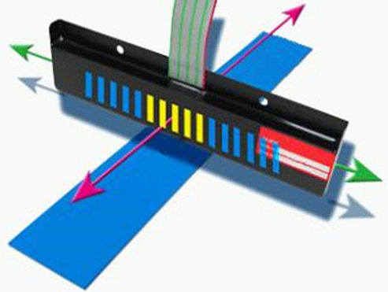

# AGV

AGV(Automated Guided Vehicle) - 自动导引车辆
1. 需要依赖固定的导航路径(**磁条** / **二维码**)

AMR(Autonomous Mobile Robot) - 自治移动机器人
1. 可以根据环境动态规划路径，不依赖固定导航标志

## Table of Contents

# AGV - Automated Guided Vehicle

分类
1. 磁条/磁钉 导航
   1. 传感器 (霍尔原件，感应 N级)
   2. 
   3. 成本低
   4. 磁条容易破损，需要定期维护
   5. 路径变更需要重新铺设磁带
   6. 无法智能避障
2. 二维码 导航
   1. [April Tag - UMich](https://april.eecs.umich.edu/software/apriltag)
   2. 通过二维码图像，解析坐标值&方向信息，位姿校准
   3. 没有二维码的地方使用 电机里程计/陀螺仪导航
   4. 建立坐标系
   5. 成本低
   6. 路径规划灵活
   7. 传感器成本低
   8. 对环境要求低
3. 激光(带反光板/反光条) 导航
   1. 需要布置反光板
   2. 精度较高，适合固定场景
   3. 定位精准
   4. 路径可灵活多变
   5. 反光板价格相对高
4. 自然物(激光SLAM) 导航
   1. 不需要布置标志，利用环境中的自然特征
   2. 灵活性更高，适应动态环境
   3. 安装成本低
   4. 行走路径灵活
   5. 传感器成本高
5. 视觉(V-SLAM) 导航
   1. 算法要求高
6. 视觉及混合(AMR) 导航 - GPS/惯性/视觉
7. 重载 AGV (老牌 AGV : 新松)

驱动方式 (价格 由低到高)
1. 差速轮 - 2轮 差动
2. 舵轮 - 驱动电机、转向电机、减速机 一体
3. 麦克纳姆轮

[HIKROBOT 海康机器人](https://www.hikrobotics.com/cn/mobilerobot/)

交互对接
1. 上层系统
   1. 仓库管理系统 WMS
   2. 生产管理系统 MES
   3. 企业资源计划系统 ERP
   4. 设备管理系统 WCS
   5. 其他 SAP/EWM
2. 接口协议 restful webservice/TCP-IP/串口转以太网
3. 机器人调度系统 RCS
   1. 世界、地图 模型建立
   2. 多路径规划、避障
   3. 车辆调度
   4. 任务分配、切换
   5. 交通动态管理

