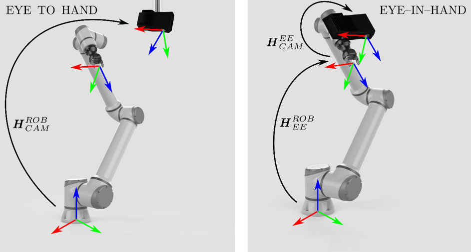

# 手眼标定 - Hand Eye Calibration

## Table of Contents

# 手眼标定 原理与实战

[上篇](https://www.bilibili.com/video/BV1By4y1b7Q7)

[下篇](https://www.bilibili.com/video/BV1ey4y1b76c)

[The benefits of 3D hand-eye calibration](https://blog.zivid.com/importance-of-3d-hand-eye-calibration)

2 branches
1. 眼在手外 手眼分离 (eye to hand)
   1. 相机固定在机械臂外(工作环境中)
   2. 求解相机在机器人基座中的位置和方向 (camera & robot_base)
   3. $AX = YB$
2. 眼在手上 手眼一体 (eye in hand)
   1. 相机固定在机器人末端
   2. 求解相机在机器人末端执行器中的位置和方向 (camera & end-effector & robot_base)
   3. $AX = XB$

CheckerBoard (accurate corner-to-corner distances and  flatness)

---

标定 : 像素点 & 长度 匹配

棋盘格标定板，需要和物料保持相同高度

9点标定

12点标定

码垛机器人
1. 四轴
   1. 前后(肩)
   2. 左右(底座)
   3. 上下(肘)
   4. 末端旋转(end-effector)，无手腕上下
2. 减少 伺服系统 & 减速器
3. 更快速度，性价比高

