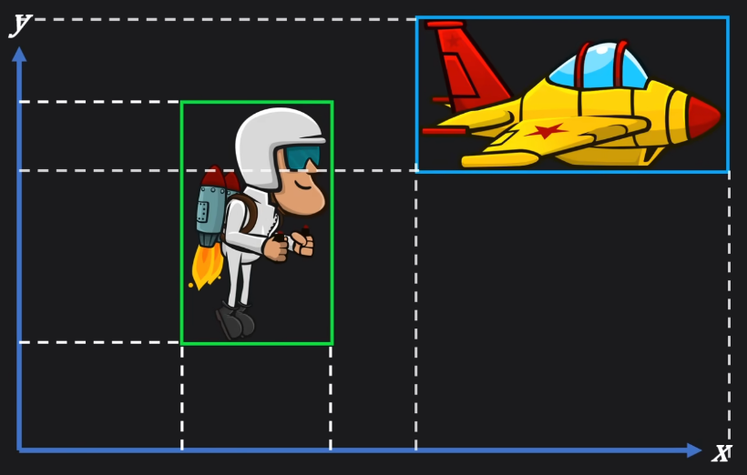

[判断一点是否在三角形内部](https://zhuanlan.zhihu.com/p/521243284)

[碰撞检测算法之 包围形法](https://zhuanlan.zhihu.com/p/508757803)

[碰撞检测算法之 GJK 算法](https://zhuanlan.zhihu.com/p/511164248)

# 包围体 (Bounding Volume)

轴对齐包围盒 (Axis Aligned Bounding Box, AABB)
1. 边 永远 平行于 坐标轴
2. 
3. Cons : 对于 **旋转** 的支持，为了包住倾斜物体，会产生 **多余碰撞区**
4. 也算是一种 特殊的 分离轴定理(投影法)，只是仅 投影在 坐标轴上

圆形包围体 (Bounding Circle)
1. 如果 目标接近圆形
2. 不受 旋转 约束，只和 物体间距离 相关
3. Cons : 对于 **方向性强** 的物体，会产生 **多余碰撞区**

有向包围盒 (Oriented Bounding Box, OBB)
1. 使用 分离轴定理(SAT, Separating Axis Theorem)

# 分离轴定理 (SAT, Separating Axis Theorem)

核心 : 寻找 **分离平面**，Separating Plane

用来检测 凸多边形(Convex Polygons) / 凸多面体(Convex Polyhedra) 是否相交
1. 凸多边形 : 任意 2点 的连线 都位于 多边形内部
2. 凹多边形 : 至少存在 1对点，连线 不完全位于 多边形内部，**通常转为 凸多边形 处理**

如果 2个物体 没有相交，那么 一定存在 1条直线(轴)，使得 2个物体 在这条直线上的**投影** 互不重叠

投影轴 & 分离线/分离面 垂直($\perp$)

对于 凸多边形/多面体，只需要测试 特定的 **==投影轴==**(只关心方向，不关心 bias)，
1. 垂直于 物体A 每一条边的 轴 (**法线**)
2. 垂直于 物体B 每一条边的 轴 (**法线**)
3. (仅 3D) 垂直于 物体A 的边 & 物体B 的边 的 **叉积方向**的 轴

计算量 和 多边形边数 正相关，轴(axis) & 顶点(vertex) 数量都多了，总点积运算次数 是 平方关系

# GJK(Gilbert-Johnson-Keerthi) 算法

闵可夫斯基差 (Minkowski Difference)
1. 将 2个 多边形 所有的点 两两相减，所有的新点 形成一个新的多边形
2. 如果 新多边形 包含原点，原多边形 碰撞
   1. 原理 : 如果有交集，那么一定可以找到 一个点 同时属于两个 原多边形，相减 在原点

单纯型(simplex)
1. $k$维 空间中，能构成的最简单的、封闭的几何图形，由 $k+1$ 个顶点组成
   1. 0维 : 点 (Point)
   2. 1维 : 线段 (Line Segment)
   3. 2维 : 三角形 (Triangle)
   4. 3维 : 四面体 (Tetrahedron) 三角锥

GJK
1. 如果能 在 闵可夫斯基差 空间内，构建出 包含原点的 单纯型，即可判断 发生碰撞
2. 迭代采样策略

https://wyman1024.github.io/collision-detection-2/

https://blog.csdn.net/u010016421/article/details/104788769

https://zhuanlan.zhihu.com/p/511164248
