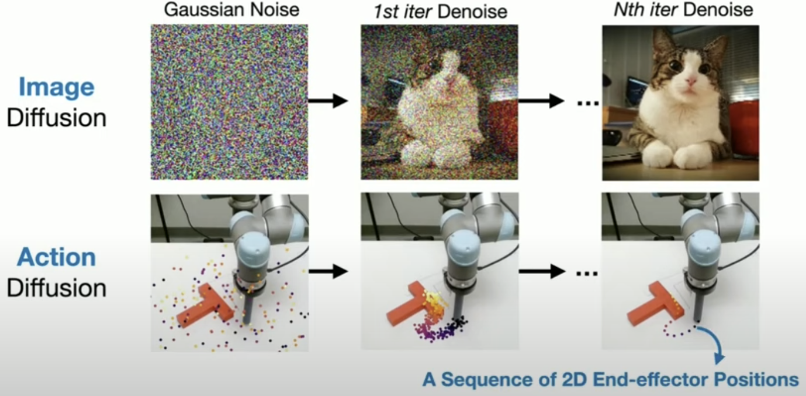
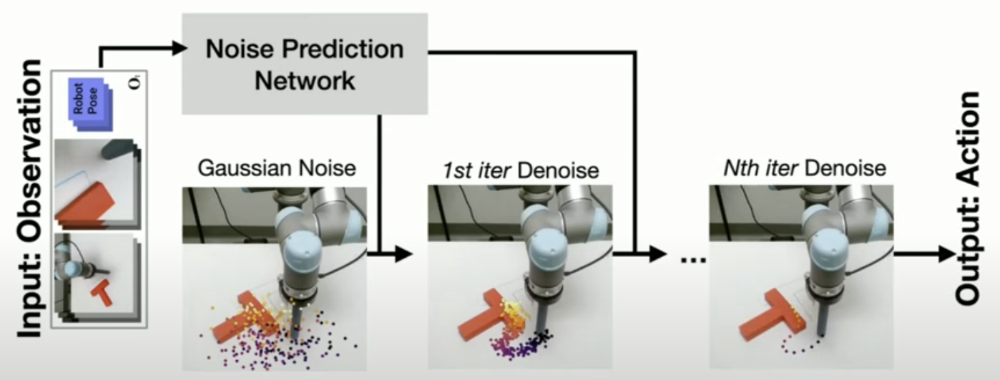

# Diffusion Policy

[Diffusion Policy: LeRobot Research Presentation #2 by Cheng Chi](https://www.youtube.com/watch?v=M03sZFfW-qU)

[Diffusion Policy - Project](https://diffusion-policy.cs.columbia.edu/#paper)

[Diffusion Policy - Github](https://github.com/real-stanford/diffusion_policy)

##

##

Learning Paradigms
1. imitation learning
2. meta learning
3. self-supervised learning
4. reinforcement learning

End Product
1. Observation -> **Visuomotor Policy(视觉-运动策略)** -> Action

Diffusion Model
1. Input  ： Text
2. Output ： Image

Diffusion Policy
1. Input  : Image
2. Output : Sequence of Actions

Action Multi-Modality

