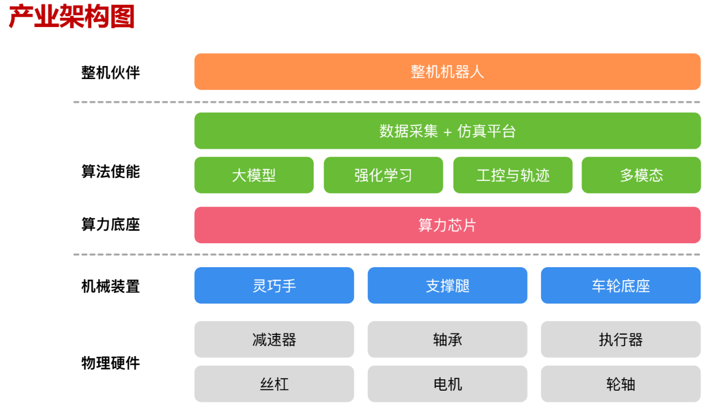
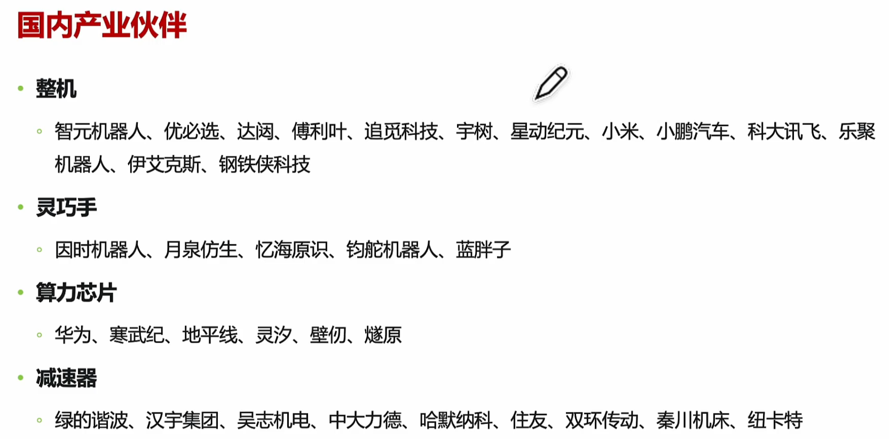
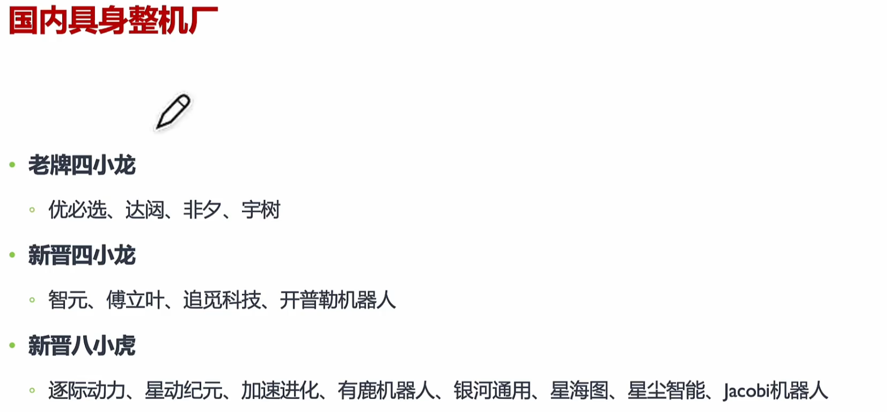

# Embodied AI - 具身智能

系统化方案 : 环境理解(CV) + 智能交互(语音) + 认知推理(LLM) + 规划执行

LLM as General Planner

将可以 调用的API 写在 Prompt 中，同时指定任务，由 LLM 具体规划代码生成

navigation

grasp - AnyGrasp

基础技术路线
1. 场景理解(成熟)
   1. 检测 & 分割
      1. vision foundation model (SAM, SAM3D, Open-Voc Detection 开放词汇目标检测)
   2. 多模态 Grounding(在具体模态中找到实体或目标) 2D -> 3D
      1. 多模态大模型 能够实现 像素级别，大模型 理解能力强，并且支持多样的 Prompt
2. 数据引导(数据量不够)
   1. 视频学习 : 引导，数据质量低，难以迁移到真机
   2. 硬件在环采集
      1. Light : 轻量级采集硬件数据(end-effector, 不是 full body)
      2. Heavy : VR 显示器 + 手套(硬件成本高)
   3. 生成式仿真 Generative Simulation
3. 动作执行
   1. 生成式模仿学习 Generative Imitation Learning
      1. Diffusion Policy
   2. Affordance 物体的不同部位可以被如何操作/交互
   3. 大模型问答 Q&A with LLM
   4. LLM Prompt Planning
   5. Language Corrections 矫正提示
4. 世界模型

Robotics & CV/NLP 区别 : 数据集获取难度

CLIP 对比学习 (Contrastive Language-Image Pretraining，对比语言-图像预训练)

具身智能 = 感知input + 算法决策((多模态)大模型) + 物理机械执行
1. 感知
   1. 主动感知
      1. V-SLAM
      2. 3D Scene Understanding
      3. Exploration
   2. 被动感知
      1. 3D 视觉 Grounding (通俗理解：在 3D 世界里找到指定的目标)
         1. 2-stage : detection & matching
         2. 1-stage
      2. VLN 视觉语言导航 Visual Language Navigation
         1. 理解多样的视觉观察，理解不同粒度的指令
2. 决策
   1. MLM、VLM、LLM
   2. 高层具身智能任务规划 : 将抽象而复杂的任务分解为子任务
   3. 低层具身行动规划 : 利用 感知 & 交互 模型，逐步实施子任务
   4. 业界技术路线
      1. 分层决策模型
         1. 实现难度相对简单，但不同步骤间融合一致性困难
         1. Figure 技术方案
            1. high-level planer
            2. low-level policy
            3. whole body controller
      1. 端到端模型
         1. 减少误差传递，但需要海量数据，资源消耗大，执行动作缓慢
         2. [PaLM-E (Pathways Language Model - Embodied)](https://palm-e.github.io/)
            1. Google 2023 年 发布的
            2. Text + Image + Sensor Data
   5. **数据工程问题**
      1. 数据稳定性 : 硬件规格修改，需要重新采集数据，需要跨硬件算法
      2. 数据工程 : 数据 采集、管理、处理、组织

具身产业
1. 
2. 
3. 

短期 销售对象 科研机构/高校，目前 毛利 无法 cover 售后

派系
1. 学术派
2. 产业派

随着 大模型 & RL 算法 爆发

