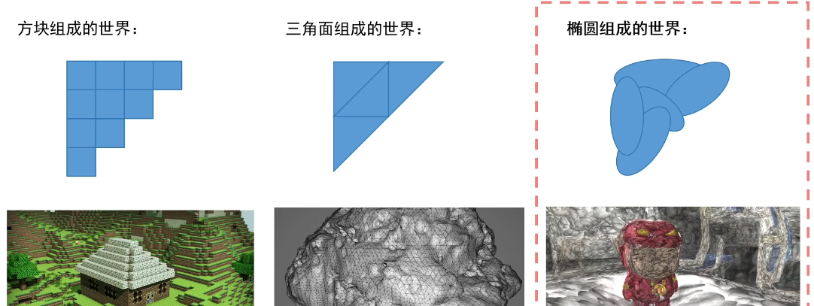
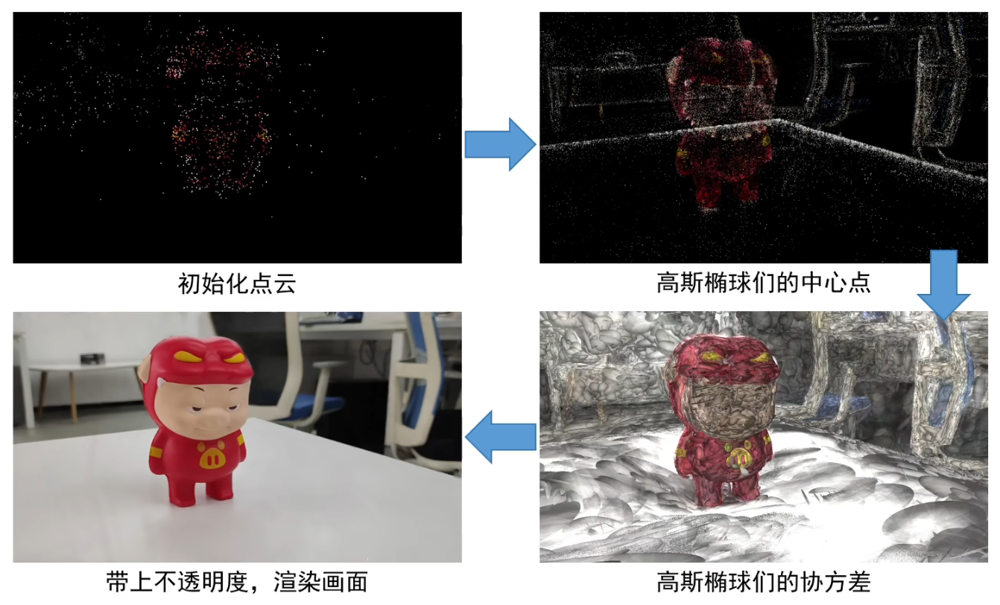
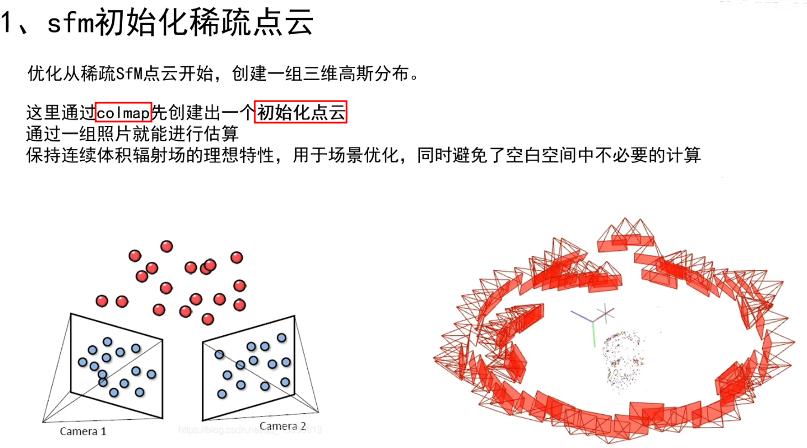
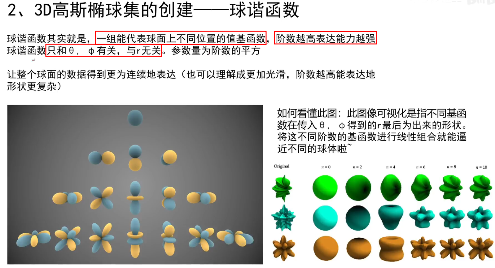
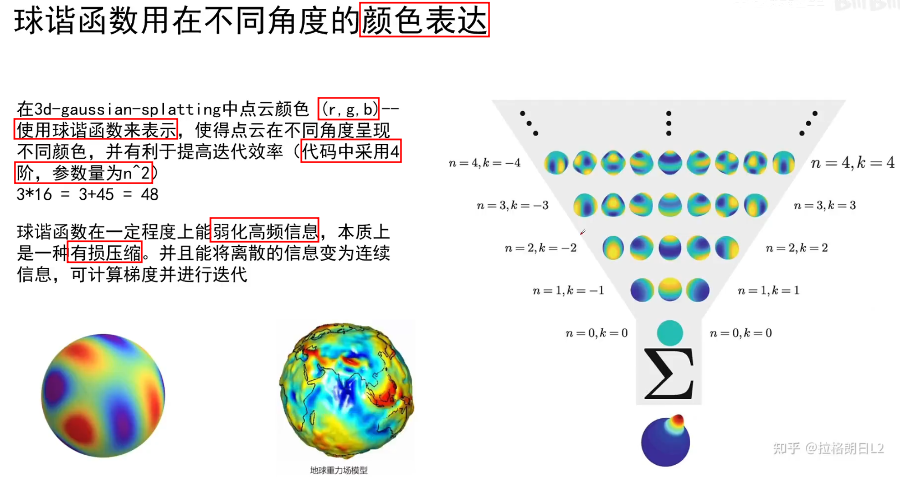
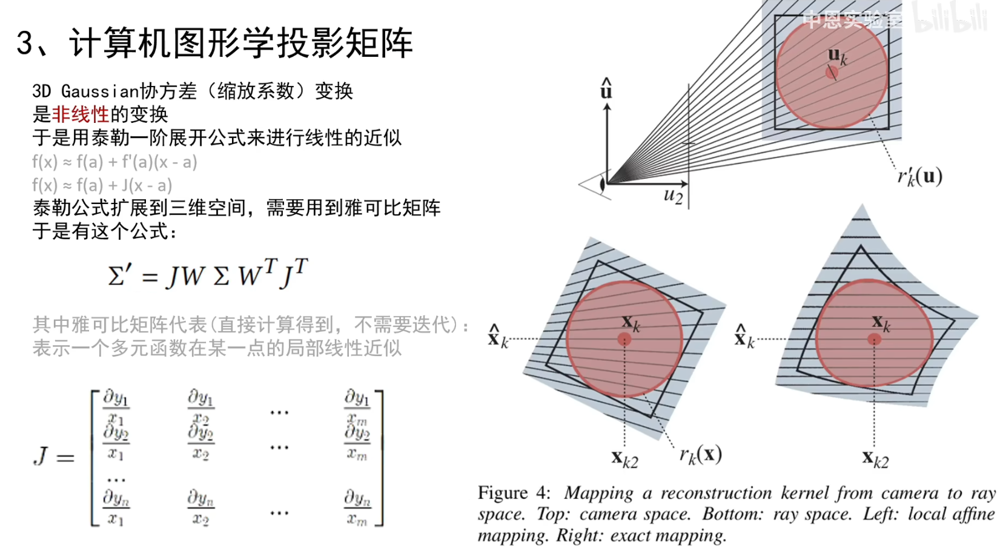
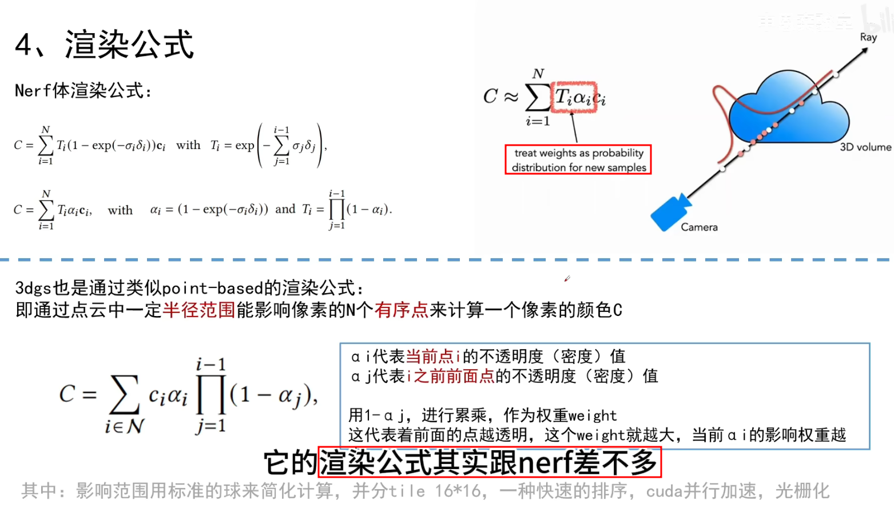

# 3D Gaussian Splatting for Real-Time Radiance Field Rendering

[Paper Website](https://repo-sam.inria.fr/fungraph/3d-gaussian-splatting/)

[Github](https://github.com/graphdeco-inria/gaussian-splatting)

```bibtex
@Article{kerbl3Dgaussians,
      author       = {Kerbl, Bernhard and Kopanas, Georgios and Leimk{\"u}hler, Thomas and Drettakis, George},
      title        = {3D Gaussian Splatting for Real-Time Radiance Field Rendering},
      journal      = {ACM Transactions on Graphics},
      number       = {4},
      volume       = {42},
      month        = {July},
      year         = {2023},
      url          = {https://repo-sam.inria.fr/fungraph/3d-gaussian-splatting/}
}
```

## Table of Contents

- [3D Gaussian Splatting for Real-Time Radiance Field Rendering](#3d-gaussian-splatting-for-real-time-radiance-field-rendering)
  - [Table of Contents](#table-of-contents)
- [Gaussian Splatting 原理速通 - 中恩实验室](#gaussian-splatting-原理速通---中恩实验室)
  - [01 - 三维高斯 概念](#01---三维高斯-概念)
  - [02 - 球谐函数 概念](#02---球谐函数-概念)
  - [03 - 迭代参数 \& 渲染](#03---迭代参数--渲染)
  - [04 - 伪代码流程](#04---伪代码流程)

---

# Gaussian Splatting 原理速通 - 中恩实验室

[中恩实验室 - B站主页](https://space.bilibili.com/3494380627299296/video)

[3D Gaussian Splatting 原理速通 - 中恩实验室](https://space.bilibili.com/3494380627299296/channel/collectiondetail?sid=2116610)


## 01 - 三维高斯 概念



3D GS 使用 椭圆 拼接

效果
1. 允许在 **1080p** 分辨率下实现高质量的实时 (**>30fps**) 的新视图合成
2. 在提出该方法时，在现有公开数据集，确保实时渲染，达到 sota 质量
3. mipnerf360 在渲染相同质量下，需要长达48h的训练时间，无法在高分辨率下实现实时渲染，10-15帧每秒


6步







协方差矩阵 联想 PCA


## 02 - 球谐函数 概念




左下角图 展示 球谐函数 基函数 (阶数越高，表达能力越强)，通过 线性组合

球谐函数 只和 仰角 & 方位角 有关，与 半径 r 无关



颜色表达类似 (r,g,b 对应 之前的 半径 r)

r,g,b 分别用三个不同的 球谐函数 储存颜色值


## 03 - 迭代参数 & 渲染






损失函数 Loss
1. $\mathcal{L} = (1 - \lambda)\mathcal{L}_1 + \lambda\mathcal{L}_{D-SSIM}$
2. 论文使用值 $\lambda = 0.2$


初始化点云质量不高


## 04 - 伪代码流程


Rasterize 光栅化


