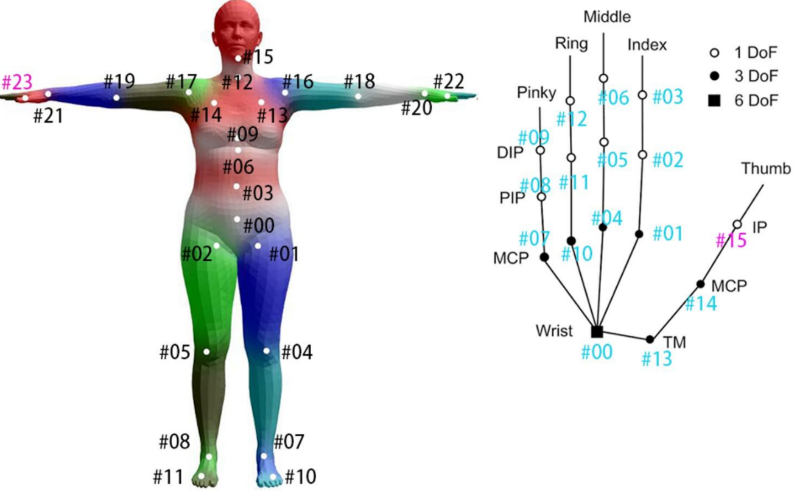
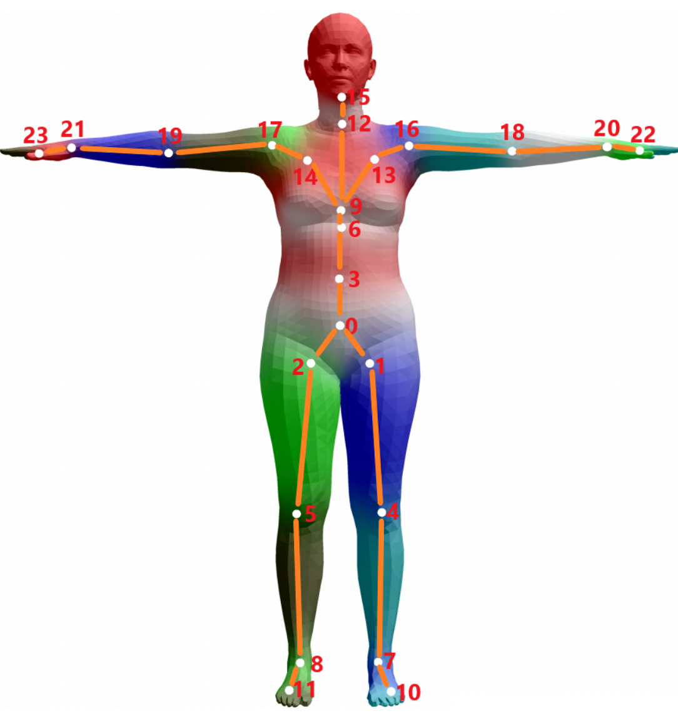
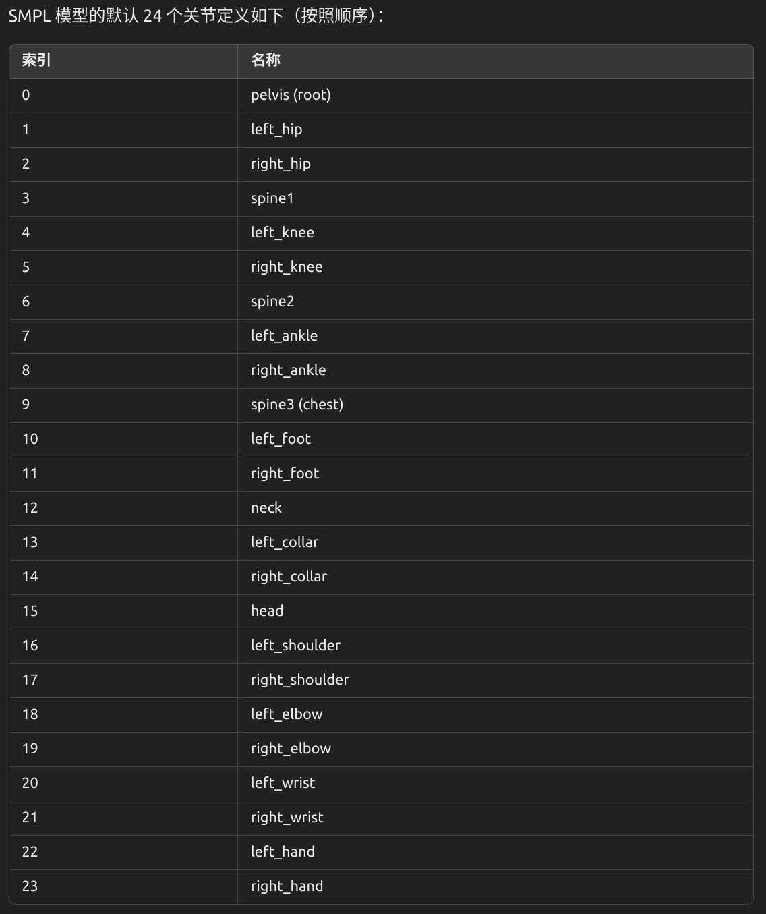

# AMASS

---

[AMASS : Archive of Motion Capture As Surface Shapes - Website](https://amass.is.tue.mpg.de/)

[AMASS - Github](https://github.com/nghorbani/amass)

[Retargeted AMASS for Robotics - HuggingFace](https://huggingface.co/datasets/fleaven/Retargeted_AMASS_for_robotics)
1. [下载方法](../../../HuggingFace/HuggingFace.md)

---

MoCap = motion capture

main problem
1. current MoCap datasets are small
2. different parameterization(参数化) of body

contribute
1. unify 15 **optical marker-based** MoCap datasets & representing within a common framework and **parameterization**
   1. input : sparse markers
   2. output : SMPL body models
2. **MoSh++** : convert mocap data into realistic 3D human meshes by
   1. Rigged Body Model(绑定身体模型)
      1. 骨骼结构(rig) + 蒙皮(skin)
   2. 控制骨骼关节(joints)


# Introduction

[SMPL 解读](https://rocyan.top/posts/paper/avatar/SMPL.html)

动作数据 / SMPLH模型

**Legend**
1. `SMPL+H` : SMPL body model + MANO hand model (52 joints, 6890 vertices)
2. `SMPL-X` : body model including hands and facial expressions (55 joints, 10475 vertices)
3. `G` : gendered (male and female models)
4. `N` : neutral (a single model that can represent male and female body shapes)









3 files
1. motion : 动作序列文件
   1. trans : 每一帧的全局平移(世界坐标系下的位置)
   2. gender : bytes/str 性别
   3. mocap_framerate : 动作采样频率，单位是帧/秒
   4. betas : 身材参数，描述个体的 高矮胖瘦 等静态外观差异
      1. betas[0] : 主要控制身高和体型（身高影响最大）
      2. betas[1] ~ betas[15] : 控制胖瘦、肩宽、手臂粗细等
   5. dmpls : 每帧的 肌肉抖动 动态参数，对应动态 basis 的权重系数
   6. poses : 每一帧的姿态参数，Axis-Angle 形式，含根节点、身体、手部
2. model : 人体模型定义(身体怎么长的 + 网格结构)，与性别有关，不同动作共享
   1. J_regressor_prior
   2. f : 网格三角形面片索引
   3. J_regressor : 线性回归矩阵，把 mesh 顶点投影到骨架关节位置
   4. kintree_table : 骨架树结构，记录每个关节的**父子连接关系**
      1. 根节点 pelvis
      2. SMPL  : 24  (2, 24)
      3. SMPLH : 52  (2, 52) (左右手各新增14)
   5. J : 预计算的关节位置
   6. weights_prior
   7. weights : 每个顶点对 24 个关节的线性蒙皮权重
   8. posedirs
   9.  bs_style : blend skinning 类型
   10. v_template : SMPL 模型的 T-pose 网格顶点坐标
   11. shapedirs : 身材变形基，和 betas 相乘，控制胖瘦、高矮等个体差异
   12. bs_type : blend style，比如 'smpl'，指定混合策略
3. dmpl(basis) : 动态形变模型
   1. eigvec : soft-tissue 形变的 PCA 主成分 basis，身体在运动时的表面形变方向模式
      1. shape (6890, 3, 8)
      2. 6890 : 顶点数 (SMPL 模型的点数)
      3. 3 : 每个点的 XYZ 坐标方向上的偏移
      4. 8 : 有 8 个主成分，每一列是一个动态变形的 基本模态


SMPL-H = SMPL + Hand joints

DMPL 模型训练时用的是 SMPL 网格(6890 点)，只对 身体mesh 做变形建模，不关心有没有手


Body Model
1. 基于骨架的人体网格生成器

Dynamic Motion Primitive Layer
1. 表面细节的动态软变形
2. 模拟这种基于动作引起的动态表面变化(身体会抖动、肌肉和脂肪会摆动)

betas 是 人体身材 参数
1. 控制胖瘦、高矮、胸围等个体差异
2. 一般是 10 或 16 维
3. 每个维度是一个 PCA 主成分


区分 dmpls & dmpl
1. dmpls 每帧动态系数
   1. 存储在动作 npz 中 `bdata['dmpls']`
   2. 长度 和 `poses` 一样，宽度是 8
   3. dmpls[i] 是第 i 帧的 **晃动强度参数**
2. dmple bias模型(主成分)
   1. 需要从 `model.npz` 中加载
   2. 对所有动作都通用，之和性别有关
   3. 存储的是 DMPL 的 basis vectors (8个主成分，表示软组织晃动的方向)
   4. dmpl model.npz 是 **晃动模板**
3. 它最早在 Dyna 论文 (CVPR 2015) 中提出，作为 SMPL 模型的一个增强项

[Download DMPLs compatible with SMPL](https://download.is.tue.mpg.de/download.php?domain=smpl&sfile=dmpls.tar.xz) - dmpl


[Extended SMPL+H model  (used in AMASS project)](https://download.is.tue.mpg.de/download.php?domain=mano&resume=1&sfile=smplh.tar.xz) - smpl-h


```python
# Preparing the environment
%load_ext autoreload
%autoreload 2
%matplotlib notebook
%matplotlib inline

import numpy as np
import torch
import os
from smplx import SMPL

from human_body_prior.body_model.body_model import BodyModel
from human_body_prior.tools.omni_tools import copy2cpu as c2c
from vedo import Plotter, Mesh

comp_device = torch.device("cuda" if torch.cuda.is_available() else "cpu")

currentDir = f"/home/lzy/Projects/HumanoidDataset/src"

motion_fname = os.path.join(
    # os.path.dirname(__file__),
    currentDir,
    r"../Download/ACCAD/ACCAD/Female1General_c3d/A1 - Stand_poses.npz"
)
bm_fname = os.path.join(
    # os.path.dirname(__file__),
    currentDir,
    r"../Download/smplh/female/model.npz"
)
dmpl_fname = os.path.join(
    # os.path.dirname(__file__),
    currentDir,
    r"../Download/dmpls/female/model.npz"
)

bdata = np.load(motion_fname)
print(f"bdata.keys() : {list(bdata.keys())}")  # ['trans', 'gender', 'mocap_framerate', 'betas', 'dmpls', 'poses']
gender = bdata['gender']
print(f"gender : {gender}")  # female
print(f"poses : {bdata['poses'].shape}")  # (360, 156)
print(f"trans : {bdata['trans'].shape}")  # (360, 3)
print(f"betas : {bdata['betas'].shape}")  # (16,)
print(f"dmpls : {bdata['dmpls'].shape}")  # (360, 8)

num_betas = 16
num_dmpls = 8

bm = BodyModel(
    bm_fname=bm_fname, dmpl_fname=dmpl_fname,
    num_betas=num_betas, num_dmpls=num_dmpls).to(comp_device)
faces = c2c(bm.f)

time_length = len(bdata['trans'])

body_parms = {
    'root_orient': torch.Tensor(bdata['poses'][:, :3]).to(comp_device), # controls the global root orientation
    'pose_body': torch.Tensor(bdata['poses'][:, 3:66]).to(comp_device), # controls the body
    'pose_hand': torch.Tensor(bdata['poses'][:, 66:]).to(comp_device), # controls the finger articulation
    'trans': torch.Tensor(bdata['trans']).to(comp_device), # controls the global body position
    'betas': torch.Tensor(np.repeat(bdata['betas'][:num_betas][np.newaxis], repeats=time_length, axis=0)).to(comp_device), # controls the body shape. Body shape is static
    'dmpls': torch.Tensor(bdata['dmpls'][:, :num_dmpls]).to(comp_device) # controls soft tissue dynamics
}

print('Body parameter vector shapes: \n{}'.format(' \n'.join(['{}: {}'.format(k,v.shape) for k,v in body_parms.items()])))
print('time_length = {}'.format(time_length))

# bm = BodyModel(bm_fname=bm_fname,


import trimesh
from body_visualizer.tools.vis_tools import colors
from body_visualizer.mesh.mesh_viewer import MeshViewer
from body_visualizer.mesh.sphere import points_to_spheres
from body_visualizer.tools.vis_tools import show_image

imw, imh=1600, 1600
mv = MeshViewer(width=imw, height=imh, use_offscreen=True)


body_pose_beta = bm(**{k:v for k,v in body_parms.items() if k in ['pose_body', 'betas']})

def vis_body_pose_beta(fId = 0):
    body_mesh = trimesh.Trimesh(vertices=c2c(body_pose_beta.v[fId]), faces=faces, vertex_colors=np.tile(colors['grey'], (6890, 1)))
    mv.set_static_meshes([body_mesh])
    body_image = mv.render(render_wireframe=False)
    show_image(body_image)

vis_body_pose_beta(fId=0)
```


#


# Installation

[AMASS 官网](https://amass.is.tue.mpg.de/index.html)
1. 注册登录，Download 数据集

[AMASS - Github](https://github.com/nghorbani/amass)
1. 创建一个虚拟环境 & 基础安装
   1. `conda create -n amass python=3.10 -y` + `conda activate amass`
   2. `pip3 install torch torchvision torchaudio --index-url https://download.pytorch.org/whl/cu126`
   3. `pip3 install pyrender`
   4. `conda install pytorch3d -c pytorch3d`
   5. `pip install ipykernel`
   6. `pip install matplotlib`
2. clone `amass` 并 `cd` 进入
   1. 修改 `requirements.txt` 删掉所有 版本要求
   2. `pip install -r requirements.txt`
   3. `python setup.py develop`
3. clone `human_body_prior` 并 `cd` 进入
   1. 修改 `requirements.txt` 删掉所有 版本要求 以及 pytorch3d
   2. `pip install -r requirements.txt`
   3. `python setup.py develop`


[pip install human_body_prior](https://pypi.org/project/human-body-prior/) 好像就行


下载 ``
1. [SMPL - Downloads](https://smpl.is.tue.mpg.de/download.php)
2. 注册登录，找到 **DMPLs for AMASS** -> **Download DMPLs compatible with SMPLlz**


删除环境 `conda remove -n amass --all`


