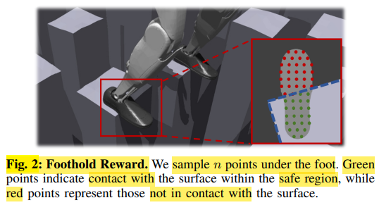

# BeamDojo : Learning Agile Humanoid Locomotion on Sparse Footholds

# Methods

## A - Foothold Reward

**sampling-based** foothold reward(**penalty**)

最大化 **foot's placement** & **safe areas** 的重叠

定义 (**penalty foothold reward**)
1. $$r_{\text{foothold}} = - \sum_{i=1}^{2} \mathbb{C}_{i} \sum_{j=1}^{n} \mathbb{1}\{d_{ij} < \epsilon\}$$
2. $\mathbb{C}_{i}$ (接触检测) : 当脚 $i$ 确实接触到地面时，才计算对应脚的采样点
3. $\mathbb{1}\{d_{ij} < \epsilon\}$ (悬空检测)
   1. $d_{ij}$ 代表的是在脚底第 $j$ 个采样点的 $(x, y)$ 坐标位置上，地面的绝对高度
   2. 本篇论文，地形最底面 $\lt \epsilon$，其他 可行走 safe 区域 $\gt \epsilon$，所以 如果 $\lt \epsilon$ 表示悬空了

最大化重叠 -> 提升 地形感知 能力

