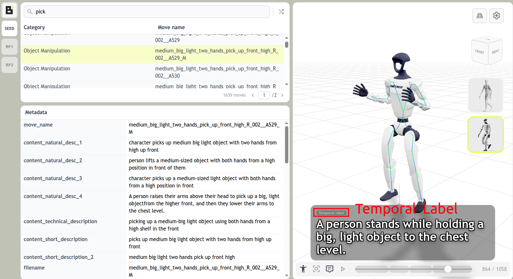
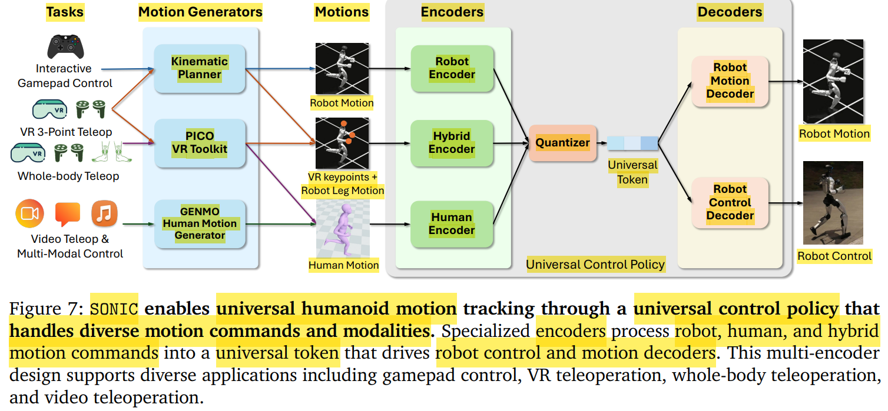
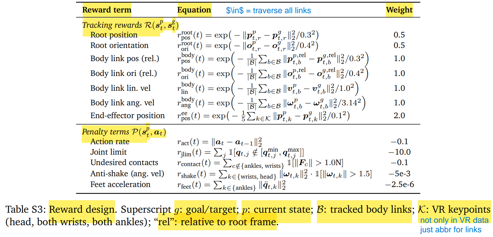
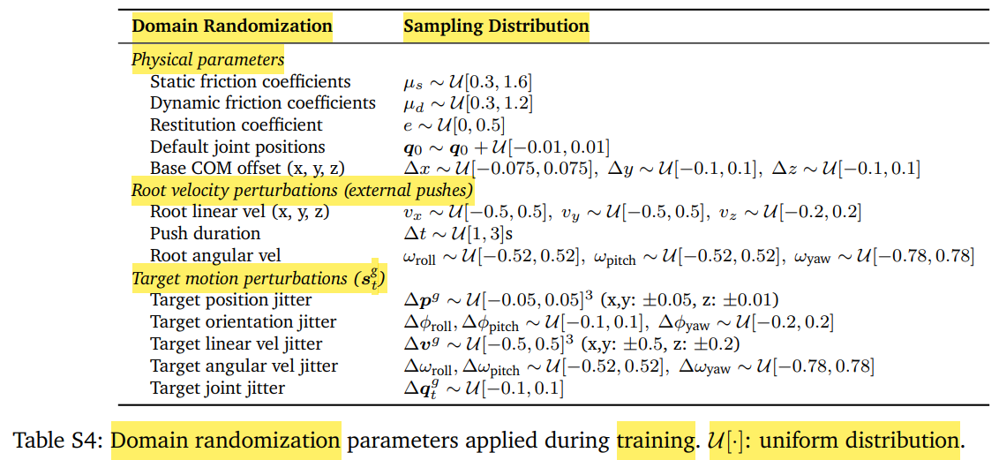

# SONIC : Supersizing Motion Tracking for Natural Humanoid Whole-Body Control

[Project Website - NVIDIA](https://nvlabs.github.io/GEAR-SONIC/)

[Docs](https://nvlabs.github.io/GR00T-WholeBodyControl/)

[Github](https://github.com/NVlabs/GR00T-WholeBodyControl)

---

live demo : **MuJoCo WASM**(WebAssembly)
1. MuJoCo 本身是用 C 写的物理仿真引擎，通常只能在本地跑
2. 把 MuJoCo 用 Emscripten 编译成了 WASM，这样就可以直接在浏览器里运行 MuJoCo 物理仿真，不需要安装任何软件
3. 浏览器 → MuJoCo.wasm → 渲染到 canvas

---

# Abstract

---

# 03 - Materials & Methods

scale data / model_size / compute

same hyperparameter & reward function

## 03.01 - Humanoid Motion Dataset

large-scale MoCap dataset

mix male & female 表演者

clip length range : 1s ~ 180s

multi-subject across multi-task

variation
1. intra-subject(个体**内**) : 同一个演员在不同次执行相同动作时，自身产生的自然变化
2. inter-subject(个体**间**) : 不同演员在执行相同动作时产生的变化

retarget
1. GMR : Motion Retargeting，非均匀局部缩放 策略
2. PyRoKi(Python Robot Kinematics) : 并行运动学求解器(基于 JAX，使用 Levenberg-Marquardt 算法)，做 IK，兼顾 关节物理限位 & 防碰撞检测

filter out : physically implausible motions

611H 50Hz (source 700H)

3 test datasets (预定义 split)
1. from self dataset
   1. **test-content**    : 包含 训练集中 完全没有出现过的动作，OOD(out of distribution)，衡量 generalization 泛化能力
   2. **test-repetition** : 包含 训练集中 见过的动作类别，但是提取 不同演员/不同次录制(takes) 片段，衡量 robustness 鲁棒性
2. external benchmark : PHUMA

BONES-SEED dataset
1. links
   1. [BONES-SEED - HuggingFace](https://huggingface.co/datasets/bones-studio/seed)
   2. [Seed Viewer](https://seed-viewer.bones.studio/)
2. metadata
   1. natural language descriptions
   2. temporal segmentation labels (时序分割标签)
   3. actor information
3. 

## 03.02 - Universal Humanoid Motion Tracking

SONIC
1. universal humanoid tracking framework
2. unified control policy
3. track diverse motion commands

使用 Motion Generators 获取 Motion Commands

### Motion Tracking Formulation

依然 Markov Decision Process，依然 PPO

**States**
1. proprioceptive  **$s^p_t$** : 10 frames
   1. joint pose & velocity
   2. root angular velocity
   3. gravity vector in root frame
   4. previous actions
2. motion commands **$s^g_t$** : 10 frames (不同 type 有不同的 frame interval)
   1. robot motion   $g_r$
      1. frame interval : 0.1s
   2. human motion   $g_h$
      1. frame interval : 0.1s
   3. hybrid motions $g_m$ : upper-body keypoints + lower-body motions
      1. frame interval : 0.02s，人类动捕数据的采样率更高

**Actions**
1. policy output **target joint positions**
2. PD controller (PD gain setting 来自于 BeyondMimic)

**Rewards**
1. 
2. tracking reward : $\mathcal{R(s^p_t, s^g_t)}$
   1. minimize error (robot state & target state)
      1. root position/orientation
      2. body link positions/linear-velocities/angular-velocities
   2. end-effector position reward
      1. key body points : head / wrists / ankles
3. penalty terms   : $\mathcal{P(s^p_t, a_t)}$
   1. anti-shake : angular velocity (head & wrist)
   2. foot acceleration penalty : smoother foot contact

**Domain Randomization**
1. physical parameters : friction / restitution / initial joint positions / base CoM position
2. external push : 给 root linear/angular velocities 周期性添加 random perturbations
3. motion perturbations : 加在 target motion commands 上，improve robustness
4. 

**6D rotation representation**(只针对三维空间旋转)
1. 3×3 旋转矩阵的前2列 (标准的旋转矩阵由 3个列向量组成)，拼接起来就是网络输入或输出的 6维向量
2. 还原成旋转矩阵 (网络输出的2个列向量未必正交)，施密特正交化(Gram-Schmidt)
   1. 归一化第一个向量，得到 **X轴**
   2. 让第二个向量与第一个向量正交，并归一化，得到 **Y轴**
   3. 叉乘求出第三个向量，得到 Z**轴**
3. 对比
   1. 欧拉角 (Euler Angles, 3D)
      1. 存在万向节死锁，具有周期性
      2. 网络在处理这种数值跳跃时，梯度会变得非常不稳定
   2. 四元数 (Quaternions, 4D)
      1. 双覆盖(Double Cover)问题，即四元数 $q$ 和 $-q$ 代表的是物理空间中完全相同的旋转
      2. 导致网络在逼近同一个旋转状态时，它的输出可能会在 $q$ 和 $-q$ 之间反复横跳
   3. 旋转矩阵 (Rotation Matrix, 9D)
      1. 连续性好
      2. 但参数太多(9D)，必须时刻满足 正交 & 归一化约束，网络很难直接输出完美的正交矩阵

### Universal Control Policy

unified encoder-decoder 架构

**==shared latent representation==**

### Train

## 03.03 - Generative Kinematic Motion Planner

large-scale latent generative model

