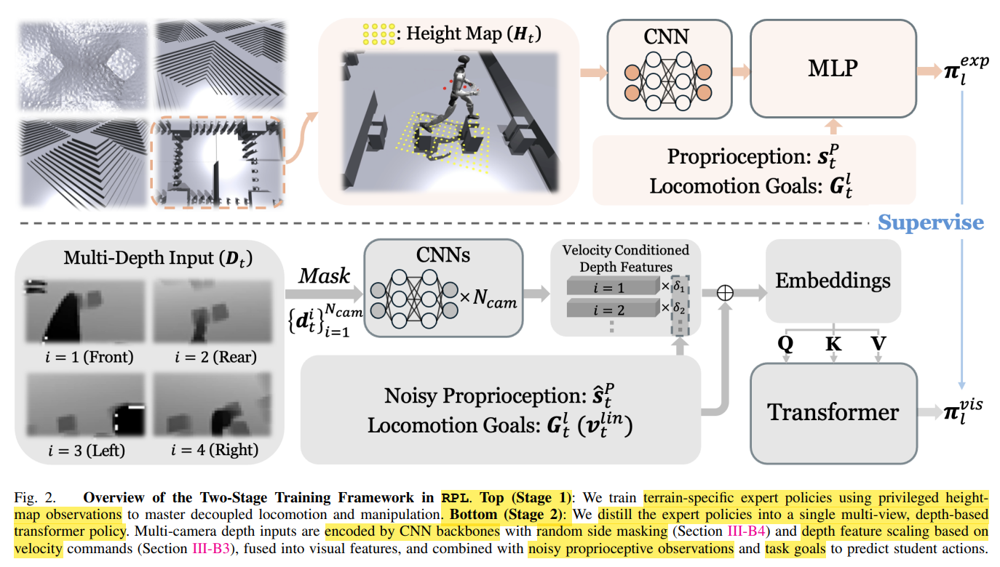

# RPL: Learning Robust Humanoid Perceptive Locomotion on Challenging Terrains

[RPL - Project Website](https://rpl-humanoid.github.io/)

# Abstract & Introduction

**multi-directional locomotion** on challenging terrains

**2-stage** training framework
1. 训练 expert policies，利用 privileged height map observations，结合 end-effector **perturbation**
2. distill 到 transformer policy (使用 多 depth cameras)

Distill 的技巧(增强 robustness)
1. DFSV (Depth Feature Scaling Based on Velocity Commands)
2. RSM (Random Side Masking)

multi-depth system
1. 同时 对 robot & terrain 进行 **RayCast**
2. 建模 传感器 latency & gaussian noise & dropout

mapping-based 方法缺点是 依赖于 explicit state estimation

end2end perceptive control

---

# Related Works

---

# RPL

基于 FALCON 的 dual-agent(**upper-body manipulation** & **lower-body locomotion**)

upper & lower 共享相同的 proprioception history **$s_t^p$**
1. 关节位置 : $q_{t-4:t}$
2. 关节速度 : $\dot{q}_{t-4:t}$
3. 根节点角速度 : $\omega_{t-4:t}^{root}$
4. 重力向量 : $g_{t-4:t}$
5. 历史动作指令 : $a_{t-5:t-1}$

$\pi_l$ lower 独有的 obs -> $a_t^l$
1. locomotion goals
   1. 目标线速度 : $v_t^{lin}$
   2. 角速度 : $w_t^{yaw}$
   3. 步行模式 : $\phi_t^{stance}$
   4. 根节点高度 : $h_t^{root}$
   5. 躯干朝向 : $o_t^{torso}$
2. perceptual obs : privileged heightmap / multi-view depth

$\pi_u$ upper 独有的 obs -> $a_t^u$
1. manipulation goals : 上半身的 target joint

最终的 action 是 $a_t^l$ & $a_t^u$ 拼接起来

## Stage 1

each terrain family -> specialized expert policies，使用 独立的 rewards 训练的

force curriculum : 添加给 end-effector，数值向下，模拟 payload，不考虑 转动惯量，只考虑 力 & 力矩

非对称的 actor-critic 训练 : critic 知道 root lin_vel & end-effector force $F_t^{ee}$

对称性数据增强 -> symmetric gait patterns
1. proprioception $\mathbf{s}_t^p$
2. lower goal $\mathbf{G}_t^l$
3. upper goal $\mathbf{G}_t^u$
4. privileged heightmap $\mathbf{H}_t^l$

**Terrain Settings**
1. 每种地形 专门的 expert policy
   1. Slope           : pyramid form, max inclination 37°
   2. Stairs Up/Down  : step length(0.25 ~ 0.30), step heights(0.05 ~ 0.27)
   3. Stepping Stones : column-shape discrete(离散的柱状), diameters(0.25 ~ 0.30), gaps(0.05 ~ 0.70), height variations(max 0.05)

**Reward Design**
1. 不同 terrain 添加不同 reward
2. **foot-edge penalty** : **precompute binary dilated edge masks** & foot sole sample points，比较严格
3. **foothold penalty** : 基于 **BeamDojo**，基于 dense sampling，比较宽容
4. **torso orientation tracking** : 通过 projected gravity 计算，$r_{torso} = \exp(-\|g_{proj} - g_{ref}\|^2/\sigma)$，让身体保持竖直

## Stage 2

**Distillation Formulation**
1. DAgger : terrain-specialized expert policies -> single visual locomotion policy (multi-depth)
2. student 只蒸馏 lower body，使用 noisy proprioception & multi-view depth，**上下半身解耦**
3. 蒸馏 (最小化 Loss)
   1. $$\mathcal{L}_{\text{distill}} = \mathbb{E}_{k,t} \left[ \left\| \pi_{l}^{\text{vis}}(\hat{\mathbf{s}}_{t}^{p}, \mathbf{G}_{t}^{l}, \mathbf{D}_{t}) - \pi_{l,k}^{\text{exp}}(\mathbf{s}_{t}^{p}, \mathbf{G}_{t}^{l}, \mathbf{H}_{t}) \right\|_{2}^{2} \right]$$
   2. $\pi_{l}^{\text{vis}}$ : 学生策略(视觉策略)
      1. multi-view depth $\mathbf{D}_{t}$
      2. ==noisy== proprioception $\mathbf{\hat{s}}_{t}^{p}$
   3. $\pi_{l,k}^{\text{exp}}$ : 专家策略，针对特定地形 $k$ 训练的
      1. privilege heightmap $\mathbf{H}_{t}$
      2. ==noise-free== proprioception $\mathbf{s}_{t}^{p}$
   4. $\mathbf{G}_{t}^{l}$ : 下半身运动目标 Locomotion Goals
   5. $\mathbb{E}_{k,t}$ : 对不同地形种类 $k$ 和 时间步 $t$ 求期望
   6. $\|  x \|_{2}^{2}$ : L2 范数的平方，用于衡量两个动作向量之间的差异
4. deploy 的 model : 蒸馏的 lower + blind upper

**Efficient Multi-Depth System simulation**
1. 使用 Nvidia Warp，实现 GPU-efficient
   1. 由 NVIDIA 开发的高性能 Python 框架，专门用于在 GPU 上编写可微分的模拟和几何计算代码
   2. 介于高层 Python 和底层 CUDA C++ 之间
   3. 提供高效的 内置空间数据结构(如 BVH，即层次包围体树)，能够极速处理 射线 & 网格(Mesh) 的 **求交运算**
2. 对 robot & terrain mesh 同时 RayCast
   1. generate ray : **camera-frame** -> **world-frame** -> **body-local-frame**
      1. $r_c = K_e^{-1} [x, y, 1]^\top$
         1. $r_c$ : camera frame 下的 ray 方向
         2. $K_e$ : 相机内参
      2. $o_b = R_b^\top (o - t_b), \quad d_b = R_b^\top d$
         1. $o$ : 原点 origin
         2. $d$ : 方向 direction
         3. $t_b, R_b$ : link 在 world 下的 位姿
   2. query mesh
      1. 在 **local** frame 中 query all meshes，得到 closest hit distance
      2. 在 **world** frame 中 query terrain mesh
3. 支持 pre-env 的 camera intrinsic randomization，不会有 control-flow divergence，所有 thread 执行相同指令

**Depth Feature Scaling Based on Velocity Commands**
1. 根据 command 调整注意力，个人理解是 方向先验 prior
2. 权重 $\delta_i$ 基于 余弦相似度，不需要额外的学习参数
3. $$\delta_{i} = 1 - \sigma\left(-k\left(\langle v_{l}^{lin}, \hat{n}_{i}\rangle - v_{th}\right)\right)$$
   1. $\langle \cdot, \cdot \rangle$ : **内积** inner product，衡量对齐程度
   2. $v_{l}^{lin}$ : 速度指令方向(不用 归一化 因为后续与 速度阈值 比较)
   3. $\hat{n}_{i}$ : 相机归一化方向
   4. $\sigma$ : sigmoid 函数，$\sigma(x) = \frac{1}{1 + e^{-x}}$
   5. $v_{th}$ : 速度阈值，内积减阈值越大，越接近 1，反之接近 0
   6. $k$ : 缩放系数/增益，控制了权重切换的平滑程度，越大越阶跃
4. 特征融合(加权拼接)
   1. $$\mathbf{f}_{\text{fused}} = \bigoplus_{i=1}^{N_{\text{cam}}} \delta_{i} \cdot \mathbf{f}_{i} \quad \text{}$$
   2. $\bigoplus$ : concatenation
5. attention 机制流程
   1. 每个深度图 经过 各自CNN 得到 各自的 特征向量(feature)
   2. 乘以相应的权重 $\delta_i$，所有相机的 feature 加权拼接，得到 fused feature
   3. fused feature 拼接 Noisy-Proprioceptive + Locomotion-Goal
   4. 通过 线性层映射(矩阵 $W_{embed}$) 得到 Embedding
   5. 送入 Transformer 块，通过 QKV 来 self-attention

**Random Side Masking for Unseen Terrain Width** (RSM)
1. 希望泛化到 narrower terrain
2. 随机 使用 random noise 覆盖 外围区域
3. 强制 policy 使用 中间可视区域 做决策
4. stairs & slope 使用 宽mask 的概率更高，梅花桩 使用 窄mask 的概率更高

---

