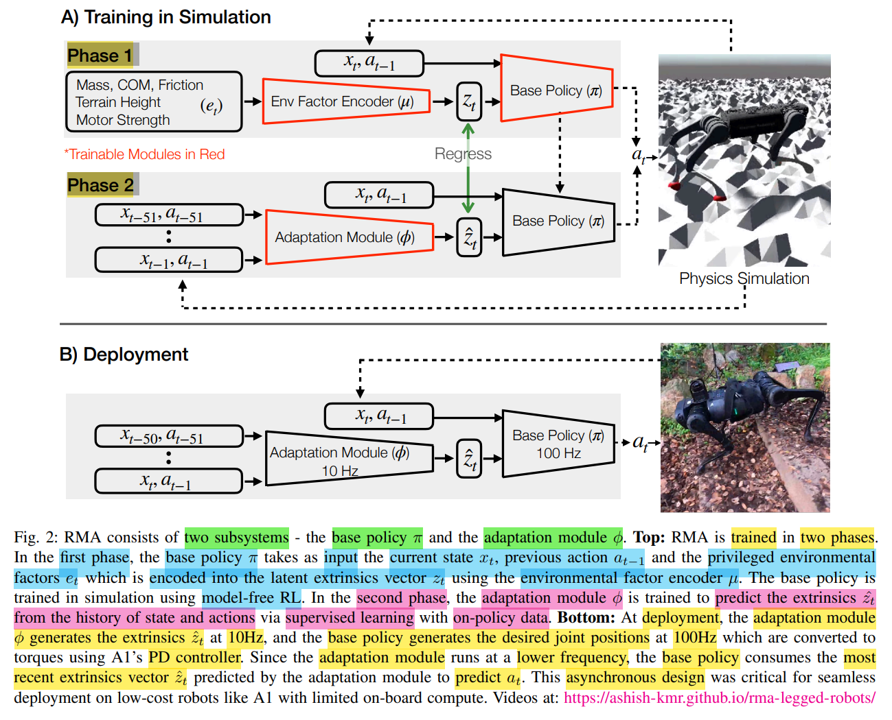

# RMA : Rapid Motor Adaptation for Legged Robots

**RSS 2021**

[RMA - Project Website](https://ashish-kmr.github.io/rma-legged-robots/)

[RMA/CMS - Github](https://github.com/antonilo/rl_locomotion)

---

Rapid Motor Adaptation

核心
1. base policy
2. adaptation module

sim2real gap
1. 真机 & 仿真模型 差别大
2. 真实场景 & 仿真建模 差别大
3. 仿真器 不能准确捕捉 现实世界 物理特性

框架
1. 
2. deploy 时候，不能直接使用 extrinsic，而是需要 adaptation module 实时估计
   1. extrinsic 也会影响 动作指令 和 实际动作
   2. eg : 算法 发出 蹬地指令，但身体没动 & 腿部速度异常快(打滑)，从而推断出 地面很滑，自动调整步态
3. 使用 recent history (state & action) 估计 extrinsic
   1. 类似于 Kalman Filter 的 状态估计
4. 2 phases
   1. phase 1 : 同时学 encoder & base-policy
   2. phase 2 : 固定 base-policy(teacher 拷贝给 student 并冻结) 学 adaptation module

监督训练 module
1. 直接监督 : 使用 encoder 输出 latent 的 loss，**本文实现方式**
2. 间接监督 : 通过 action 的 loss，梯度传到 encoder

个人理解
1. 类似于 DAgger / Teacher-Student Distillation，但是 蒸馏对象是 latent output
2. 训练 student 只能看到 可部署 obs，使得 student 输出的 extrinsic 尽量接近 teacher

细节
1. reset 时，清空历史，预填 zero obs_history (state & action)
   1. policy 最开始 输出的 action，不是从 obs_history 中取的
   2. 仿真里真正用于 PD target 的 action，在 `step()` 里用的是 `act_history[... - 3]`
      1. 模拟 控制链路的 **action latency**
2. 直接从 obs_history 里切片拼接，取**最近的**(latest) history_len
3. sim2real gap
   1. 仿真里，时间是 暂停的，追求逻辑严密(因果性)
      1. 暂停世界，物理计算停止，时间冻结，adaptation 计算，算完后才恢复时间
   2. 现实里时间是 流动的，所以追求速度补偿(实时性)
      1. 现实是异步 &  连续的，计算要花时间，在输入端就必须尽可能给它最新鲜的数据，抵消**推理延迟 Inference Latency**
   3. 思考
      1. 可能可以使用 延迟随机化 Latency Randomization，弥补这种 Sim-to-Real 时间差
      2. 迫使 Adaptation Module 学习 **时间鲁棒 Time-Invariant** 的表征
      3. 方法
         1. 使用 随机的 lag
         2. 固定 lag，对 adaptation 输入做随机 time-shift / dropout / hold

