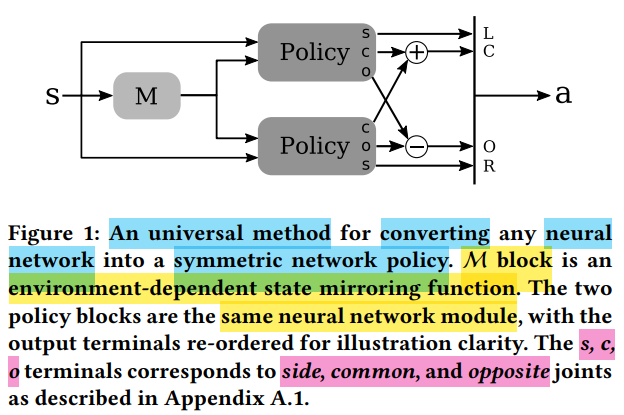

# Symmetry

---

# On Learning Symmetric Locomotion - SIGGRAPH 2019

Peng XueBin

## 01 - Abstract & Introduction

symmetry is a potential useful structure

DRL need to improve learning efficiency & motion quality

symmetry 与其他 efficiency improvement 方法 orthogonal(互补干扰)

直觉上
1. avoid asymmetric local minima
2. hard symmetry constraints 可能会带来问题
3. 对称策略(policy) 帮助实现 对称动作，并不保证 对称结果(gait)
   1. eg : 奔跑步态 在任意瞬间 都是不对称的，但 是由 对称策略 在不同时间点 驱动出来的结果

integrate symmetry **inductive bias(归纳偏置)**
1. DUP (Duplicate Tuples)  : 数据增强法，将 每条运动数据 及 其镜像副本 同时 存入经验回放池，tuple : $(s_t, a_t, r_t, s_{t+1})$
2. LOSS (Auxiliary Loss)   : 辅助损失法，增加 损失函数，惩罚 策略输出 & 镜像输出 的差异
3. PHASE (Phase Mirroring) : 相位镜像法，将步态周期 分为两半，前半周 学习原始策略，后半周 直接使用镜像后的策略
4. NET (Symmetric Network) : 对称网络法，通过 网络结构设计，使 模型 在数学上 保证 对于镜像输入 产生镜像输出

## 02 - Related Work

## 03 - Background

RL问题定义 & PPO

## 04 - Symmetry Enforcement Methods

Mirroring Function (镜像函数) 是 environment 的一部分

Mirror State  : $M_s(s)$

Mirror Action : $M_a(a)$

Symmetric Trajectory : $(s, a)$ & $(M_s(s), M_a(a))$

Symmetric Policy
1. $\pi_{\theta}(M_s(s)) = M_a(\pi_{\theta}(s))$
2. 对称策略 传入 镜像状态 时，产生 镜像动作

Symmetric State-Value Function
1. $V(s) = V(\mathcal{M}_s(s))$
2. **NET-POL** 消融实验 : 只在 policy 网络上 使用 对称架构，而在 state-value 网络上 不使用 对称约束，学习速度 & 最终表现 会显著下降

对称策略(policy) 并不保证 对称结果(gait)
1. 初始状态的影响 & 优势足(dominant foot)
2. 状态空间 没有完全探索

在 RL 中，使用 reward function 来 直接优化 gait symmetry 的问题
1. 导致 delayed / sparse reward

追求的是 approximately symmetric 的 policy，对称性 只是 引导

### A.1 - Mirroring Functions

不同 joints 类别 的 处理原则
1. **common**
   1. 位于 **中轴线上**，一般是 **绕 $y$ 轴**
   2. 镜像后，保持不变
2. **opposite**
   1. 位于 **中轴线上**，但运动方向与左右对称相关的部分
   2. 镜像时，取负值
3. **side**
   1. 成对出现的肢体部件
   2. 镜像时，左右互换(按需 加 负号(非 y-axis))，eg : knee 就不用 加
   3. 为了方便，可以在 构建 urdf 的时候就将 相关旋转轴(除了 绕 y-axis) 反向，省去 取负操作

environment 处理
1. 向量信息(vector-valued): y-axis 方向的值 需要 取反，eg : 速度 & 目标位置
2. 朝向信息(orientations) : roll & yaw 需要 取反，eg : 欧拉角

### 04.01 - Duplicate Tuples (DUP)

算是 一种 Data Augmentation

把 rollout traj & mirrored traj 都存入 rollout memory buffer 中

各个 reward 不因为 trajectory 的 mirror 而改变
1. 因为 reward function $r(s,a)$ 是 自守的(automorphic)
2. 即 $r(s, a) = r(M_s(s), M_a(a))$

缺陷
1. 通过 mirror 得到的数据 严格上 不算 on-policy，不符合 Policy Gradient 的 假设
2. 结合 PPO / TRPO 使用，可能会产生 off-policy 的问题

作者的结果表明 实践中 问题不大

### 04.02 - Auxiliary Loss (LOSS)

Symmetry Loss
1. $$L_{sym}(\theta) = \sum_{t=1}^{T} ||\pi_{\theta}(s_t) - M_a(\pi_{\theta}(M_s(s_t)))||^2$$
   1. 相当于 自检，state 下的 action，应该接近，mirror state 下 action 的 mirror
2. 加权($w$，超参)然后 加到 PPO 的 default loss 中

加在 Loss **优于** 加在 Reward
1. 信号更清晰 : Loss 可导，能知道往哪个方向优化能变对称，而 Reward 需要通过 PPO 算法 试错 去 领悟
2. 避免副作用 : 避免 为了刷分而学出 unexpected behaviors

采样效率(sample efficiency) 高，也就是 达到相同的 运动表现(return) 需要的 **数据量**(所有 Rollout 轮数中累加的总帧数) **少**(试错次数少)

缺点
1. 需要 配合 **curriculum learning** 才 beneficial
2. 某些 情况/场景 强行加入 反而有害(detrimental)
3. 多一个 超参 $w$，但是 method 对于 其取值 **不敏感(not sensitive)**

### 04.03 - Phase-Based Mirroring (PHASE)

重复的 gait cycles，使用 相位(phase) $\phi \in [0, 1)$ 进行参数化，当 $\phi$ 达到 1 时则绕回至 0

phase 需要作为 observation 的一部分

常见假设(assumption) : 相位 随 时间 **线性推进**

更 robustness 策略 : 足端着地时，进行 相位重置(phase-reset)
1. 左脚着地，设置 $\phi = 0$ (0 ~ 0.5，代表迈出左腿)
2. 右脚着地，设置 $\phi = 0.5$ (0.5 ~ 1，代表迈出右腿)

enforce symmetry
1. 策略 仅针对前半个周期 进行学习
   1. 不停止数据采集(rollout 全周期)，只是 通过 mirror，让 神经网络的参数 $\theta$ 仅仅对半个周期的表现负责
2. $$a_t = \begin{cases} \pi_{\theta}(s_t) & 0 \le \phi(s_t) < 0.5 \\ \mathcal{M}_a(\pi_{\theta}(\mathcal{M}_s(s_t))) & 0.5 \le \phi(s_t) < 1 \end{cases}$$
   1. 前半个周期 : 真实状态 $s_t$，通过 policy 得到 $a_t$，直接用 $a_t$ 控制机器人
   2. 后半个周期 : 真实状态 镜像 $M_s(s_t)$，通过 policy 得到 $a_t$，再将 $a_t$ 镜像 $M_a(a_t)$ 控制机器人
3. 整个过程中 的 特征分布 始终是属于 前半周/被镜像后的伪前半周

从数学公式上 保证，后半周 一定是 前半周 的**完美镜像**

易于实现，不需要 修改 training(network / optimizer)，直接在 environment 实现

对于 imitation-guided learning 很有用，参考动作(MoCap) 就是 按时间排列好的(固定速率)

缺点
1. 在 $\phi = 0.5$ 处 强行切换，可能存在 突变(abrupt)风险
2. 对于 forward-progress 任务(前进，没有参考)，强制规定了 步态周期(相位 $\phi$ 随时间 线性增加)，机器人没法自己探索更优的步频

### 04.04 - Symmetric Network Architecture

在 network architecture 层面 要求 对称性

**通用方法**，inner network 不需要 知道 对称性
1. 外层 套壳(整个打包 Wrapper 为整体 Policy)，内层 权重共享(inner network(灰色 policy))，输出端 拼出 action
2. 内部网络 $f$，同时接收原始状态 $s$ 和镜像状态 $M_s(s)$ 作为输入
3. 
4. Left / Common / Opposite / Right
5. **side** 类型 (输出维度确实只负责 身体的一侧，也就是 side 的一半，否则维度 对不上)
   1. 注意 $\pi$ 是 外层套壳后 整个 policy，$f$ 是 原 inner policy
   2. $$\pi_{side}(s) = \begin{bmatrix} f(s, M_s(s)) \\ f(M_s(s), s) \end{bmatrix}$$
   3. $$\begin{aligned}
      \pi_{side}(M_s(s)) &= \begin{bmatrix} f(M_s(s), M_s(M_s(s))) \\ f(M_s(M_s(s)), M_s(s)) \end{bmatrix} \\
      &= \begin{bmatrix} f(M_s(s), s) \\ f(s, M_s(s)) \end{bmatrix} \\
      &= M_a \left( \begin{bmatrix} f(s, M_s(s)) \\ f(M_s(s), s) \end{bmatrix} \right) \\
      &= M_a(\pi_{side}(s))
      \end{aligned}$$
      1. $$M_a \left( \begin{bmatrix} a_l \\ a_r \end{bmatrix} \right) = \begin{bmatrix} a_r \\ a_l \end{bmatrix}$$
6. **common**(加法 $\oplus$) 类型
   1. $$a_{C} = \text{Policy}_{top}(s).out_C + \text{Policy}_{bottom}(\mathcal{M}_s(s)).out_C$$
   2. 对调 $s$ 和 $\mathcal{M}_s(s)$，输出不变
7. **opposite**(减法 $\ominus$) 类型
   1. $$a_{O} = \text{Policy}_{top}(s).out_O - \text{Policy}_{bottom}(\mathcal{M}_s(s)).out_O$$
   2. 对调 $s$ 和 $\mathcal{M}_s(s)$，输出相反数
8. train from scratch 不需要 考虑 common & opposite ÷2 的问题，预训练模型 迁移 才需要

缺点
1. 需要 state & action 的 symmetry structure 的 先验信息，重新定义 网络
2. 对于 state & action 的 normalization 比较 sensitive
   1. 左 & 右 关节必须使用 同一组 $\mu$ 和 $\sigma$，通常取两者的平均值

## 05 - Gait Symmetry Metrics

## 06 - Environment

## 07 - Results

---
---

# Symmetry Considerations for Learning Task Symmetric Robot Policies

