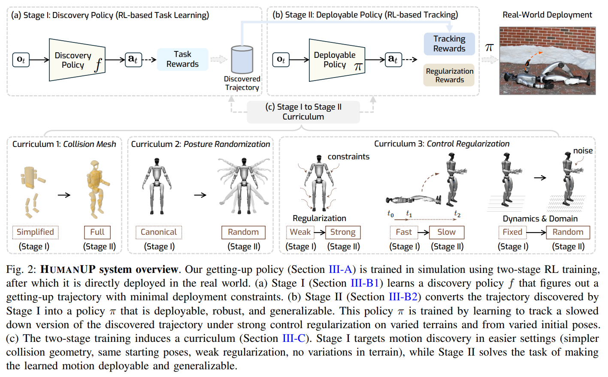
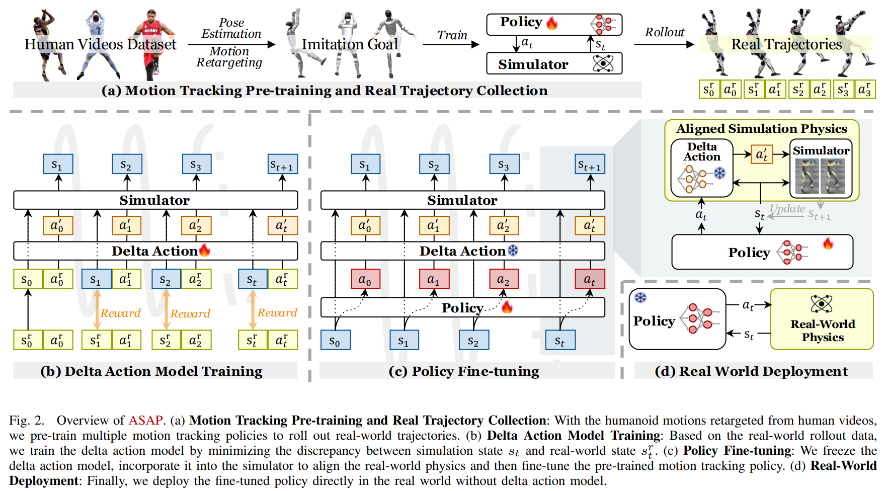
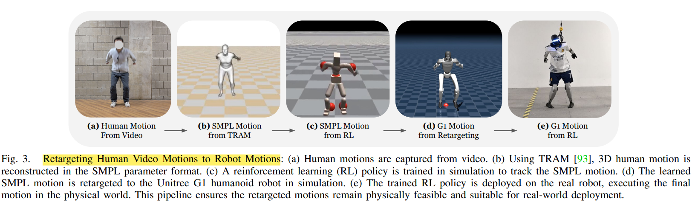
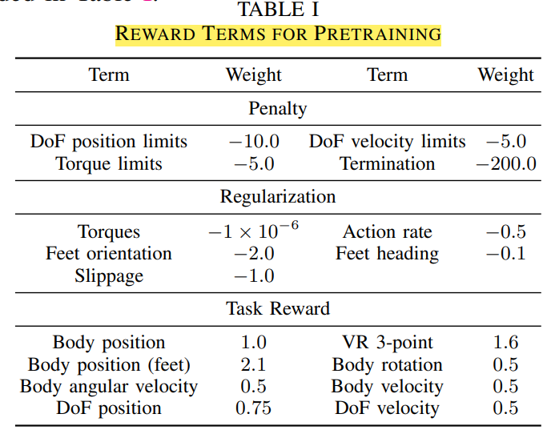
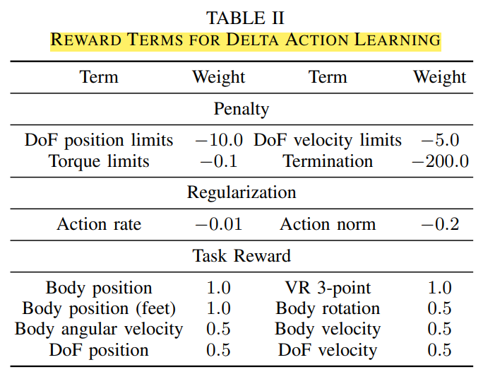

# Locomotion

low-contact : 地面 走/跑

high-contact : 更多环境

reinforcement learning

rewards
1. penalty - 惩罚不良行为
2. regularization - 限制模型或策略的复杂度，防止智能体学到极端、剧烈波动、不稳定的策略
3. task reward - 衡量任务完成度

Regularization(优化) 看起来像 Penalty(约束)，都是负向奖励，都会减少智能体的最终得分

lower CoM : cadence should be faster

higher CoM : better in dynamic

Quadruped Running - He

Humanoid Parkour - Zhuang

walking
1. single support : 70%
2. double support : 30%

# Learning Getting-Up Policies for Real-World Humanoid Robots

[Learning Getting-Up Policies for Real-World Humanoid Robots](https://humanoid-getup.github.io/)

与 普通 Locomotion 区别
1. Non-Periodic Behavior
2. Contact-Rich Locomotion (with ground)
3. Reward Sparsity

分类
1. 面朝上
2. 面朝下(翻身 + 起立)

observation 只有 机器人本体信息

2阶段训练
1. stage 1 : 不足以 sim2real
   1. task reward 主导，constraint 较少
2. stage 2 : 在 stage 1 基础上 添加约束，确认可行，并 track 轨迹

Reward
1. Getting Up
   1. base height
   2. head height
   3. base height increase
   4. feet contact force increase(upper body leave)
   5. symmetry
      1. body
      2. waist
2. Roll Over
   1. base gravity 方向 朝上
   2. knee gravity 方向 朝上
3. Tracking
   1. DoF position 关节角度
   2. 头部高度不作为奖励，而作为终止条件(和 需要 tracking 相差 太多 则结束)

过多的 constraint reward 会 降低 探索能力

Curriculum
1. Collision Mesh
   1. simplified - 一阶段
   2. full
2. Posture Randomization
   1. canonical
   2. random (1m 落地 结果的姿势)
3. Control Regularization
   1. stage 2 加强限制
   2. stage 1 的动作 放慢 让 stage 2 学习 (slower & safer)
   3. domain random

Baseline & Metrics
1. 宇树自己的 起身控制
2. 电机温度

Common Failure : low friction

Future
1. risk
2. hardware
3. RL/IL

# ASAP : Aligning Simulation and Real-World Physics for Learning Agile Humanoid Whole-Body Skills

[ASAP : Aligning Simulation and Real-World Physics for Learning Agile Humanoid Whole-Body Skills](https://agile.human2humanoid.com/)

dynamics mismatch between simulation and real

agile and coordinated whole-body motions

Existing Method
1. System Identification
2. Domain Randomization

2 stage
1. **Pre-Train** motion tracking policies in simulation using retargeted human motion data
   1. train base policy in simulation
   2. human motion as data sources(retargeted to humanoid robot)
   3. phased-conditioned motion tracking policy to follow retargeted movements
2. **Post-Train** deploy the policies in the real world and collect real-world data to train a **delta  action model(residual correction)** that compensates for the dynamics mismatch
   1. finetune the policy by aligning the simulation and real-world dynamics
   2. real-world rollout data including proprioceptive states and positions

**Pre-Training** : Learning Agile Humanoid Skills
1. Data Generations : Retarget Human Video Data
   1. 
   2. Transforming Human Video to SMPL Motions
      1. **TRAM** : reconstruct 3D motions from videos, in SMPL parameter format
   3. Simulation-Based Data Cleaning : MaskedMimic(imitate motions in IsaacGym)
   4. Retarget SMPL Motions to Robot Motions
      1. shape-and-motion 2 stages
         1. shape : 12 body links & gradient descent to minimize joint distances
         2. motion : gradient descent to minimize body links distance(调整关节角度)
2. Phase-Based Motion Tracking Policy Training
   1. goal state $s^g_t$
   2. proprioception $s^p_t$ (observation) - 5-step history
      1. $q$ : joint position (23) * [t-4 : t]
      2. $\dot{q}$ : joint velocity (23) * [t-4 : t]
      3. $w^{root}$ : root angular velocity (3) * [t-4 : t]
      4. $g$ : root projected gravity (3) * [t-4 : t]
      5. $a$ : former action (23) * [t-5 : t-1]
   3. PPO (proximal policy optimization) - design choices
      1. asymmetric

transfer scenarios
1. IssacGym -> IsaacSim
2. IssacGym -> Genesis
3. IssacGym -> Unitree G1

Rewards
1. Pre-Training
   1. 
2. Delta Action Learning
   1. 

# OmniH2O : Universal and Dexterous Human-to-Humanoid Whole-Body Teleoperation and Learning

Retargeting AMASS to specific humanoid robot

We use an 3-step process to retarget the AMASS dataset to specific humanoid embodiments. Taking `H1` as an example here
1. Write forward kinematics of `H1` in `human2humanoid/phc/phc/utils/torch_h1_humanoid_batch.py`
2. Fit the SMPL shape that matches the `H1` kinematics in `human2humanoid/scripts/data_process/grad_fit_h1_shape.py`
3. Retarget the AMASS dataset based on the corresponding keypoints between fitted SMLP shape and `H1` using `human2humanoid/scripts/data_process/grad_fit_h1.py`

