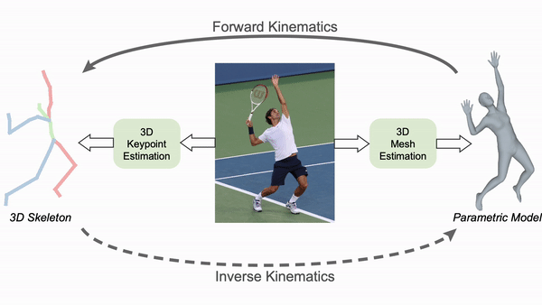
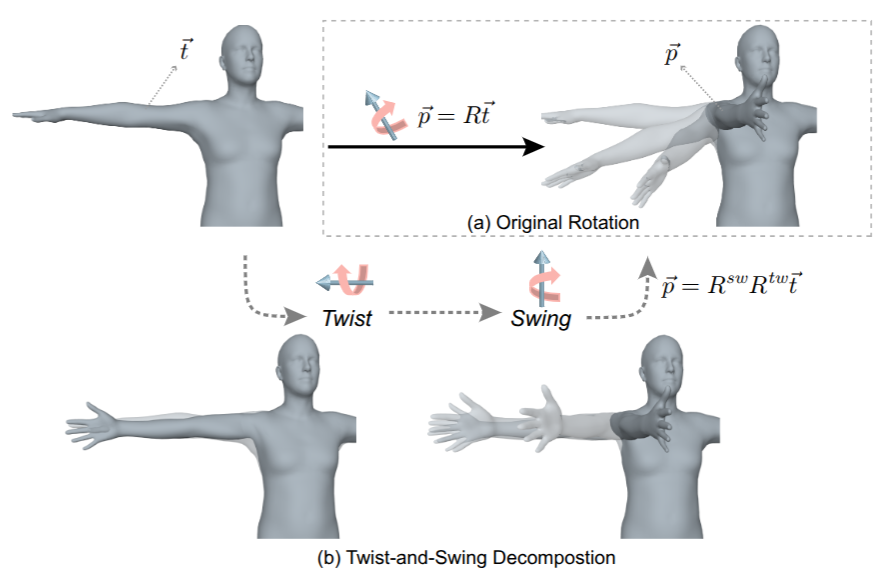
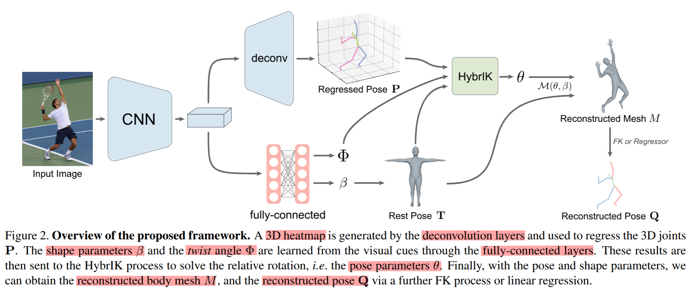
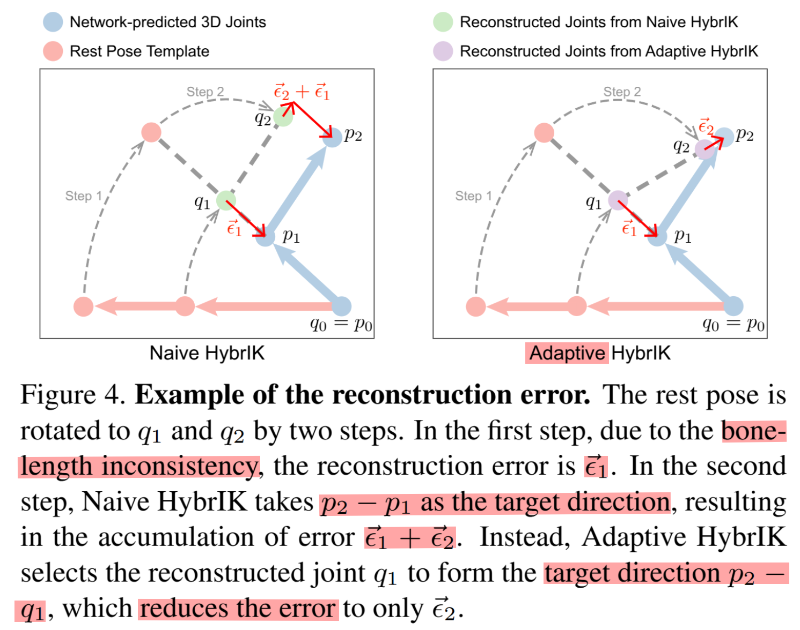
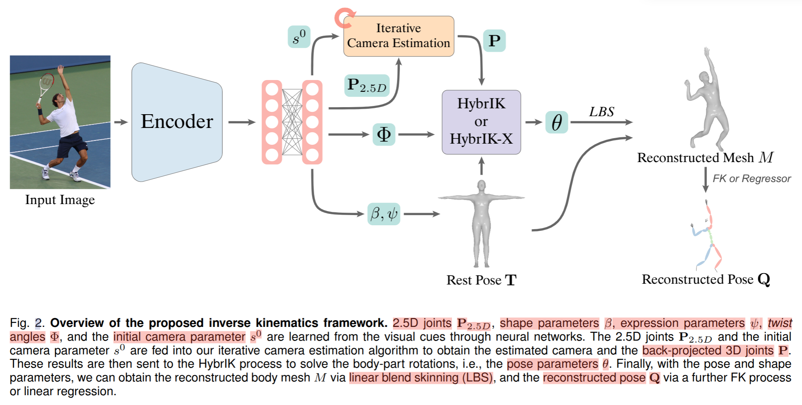
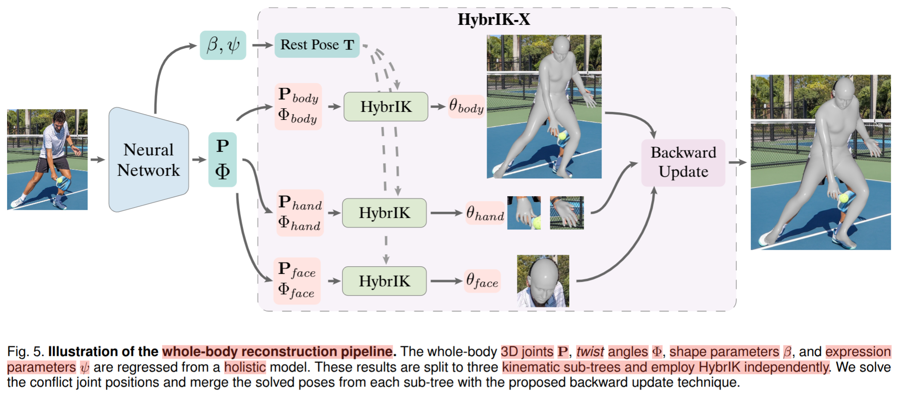

# HybrIK & HybrIK-X



**HybrIK-X**(`TPAMI 2025`) 是 **HybrIK**(`CVPR 2021`) 续作

[HybrIK-X & HybrIK - Github](https://github.com/jeffffffli/HybrIK)


Datasets
1. 3DPW - **outdoor** benchmark for 3D pose and shape estimation
2. Human3.6M - **indoor** benchmark for 3D pose estimation
3. AGORA

Metrics
1. PA-MPJPE (Procrustes Aligned Mean Per Joint Position Error)
2. MPJPE (Mean Per Joint Position Error)
3. MVE (Mean Volume Error)


# Papers

## HybrIK

3D keypoints(3D joints/skeleton) estimation methods
1. 优 : pixel-level accuracy
2. 劣 : unrealistic body structure

3D mesh parameter (SMPL) learning
1. 优 : realistic & controllable 3D mesh will a few parameters (shape prior)
2. 劣 : image-model misalignment & non-linear

transforms accurate 3D joints to relative body-part rotations for 3D body mesh reconstruction, via the twist-and-swing decomposition
1. 
2. twist : 绕骨骼轴的旋转，1 DoF
3. swing : 平面内的旋转，2 DoF，方向是 同时垂直于 起始方向 & 目标方向 (可以使用 cross product 求解)

accurate 3D joints facilitate the 3D body mesh estimation

shape prior in parametric body model in turn fixes the unrealistic body structure issue

Framework
1. 
2. 3D heatmap (3D joints location representation)


Naive & Adaptive HybrIK
1. 
2. p - input pose
3. q - output/reconstructed pose

Overall Loss
1. pose (3D keypoints)
2. shape (SMPL)
3. rot
4. tw (twist angle) - 使用 `sin` & `cos` - 需要网络学习 twist，但是 swing 可以直接计算，因此无需 loss

wrong twist angles do not affect the reconstructed SMPL joints

only the swing rotations change the joint locations


## HybrIK-X

**HybrIK-X** = HybrIK + **articulated hands** & **an expressive face**

one-stage model

抛弃 heatmap 使用 2.5D(2 pixel coordinate + relative depth)
1. heatmap 缺点
   1. fails when the human body is outside the input image
   2. computational burden
2. 使用 camera parameter back-project 2.5D to 3D
   1. weak-perspective camera model

Framework
1. 
1. 
2. split to 3 kinematic sub-trees (`body` & `hand` & `face`) and employ HybrIK independently


# 代码

```bash
python3 scripts/demo_video.py --video-name examples/dance.mp4 --out-dir res_dance


```


# Installation

[hybrik - Installation](https://github.com/jeffffffli/HybrIK?tab=readme-ov-file#installation-instructions)

[pytorch3d - Installation](https://github.com/facebookresearch/pytorch3d/blob/main/INSTALL.md)

如果 使用的是 Anaconda，推荐使用 `conda install pytorch3d -c pytorch3d` 安装


