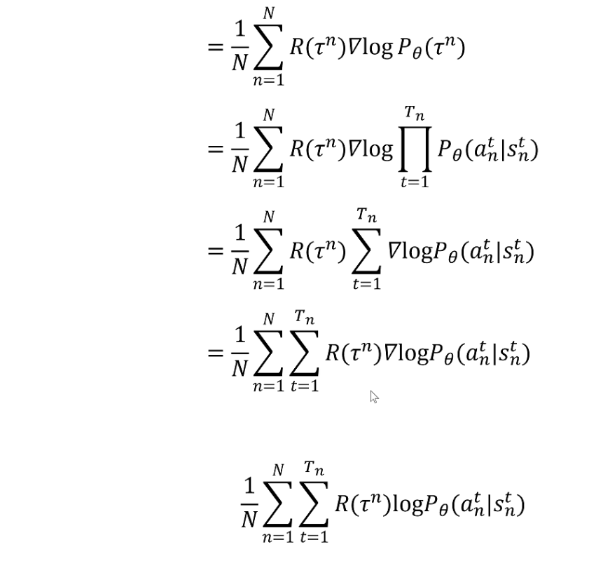

# RSL_RL

[RSL_RL - Github](https://github.com/leggedrobotics/rsl_rl)

PyTorch 的强化学习算法实现

核心是 Proximal Policy Optimization(PPO)

结合了 Actor-Critic 架构

适用于多个环境并行训练(num_envs)的情况

并支持循环神经网络(RNN)作为策略网络

文件结构
1. **algorithms**
   1. `ppo.py`
2. **env** - 环境抽象
   1. `vec_env.py`
3. **modules** - 网络模型
   1. `actor_critc_recurrent.py`
   2. `actor_critc.py`
4. **runners** - 训练驱动脚本
   1. `on_policy_runners.py`
5. **storage** - 采样数据缓存
   1. `rollout_storage.py`
6. **utils**
   1. `utils.py`

`@staticmethod`
1. 把类中的普通函数声明为 静态方法
2. 不会 隐式接收 self(实例对象) 或 cls(类本身) 参数
3. 既可以通过 `类名.方法()` 调用，也可以通过 `实例.方法()` 调用

`@property`
1. 把一个 **无参方法** 伪装成 只读属性
2. 调用时无需加括号，像访问变量一样 `obj.attr`

`@abstractmethod`
1. 告诉解释器 是 **抽象方法，没有默认实现，子类必须重写**
2. 如果子类漏掉实现 会抛 `TypeError: Can't instantiate abstract class`

`.detach()`
1. 切断 张量 & 计算图(computational graph) 之间的关联
2. 不再保留梯度信息，并且在随后反向传播时 不会回传梯度
3. 返回一个 新的张量 与 原张量 **共享数据**

## ppo.py

import
1. [ActorCritic](#actor_criticpy--actor_critic_recurrentpy)
2. [RolloutStorage](#rollout_storagepy)

总损失 : `L = surrogate_loss + value_loss_coef * value_loss – entropy_coef * entropy`

`PPO` 类
1. `__init__()`
   1. desired_kl : 目标 KL 距离，配合 schedule="adaptive"
   2. schedule : 学习率调度方式
      1. "fixed" : 始终使用初始 learning_rate
      2. "adaptive" : 按 KL 距离自适应调整，在 `update()` 函数中，根据 kl_mean 和 `2*desired_kl` / `0.5*desired_kl` 进行 learning rate 的调整
   3. learning_rate
   4. PPO components
      1. actor_critic : `ActorCritic` 类
      2. storage : `RolloutStorage` 类
      3. optimizer : `optim.Adam(self.actor_critic.parameters(), lr=learning_rate)`
      4. transition : `RolloutStorage.Transition` 类，暂存当前时间步step 环境交互数据，等待存入完整的 trajectory buffer
   5. PPO parameters
      1. clip_param : 裁剪系数，裁剪 重要性采样比值
      2. num_learning_epochs : 每次 rollout 结束后，对 **同一批数据** 做多少个 epoch 的梯度更新
      3. num_mini_batches : 把整批 rollout 数据 拆成几份 mini-batch
      4. value_loss_coef : value_loss 的权重
      5. entropy_coef : 熵正则权重，鼓励策略保持随机性
      6. gamma : 折扣因子 $\gamma$，步数越远 权重越小
      7. lam : GAE 的 $\lambda$
      8. max_grad_norm : 梯度裁剪阈值，防止梯度爆炸
      9. use_clipped_value_loss : Boolean
2. `init_storage()` : 实例化 `RolloutStorage` 类
3. `test_mode()` : 调用 `nn.Module.train()`
4. `train_mode()` : 调用 `nn.Module.eval()`，关闭 dropout，使用 train 时 统计的 batchnorm 全局均值、方差，是否计算梯度由 `torch.no_grad()` 决定
5. `act()`
   1. 与环境交互(输入当前 obs & critic_obs)，收集当前 step 全部数据(actions, values, actions_log_prob, action_mean, action_sigma, observations, critic_observations)，并暂时存放在 transition 上，返回 actions
   2. `.detach()` : 把动作从计算图切断，不需要反向传播 只是要把值存进缓冲区，节省显存
   3. `act()` 阶段的主要目标是 采样&收集数据(阶段并不会立刻反向传播)，是先存进 rollout buffer，供稍后做梯度更新时使用
6. `process_env_step()`
   1. 在每一步 env.step() 之后，把刚拿到的 reward / done 等信息补齐到 transition
   2. 正式写入 RolloutStorage
   3. **==☆==** 判断 是否是 time_out 导致的被迫强制中断，**如果 不是失败 而是 时间用完 这步奖励应当包含后续的预期价值**
      1. 如果把它当成真正终点，会低估后续潜在回报，给价值函数带来偏差
      2. **time-limit bootstrapping**，在超时那一步 用 Critic 的预测值来 补 被截掉的尾巴
      3. `infos['time_outs']` 是长度为 num_envs 的 0/1 掩码，=1 表示 超时
   4. 清空 transition
   5. 对于 dones 的环境，重置 RNN 隐状态(如果有，对 普通 MLP 无影响)
7. `compute_returns()`
   1. 调用 actor_critic 的 `evaluate()`，输出 状态价值
   2. 调用 storage 的 `compute_returns()`，计算 GAE
8. `update()` **==☆==**
   1. 调用 `reccurent_mini_batch_generator` / `mini_batch_generator`，得到 batch 生成器 `yield`
      1. 包含以下内容
         1. obs_batch, critic_obs_batch, actions_batch
            1. 完整的 obs 信息，而非第一帧
         2. target_values_batch, advantages_batch, returns_batch
         3. old_actions_log_prob_batch, old_mu_batch, old_sigma_batch
         4. hid_states_batch
         5. masks_batch
   2. 在 mini-batch 内
      1. act
      2. 计算 KL 并 调整学习率，需要有 `desired_kl` & `schedule == 'adaptive'`

## vec_env.py

`VecEnv` 类 : 继承 `abc.ABC` (Abstract Base Classes)
1. variable
   1. num_envs, num_obs, num_privileged_obs, num_actions : `int`
   2. max_episode_length : `int`
   3. obs_buf, privileged_obs_buf, rew_buf, reset_buf : `torch.Tensor`
   4. episode_length_buf : `torch.Tensor`，计数器(表示 已经历的时长)，效果是 并行环境 在 不同的时间步 陆续结束，打破了同步，避免采样数据高度同步、单调
      1. 以 LeggedGym 中的 BaseTask 为例，初始化方式 : `torch.zeros(self.num_envs, device=self.device, dtype=torch.long)`
   5. extras : `dict`
   6. device : `torch.device`
2. `@abstractmethod`
   1. `step(actions: torch.Tensor)`
   2. `reset(env_ids: Union[list, torch.Tensor])`
   3. `get_observations()`
   4. `get_privileged_observations()`
      1. `Union[torch.Tensor, None]`

强化学习里，episode(也叫 trajectory、回合)，指从环境 reset 开始，到 done=True 为止的那段完整交互序列

对并行 `VecEnv` 而言，每个子环境都在独立地经历自己的 episode，结束标志可以是任务完成、失败、或者达到预设最大步数 `max_episode_length`

## actor_critic.py & actor_critic_recurrent.py

ActorCriticRecurrent 先用 Memory(GRU/LSTM) 对原始观测做一步时序建模，得到隐向量 $h_t$

把 $h_t$ 当作 新的观测 送进父类 ActorCritic 的 MLP，继续输出 动作均值 $\mu$ 或价值 $V$

如果有 `privileged_obs` 则 `critic_obs` 使用 privileged，否则就使用 `obs`

`ActorCriticRecurrent` 类 继承 `ActorCritic` 类 继承 `nn.Module` 类
1. is_recurrent : 类属性/类变量 (class variable)，而不是实例属性
2. `__init__()`
   1. activation 使用 后面的 `get_activation()` 获取
   2. mlp_input_dim_a (actor)  : num_actor_obs
   3. mlp_input_dim_c (critic) : num_critic_obs
   4. Policy : **actor**  : 通过 `nn.Sequential(*actor_layers)`  创建，网络输出就是 mean
   5. Value  : **critic** : 通过 `nn.Sequential(*critic_layers)` 创建，网络输出就是 mean
   6. Action Noise
      1. std : `nn.Parameter` 用来声明 **可训练权重的** 张量类型
         1. 本质上是 `Tensor(requires_grad=True)` 并多附加一个 flag
         2. `nn.Module` 在构造时会自动把所有 `nn.Parameter` 成员登记到 `model.parameters()` 列表里
         3. 否则 需要 把这个张量显式地 传给优化器，否则仍不会被更新
      2. distributuion : `from torch.distributions import Normal`，但是初始化的时候 不知道均值，所以先设为 None
   7. ==recurrent 特有==
      1. memory_a : actor
      2. memory_c : critic
3. `init_weights()` : 仅 `orthogonal_` 初始化 nn.Linear 类型的层
   1. `torch.nn.init.orthogonal_()` 把权重矩阵初始化为正交矩阵
   2. input :
      1. sequential : `nn.Sequential` 对象，里边包含若干层
      2. scales : 长度与要初始化的 `nn.Linear` 层数量一致，每个位置存放该层使用的 gain 系数
4. distribution : 当前 观测 下，策略对动作空间的 **完整概率分布**，动作 action 来自这个分布
   1. `action_mean()` : `self.distribution.mean`
   2. `action_std()` : `self.distribution.stddev`
   3. `entropy()` : 香农熵 的连续版本 微分熵
      1. `self.distribution.entropy().sum(dim=-1)`
      2. `.sum(dim=-1)` : 动作各维之间独立，熵具有可加性，把每个维度的熵相加，得到整条动作向量的总熵
   4. `update_distribution()` : 用 计算的 mean + 可学习的 std，更新 distribution
5. `get_actions_log_prob()` :
   1. `self.distribution.log_prob(actions).sum(dim=-1)`
   2. 
   3. 假定 **各动作维互相独立**
   4. 计算的是 **单个时间步的**，不是整条轨迹
   5. 先对每个动作维度算 一维高斯的 对数概率，把 action_dim 的结果相加，得到联合对数概率
   6. obs 已经隐含在 `self.distribution` 里
6. `act()` : **对应 actor** : 从策略分布中随机采样动作，增强探索
   1. not recurrent : update_distribution + sample(训练时 增加探索性)
   2. ==recurrent*= : 先经过 memory_a 的 `forward()`，再经过 not recurrent 的 `act()`，**一套接口，两种运行模式**
1. `act_inference()` : 推理(确定性动作)，直接输出动作分布的均值 $\mu$，得到确定性动作
   1. not recurrent : observations 直接通过 actor 网络，不进行随机采样
   2. ==recurrent== : 先经过 memory_a，由于 mask=None，因此 不是 batch_mode，只用上一步 hidden_states
2. `evaluate()` : **对应 critic** : critic 输出 状态价值函数
   1. not recurrent : critic_observations 直接通过 critic 网络，参与 后续 GAE，输出本来就是确定性的标量，**不需要像 action 那样采样**
   2. ==recurrent== : 先经过 memory_c 的 `forward()`，再经过 not recurrent 的 `act()`，**一套接口，两种运行模式**
1.  ==recurrent 特有==
   1. `reset()` : 根据 dones 重置 memory_a & memory_c，调用 实例的 `reset()` 函数
   2. `get_hidden_states()` : 同时返回 memory_a & memory_c 的 hidden_states

`get_activation()` : 通过 act_name 获取各种激活函数

`Memory` 类，继承 `torch.nn.Module` 类
1. `__init__()`
   1. rnn_cls : `nn.GRU` 或 `nn.LSTM`，其 forward 的 输入/输出 如下
      1. 输入 : input  + hidden_states(optional)
      2. 输出 : output + next_hidden_state
   2. rnn : 根据 `rnn_cls(input_size, hidden_size, num_layers)` 创建
   3. hidden_states : 用于接力 隐状态
2. `forward()` : 两种运行模式
   1. 是 batch_mode (masks ≠ None) : **批量训练模式，使用完整轨迹进行反向传播，参数更新**，hidden_states 不能为 None，使用 masks
      1. rnn 输入
         1. input : 已 pad 的序列，`[T_max, num_traj, feat]`
         2. hidden_states : 采样阶段保存的首时刻隐状态 $h_0$
      2. rnn 输出
         1. out : 之后用 `unpad_trajectories()` 把补零行删除
         2. _ : 并不关心 返回的 next_hidden，在当前 mini-batch 中不会再用，直接忽略节省显存
   2. 否 batch_mode (masks = None) : **采样推理模式，需要 把当前观测送进 RNN，并把产生的隐藏状态 保存，供下一时间步继续用**，因此每次使用上一步 hidden_states
      1. rnn 输入
         1. `input.unsequeeze(0)` : `[num_envs, feat]` -> `[1, num_envs, feat]`，只算一步，开销最小，符合 PyTorch RNN 的输入格式 `(seq_len, batch, feature)`，后续会 `sequeeze(0)`
         2. `self.hidden_states` : 上一步的隐状态，**由类内部维护，自动实现 串行记忆**
      2. rnn 输出
         1. out :
         2. self.hidden_states : **接力保存** hidden_states
3. `reset()` : 清空 hidden_states

## on_policy_runner.py

import
1. PPO
2. ActorCritic, ActorCriticRecurrent
3. VecEnv

接收来自 Isaac Gym 的环境对象 (必须是 VecEnv 类型)

Surrogate Loss 训练 Actor(策略网络) 的目标

`OnPolicyRunner`，数据收集覆盖所有子环境

`OnPolicyRunner` 类
1. `__init__()`
   1. config : 对于 LegggedGym 都是 继承 `BaseConfig`，并且 runner, algorithm, policy 都在 `PPO Cfg`，不在 `Env Cfg`
      1. cfg : `train_cfg["runner"]`
      2. alg_cfg : `train_cfg["algorithm"]`
      3. policy_cfg : `train_cfg["policy"]`
   2. device
   3. env: `VecEnv` 实例，维护了 num_envs 条并行仿真
   4. actor_critic : 用 `eval()` 获取 actor_critic_class，并创建实例
   5. alg : 用 `eval()` 获取 alg_class，并创建实例
   6. num_steps_per_env
   7. save_interval
   8. Log 相关
      1. log_dir
      2. writer : `torch.utils.tensorboard.SummaryWriter`
      3. tot_timesteps : 累加 `self.num_steps_per_env * self.env.num_envs`
      4. tot_time : 累加 `locs['collection_time'] + locs['learn_time']`
      5. current_learning_iteration
   9. 直接 `env.reset()`
2. `learn()` **==☆==**
   1. lenbuffer, rewardbuffer
      1. 录最近 100个 episode 的奖励和长度，用于可视化和日志打印，滑动平均
      2. 双端队列，超过 100 条元素时会把最早的自动弹出，始终只保留最近 100 次 episode 终止时的回报与长度
      3. 采样过程中，每个并行环境各有一份 `cur_reward_sum` / `cur_episode_length`，都是 一维 tensor，长度 = num_envs
   2. **外层循环** : 从 `self.current_learning_iteration`(导入模型时，可以得到) 开始，执行 `num_learning_iterations`
   3. 进行 Rollout 采样，使用 `torch.inference_mode()`
   4. **内层循环** : 迭代 `num_steps_per_env` 次
      1. 先 通过 obs 得到 action，再和 环境交互 得到 obs, privileged_obs, rewards, dones, infos
3. `log()` : 日志输出，使用 `Tensorboard` 的 `SummaryWriter`
4. `save()` : 保存模型
   1. `actor_critic.state_dict()` :actor-critic 全部可学习参数(权重、偏置、可训练的 std 等)，key 是层路径，value 是同形状 Tensor
   2. `optimizer.state_dict()` : 包含 Adam 的 动量缓冲、学习率、步数计数器等内部状态，用于 继续训练，若只做推理可跳过
   3. `learning_iter` : 当前已经完成的训练迭代数，保证日志、文件命名、学习率调度等与上次中断时保持连贯
   4. `infos` : 额外信息的占位(环境归一化统计、成绩指标、自定义标记等)
5. `load()` : 加载模型
6. `get_inference_policy()` : 先切换 `eval()` 模式，再 `.to(device)`，最后返回 `ActorCritic` 类的 `act_inference()`

## rollout_storage.py

import `utils.py` 中的 `split_and_pad_trajectories()`

`RolloutStorage` 类 : 真正的 缓冲区 /trajectory buffer
1. `Transition` 类 : 一次时间步的 临时存储，在 `RolloutStorage` 类 内部定义
   1. observations, critic_observations (action 之前的 obs)
   2. actions, actions_log_prob, action_mean, action_sigma, hidden_states
   3. rewards, dones, values
2. `__init__()` : (`T = num_transitions_per_env`, `N = num_envs`)
   1. device
   2. shape : obs_shape, privileged_obs_shape, actions_shape
   1. core
      1. observations : `[T , N , *obs_shape]`
      2. privileged_observations : `[T , N , *privileged_obs_shape]`
      3. rewards : `[T, num_envs, 1]`
      4. actions :  `[T, num_envs, *actions_shape]`
      5. dones : `[T, num_envs, 1]`
   2. PPO
      1. actions_log_prob : `[T, num_envs, 1]`
      2. values : `[T, num_envs, 1]`
      3. returns : `[T, num_envs, 1]`
      4. advantages : `[T, num_envs, 1]`
      5. mu
      6. sigma
      7. num_transitions_per_env : 用于 **设定 各个 buffer 尺寸**
      8. num_envs
   3. rnn
      1. saved_hidden_states_a
      2. saved_hidden_states_c
      3. 都在 `_save_hidden_states()` 初始化
   4. step : 已经写入的时间步数，作为 pointer 指向存储位置
1. `add_transitions()` : 传入 `Transition` 类对象
   1. add 后 更新指针 `self.step += 1`
2. `_save_hidden_states()` : 把 每一个时间步 的 RNN 隐状态都存下来，形成一条长度为 T(rollout 步数) 的时间序列
   1. 传入的 hidden_states 是 `(hidden_states_actor , hidden_states_critic)`
   2. 如果是 None，直接跳过
   3. 把原本 只有一个张量 h 的 GRU 隐状态 包装成长度为 1 的元组 (h,)，与 LSTM 返回的 (h, c)，**统一为 tuple 形式**
   4. 如果没有 initialize 就先初始化，尺寸 `(T,  * 单步 hidden_state.shape)`
      1. `self.observations.shape[0]` = `num_transitions_per_env` = `T`
3. `clear()` : self.step 指针归零，重新指向开始
4. `compute_returns()` : 计算 GAE
   1. delta 表示 $\delta$
   2. advantage 结合 $\gamma$衰减 & 等比数列比值 $\lambda$，并 累计(新advantage = 新delta + 旧advantage放缩)
   3. returns 是 PPO的 bootstrap 目标 return = advantage + value
   4. 用 advantages 记录全部的 advantage (先逐个 advantage 加上 values 再统一减去)，再除以 advantages 的 std 归一化
   5. 
5. `get_statistics()` : 采样结束后快速得到 ① 每条 episode 的平均长度 & ② 每一步的平均奖励
6. batch_generator : yield 生成器函数
   1. `mini_batch_generator()`
   2. `reccurent_mini_batch_generator()` (==recurrent==)

某个并行环境在本时间步返回 done=True 时，process_env_step() 里的处理如下
1. 将 done 标志写入 Transition
2.

## utils.py

`split_and_pad_trajectories()`
1. input :
   1. tensor : observations 或者是 privileged_observations
   2. dones
2. output:
   1. trajectories
   2. masks

`unpad_trajectories()` 是 `split_and_pad_trajectories()` 的 反向操作

在 `rollout_storage.py` 中的 `reccurent_mini_batch_generator()` 函数 调用

