# Structure

Long Horizon -> Short-Horizon
Slow Computation -> Fast Computation

控制器
1. 任务层(Task Level)
   1. 选择行为，高层AI决策
2. 行为层(Behavior Level)
   1. 调度控制器，比如 步态控制、跳跃控制
   2. 行为树、FSM
3. 轨迹层(Trajectory Level)
   1. 轨迹规划与跟踪
   2. MPC 轨迹跟踪、路径优化
4. 控制层(Control Level)
   1. 力/位移控制，关节控制
   2. 逆动力学控制器、增益调度
5. 执行层(Execution Level)
   1. 电机指令发送，传感器读回
   2. 伺服控制、IO接口

Controller
1. 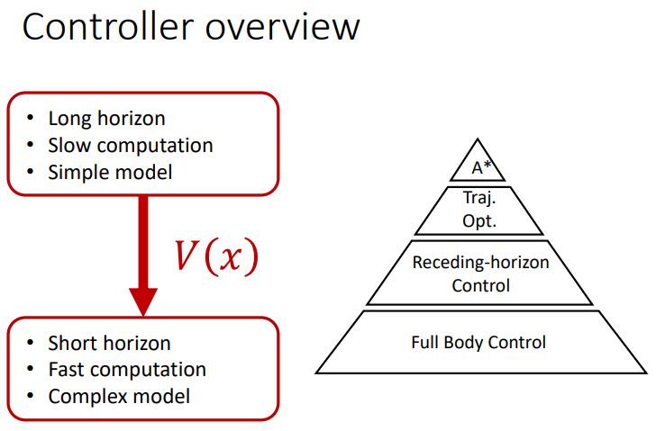
2. Path Planning 路径规划
3. Trajectory Optimization 轨迹优化 : 给定路径，优化轨迹，比如优化能耗、步态稳定性
4. Receding Horizon Control (预瞄控制(Preview Control), MPC) : 实时跟踪轨迹，同时可以动态适应变化
5. Full Body Control 全身控制 : Actuator

Walking Pattern Generation
1. 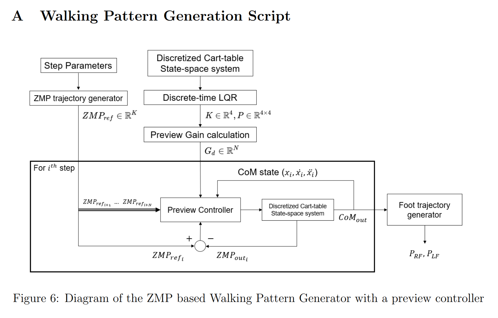
2. Discrete-time LQR
3. Preview Control
   1. 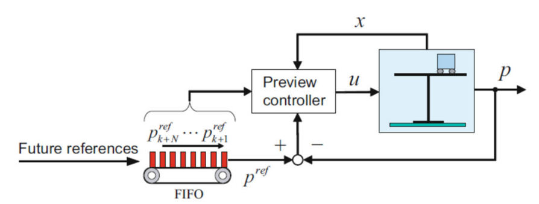
4. 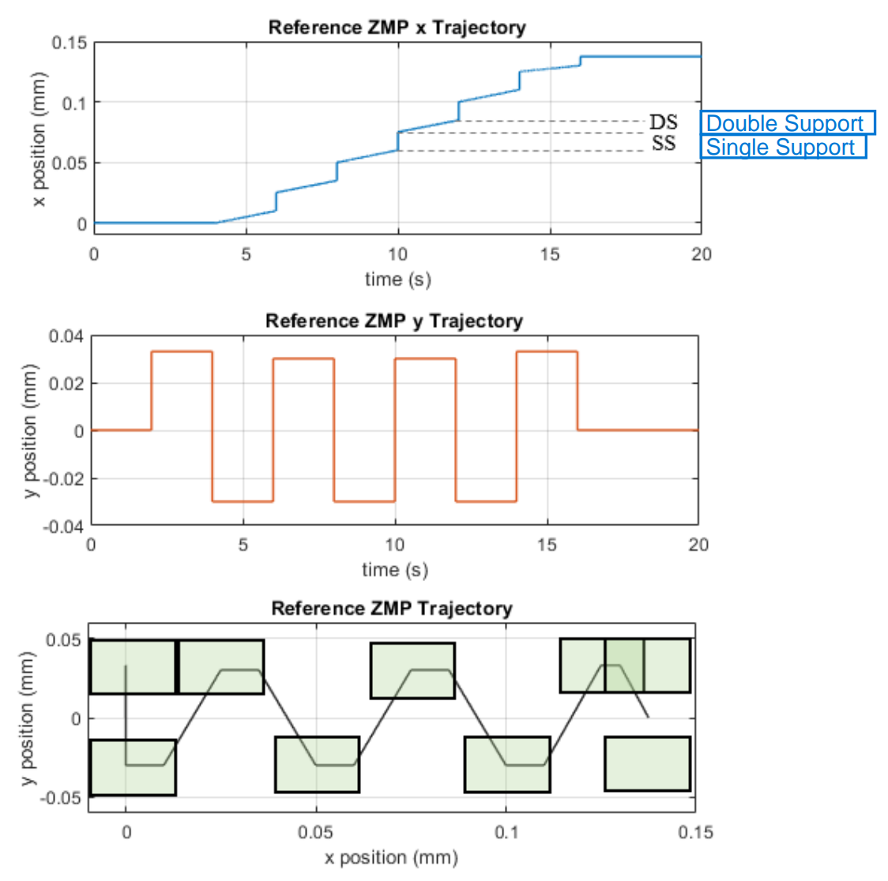

3D Linear Inverted Pendulum

LIPM - Linear Inverted Pendulum Model

Cart-Table Model

ZMP Tracking Control

feed-forward control

Kajita's Method
1. 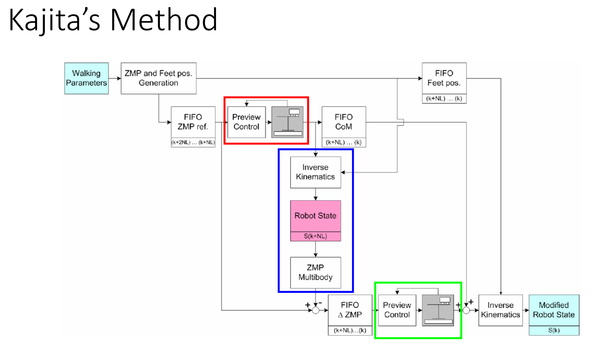

---

# Hardware

减速器
1. 齿轮减速器(Gear Reducer)
   1. Bevel(斜) Gear Reducer
2. 蜗杆减速器(Worm Wheel Reducer)
3. 蜗杆齿轮减速器(Worm Gear Reducer)
   1. 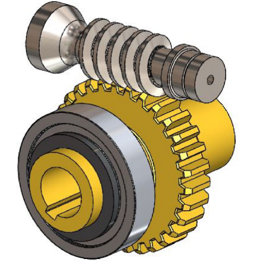
4. 行星齿轮减速器(Planetary Gear Reducer)
   1. 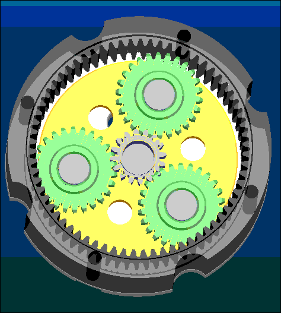
5. RV减速器(Rotary Vector Reducer) / 摆线针轮减速器(Cycloid Gear Reducer)
   1. [Cycloidal drive - Wikipedia](https://en.wikipedia.org/wiki/Cycloidal_drive)
   2. [What is Cycloidal Drive? Designing, 3D Printing and Testing - YouTube](https://www.youtube.com/watch?v=OsS9-FzKN6s)
   3.  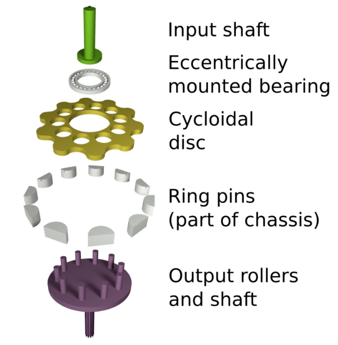
   4. 优点
      1. 具有更高的疲劳强度、刚度和寿命
      2. 不像**谐波传动**那样随着使用时间增长，运动精度会降低
   5. 缺点
      1. 重量大
      2. 外形尺寸较大
6. 谐波减速器
   1. [Strain wave gearing - Wikipedia](https://en.wikipedia.org/wiki/Strain_wave_gearing)
   2. 波发生器(Wave Generator) + 柔轮(Flexspline) + 钢轮(Circular Spline)
   3. 通过给 **波发生器(Wave Generator)** 施加 **旋转输入**，带动 **柔轮(Flexspline)** 相对于 **钢轮(Circular Spline)** 做转动
   4. 柔轮 比 钢轮 少 2齿左右(eg : 钢轮100齿，柔轮98齿)
   5. 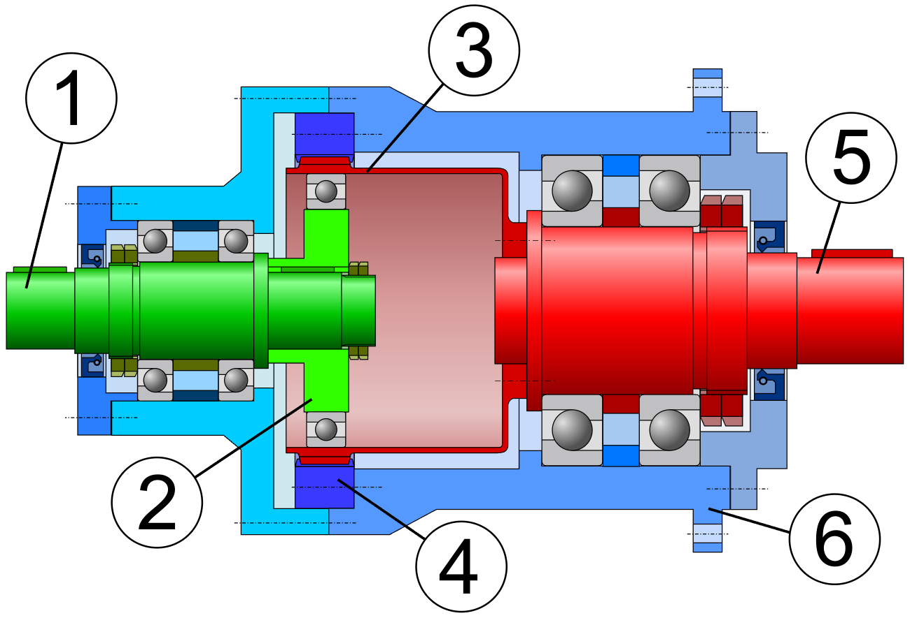 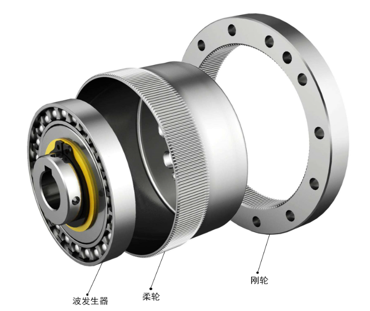
      1. ① input shaft
      2. ② wave generator
      3. ③ flexspline
      4. ④ circular spline
      5. ⑤ output shaft
   6. 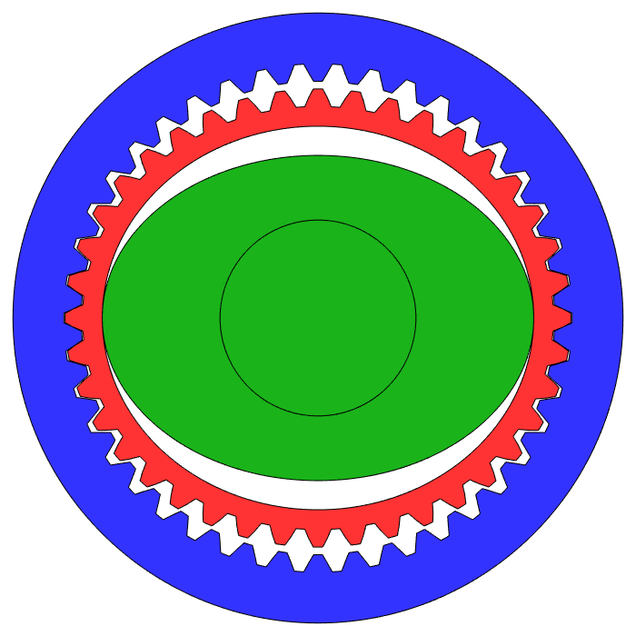 
   7. 谐波减速器的 柔轮 不断发生变形来传递扭矩，使得谐波减速器承受大扭矩和冲击载荷的能力有限，因此一般运用在前端

空心杯电机
1. 无铁心转子，永磁体 在 杯内
2. 分为 有刷 & 无刷
3. 优点
   1. 转子空心结构，转动惯量小，转矩分布均匀
   2. 响应速度快，启停性能好
   3. 结构紧凑，体积 & 重量 小，功率密度高
   4. 消除 因 铁芯形成涡流 而造成的 电能损耗

旋转执行器
1. 谐波减速器(Harmonic Drive)/应变波齿轮(Strain Wave Gearing)
2. 空心杯电机(灵巧手)
3. 行星精密齿轮箱

线性执行器
1. 滚珠丝杠
   1. force sensor
   2. position sensor
2. 行星滚珠丝杠

