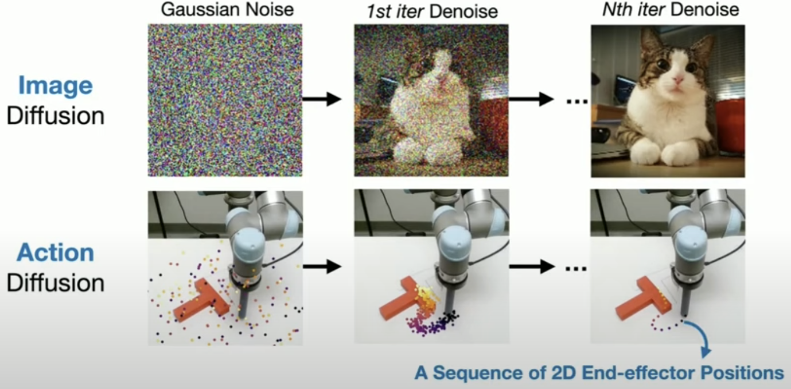
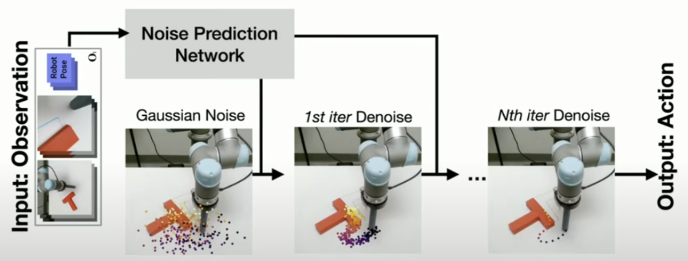
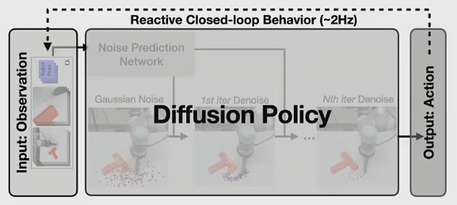
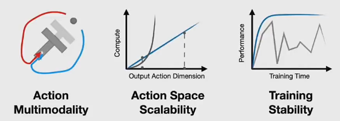
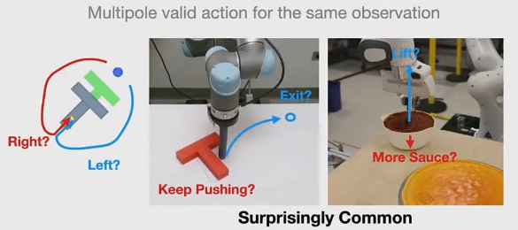
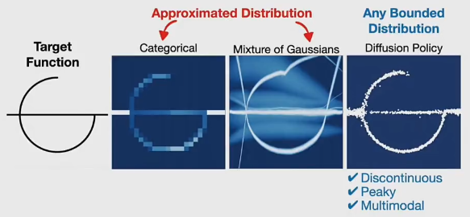
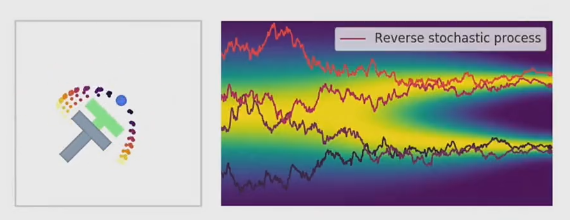
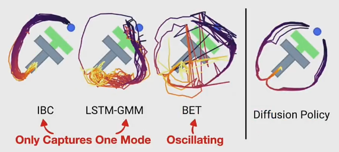
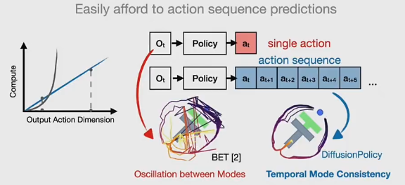
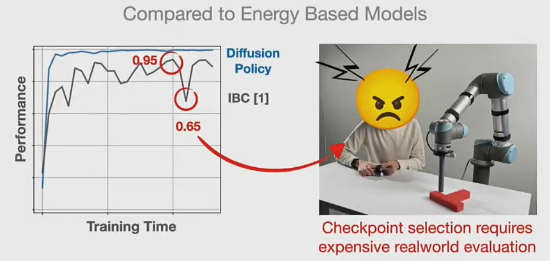

# Diffusion Policy

[Diffusion Policy: LeRobot Research Presentation #2 by Cheng Chi](https://www.youtube.com/watch?v=M03sZFfW-qU)

[Diffusion Policy - Project](https://diffusion-policy.cs.columbia.edu)

[Diffusion Policy - Github](https://github.com/real-stanford/diffusion_policy)

# 知乎

[Diffusion Policy 基于扩散模型的机器人动作生成策略 - 知乎](https://zhuanlan.zhihu.com/p/670555655)

不同的 learning paradigms 的 output/end-product 都是 visuomotor policy (接收 observation 输出 action)
1. imitation learning
2. meta learning
3. self-supervised learning
4. reinforcement learning

如果 policy 的 representation 不够 expressive，就会成为 learning paradigm 的 bottleneck

Diffusion Policy 一种 新型 **机器人行为生成**(Robot Action Generation)方法，也是 policy representation/parameterization

将机器人的 **视觉动作策略**(Visuomotor Policy) 表示为 **条件去噪扩散过程**(Conditional Denoising Diffusion Process)

解决 机器人 输出问题，过往 很多工作 都注重 解决 输入问题

Diffusion Policy 聚焦于机器人的 动作端 而非 输入端

action 是使用 sequence of 2D end-effector positions 表示的

Diffusion Model
1. Input  ： Text
2. Output ： Image

Diffusion Policy
1. Input  : Image
2. Output : Sequence of Actions

**Challenges in Policy Learning**
1. 
2. **Action Multi-Modality**
   1. 
   2. 
   3. **diffusion policy 可以 建模 任何 bounded distribution**(有界分布，随机变量的所有可能取值都落在某个有限的区间内)，即便 discontinuous、peaky、multi-modal
   4. 
   5. Denoising Process 可以看做 action space 中的 gradient descend process
   6. predicted gradient field 可以有 local minima，每个捕捉一个 mode
   7. 和 其他方法 对比
      1. 
      2. IBC (逆向行为克隆)
      3. LSTM-GMM (长短期记忆网络-高斯混合模型)
      4. BET (行为变换器)
3. **Action Space Scalability**
   1. 
   2. sequential correlation 问题
   3. 在 高维、连续 动作空间中，如何 高效、连贯 预测一长串未来的动作序列
   4. 离散化 预测 成本高，会遇到 维度诅咒(Curse of Dimensionality) 问题，离散化的成本会呈指数级增长
   5. 单步预测方法，很难保证长期的动作连贯性，可能出现 犹豫 & 摇摆 情况，**Oscillation between Modes** / **Action Inconsistent**
   6. Diffusion Policy 将整个未来动作序列视为一个高维的 图像，通过去噪过程来生成这个序列
4. **Training Stability**
   1. 
   2. Diffusion 性能不逊色于 GAN，但其训练过程非常稳定

Diffusion Policy 不是一个独立的学习范式，而是一种可以被 RL 或 IL 利用的 policy representation

论文中，使用 模仿学习，由人类遥控机器人执行动作，收集数据，并通过学习将其转化为策略

输入 包括过去几帧的图像，输出 是对未来动作的预测

Locomotion & Manipulation
1. 在 Locomotion，RL有更好的效果，Sim2Real Gap的问题相对好解决，外界环境大多可以视为一个刚体，物理特性基本可以忽略
2. 在 Manipulation，RL存在最大的问题是， Sim2Real Gap 没法很好的解决，每个物体都具有独特的物理特性，如重心、摩擦力和动力学

训练数据对于机器人执行特定任务至关重要

最大的挑战在于如何有效地收集大量、多样化的数据

Diffusion Transformer Policy

