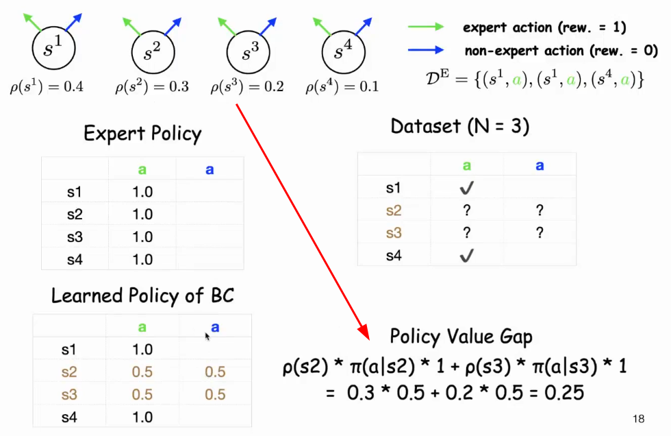

# Imitation Learning

## Table of Contents

- [Imitation Learning](#imitation-learning)
  - [Table of Contents](#table-of-contents)
- [Online / Offline](#online--offline)
- [Introduction to Imitation Learning](#introduction-to-imitation-learning)
  - [01 - What is Imitation Learning](#01---what-is-imitation-learning)
  - [02 - Offline Imitation Learning (Behavioral Cloning)](#02---offline-imitation-learning-behavioral-cloning)
  - [03 -Imitating Environment](#03--imitating-environment)
  - [04 -](#04--)

---

# Online / Offline

离线学习 Offline-Learning (批处理学习 Batch-Learning)
1. **数据特点** : 所有训练数据 在模型开始训练前 就已经被收集好，并以一个固定的数据集(batch)的形式提供
2. **训练过程** : 模型在整个数据集上进行一次或多次完整的训练，直到收敛，训练完成，模型就被部署并用于推理，模型不会再从新的数据中学习
3. 优点 : 训练过程稳定可控，可以利用高性能计算设备进行大规模并行训练，易于复现和评估
4. 缺点 : 模型无法实时适应新的数据分布，如果数据分布随时间变化(eg : 市场趋势、用户行为)，模型性能会下降

在线学习 Online-Learning (迭代式 & 增量式 的学习模式)
1. **数据特点** : 数据是 流式地、连续地 到达，模型在接收到每个或每批新的数据点后立即进行更新
2. **训练过程** : 模型在每个时间步(time step)，接收新的数据点，基于这些数据更新自身的参数，过程是持续的
3. 优点 : 能够实时适应数据分布的变化，节省内存(不需要一次性加载所有数据)，适用于数据量巨大且无法一次性存储的场景
4. 缺点 : 训练过程 可能不稳定，容易受 异常数据点影响

eg :
1. VLA : 大规模的离线模仿学习
2. DAgger : 在线模仿学习

---

# Introduction to Imitation Learning

[模仿学习分享 - B站视频](https://space.bilibili.com/1557040062/upload/video)

## 01 - What is Imitation Learning

[什么是模仿学习 - B站视频](https://www.bilibili.com/video/BV1RU4y167oA)

learning from expert's behavior **demonstration**

**Framework of Imitation Learning**
1. Markov Decision Processes (MDPs) : $\mathcal{M} = (\mathcal{S}, \mathcal{A}, P, r, \rho, H)$
   1. (finite) state space $\mathcal{S}$ & action space $\mathcal{A}$
   2. **transition function** $P(s' | s, a)$，条件概率
   3. $r(s, a)$ reward value，假设 0 ~ 1
   4. $\rho$ initial state distribution
   5. $H$ maximum length of a trajectory
   6. policy $\pi_h(a | s)$ : 在 时间步 h 下的 state s 下，选择 action a 的 概率
      1. non-stationary 和 时间步 h 有关
   7. environment **return** / policy value，环境交互 进行 rollout，产生轨迹，求 reward 累加的 期望 $V(\pi)$
      1. $$V(\pi) = \mathbb{E}\left[ \sum_{h=1}^{H} r(s_h, a_h) \middle| s_1 \sim \rho, a_h \sim \pi(\cdot|s_h), s_{h+1} \sim P_h(\cdot|s_h, a_h) \right]$$
   8. state-action(visitation) distribution $d^{\pi}(s, a) = \mathbb{P}(s_h = s, a_h = a)$
      1. $d^{\pi}_h(s, a)$ : 时间步 h 时，state-action pair 的 visitation 概率
      2. $d^{\pi}_h(s)$ : 时间步 h 时，state 的 visitation 概率
      3. $d^{\pi}_h(s, a) = d^{\pi}_h(s) \pi_h(a | s)$
2. 
3. **Task** : 给定 dataset of expert trajectories，学习 policy 最 match expert 的 performance
   1. 单条 Expert Trajectory (H state-action pairs) : $tr = \{(s_1, a_1), \cdots ,(s_H, a_H)\}$
   2. Dataset(N 条 trajectory) : $\mathcal{D}^E = \{tr^1, \cdots, tr^N\}$
4. **Criterion** (Imitation Gap) : 用 policy value difference 度量
   1. $$\min_{\pi} V(\pi^E) - V(\pi)$$

**Connection with Supervised Learning**
1. Similarity
   1. input-output pairs : 对于 imitation learning，input 是 state，output 是 action
   2. 目标 是 学习 sequential model (eg : LSTM)
2. Difference
   1. supervised learning : 假设 样本是 独立同分布的 iid(independent and identically distributed)，从 unknown distribution 中抽取
   2. imitation learning : state-action pairs 是 **相关的 correlated** $s_{h+1} \sim P_h(· | s_h , a_h)$
   3. supervised learning 是 imitation learning 在 $H = 1$ 的 特例
   4. imitation learning 的 sample 来源于 Markov Chain，因此 $s_{h+1} = s'_h$ 而 supervised 没有这种性质
      1. 

## 02 - Offline Imitation Learning (Behavioral Cloning)

[离线模仿学习 (行为克隆) - B站视频](https://www.bilibili.com/video/BV18P4y1f72u/)

Main Idea : MLE (maximum likelihood estimation，极大似然估计)
1. 样本是 trajectory
2. 轨迹的似然函数
   1. $$\mathbb{P}(\mathrm{tr}) = \rho(s_1) \prod_{h=1}^{H} P_h(s_{h+1} | s_h, a_h) \pi_h(a_h | s_h)$$
   2. $\rho$ : 初始状态概率
   3. 连乘
      1. $\pi_h$ : 在 state 下，选择 action 的概率
      2. $P_h$ : 在 state & action 下转移到 下个 state 的概率
3. 连乘 通过 log 变为 累加，和 policy $\pi$ 无关的项 都可以变为 constant
   1. $$\log (\mathbb{P}(\mathrm{tr}) ) = \sum_{h=1}^{H} \log \pi_h(a_h | s_h) + \text{constant}$$
4. 多条 expert 可以一块计算
   1. $$\max_{\pi} \sum_{h=1}^{H} \sum_{(s_h,a_h)\in\mathcal{D}} \log \pi_h(a_h | s_h), \quad \text{s.t.} \sum_{a} \pi_h(a | s)=1,\ \forall\, s\in\mathcal{S},\ h\in[H]$$

Optimal Solution (考虑 tabular 情况)
1. 状态和动作空间 **离散且有限** 时(表格法)，可以直接计算 最大似然问题 最优解，不需要用神经网络等复杂的模型
2. $$\pi_{h}^{BC}(a|s) = \begin{cases} \frac{\#\text{tr}_h(\cdot, \cdot)=(s,a)}{\sum_{a'} \#\text{tr}_h(\cdot, \cdot)=(s,a')} & \text{if } \sum_{a'} \#\text{tr}_h(\cdot, \cdot)=(s,a') > 0 \\ 1/|\mathcal{A}| & \text{otherwise} \end{cases}$$
   1. $\#$ 是计数
   2. 在专家数据中见过状态 s : 不管任何 action，至少 访问过一次 state，**经验分布** (well-defined)
      1. 分子 : 在专家数据中，在状态 s 下，特定动作 a 被采取的次数
      2. 分母 : 在专家数据中，在状态 s 下，所有可能动作 被采取的次数 总和
   3. 在专家数据中从未见过 s : **均匀分布** (uniform policy)，会 有 **imitation gap** on non-visited states

直觉上讲，行为克隆计算的是 经验条件分布 (empirical conditional distribution)

H=1 的例子
1. 

判断 Behavioral Cloning 的指标 missing mass (non-visited states)
1. 有 上界 upper bound
2. $$\mathbb{E}[ \sum_{h=1}^{H} \sum_{s \in \mathcal{S}} d_{h}^{\pi}(s) \mathbb{I}(s \notin \mathcal{D}) ] \leq \frac{4 |\mathcal{S}| H}{9N}$$
   1. $d_{h}^{\pi}(s)$ : 时间步 h 下，你的策略 $\pi$ 访问 状态 s 的概率，是自己的策略所产生的，而不是专家的
   2. $\mathbb{I}$ : 指示函数，如果状态 s **不在**专家数据 中，它的值就是 1，否则就是 0
   3. $|\mathcal{S}|$ : state space 大小
   4. $H$ : 轨迹最大长度
   5. $N$ : 专家轨迹的数量
3. 直观理解 : trajectory 越长，state space 越大，越 容易 缺失；轨迹数量越多，越 不容易 缺失

$\gtrsim$ & $\lesssim$ : 忽略 低阶项 & 常数项

**Sample Complexity of BC** (**Upper Bound**)
1. 给出了 行为克隆 的 **性能上限**，**行为克隆** 的 **模仿差距** 不会超过的值
2. 
3. trajectory 长度 H 也是 bound，即 bound 可以改为 $\min\{H, \frac{|\mathcal{S}| H^2}{N} \}$，可以分 专家轨迹 数量大小 来讨论
   1. 小样本 : 专家轨迹数量 N 少，H 更小
   2. 大样本 : 专家轨迹数量 N 多，$\frac{|\mathcal{S}| H^2}{N}$ 更小
4. 对于 确定性(deterministic) expert 策略
   1. 专家表现 & 学习到的策略表现 之间的差距 有一个 大致的 上限
5. 对于 随机性(stochastic) expert 策略
   1. 次优性(sub-optimality，即 **表现差距**)，会额外增加一个与 $\log(N)$ 相关的项
   2. 同一个状态下可能会做出不同的决策，增加了学习的难度，通过有限的数据集，很难准确捕捉到专家策略的完整概率分布
6. 行为克隆(BC) 与 普通的监督学习(Supervised Learning) 相比，其性能差距与轨迹长度 H 呈平方(quadratic)关系，**协方差偏移(Covariance Shift)**，可能会有 **连锁性的错误**

**Lower Bound** of Offline Imitation Learning
1. 所有 离线模仿学习算法 的 性能下限，任何 离线算法 的 模仿差距 都 至少大于 或 约等于 该值
2. 

由上面两个结论，行为克隆 在 离线模仿学习 是 **渐近最优(asymptotically optimal)** 的，在 minimax 意义下 已经 最优

H>1 例子 (Reset Cliff MDP)
1. 
2. $s^1, \cdots, s^{|\mathcal{S} - 1|}$ 是 好状态
3. $b$ 是 坏状态
4. 行为
   1. 好状态 执行 expert action，会 重置为初始状态 (环境 reset)
   2. 执行 non-expert，会进入 坏状态，无法离开，吸收态 (坏状态 absorbing/cliff)
5. 如果 state space 够大，不是所有 专家状态 都出现在数据中

**复合误差(Compounding Errors)**
1. X 轴 (Planning Horizon $H$)：表示任务的轨迹长度
2. Y 轴 (Policy Value Gap)：表示模仿差距，衡量学习到的策略与专家策略之间的性能差距
3. 
4. 两侧同时取 log
5. **双对数坐标系** 下，slope = 2，因此 原本的 函数关系 是 **二次的**
6. 简而言之，就是 $H$ 越大，问题 越困难

## 03 -Imitating Environment

[基于行为克隆的环境模仿 - B站视频](https://www.bilibili.com/video/BV1XT411F7rU/)

## 04 -

[ - B站视频]()

Adversarial Imitation Leaning

Semi-Supervised Imitation Learning

