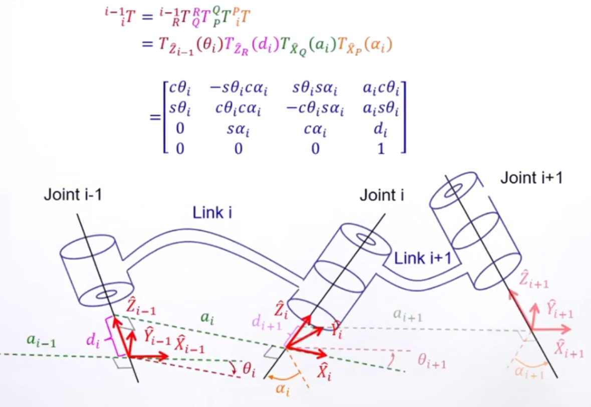
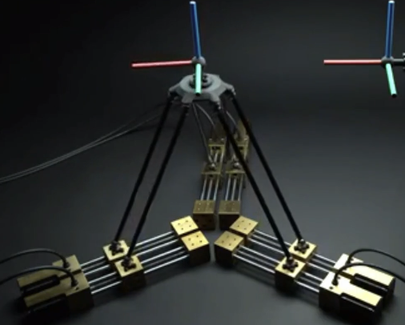

# 机器人学 运动学 & 动力学

## Table of Contents

- [机器人学 运动学 \& 动力学](#机器人学-运动学--动力学)
  - [Table of Contents](#table-of-contents)
- [台大机器人学 运动学(Kinematics) - 林沛群](#台大机器人学-运动学kinematics---林沛群)
  - [01 - Spatial Descriptions and Transforms](#01---spatial-descriptions-and-transforms)
  - [02 - Manipulator Forward Kinematics](#02---manipulator-forward-kinematics)
  - [03 - Manipulator Inverse Kinematics](#03---manipulator-inverse-kinematics)
  - 
- [台大机器人学 动力学(Kinetics) - 林沛群](#台大机器人学-动力学kinetics---林沛群)
  - [05 - Jacobian : Velocities and Static Forces](#05---jacobian--velocities-and-static-forces)

---

# 台大机器人学 运动学(Kinematics) - 林沛群

[台大机器人学之运动学(Kinematics) - 林沛群](https://www.bilibili.com/video/BV1v4411H7ez)

## 01 - Spatial Descriptions and Transforms

Rigid Body 状态描述
1. **2D 平面** : 2 Translation DoF + 1 Rotation DoF
2. **3D 空间** : 3 Translation DoF + 3 Rotation DoF

位移 & 姿态 (displacement & orientation)

**移动**
1. $\vec{P} = { }^{A} P_{B \ \text{org}}$ = origin of {B} represented in {A}
2. 

**转动**
1. **作用 1** : 描述 {B} 相对于 {A} 的姿态
   1. 从 {A} 看 {B} 的单个基向量，要得到值，相当于要将 {B} 的 该基向量 向 {A} 的 三个基向量进行 **投影(点乘)**
   2. 
2. **作用 2** : 用于转换向量坐标系(**坐标变换**)
   1. 从 {B} 看 一个向量 P 的坐标为 $[p_x, p_y, p_z]^T$，是在 {B} 的三个基上的分量(投影)。${}^A_B R$ 的各列 表示从 {A} 看 {B} 的各个基的表示，要得到在 {A} 的三个基的分量，仅需用 {B} 下的 P 左乘 ${}^A_B R$
   2. 从公式的角度理解(向量点乘，需在相同坐标系，无论基于哪个坐标系，得到的数值不变)
      
3. **作用 3** : 描述物体转动状态 (**右手螺旋**确定方向)
   1. 旋转和坐标变换的关联
      1. 旋转 相当于带着整个坐标系 转到 新的位置，然后看 新向量 在 旧坐标系 下的坐标
      2. 可以看成 新向量在新坐标系下的坐标(等于旧向量在旧坐标系下的坐标)，再转换回 旧坐标系
   2. 
   3. $$R_{\hat{X}_A}(\theta)=\left[\begin{array}{ccc}
        1 & 0           & 0              \\
        0 & \cos \theta & -\sin \theta   \\
        0 & \sin \theta &  \cos \theta
        \end{array}\right]$$
   4. 
   5. $$R_{\hat{Y}_A}(\theta)=\left[\begin{array}{ccc}
        \cos \theta & 0 & \sin \theta   \\
        0            & 1 & 0             \\
        -\sin \theta & 0 & \cos \theta
        \end{array}\right] \text{注意负号位置}$$
   6. 
   7. $$R_{\hat{Z}_A}(\theta)=\left[\begin{array}{ccc}
        \cos \theta & -\sin \theta & 0   \\
        \sin \theta &  \cos \theta & 0   \\
        0           & 0            & 1
        \end{array}\right]$$
   8. 
4.  **性质**
   1. **${}^B_A R = {}^A_B R^T$** : 观察完全展开的 矩阵 ${}^A_B R$，显然 转置后，每一列可以看做 将 {A} 的 同一个基向量 向 {B} 的 三个基向量进行 **投影(点乘)**，因此可以得到 ${}^B_A R$
      1. 
   2. **${}^A_B R^T = {}^A_B R^{-1} = {}^B_A R$**(对于 Rotation Matrix， 逆 等于 转置) - (P.S. **${}^A_B R ^T × {}^A_B R = I$**)
      1. 

**Orthogonal Matrix 性质**
1. 
2. Rotation Matrix 的行列式为1，Reflection Matrix 的行列式为-1(TODO)

**3D空间中的旋转 & Rotation Matrix**
1. 空间中的 Rotation 有 3个 DoF，当前已知 有 分别绕 X/Y/Z 轴的旋转矩阵，需要将一般的 Rotation Matrix 表达的姿态拆分成 3次 绕 X/Y/Z 轴 旋转角度
2. 注意事项
   1. Rotation Matrix 是 **non-commutable**不可交换顺序，需要定义 旋转的顺序
   2. 旋转轴 需要明确定义
      1. Fixed Angles - **外旋(Extrinsic Rotation)**，旋转操作**相对于固定的全局坐标系(世界坐标系)**
      2. Euler Angles - **内旋(Intrinsic Rotation)**，旋转操作**相对于物体的当前局部坐标系**
3. **X-Y-Z Fixed Angles - 由 Angles 推算 R** - 先转的先左乘，位置在后面
   1. 
4. **X-Y-Z Fixed Angles - 由 R 推算 Angles** - 借助结果旋转矩阵的9个数字之间的关系，反推旋转角度
   1. 
   2. `atan` & `atan2`
      1. `arctan`(或 `atan`) 是 **标准的反正切函数**，输出范围$(-\frac{\pi}{2}, \frac{\pi}{2})$，即 **第一、第四象限**
      2. `atan2` 是 **扩展的反正切函数**，，范围$(-\pi, \pi)$，即 **四个象限**
   3. 当绕中间的 Y轴 旋转 **+90°** 时，导致**Gimbal Lock - 万向节死锁现象** **==☆==**，X轴 & Z轴 重合，没有唯一解
      1. 原 ${}^A_B R_{XYZ}(\gamma, \beta, \alpha)$ 会退化，四个数仅能得到 $\gamma - \alpha$

         $$\begin{align*}
            {}^A_B R_{XYZ} (\gamma, \beta, \alpha)
            &=\left[\begin{array}{ccc}
            0  & \cos \alpha \sin \gamma - \sin \alpha \cos \gamma & \cos \alpha \cos \gamma + \sin \gamma \sin \alpha \\
            0  & \sin \alpha \sin \gamma + \cos \alpha \cos \gamma & \sin \alpha \cos \gamma - \cos \alpha \sin \gamma \\
            -1 & 0                                                 & 0
            \end{array}\right] \\
            &=\left[\begin{array}{ccc}
            0  & \sin(\gamma - \alpha) &  \cos(\gamma - \alpha) \\
            0  & \cos(\gamma - \alpha) & -\sin(\gamma - \alpha) \\
            -1 & 0                     & 0
            \end{array}\right]
            \end{align*}$$
5. **Z-Y-X Euler Angles - 由 Angles 推算 R** - **先转的后左乘**，位置在前面(相当于一步步进行反向接力，解算回初始坐标系) - 和 Fixed Angles 顺序正好相反
   1. 
6. **Z-Y-Z Euler Angles - 由 Angles 推算 R** - 先转的后左乘，位置在前面(相当于一步步进行反向接力，解算回初始坐标系) - 和 Fixed Angles 顺序正好相反
   1. 
7. **Z-Y-Z Euler Angles - 由 R 推算 Angles** - 和 Fixed Angle 一样，会遇到 **Gimbal Lock**(当 $\beta = 0$，没有唯一解)
   1. 
   2. 针对不同的 R 有不同的 拆解方法 (ZYX, ZYZ)
8. 总结
   1. Euler Angles & Fixed Angles 各有 $3×2×2 = 12$(1、3转轴可以一样，相邻转轴不能一样) 种顺序可能
   2. 

**==☆==** : Fixed Frame & Euler Angle
1. 旋转角度 都是 绕 x轴 转 $\gamma$，绕 y轴 转 $\beta$，绕 z轴 转 $\alpha$
2. 矩阵乘法 都是 $\text{Mat}_\text{Z} × \text{Mat}_\text{Y} × \text{Mat}_\text{X}$
3. Fixed Frame 顺序是 X-Y-Z
4. Euler Angle 顺序是 Z-Y-X

**Gimbal Lock - 万向节死锁**
1. [Gimbal Lock - Wikipedia](https://en.wikipedia.org/wiki/Gimbal_lock)
   1. 
   2. 

**Homogeneous Transformation Matrix (T)** 齐次变换矩阵
1. 将 Rotation & Translation 整合 - 16个元素，6 DoF
   1. 
2. **移动 & 旋转** 复合 (向量 先旋转、再平移)
   1. 
3. Homogeneous Matrix 好处 - 可以进行连续变换
4. **Homogeneous Transformation Matrix (T)** 的三种用法(类似于 Rotation Matrix 的三种用法)
   1. 
5. Transformation Matrix 运算
   1. 连续运算 : 要注意 每个 frame 之间的 原点向量 需要 逐级变换到 参考系
   2. 
6. 逆矩阵
   1. 旋转部分 : 求逆，也就是 转置
   2. 平移部分 : ${}^B P_{A \ org}$，要达到 反向操作的效果，需要将 原点间距向量 ${}^A P_{B \ org}$ 取反(反向移回)，并从 {B} frame 进行表示 $- {}^B_A R \  {}^A P_{B \ org} = - {}^A_B R^T \  {}^A P_{B \ org}$
   3. 
7. 连续运算
   1. 注意 : 求逆部分不需要直接求，使用上述逆矩阵的特性即可方便得到
   2. 
   3. 
8. **P.S.** 如果 旋转 & 平移 关于同一轴(不必须是坐标系)，顺序对最终的变换矩阵没有影响，可以用代码验证

**Operators 算子** : Translation & Rotation & Transformation
1. single : 移动 / 旋转
   1. 
2. combined : 移动 & 旋转
   1. 先转动再移动 ≠ 先移动再转动(移动的向量也会被转动)
   2. 
3. frame 中的点运动 = frame 做反向运动 (CCW = counter-clock-wise, CW = clock-wise)
   1. 
   2. 
   3. 感觉有点类似于 内旋，需要根据当前 frame 进行反向操作，而不是针对原始 frame
      1. eg : $P_2 = T × R × P_1$
         1. 对于 fixed angle 相当于 $P_1$ 先 Rotate 再 Translate
         2. 对于 euler angle 相当于 $P_1$ 先 Translate 再 Rotate(Translate 之后的坐标系)
            1. 如果再从坐标系反向运动理解，就是点不动，坐标系 先 反向Rotate 再 反向Translate

**Transformation Matrix 运算**
1. 连续运算
   1. 向量相加，只有 在相同坐标系下 才有意义
   2. 
   3. 矩阵乘法 具有 **结合律**
2. 反向运算
   1. 
   2. Rotation 部分 : 抵消
   3. Translation 部分 : 反向 & 视角切换

---

## 02 - Manipulator Forward Kinematics

Kinematics 运动学，不涉及 力
1. 转动 & 移动
   1. 位置、姿态
   2. 速度、角速度
   3. 加速度、角加速度

Dynamics 动力学
1. Newton's 2nd Law
2. Work & Energy
3. Impulse & Momentum

机械臂
1. links
   1. 之间做 prismatic(平移) & revolute(旋转)
   2. 驱动 actuator 将 末端移动
   3. 在 link 上建立 frame
   4. **编号方式**
      1. Link 0 : 地杆，不动的杆件
      2. Link 1 : 和 Link 0 相连，第1个 可动杆件
      3. ...... :
2. joints
   1. 每个 joint 对 特定 axis 进行 rotation/translation

**==几何描述==**
1. **转轴 Axis 定义在 Link ==前侧==**
2. 
3. `Link Length` $a$ : 公垂线长度 (2条 异面axes 之间的 最短距离线段，和 2个 axes 都垂直)
4. `Link Twist` $\alpha$ : 2个 axes 绕 公垂线 旋转的 角度(从 前杆件 转到 后杆件)
5. `Link Offset` $d$ : 2个 相邻公垂线 在 1个 axis 上 相距的距离
6. `Joint Angle` $\theta$ : 2个 相邻公垂线 在 1个 axis 上 旋转的 角度
7. 对于
   1. 旋转 revolute  : 只有 `Joint Angle` $\theta$ 变动
   2. 平移 prismatic : 只有 `Link Offset` $d$ 变动

**在杆件上建立Frame**
1. 
2. 先确定 $z$(转动/移动 方向) & $x$(公垂线 方向)，在用 右手定则 确定 $y$
3. 特殊情况
   1. **Link 0** (没有前轴)
      1. 
      2. 虽然 $\theta$ & $d$ arbitrary，但 通常 取 0
   2. **Link n**(Last Link)
      1. 没有后轴(没有公垂线)，frame 的 $x$ 取同方向
      2. 

**Denavit-Hartenberg 表示法**
1. Craig Version
   1. axis  在 link **前端**
   2. 
   3. **Link Transformation**
      1. 转动 $\alpha_{i-1}$，平移 $a_{i-1}$，转动 $\theta_{i}$，平移 $d_{i}$
      2. 都是对于 **euler angle**，因此 先进行的 transform 后左乘
      3. 
      4. 
   4. 最后需要 补一步，最后一个 link origin 到 end-effector 的变换
2. Standard
   1. joint 在 link **末端**
   2. 
   3. **Link Transformation**
      1. 转动 $\theta_{i}$，平移 $d_{i}$，转动 $\alpha_{i-1}$，平移 $a_{i-1}$
      2. 

对于 z轴相交(没有公垂线 $a=0$) 有多种定义方法
1. 

Examples
1. RRR Manipulator
   1. 
2. RPR Manipulator
   1. 
3. PRRR Manipulator - 晶圆机器人
   1. 
4. RRRP Manipulator - SCARA机器人
   1. 

对 **同一个轴**，==旋转 & 平移 顺序== 可以 调换

Actuator, Joint, Cartesian Space(笛卡尔坐标系,point)
1. 
2. Kinematic Mapping

---

## 03 - Manipulator Inverse Kinematics

6 自由度(3 rotation，3 translation)，6 限制条件(rotation 部分 3模长=1，3正交)

Reachable Workspace - 一种以上姿态到达的位置

Dexterous Workspace - 任何姿态到达的位置

Subspace

**多重解**
1. nonlinear transcendental equations (非线性超越方程)
   1. 6 方程 6 未知数 不代表 由 唯一解
2. 解的数量 由 joint & link 数量决定
   1. joint offset 导致解的数量增加
3. eg
   1. 
4. 选择 : 快速，省能，避障，距离

**求解方法**
1. Closed-Form Solutions (algebraic + geometric)
   1. 求解快
   2. 大部分机械臂设计成解析解形式
   3. Pieper's Solution : 相邻3轴交于一点
2. Numerical Solutions (方程给电脑)

##

---

# 台大机器人学 动力学(Kinetics) - 林沛群

[台大机器人学之动力学(Kinetics) - 林沛群](https://www.bilibili.com/video/BV1Vt41157jp/)

## 05 - Jacobian : Velocities and Static Forces

微分(求导) 是依赖于 参考系的

参考系 : 观察者

坐标系 : 用哪套轴 ($x, y, z$) 表达

**移动** Translation
1. 
2. 观察者 在 Frame $B$ 上，看着点 $Q$ 随时间变化的位置
3. $^B V_Q$ 是 **点 $Q$ 相对于 $B$ 的速度** & **表达在 Frame $B$ 中**
4. 坐标系原点 对于 universe frame 的速度 有 简写
5. 例子
   1. 
   2. $^C_T R = ^C_U R · ^U_T R$
   3. PPT在这里做了一个隐含的假设 : 假设 Frame T & U（世界）的坐标轴方向 此时此刻是平行的
   4. C 的 Origin 相对于 T，也就是 向量 从 T 指向 C，因为 指向 被减向量，因此 相对速度中 $^U T_C$ 是 被减向量
6. 一般情况 需要 : 先 转到 World Frame 进行运算，再 转回 目标 Frame
7. 注意 是 velocity，不是 position
8. 必须 **上标一致(参考系 & 表达坐标系 一致)** 才能 直接进行加减运算

**转动** Rotation
1. $^A \Omega _B$ frameB 相对于 frameA 的 角速度**向量**，表达在 frameA 中
2. 
3. 相对于 universe frame 的 角速度 有 简写

**Rigid Body Motion**
1. 暂时不用使用旋转矩阵将 {B} frame下的向量 转到 {U} frame，先进行微分
   1. **正体** $\mathrm{x y I J r}$ 是在 universe frame
   2. **斜体** $x y i j r$ 是在 中间 frame
   3. 真正相加的时候 需要在 同一 frame，要将 $ij$ 转到 {U} frame
   4. 
2. ==注意== : 相对 {U}，{B} 本身也在运动，所以 **导正正导**，需要同时考虑 系数 & $ij$ 的微分，$\mathrm{I J}$ 是固定的(微分为0)
3. 补 : 坐标轴位置向量微分(速度向量)
   1. 
   2. 当 $d \theta$ 很小，$d \hat{e}$ 基本上等于 弧长，因此长度等于 **弧 × 半径**
   3. magnitude : 两边同时除以 dt，就变为 微分
   4. direction : dt 很小 的时候，$d \hat{e}$ & $\hat{e}$ 基本垂直
   5. 当 $x$ 很小时，$x$ & $\sin x$ 是等价无穷小
   6. 叉乘 ($\times$) 也 必须在相同 Frame 下才能进行，此处都表达在 动参考系 更好
4. 带入，并将 {B} 替换为 {U}
   1. 
   2. 
   3. 由于 $\vec{\omega}$ 是在 {U} 下的，需要将 {B} 中的 向量转到 {U}
5. 最终
   1. 
   2. 公式里都是 对于 universe frame
   3. 分量
      1. 新坐标系原点 相对于 世界坐标系原点 速度
      2. 新坐标系中 点 本身的运动速度(转回 世界坐标系)
      3. 新坐标系 旋转 在 点 产生的速度(向量先转回世界坐标系，因为旋转向量定义在世界坐标系)

**Velocity Propagation** (from Link to Link)

Revolute Prismatic Helical Cylindrical Universal Spherical

Grübler's Formula (注意 **independent constraint**)
1. eg :
   1. 
   2. Links : 6 + 6 + 1 + 1(Ground) = 14
   3. Joints : 6 × (prismatic + universal + spherical)
   4. #DoF = (14 - 1) * 6 - 6 * (5 + 4 + 3) = 6

Redundant Manipulator (`#joints` > `#end-effector dof`)
1. 

Composition of Rotations
1. current axis - **post-multiply**
2. fixed axis - **pre-multiply**

**Similarity Transform**
1. 
2. 联想 相似矩阵 的定义 $P^{-1}AP = B$，则 A & B 相似
3.

