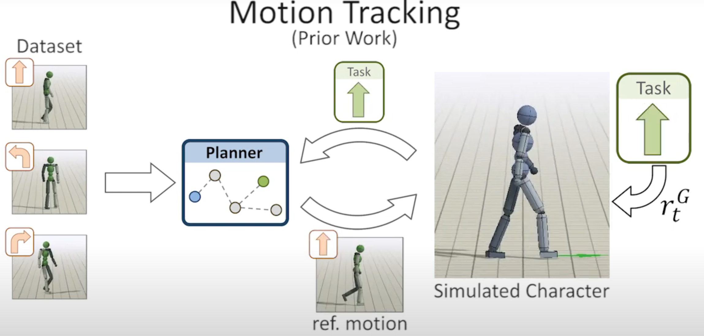
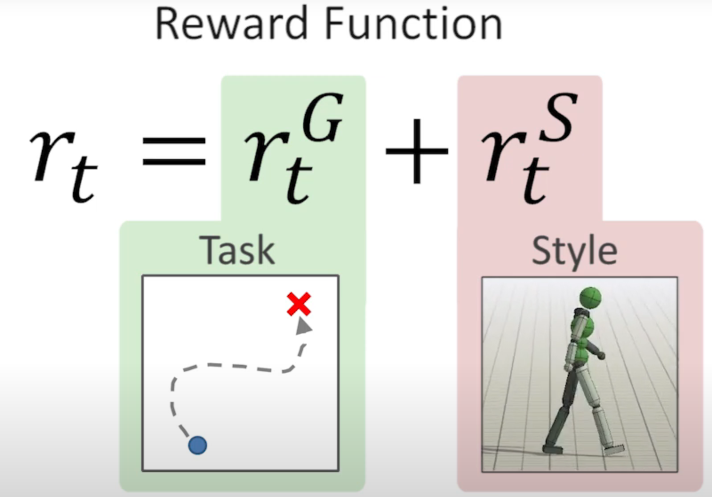
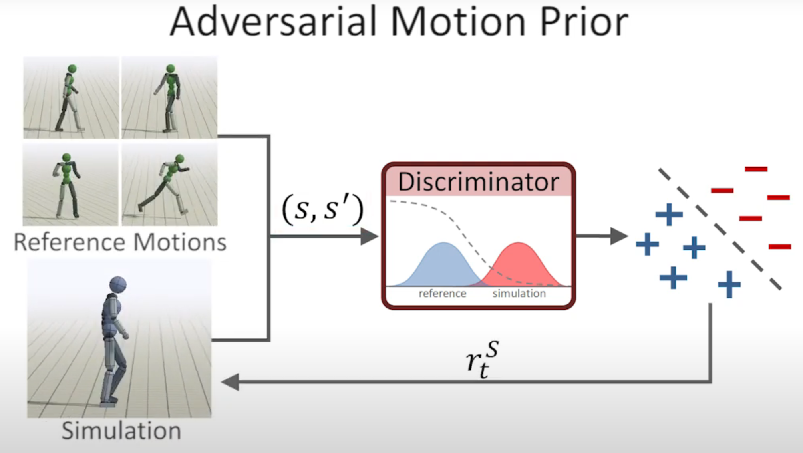
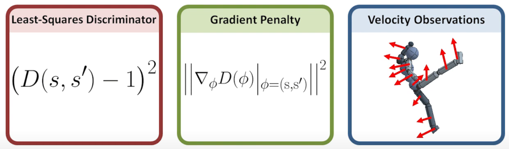

# AMP: Adversarial Motion Priors for Stylized Physics-Based Character Control

ACM SIGGRAPH 2021

[AMP - Project Website](https://xbpeng.github.io/projects/AMP/index.html)

---

对抗学习 对于 合成问题(image generation) 很有效

motion imitation 方向
1. adversial learning 效果不好，不如 motion tracking 方法
2. motion tracking 方法，对于 individual motion clip 很有效，但是对于 large & diverse motion datasets，很困难
   1. 需要 用 task-specific 标签来标注 clips
   2. 随后 用 clips 构建 motion planner
   3. 训练执行特定任务时，需要 query motion planner 来选择合适的 clip 来 track
      1. 
   4. 构建 effective motion planner 本身 就很有挑战性

AMP
1. 使用 adversial mition prior 避免 limitation
2. motion prior
   1. 通过 大量 unstructed motion clips 训练
   2. 用于 衡量 character & dataset 的 motion 相似性
   3. 用于 specify style 目标
3. Policy 通过 强化学习 训练得到
   1. reward function $r_t = r^G_t + r^S_t$
   2. 
   3. $r^G_t$ : task  (high-level)
   4. $r^S_t$ : style (low-level) - using motion prior
4. 给定一个 motion clips 数据集，motion prior 可以 作为 adversial discriminator，预测 state transition 是 来源于 数据集 还是 仿真，预测结果 作为 风格奖励 来训练 policy
   1. 
   2. 使用 state 和 next state 表示 transition 更方便，因为 数据集中 无 action
5. 可以训练 用 不同 style 执行任务

Design Decision
1. 增强 训练稳定性 & 动作准确性
2. 

Experiment
1. single-clip imitation task
   1. 无需手动调整 reward
   2. 无需手动设计 跟踪目标
   3. 无需 policy & reference 之间的 synchronization
   4. 也适用于 non-humanoid 对象
2. accommodate large motion datasets
   1. 结合 motion prior(style) & task 目标
   2. clips 之间 无需 explicit blending
   3. intrinsic strategy 自动产生 无需 motion planner 或 手动标注
   4. 以不同 style 执行任务，只需给定 不同 参考动作的 motion prior
   5. 相同 motion prior 可以 用于 不同 task

Evaluate 不同 design decision 的 效果
1. Without/With Gradient Penalty - vital for stable training & high quality result
2. Without/With Velocity Observation - help avoid spurious(虚假) local optima
3. Compare with
   1. policy trained without motion data (不自然，笨拙)
   2. policy trained using a latent space model (visual artifacts)

Training
1. reply buffer (经验回访池，存储之前生成的轨迹，帮助判别器训练)
2. 对于 discriminator，如果 认为是 来自于 dataset 给 1 分，如果 认为是 policy 生成的 给 -1 分

# TLDR

对于 AMP，生成器 其实就是 Policy

使用了最小二乘鉴别器(Least-Squares Discriminator)

Gradient Penalty，防止 overshoot

数据集只提供运动的风格，而不提供如何实现目标

经过学习之后可以组合数据集中的动作，也可以在多个动作之间自动过渡

Task Reward Function 仍需 手动设置，并且 task 和 style 的 权重也是 手动设置，比较 finicky

只是在学high level的motion隐空间，low level的policy输出仍然是action

---

模仿真实运动数据，训练一个既能完成特定任务 (Task)，又能生成 符合风格的运动（Motion Style） 的策略 (Policy)

输入：Motion Dataset（运动数据集），包含 参考运动（Reference Motion），用于定义角色的 期望运动风格（Desired Motion Style）

通过 对抗学习（Adversarial Training） 训练一个 运动风格模型（Motion Prior）

训练时使用两个奖励信号，确保了策略（Policy）不仅完成任务，还能保持自然的运动风格
1. 任务奖励
2. 风格奖励

Generative Adversarial Imitation Learning

环境互动+最大化从专家数据学到的奖励函数=最优Actor

基于对抗学习(Adversarial Learning) 的强化学习方法

用于物理仿真的角色控制(Physics-Based Character Control)

利用 对抗性运动先验，自动学习任务执行方式，同时保持自然且具有风格的运动

通过 GAN（生成对抗网络）的思想，训练一个判别器（Discriminator）来区分真实的运动数据（来自数据集）与角色生成的运动

判别器为角色的运动提供一个风格奖励（Style Reward），鼓励它生成类似于真实数据的运动

