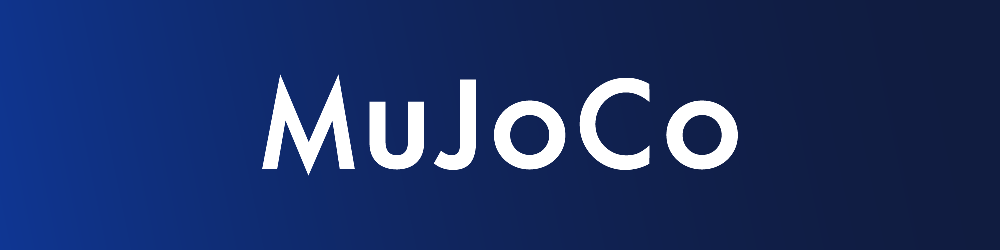

# MoJoCO

---

## Table of Contents


---

# MoJoCo 官网

[MuJoCo - Documentation](https://mujoco.readthedocs.io/en/stable/overview.html)

[MuJoCo - Github](https://github.com/google-deepmind/mujoco)

Intro
1. defines models in the native `MJCF` scene description language – an `XML` file format
2. `URDF` model files can also be loaded
3. interactive visualization with a native GUI, rendered in `OpenGL`


Model instances
1. user defines the model in an `XML` file written in `MJCF` or `URDF`
2. |       |High Level         |Low Level          |
   |-------|-------------------|-------------------|
   |File   |MJCF/URDF (XML)    |MJB (binary)       |
   |Memory |mjSpec (C struct)  |mjModel (C struct) |
   1. runtime computations are performed with `mjModel`
   2. **high-level** : for user convenience (be compiled into a **low-level model**)
   3. `XML loader` interprets the `MJCF/URDF` file, creates the corresponding `mjSpec` and compiles it to `mjModel`
3. path
   1. (text editor) → MJCF/URDF file → (MuJoCo parser → mjSpec → compiler) → mjModel


```xml
<mujoco>
   <worldbody>
      <light diffuse=".5 .5 .5" pos="0 0 3" dir="0 0 -1"/>
      <geom type="plane" size="1 1 0.1" rgba=".9 0 0 1"/>
      <body pos="0 0 1">
         <joint type="free"/>
         <geom type="box" size=".1 .2 .3" rgba="0 .9 0 1"/>
      </body>
   </worldbody>
</mujoco>
```

```xml
<mujoco model="example">
   <default>
      <geom rgba=".8 .6 .4 1"/>
   </default>

   <asset>
      <texture type="skybox" builtin="gradient" rgb1="1 1 1" rgb2=".6 .8 1" width="256" height="256"/>
   </asset>

   <worldbody>
      <light pos="0 1 1" dir="0 -1 -1" diffuse="1 1 1"/>
      <body pos="0 0 1">
         <joint type="ball"/>
         <geom type="capsule" size="0.06" fromto="0 0 0  0 0 -.4"/>
         <body pos="0 0 -0.4">
         <joint axis="0 1 0"/>
         <joint axis="1 0 0"/>
         <geom type="capsule" size="0.04" fromto="0 0 0  .3 0 0"/>
         <body pos=".3 0 0">
            <joint axis="0 1 0"/>
            <joint axis="0 0 1"/>
            <geom pos=".1 0 0" size="0.1 0.08 0.02" type="ellipsoid"/>
            <site name="end1" pos="0.2 0 0" size="0.01"/>
         </body>
         </body>
      </body>

      <body pos="0.3 0 0.1">
         <joint type="free"/>
         <geom size="0.07 0.1" type="cylinder"/>
         <site name="end2" pos="0 0 0.1" size="0.01"/>
      </body>
   </worldbody>

   <tendon>
      <spatial limited="true" range="0 0.6" width="0.005">
         <site site="end1"/>
         <site site="end2"/>
      </spatial>
   </tendon>
</mujoco>
```


```python
import mujoco

assets = {}

model = mujoco.MjModel.from_xml_string(xml_string, assets)
model = mujoco.MjModel.from_xml_path(xml_path, assets)
model = mujoco.MjModel.from_binary_path(bin_path, assets)

```

mjModel
1. 保存 MuJoCo 模型的所有静态信息(物体的形状、关节、几何体、力学参数等)
2. `model = mujoco.MjModel.from_xml_path("your_model.xml")`

mjData
1. 数据结构，用于保存模型运行时的动态状态信息(物体的位置、速度、力、接触信息等)
2. `data = mujoco.MjData(model)`

mj_kinematics
1. Run **forward kinematics** : 计算前向运动学，即根据关节角度等输入，计算出所有物体的位姿
2. `mujoco.mj_kinematics(model, data)`

mj_forward
1. 执行前向动力学计算，计算系统下一时刻的状态(不进行时间积分)
2. `mujoco.mj_forward(model, data)`

mj_step
1. 推进仿真一个时间步(包括时间积分和动态模拟)
2. `mujoco.mj_step(model, data)`

renderer : 指代 MuJoCo 内部或封装的渲染器，负责将当前的模型状态(from mjData)绘制到屏幕上
1. code
   ```py
   renderer = mujoco.Renderer(model)
   renderer.update_scene(data)
   image = renderer.render()
   ```

mujoco_viewer : 专门用于展示 MuJoCo 模型和仿真结果的可视化工具
1. `.render` : 更新并显示当前的仿真状态，在每个仿真步后调用
2. `.close` : 关闭渲染窗口，释放相关资源
3. code
   ```py
   import mujoco
   import mujoco.viewer

   model = mujoco.MjModel.from_xml_path("your_model.xml")
   data = mujoco.MjData(model)

   with mujoco.viewer.launch_passive(model, data) as viewer:
      while viewer.is_running():
         mujoco.mj_step(model, data)  # 手动推进仿真
         viewer.sync()
   ```


# 相关视频

[【强化学习仿真器之mujoco】第1讲：mujoco代码入门 - B站](https://www.bilibili.com/video/BV1RWKHetEtK)


