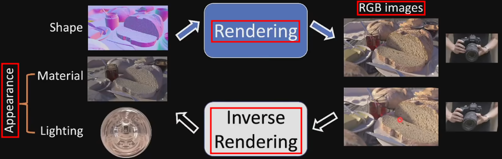
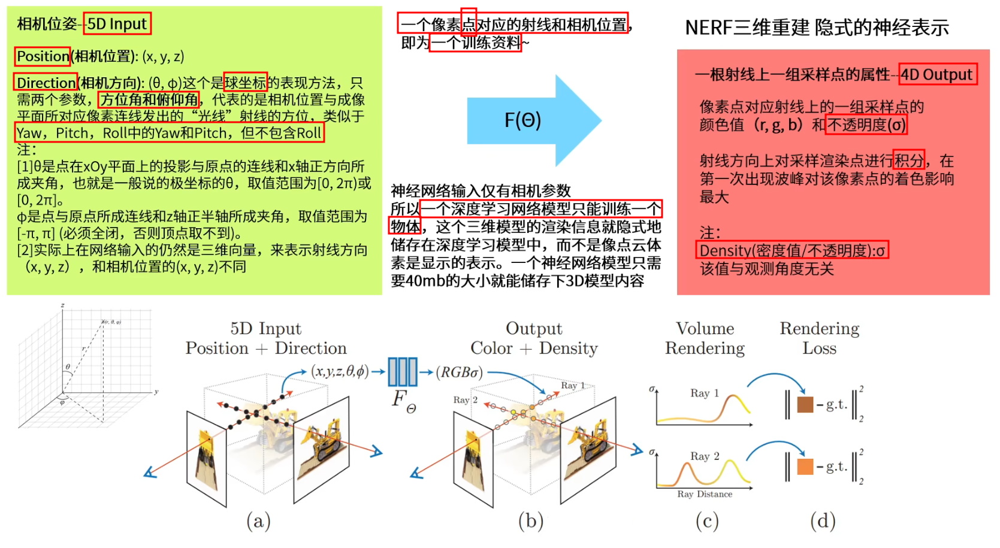
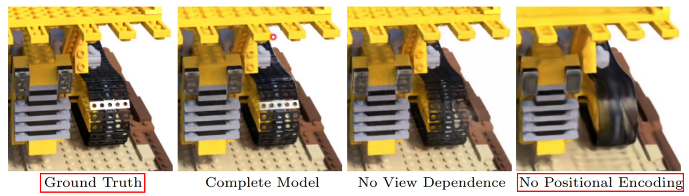
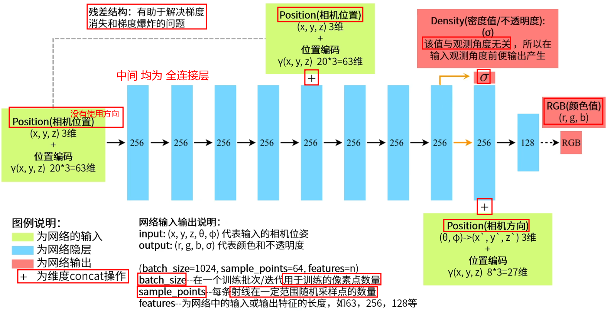
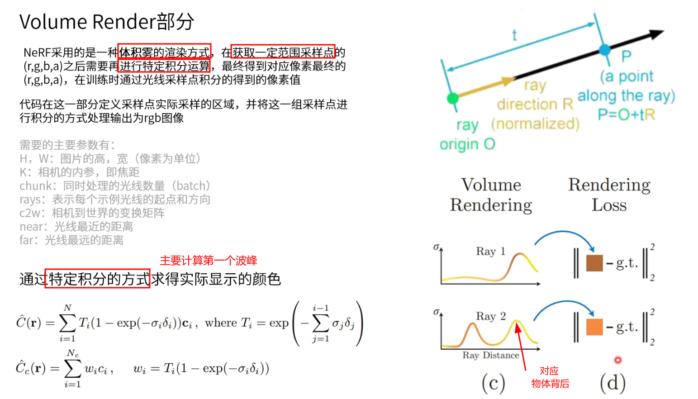

# NeRF: Representing Scenes as Neural Radiance Fields for View Synthesis

NeRF(Neural Radiance Fields) - 神经辐射场

[Paper Website](https://www.matthewtancik.com/nerf)

[Github](https://github.com/bmild/nerf)

```bibtex
@inproceedings{mildenhall2020nerf,
 title={NeRF: Representing Scenes as Neural Radiance Fields for View Synthesis},
 author={Ben Mildenhall and Pratul P. Srinivasan and Matthew Tancik and Jonathan T. Barron and Ravi Ramamoorthi and Ren Ng},
 year={2020},
 booktitle={ECCV},
}
```

## Table of Contents

- [NeRF: Representing Scenes as Neural Radiance Fields for View Synthesis](#nerf-representing-scenes-as-neural-radiance-fields-for-view-synthesis)
  - [Table of Contents](#table-of-contents)
- [NeRF - 中恩实验室](#nerf---中恩实验室)
  - [01 - 十分钟 带你快速入门 NeRF 原理](#01---十分钟-带你快速入门-nerf-原理)
  - [02 五分钟学会渲染自己的 NeRF 模型](#02-五分钟学会渲染自己的-nerf-模型)
- [其他](#其他)

---

# NeRF - 中恩实验室

[中恩实验室 - B站主页](https://space.bilibili.com/3494380627299296/video)

## 01 - 十分钟 带你快速入门 NeRF 原理

[十分钟带你快速入门NeRF原理 - B站视频](https://www.bilibili.com/video/BV1o34y1P7Md/)

渲染 & 反渲染(3D reconstruction，从 图像 获取 三维模型)



过往的 三维重建 通过图片 重建 网格/点云/体素

NeRF 通过 神经隐式 方法(将 3维 模型信息 隐式 存储神经网络中)


NeRF神经网络 采取 体积雾(≈ 带不透明度的点云)的 渲染方式，通过已知视角的图片进行训练，然后输入其它相机视角的参数，从而预测出未出现视角的图片

此时三维模型的信息就储存在了NeRF神经网络之中，所以这是一种 **隐式** 的表示方法，而不是像点云、体素、网格 **显式** 的表示方式



相机位姿可以理解成射线的起点，但实际上训练要用射线上的采样点才能表示出空间中体积雾的点

采样点位置 = 相机原点 + 采样距离 * 相机观测方向(unit vector)

注意
1. 以 像素点 为 训练资料，而非 整张图
2. 一个 batch 包括 多个 像素点 & 多个 相机位姿 的参数
3. 输出
   1. 不是直接得到一个像素点的 RGB-D 值
   2. 而是输出 一段 采样点 上的 RGB-D 值
   3. 通过 在一定范围内的 采样点 RGB-D 值 积分 以得到确切的颜色值 (体积雾渲染)



位置编码 $\gamma(x, y, z)$ 是为了体现 图像中的高频信息，提高图片的细节质量
1. $F_{\Theta} = F_{\Theta}^{\prime} \circ \gamma$
2. $\gamma(p) = (\sin (2^{0} \pi p), \cos (2^{0} \pi p), \cdots, \sin (2^{L-1} \pi p), \cos (2^{L-1} \pi p))$
3. $\sin$ 和 $\cos$ 2个 为 1项
4. 空间坐标用 10 项，即 20 维来分别表示 (x, y, z) 位置编码
5. 相机方向用  4 项，即  8 维来分别表示 (x, y, z) 位置编码



开始时，没有将 相机方向 作为 输入，因为 认为物体不透明度 和 相机朝向 无关



Volume Render

如果已经碰到 不透明度 很高的波峰，说明 已经碰到物体表明，后面的波峰 代表物体的背后(实际上看不见)，不应该成像到图片上

使用 特殊积分(主要 计算第一个波峰)
1. $\hat{C}(\mathbf{r})=\sum_{i=1}^{N} T_{i}(1-\exp (-\sigma_{i} \delta_{i})) \mathbf{c}_{i}$
   1. 其中 $T_{i}=\exp (-\sum_{j=1}^{i-1} \sigma_{j} \delta_{j})$
2. $\hat{C}_{c}(\mathbf{r})=\sum_{i=1}^{N_{c}} w_{i} c_{i}$
   1. $w_{i}=T_{i}(1-\exp (-\sigma_{i} \delta_{i}))$

通过一组图片 & 对应相机位姿 训练网络，用来存储对应模型信息


## 02 五分钟学会渲染自己的 NeRF 模型

[五分钟学会渲染自己的 NeRF 模型 - B站视频](https://www.bilibili.com/video/BV1q84y1U7Qf/)

[Instant Neural Graphics Primitives - Github](https://github.com/NVlabs/instant-ngp)

使用 instant-ngp 来快速生成 NeRF，使用哈希编码的方式极大地提高了训练速度


# 其他


[NeRF简介](https://www.bilibili.com/video/BV1Qd4y1r7ZX/)

NeRF
1. 2020年 ECCV best paper 提名
2. 解决新视图合成问题
3. 可微渲染的一种


