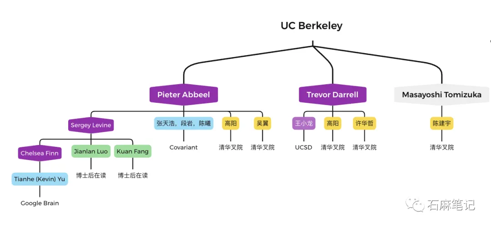

# Networking

a.k.a 圈子

[AI+Robotics华人图谱 - 石麻笔记](https://mp.weixin.qq.com/s/eZZn4diIO1i51Xrb95l5xQ?poc_token=HKdE3WijaKu_F1Hf0H4FkMcHwsREh9_c1g6gTNJ_)

humanoid 控制算法 分3代
1. 用简单的基于模型的控制算法(**LIPM+ZMP**)，代表机器人 ASIMO
2. 动态模型控制和最优控制算法(**MPC+WBC**)，代表机器人 Atlas
3. 模拟仿真 + 强化学习

分类
1. UC Berkeley BAIR
   1. 
   2. `Pieter Abbeel` - 深度强化学习，吴恩达的第一个博士生
      1. 学生 `Sergey Levine` - PALM-E & RT1 & RT2
         1. 学生 `Chelsea Finn`
2. Stanford SAIL
3. MIT CSAIL
4. CMU
5. UW & Nvidia
6. UCSD
7. 北美其他高校及企业
8. 清华大学
9.  北京大学
10. 上海交通大学
11. 国内其他高校及企业

[将机器人的手牵向人类的手：灵巧操作华人论文综述 - 石麻笔记](https://mp.weixin.qq.com/s/XL1rQpJL9cJ6y-XcHjcHeA?poc_token=HKlE3WijzEQ2mqZSSBZ8IJWwrsbANPk8er0R_QSq)