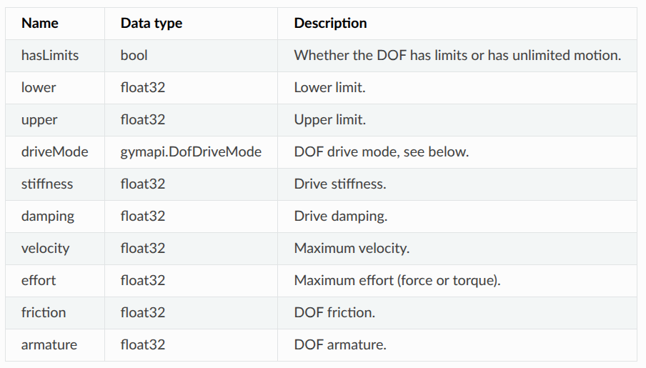

# Isaac Gym

[Isaac Gym - Tensor API](file:///home/lzy/Projects/isaacgym/docs/programming/tensors.html?highlight=wrap_tensor)

- [Isaac Gym](#isaac-gym)
  - [](#)
  - [Simulation Setup](#simulation-setup)
  - [Assets](#assets)
  - [Tensor API](#tensor-api)
    - [Physics State](#physics-state)
    - [Contact Tensors](#contact-tensors)
    - [Force Tensors](#force-tensors)
    - [Control Tensors](#control-tensors)
  - [API Reference](#api-reference)
    - [Python API](#python-api)
  - [Installation](#installation)


##

gymapi : Isaac Gym 的核心接口模块，提供了与底层物理引擎（PhysX）交互的基本功能。它定义了仿真环境、资产（Assets）、角色（Actors）等的创建和管理方法，是构建和控制仿真世界的基础。

gymutil : 辅助模块，提供了一些实用工具函数，用于简化仿真设置、参数解析和调试

gymtorch : gymtorch 是 Isaac Gym 与 PyTorch 的集成模块，用于将仿真中的原始数据（例如张量）转换为 PyTorch 张量，从而便于在深度学习框架中使用


## Simulation Setup

`from isaacgym import gymapi`  core API defined in `gymapi` module

`gym = gymapi.acquire_gym()`


## Assets


## Tensor API

tensor API is currently only supported for the **PhysX backend**


**global tensors** : tensors that hold the values for all actors in the simulation

Gym Tensor API 直接与 GPU 交互，但返回的数据不是标准的 PyTorch Tensor，而是低级别的 GPU 缓冲区，必须使用 `gymtorch.wrap_tensor()` 转换，才能在 PyTorch 中操作

Gym tensor API uses simple tensor desciptor, which specify the **device, memory address, data type, and shape of a tensor**


### Physics State

Actor Root State Tensor - TODO

`actor_root_state = self.gym.acquire_actor_root_state_tensor(self.sim)`

`self.root_states = gymtorch.wrap_tensor(actor_root_state)`


Degrees-of-Freedom


### Contact Tensors

```python
_net_cf = gym.acquire_net_contact_force_tensor(sim)
net_cf = gymtorch.wrap_tensor(_net_cf)
```

### Force Tensors


### Control Tensors

**DOF Control**

set_dof_actuation_force_tensor

**Body Forces**


## API Reference

### Python API

[Python Gym API - Isaac Gym](file:///home/lzy/Projects/isaacgym/docs/api/python/gym_py.html)

`gym = gymapi.acquire_gym()`
`robot_asset = gym.load_asset(sim, asset_root, asset_file, asset_options)`

**class** `isaacgym.gymapi.Gym`
1. `acquire_actor_root_state_tensor` : Retrieves buffer for Actor root states - TODO
   1. shape : (num_actors, 13)
      1. position([0:3]) - 3
      2. rotation([3:7]) - 4
      3. linear velocity([7:10]) - 3
      4. angular velocity([10:13]) - 3
   2. 通常对应于机器人模型的 基座(base link/pelvis)
2. `get_asset_dof_count` : Gets the count of Degrees of Freedom on a given asset
   1. number of degrees of freedom in asset
3. `get_asset_dof_dict`
4. `get_asset_dof_name` : 需要 index of joint
5. `get_asset_dof_names`
6. `get_asset_dof_properties(self: Gym, arg0: Asset)→ numpy.ndarray[carb::gym::GymDofProperties]` : Gets an array of DOFs' properties for the given asset
   1. [DOF Properties and Drive Modes](file:///home/lzy/Projects/isaacgym/docs/programming/physics.html?highlight=physics#dof-properties-and-drive-modes)
   2. 注意 得到的 是 **结构化数组**
        ```python
        dof_props_asset = gym.get_asset_dof_properties(robot_asset)
        print(type(dof_props_asset)) # <class 'numpy.ndarray'>
        print(dof_props_asset.dtype)
        # {
        #    'names':
        #        ['hasLimits', 'lower', 'upper', 'driveMode',
        #        'velocity', 'effort', 'stiffness', 'damping', 'friction', 'armature'],
        #    'formats':
        #        ['?', '<f4', '<f4', '<i4', '<f4', '<f4', '<f4', '<f4', '<f4', '<f4'],
        #    'offsets':
        #        [0, 4, 8, 12, 16, 20, 24, 28, 32, 36],
        #    'itemsize': 40
        # }
        print(dof_props_asset["lower"][0].item())
        print(dof_props_asset["effort"][0].item())
        ```
   3. 
   4. stiffness (对应 PD-Control 的 P-gain $K_p$ 比例增益)
   5. damping   (对应 PD-Control 的 D-gain $K_d$ 微分增益)
7. `get_asset_dof_type(self: Gym, arg0: Asset, arg1: int)→ DofType` : Degree of Freedom type
   ```python
    dof_type = gym.get_asset_dof_type(robot_asset, i)
    if dof_type == gymapi.DOF_ROTATION:
        dof_type_str = "Rotation"
    elif dof_type == gymapi.DOF_TRANSLATION:
        dof_type_str = "Translation"
   ```


torch_utils
1. `quat_rotate` & `quat_rotate_inverse` - TODO
   1. input
      1. q : 四元数 $(q_x, q_y, q_z, q_w)$
      2. v : 待旋转的向量 $x, y, z$

```python
@torch.jit.script
def quat_rotate(q, v):
    shape = q.shape
    q_w = q[:, -1]
    q_vec = q[:, :3]
    a = v * (2.0 * q_w ** 2 - 1.0).unsqueeze(-1)
    b = torch.cross(q_vec, v, dim=-1) * q_w.unsqueeze(-1) * 2.0
    c = q_vec * \
        torch.bmm(q_vec.view(shape[0], 1, 3), v.view(
            shape[0], 3, 1)).squeeze(-1) * 2.0
    return a + b + c


@torch.jit.script
def quat_rotate_inverse(q, v):
    shape = q.shape
    q_w = q[:, -1]
    q_vec = q[:, :3]
    a = v * (2.0 * q_w ** 2 - 1.0).unsqueeze(-1)
    b = torch.cross(q_vec, v, dim=-1) * q_w.unsqueeze(-1) * 2.0
    c = q_vec * \
        torch.bmm(q_vec.view(shape[0], 1, 3), v.view(
            shape[0], 3, 1)).squeeze(-1) * 2.0
    return a - b + c
```


## Installation


[Isaac Gym - Now Deprecated](https://developer.nvidia.com/isaac-gym)

[Isaac Gym - Download Archive](https://developer.nvidia.com/isaac-gym/download)

Installation instructions can be found in the package in the docs folder - open `docs/index.html` to see more.

[Isaac Gym安装及使用教程 - 知乎](https://zhuanlan.zhihu.com/p/618778210)


```python
# unitree-rl 不要完全一样操作
# 可能需要
# find ~/miniconda3/envs/unitree-rl/ -name "libpython3.8.so.1.0"
# sudo ln -s /home/lzy/miniconda3/envs/unitree-rl/lib/libpython3.8.so.1.0 /usr/lib/libpython3.8.so.1.0 创建软链接


# 绿色的按钮下载压缩文件IsaacGym_Preview_4_Package.tar.gz
# 对上面的文件解压缩，得到isaacgym的文件夹，最外层可以扔掉

# 指令会新建名为rlgpu的conda环境

cd isaacgym/python/
sh ../create_conda_env_rlgpu.sh

# 先试一下安装好的环境能不能用
conda activate rlgpu
cd examples
python joint_monkey.py

# 如果报错没有isaacgym
cd isaacgym/python/
pip install -e .

# 此时再尝试运行demo
cd examples
python joint_monkey.py

# 如果报错ImportError: libpython3.7m.so.1.0
# 找出系统中的libpython3.7m.so.1.0的位置
find / -name "libpython*so*"
sudo cp /path/to/libpython3.7m.so.1.0 /usr/lib/x86_64-linux-gnu

# 再次尝试运行demo
cd examples
python joint_monkey.py

# 从 Github 下载 IsaacGymEnvs https://github.com/isaac-sim/IsaacGymEnvs/tree/main 内容全部复制到 isaacgym 中
cd isaacgym/
pip install -e .


cd isaacgymenvs
python train.py task=Cartpole
# 【ImportError】from torch._C import * # noqa: F403； ImportError: xxx: defined symbol: iJIT_NotifyEvent
pip install mkl==2024.0.0

# RuntimeError: The following operation failed in the TorchScript interpreter.
# Traceback of TorchScript (most recent call last):
# RuntimeError: nvrtc: error: invalid value for --gpu-architecture (-arch)
pip3 install torch torchvision torchaudio  # solve this by upgrading to a higher torch version
```


