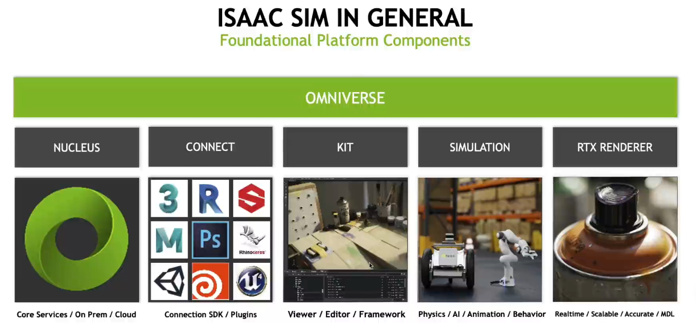
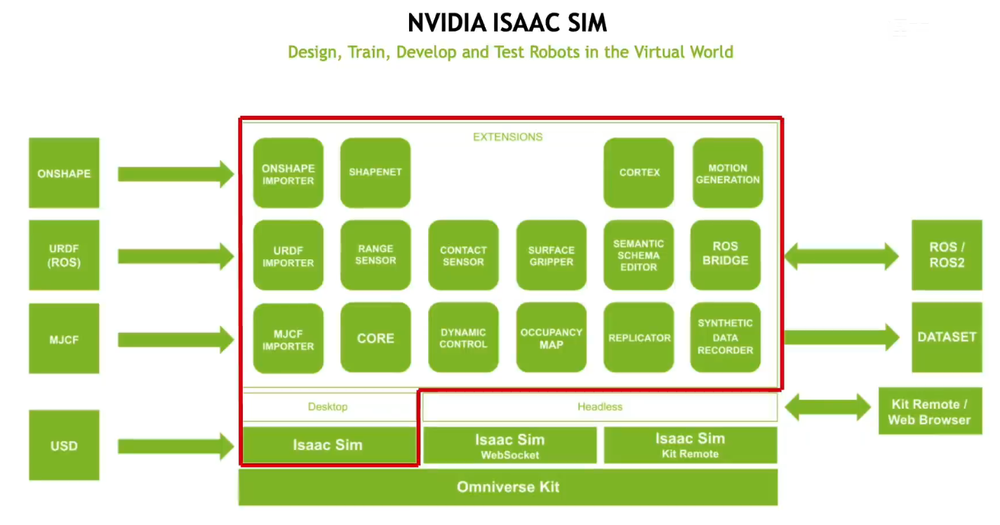
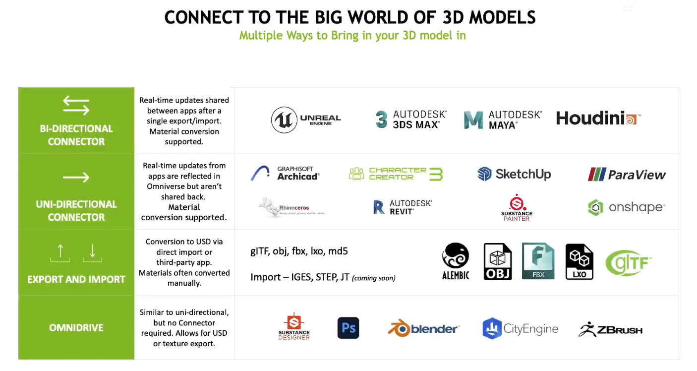
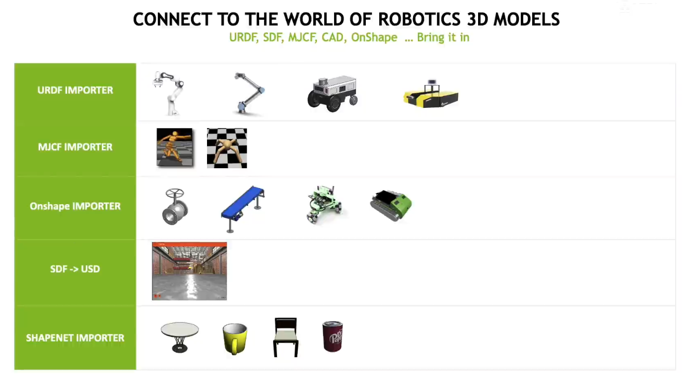

# Isaac Sim

皮克斯动画工作室 - USD格式


# Introduction

Isaac Sim 依托于 Omniverse，Omniverse 包含 5大组件
1. 

Isaac Sim 可以视为 Extensions 的、 集合
1. 

支持的 connector
1. 
2. 

ROS/ROS2 Bridge

Gazebo & IsaacSim (SDF ↔ USD，Runtime Sync)


# Installation

可能需要 在 BIOS 关闭 显卡hybrid

[Installation using Isaac Sim (pip)](https://isaac-sim.github.io/IsaacLab/main/source/setup/installation/pip_installation.html) - recommended for 22.04


[Installation using Isaac Sim (binaries)](https://isaac-sim.github.io/IsaacLab/main/source/setup/installation/binaries_installation.html#isaaclab-binaries-installation) - recommended for 20.04
1. 先下载 zip 文件 [Download Isaac Sim](https://docs.isaacsim.omniverse.nvidia.com/latest/installation/download.html#download-isaac-sim-short)


自动安装的 torch 如果有问题 (`import torch` 显示 没有 NCCL)，可以考虑 `pip3 install torch torchvision torchaudio --index-url https://download.pytorch.org/whl/cu126`


## Deprecated Omniverse

```bash
# 检查 ICD 冲突 (只保留一个位置包含 nvidia_icd.json 文件，另一个重命名加一个 '.bak')

ls /etc/vulkan/icd.d/*nvidia*
ls /usr/share/vulkan/icd.d/*nvidia*
```

[NVIDIA Isaac Sim](https://developer.nvidia.com/isaac/sim)
1. 点击 `Download Omniverse` 进入 [Installation](https://docs.omniverse.nvidia.com/isaacsim/latest/installation/index.html)
2. 选择 `Workstation Installation`, Direct Link: `Linux`, 下载 `omniverse-launcher-linux.AppImage`

打开 `Omniverse Launcher`，进入 `EXCHANGE`，搜索 `ISAAC SIM` 并安装，同时 安装 `CACHE`

