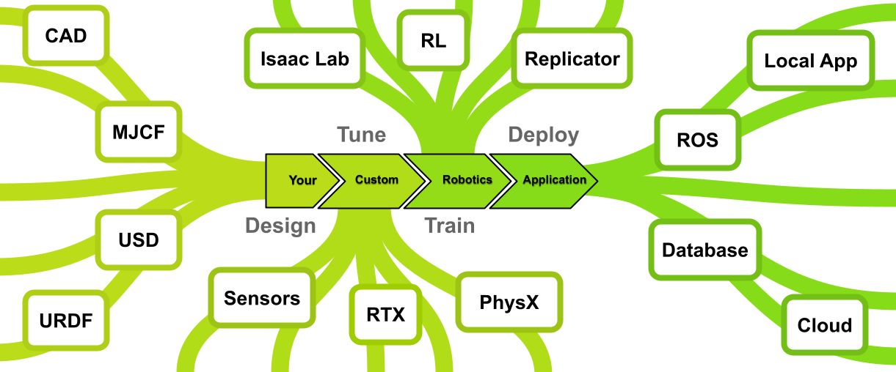
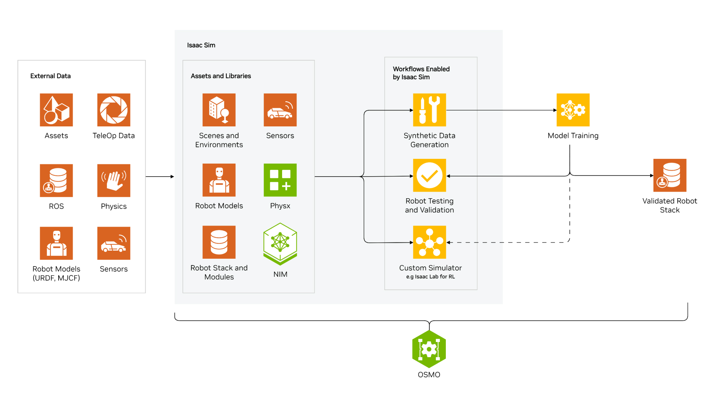
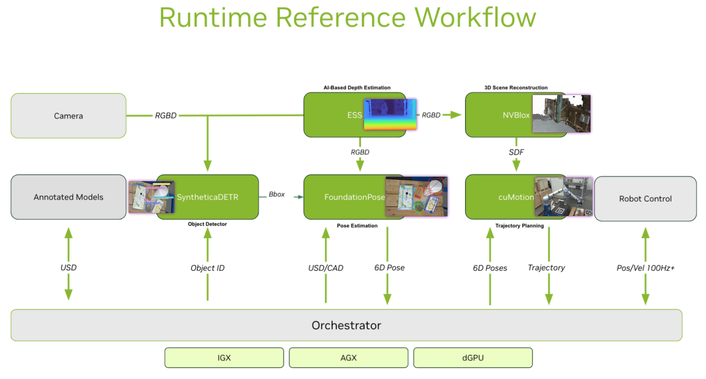

# Omniverse | Isaac Sim | Isaac Lab

[NVIDIA Isaac Sim - Nvidia 官网](https://developer.nvidia.com/isaac/sim )

[How Isaac Sim relates to Isaac Lab - YouTube 视频](https://www.youtube.com/watch?v=NFcRirGuERI )

Omniverse 是 开放式协作与仿真平台，用于构建和操作虚拟世界和数字孪生
1. 基于 USD(Universal Scene Description) 3D 框架，可互操作多种 3D 工具(Maya、Blender)
2. 提供高质量的物理渲染、实时物理仿真
3. 是 Isaac Sim 等工具的基础平台，它为 Isaac Sim 提供底层仿真和渲染支持

Issac Sim 是 基于 Omniverse 构建的机器人仿真工具 (用于 Build，闭源)
1. [What Is Isaac Sim?](https://docs.omniverse.nvidia.com/isaacsim/latest/index.html)
2. 高保真的物理仿真(动力学 & 传感器)
3. 与 ROS 集成
4. 可扩展性强

Isaac Lab 是 专注于机器人 AI 开发的工具集(轻量化)，依赖于 Isaac Sim 的仿真能力 (用于 Train，开源)
1. 提供了一系列预构建的机器人模型和任务场景
2. 包括强化学习环境、路径规划模块、控制策略
3. 支持 强化学习(Reinforcement Learning, RL) 和 模仿学习(Imitation Learning, IL)
4. 支持多种机器人形态(移动机器人、机械臂、人形机器人等)

Isaac Gym 用于机器人强化学习的 GPU 加速仿真框架
1. [Isaac Gym - Now Deprecated](https://developer.nvidia.com/isaac-gym)
2. 支持主流 强化学习算法(PPO、SAC)
3. 无高保真的渲染
4. 不包括可变形和刚性对象之间的交互
5. 逐渐被 Isaac Lab 取代，已经停止维护，但是使用简单

Orbit 是 Isaac Lab 的前身
1. [Paper Website](https://isaac-orbit.github.io/)
2. Orbit will continue to evolve as Isaac Lab to become an even lighter application on Isaac Sim for robot learning

NVIDIA PhysX
1. scalable, multi-physics SDK
2. simulating and modeling physics in Robotics, Autonomous Vehicles, and VFX workflows






# Blog

## Create, Design, and Deploy Robotics Applications Using New NVIDIA Isaac Foundation Models and Workflows

[Create, Design, and Deploy Robotics Applications Using New NVIDIA Isaac Foundation Models and Workflows](https://developer.nvidia.com/blog/create-design-and-deploy-robotics-applications-using-new-nvidia-isaac-foundation-models-and-workflows/)

New Features
1. `NVIDIA Isaac Perceptor`(感知), a new reference workflow for **AMRs** and **AGVs**
   1. built on top of the NVIDIA Isaac Robot Operating System (ROS)
   2. Key features
      1. Multi-camera AI-based **depth perception** : processes depth points, GPU-accelerated
      2. Multi-camera visual inertial odometry
         1. ROS 2 packages for visual simultaneous localization and mapping (VSLAM) and visual odometry (VO)
         2. based on the NVIDIA CUDA Visual SLAM (cuVSLAM) library and provides robust navigation
      3. Real-time, multi-camera voxel grid mapping
         1. nvblox, the CUDA-accelerated 3D reconstruction library
         2. identify obstacles to provide a 2D costmap
2. `NVIDIA Isaac Manipulator`(交互), offers new foundation models and a reference workflow for **industrial robotic arms**
   1. Key features
      1. cuMotion(coRobo) for faster path planning : GPU-accelerated motion planner, available as a plugin for the MoveIt 2 motion planning framework
      2. FoundationPose : single-shot **6D pose estimation and tracking**
      3. SyntheticaDETR :  set of Real-Time DEtection TRansformer (DETRs)-based models for single-shot, image space object detection trained on synthetic data generated using NVIDIA Omniverse
3. `NVIDIA Jetson` for Robotics, with new updates in NVIDIA JetPack 6.0 (至少 Orin)
4. `NVIDIA Isaac Sim` 4.0 brings `NVIDIA Isaac Lab`, a lightweight app for robot learning.




# Installation

## Isaac Sim

[NVIDIA Isaac Sim](https://developer.nvidia.com/isaac/sim)
1. 点击 `Download Omniverse` 进入 [Installation](https://docs.omniverse.nvidia.com/isaacsim/latest/installation/index.html)
2. 选择 `Workstation Installation`, Direct Link: `Linux`, 下载 `omniverse-launcher-linux.AppImage`

打开 `Omniverse Launcher`，进入 `EXCHANGE`，搜索 `ISAAC SIM` 并安装，同时 安装 `CACHE`


## Isaac Gym

[Isaac Gym - Now Deprecated](https://developer.nvidia.com/isaac-gym)

[Isaac Gym - Download Archive](https://developer.nvidia.com/isaac-gym/download)

Installation instructions can be found in the package in the docs folder - open `docs/index.html` to see more.

[Isaac Gym安装及使用教程 - 知乎](https://zhuanlan.zhihu.com/p/618778210)


安装及报错解决

```python
# 绿色的按钮下载压缩文件IsaacGym_Preview_4_Package.tar.gz
# 对上面的文件解压缩，得到isaacgym的文件夹，最外层可以扔掉

# 指令会新建名为rlgpu的conda环境

cd isaacgym/python/
sh ../create_conda_env_rlgpu.sh

# 先试一下安装好的环境能不能用
conda activate rlgpu
cd examples
python joint_monkey.py

# 如果报错没有isaacgym
cd isaacgym/python/
pip install -e .

# 此时再尝试运行demo
cd examples
python joint_monkey.py

# 如果报错ImportError: libpython3.7m.so.1.0
# 找出系统中的libpython3.7m.so.1.0的位置
find / -name "libpython*so*"
sudo cp /path/to/libpython3.7m.so.1.0 /usr/lib/x86_64-linux-gnu

# 再次尝试运行demo
cd examples
python joint_monkey.py

# 从 Github 下载 IsaacGymEnvs https://github.com/isaac-sim/IsaacGymEnvs/tree/main 内容全部复制到 isaacgym 中
cd isaacgym/
pip install -e .


cd isaacgymenvs
python train.py task=Cartpole
# 【ImportError】from torch._C import * # noqa: F403； ImportError: xxx: defined symbol: iJIT_NotifyEvent
pip install mkl==2024.0.0

# RuntimeError: The following operation failed in the TorchScript interpreter.
# Traceback of TorchScript (most recent call last):
# RuntimeError: nvrtc: error: invalid value for --gpu-architecture (-arch)
pip3 install torch torchvision torchaudio  # solve this by upgrading to a higher torch version
```


smpl


usd & urdf


机器人 retarget : 将一个动作或运动从一个源系统（如人类的动作、虚拟角色的运动）映射到机器人系统上。它的核心是让机器人模仿或执行源系统的动作，同时考虑机器人自身的物理限制、动力学特性和任务需求。
1. 运动源（Source Motion）：来源可以是人类动作（通过动作捕捉设备获取）、虚拟角色动画或其他机器人动作数据
2. 目标系统（Target System）：通常是一个机器人，它的运动方式受到自身结构、关节范围、动力学模型等限制
3. 映射（Mapping）：将源运动转换为目标系统可以执行的动作，同时保持运动的语义和功能


# Isaac Lab & Isaac Sim

[NVIDIA Omniverse](https://developer.nvidia.com/omniverse)

[NVIDIA Isaac Lab](https://developer.nvidia.com/isaac/lab)

[NVIDIA Isaac Lab - Github](https://github.com/isaac-sim/IsaacLab)

[NVIDIA Isaac Lab Documentation - Local Installation](https://isaac-sim.github.io/IsaacLab/main/source/setup/installation/index.html#local-installation)


# Installation

[Omniverse](https://www.nvidia.com/en-us/omniverse/)

[Omniverse Download](https://www.nvidia.com/en-us/omniverse/)

[NVIDIA Omniverse](https://developer.nvidia.com/omniverse) 选择 `Access Omniverse Launcher for Windows or Linux`

```bash
# 安装 omniverse launcher 是一个 AppImage
wget https://install.launcher.omniverse.nvidia.com/installers/omniverse-launcher-linux.AppImage
```


https://docs.robotsfan.com/isaaclab/index.html


https://developer.nvidia.cn/isaac/sim
