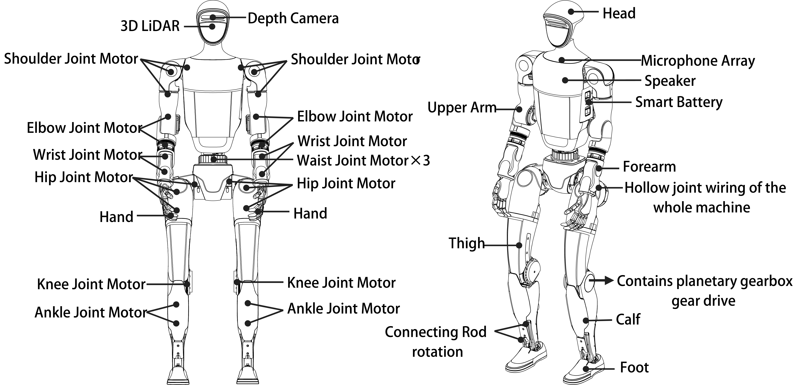
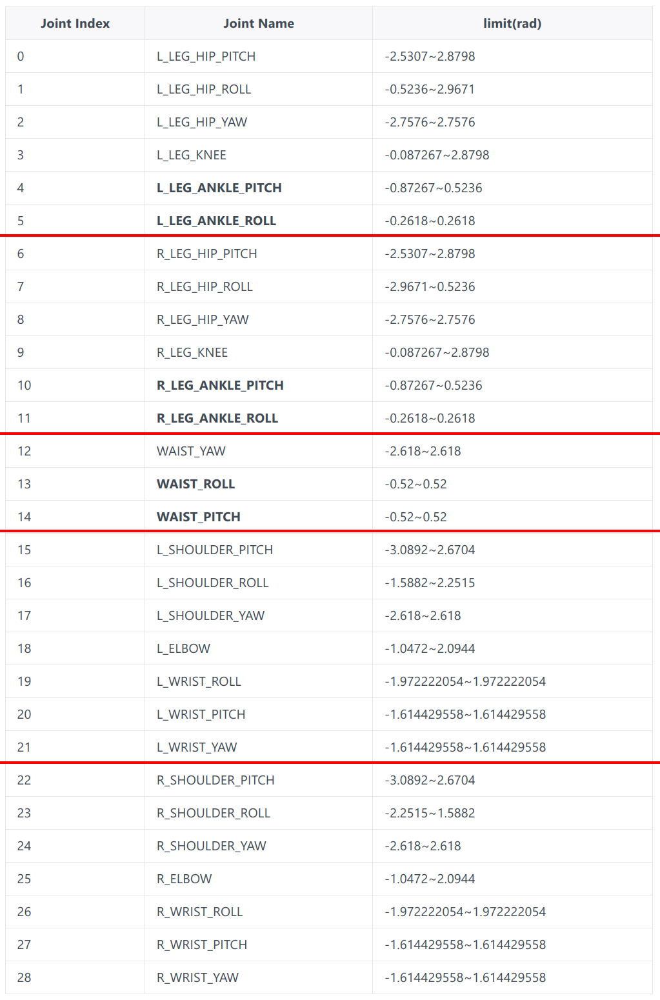
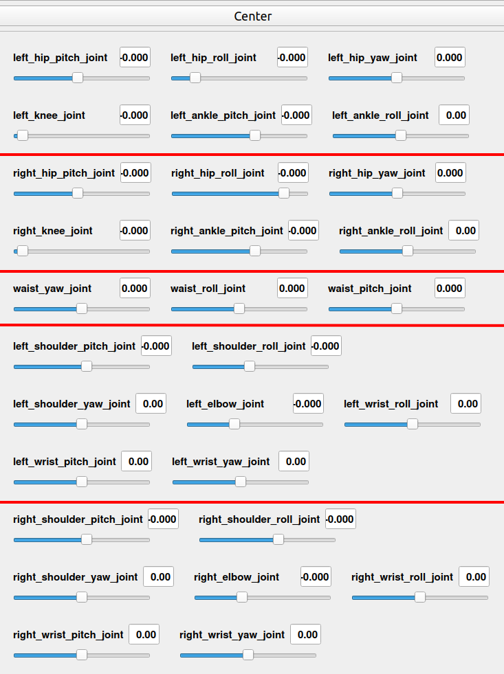

# UniTree

## G1

Links
1. [UniTree - G1](https://www.unitree.com/cn/g1)
2. [G1 URDF - Github](https://github.com/unitreerobotics/unitree_ros/tree/master/robots)
3. [G1 SDK Development Guide](https://support.unitree.com/home/en/G1_developer/about_G1)

**G1**
1. 23 DoF
   1. waist : 1
   2. single arm : 5
   3. single hand : 0

**G1-EDU**
1. **23 ~ 43** (`43 = 23 + 2 + (7 + 2) * 2`) DoF
   1. waist : 1(origin) + **2 (additional)**
   2. single arm : 5
   3. single hand : **(7 + 2) * 2 (additional)**
      1. dexterous hand : 7
         1. thumb : 3
         2. index finger  : 2
         3. middle finger : 2
      2. additional wrist : 2

头部 & 颈部 无 DoF

**Size** : 1320x450x200mm

**Weight** : ≈ 35 kg

**Joint serial number and joint limit** (0~28 共 29 个)
1. 
2. 

Vocabulary
1. torso : 躯干
2. pelvis : 盆骨 (tf-tree root)
3. elbow : 肘
4. ankle : 脚踝
5. hip : 髋
6. wrist : 手腕
7. waist : 腰

