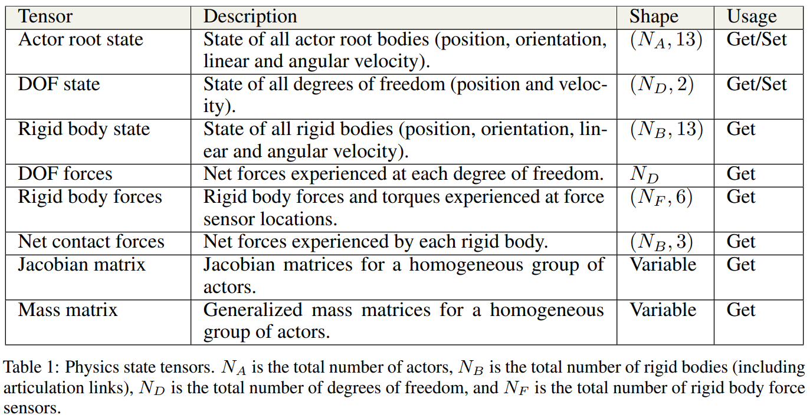

# 华北舵狗王带你5天上手IsaccGym强化学习

[Tinymal 官网](https://tinymal.cn/)

[BiliBili 课程](https://www.bilibili.com/cheese/play/ep966381)

[课程 配套文档](https://www.bilibili.com/cheese/play/ep966684)

[IsaacGymEnvs - Github](https://github.com/isaac-sim/IsaacGymEnvs/tree/main)

[莫凡Python - RL](https://mofanpy.com/tutorials/machine-learning/reinforcement-learning/)

## 1 课程先导内容

数据融合

DQN

Markov Process

Q-Learning (+RBF网络拟合)

Deep Reinforcement Learning

## 2 浅尝截止 : 传统控制 与 RL-IsaacGym 官方倒立摆例子

传统控制(分层解耦)
1. 无人机 - ADRC 自抗扰控制器 & OLDX飞控 & 基于二维码阵列定位 & 姿态控制 - 无人机之父(拉菲罗·安德烈)
2. 腿足机器人 - kinematics & kinetics & 步态控制 & 力控 & 伺服

IsaacGym RL 基本软件框架(Task)，使用 yaml 设置参数
1. `__init__` 初始化(仿真环境构建)
2. `step`
   1. pre
   2. post 环境复位

翻译
1. "タスク設定": "Task Settings"
   1. 为强化学习的任务提供配置和环境参数
2. "学習設定": "Learning Settings"
3. "タスク設計": "Task Design"
   1. 实际构建强化学习任务的逻辑和实现细节
      1. 奖励函数 (Reward Function)
      2. 观察空间 (Observation Space)
      3. 动作空间 (Action Space)
4. "タスク登録": "Task Registration"
   1. 将任务、环境或算法的定义注册到框架中，以便后续训练或运行时可以动态调用和使用
5. "学習アルゴリズム": "Learning Algorithm"

`source devel/setup.bash`
1. `devel/setup.bash` 加载特定工作空间的环境变量(临时配置)，仅限当前终端会话
2. 让当前终端会话能够访问 ROS 工作空间中的包和资源
3. 可能需要多次切换不同的工作空间，每次切换工作空间时需要运行

`source ~/.bashrc`
1. 重新加载全局用户配置(`~/.bashrc`)
2. `~/.bashrc` 提供的是全局的、持久的配置

cuda & torch & libtorch
1. 通常，driver api 的版本能向下兼容 runtime api 的版本，即 `nvidia-smi` 显示的版本大于`nvcc --version` 的版本通常不会出现大问题

项目文件夹
1. assets : 3D模型文件
2. isaacgymenvs : task & train 配置
   1. cfg
   2. train.py (`cd isaacgymenvs`)

环境配置 & 安装 [isaac-gym](../Robotics/Omniverse-Isaac/Omniverse.md#isaac-gym)

车摆 cartpole，底部小车可以移动

`python train.py task=Cartpole`

actors
1. show selected env axes
2. show selected env outline
3. show only selected env

奖励越大，机器人越稳定

checkpoint 可以载入已有的保存点

`python train.py task=Ant checkpoint=runs/Ant/nn/Ant.pth`

### 训练脚本介绍

使用 Hydra 管理 config

`train.py` 命令行 args (default value 在 `isaacgymenvs/config/config.yaml`)
1. **task=TASK** - `isaacgymenvs/config/task` 文件夹中
2. **train=TRAIN** - selects which training config to use. Will automatically default to the correct config for the environment (ie. `<TASK>PPO`).
3. **num_envs=NUM_ENVS** - selects the number of environments to use (overriding the default number of environments set in the task config).
4. **seed=SEED** - sets a seed value for randomizations, and overrides the default seed set up in the task config
5. **sim_device=SIM_DEVICE_TYPE** - Device for **physics simulation**. Follows PyTorch-like device syntax.
   1. `cuda:0 (default)` to use GPU
   2. `cpu` for CPU
6. **rl_device=RL_DEVICE** - Which device / ID to use for the **RL algorithm**. Defaults to cuda:0, and also follows PyTorch-like device syntax.
7. **graphics_device_id**=GRAPHICS_DEVICE_ID - Which Vulkan graphics device ID to use for **rendering**. Defaults to 0. Note - this may be different from CUDA device ID, and does not follow PyTorch-like device syntax.
8. **pipeline=PIPELINE** - Which API pipeline to use.
   1. Defaults to gpu, can also set to cpu.
   2. When using the **gpu** pipeline, all data stays on the GPU and everything runs as fast as possible.
   3. When using the **cpu** pipeline, **simulation can run on either CPU or GPU**, depending on the sim_device setting, but a copy of the data is always made on the CPU at every step.
9.  **test=TEST** - If set to True, **only runs inference** on the policy and **does not do any training**
10. **checkpoint=CHECKPOINT_PATH** - Set to path to the checkpoint to load for training or testing.
11. **headless=HEADLESS** - Whether to run in headless mode.(可视化窗口)
12. experiment=EXPERIMENT - Sets the name of the experiment.
13. **max_iterations=MAX_ITERATIONS** - Sets how many iterations to run for. Reasonable defaults are provided for the provided environments.

eg :
1. load a trained checkpoint and **continue training** 继续训练
   1. `python train.py task=Ant checkpoint=runs/Ant/nn/Ant.pth`
2. load a trained checkpoint and **only perform inference** (no training) pass **test=True**, run with fewer environments using **num_envs=64**
`python train.py task=Ant checkpoint=runs/Ant/nn/Ant.pth test=True num_envs=64`

actual configs
1. for task are in `isaacgymenvs/config/task/<TASK>.yaml` - 环境仿真 和 任务设置
2. for train in `isaacgymenvs/config/train/<TASK>PPO.yaml`

### IsaacGym RL 框架

注意 cfg(配置 `cfg/task/task_name.yaml` & `cfg/train/task_namePPO.yaml`) 和 task(`task/task_name.py`)

其中 task (`task/task_name.py`) 中 会创建 `task_name` 类
1. 从 配置文件 中 读取参数，自定义参数需要设置为 类中的局部变量
2. 设置 `numObservations`(观察值数量 eg:车位置、车速度、杆角度、杆角速度) & `numActions`(动作数量)
3. 代码框架
   1. create_sim
      1. _create_ground_plane
      2. _create_envs
   2. pre_physics_step 物理仿真前的动作应用
   3. post_physics_step 物理仿真后的状态更新
      1. compute_observation
      2. compute_reward

如果新添加 需要 在 `tasks/__init__.py` 中 添加 任务

配置训练
1. `cfg/train/task_namePPO.yaml`
   1. `max_epochs: ${resolve_default:100,${....max_iterations}}`
2. `cfg/task/task_name.yaml`
   1. `numEnvs: ${resolve_default:512,${...num_envs}}`

Gym API 和 tensor 相关用法
1. `refresh_dof_state_tensor` 将使用物理引擎的最新值填充张量(compute_observation 时)

| Tensor                | Description                                                                 | Shape         | Usage      |
|-----------------------|-----------------------------------------------------------------------------|--------------|------------|
| **Actor root state**  | state of all actor root (position, orientation, linear & angular velocity)  | (N_A, 13)    | Get/Set    |
| **DOF state**         | State of all degrees of freedom (position and velocity)                     | (N_D, 2)     | Get/Set    |
| **Rigid body state**  | State of all rigid bodies (position, orientation, linear & angular velocity)| (N_B, 13)    | Get        |
| **DOF forces**        | Net forces experienced at each degree of freedom                            | N_D          | Get        |
| **Rigid body forces** | Rigid body forces and torques experienced at force sensor locations         | (N_F, 6)     | Get        |
| **Net contact forces**| Net forces experienced by each rigid body                                   | (N_B, 3)     | Get        |
| **Jacobian matrix**   | Jacobian matrices for a homogeneous group of actors                         | Variable     | Get        |
| **Mass matrix**       | Generalized mass matrices for a homogeneous group of actors                 | Variable     | Get        |

物理仿真中，actor 是环境中的核心实体，通常具有以下功能
1. root state
2. 控制接口
3. 刚体 & 关节
4. 仿真交互

Python Gym API 说明 `isaacgym/docs/api/python/gym_py.html`
1. acquire_actor_root_state_tensor
2. acquire_dof_force_tensor - 获取作用在每个自由度上的 力Force 或 力矩Torque 的大小
3. acquire_dof_state_tensor
4. acquire_force_sensor_tensor - 所有力传感器的状态数据
5. acquire_net_contact_force_tensor - 所有刚体的接触力数据
6. ...

论文 Isaac Gym: High Performance GPU-Based Physics Simulation For Robot Learning

## 3 牛刀小试 : 修改倒立摆例子

除了对倒立摆姿态的平衡外还，新增对小车位置进行控制 (减少漂移)

新建任务
1. 在 `isaacgymenvs/tasks/__init__.py` 的 `isaacgym_task_map` 中添加任务，方便后面在命令行进行 task 选择
2. 添加/修改
   1. `cfg/task/task_name.yaml` (asset 模型文件)
   2. `cfg/train/task_namePPO.yaml`
   3. `tasks/task_namePPO.py`

修改保存在 `runs` 的 checkpoint 名称，需要修改 `train/task_namePPO.yaml` 中的 `params:config:name:`

`python train.py task=CartpoleUser headless=True`

`python train.py task=CartpoleUser test=True num_envs=9 checkpoint=...`

`self.max_episode_length` 最大仿真步数

常用函数 `from isaacgymenvs.utils.torch_jit_utils import tensor_clamp(设置上下限裁剪)`

## 4 广泛学习 : 测试 Legged Gym 强化学习框架

[Isaac Gym Environments for Legged Robots](https://github.com/leggedrobotics/legged_gym)

对于腿足式机器人目前主要采用的是 RSL 实验室开源的 LeggedGym 强化学习软件包，其针对四足、人形机器人构建了一个统一的训练框架，面向机器人训练需要的地形构建、RD域随机化以及腿足强化奖励

能通过直接导入 URDF 设计奖励函数

[Github leggedrobotics/legged_gym](https://github.com/leggedrobotics/legged_gym)

四足机器人
1. 该项目提供了从训练到实物C++部署的完整四足机器人例子，可以实现上下楼梯，越障，训练算法采用了带约束的PPO，可以在设置奖励的基础上进一步通过约束cost代价函数的方式实现对智能体的训练
2. https://github.com/zeonsunlightyu/LocomotionWithNP3O

人形机器人
1. Humanoid-gym项目提供了人形机器人从训练到sim2sim的完整例子，训练观测融入和长期历史记忆，并且设置了基于步态相序下的奖励
2. https://github.com/roboterax/humanoid-gym

轮足机器人
1. 提供了轮足机器人的在isacc下的仿真和强化学习例子，同时具有RM双轮足与B2-W四轮足的模型
2. https://github.com/aCodeDog/legged-robots-manipulation/tree/master

模仿学习
1. 提供了基于频域变换FLD下的动作模仿与映射的方法
2. https://github.com/mit-biomimetics/fld/tree/main

rsl_rl legged-gym
humanoid-gym
OpenLoong
ocs2

使用 `v` 可以暂停可视化

`viewer` 中 可以 `render collision meshes`(简化的模型)

GymRigidBodyState (using 13 floats)
1. 3 floats for position
2. 4 floats for quaternion
3. 3 floats for linear velocity
4. 3 floats for angular velocity

[`class isaacgym.gymapi.Gym`](file:///home/lzy/Projects/isaacgym/docs/api/python/gym_py.html)
1. `acquire_*_tensor` - retrieve buffer
   1. returns a generic tensor descriptor that isn’t very useful by itself (相当于进行绑定，绑定后，以后只要refresh即可，除非动态生成/销毁)
2. `refresh_*` - update buffer

[Tensor API](file:///home/lzy/Projects/isaacgym/docs/programming/tensors.html)
3. `gymtorch.wrap_tensor` - access the contents of the tensor，将 Isaac Gym 仿真数据 转换为 PyTorch 张量 (wrap to tensor)
4. `gymtorch.unwrap_tensor` - convert torch tensor to a Gym tensor descriptor，将 PyTorch 张量 转换为 Isaac Gym 数据格式 (unwrap from tensor)

先 acquire 后 refresh
1. Isaac Gym 中，所有的状态数据(关节状态、刚体状态等)都存储在 GPU 上的内存中，作为模拟器运行的内部数据
2. 当调用 `acquire_*_tensor` 方法时，您只是获取了这些 GPU 数据 descriptor/buffer，本身不会包含最新的状态数据
3. `refresh_*` 操作是用来同步这些句柄与模拟器当前状态的最新数据，允许用户控制刷新时机
4. 刷新操作并不会修改模拟器内部的状态，而是将模拟器最新的状态数据同步到已经分配好的张量中

PD阻抗控制，转为关节扭矩，最终作用到电机执行器 - TODO

## 5 深度学习 : 导出 URD 正确模型

**SW建模**(机械模型) - **URDF导出**(URDF文件) - **模型校验(rviz)**(URDF修改) - **算法移植**(IsaacGym) - **训练优化**(pt模型) - **XML导出**(PyTorch) - **Mujoco迁移**(tvm C++ 框架) - **实物迁移**

[Generating an URDF File - ROS2 Documentation](https://docs.ros.org/en/humble/Tutorials/Intermediate/URDF/Exporting-an-URDF-File.html)

[solidworks_urdf_exporter - Github](https://github.com/ros/solidworks_urdf_exporter)

## 6 算法部署 : 在 Isaac 里训练你的机器人

## 7 模型迁移 : 通过 mujoco 进行 sim2sim 迁移

