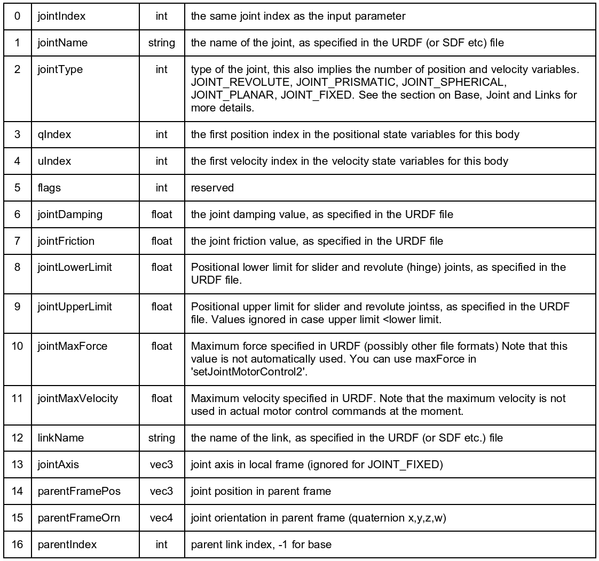

`getJointInfo()`
1. 

PyBullet 在加载 URDF 时，Base Link 的位置是由 inertial 里定义的 origin 影响的

如果你的关节是 fixed joint(即不可运动的关节)，那么它不会有旋转轴，所以 PyBullet 直接返回 (0,0,0)

loadURDF() 只影响 Base Link 的全局位置，关节（Joint）在 Base Link 内部的相对位置 不会变

PyBullet 里的 Base Link（Root Link） 是绝对位置，而其他 Links 都是相对位置