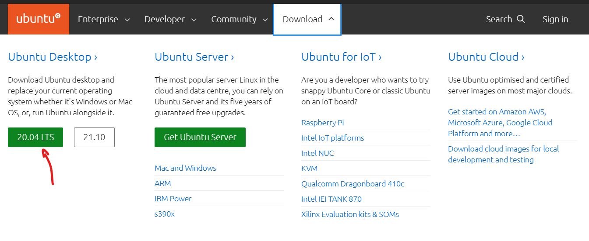
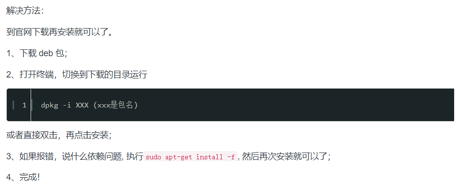

# ROS相关安装

[toc]

# 虚拟机

## 安装VM Ware

安装包+密钥

```
ZF3R0-FHED2-M80TY-8QYGC-NPKYF

YF390-0HF8P-M81RQ-2DXQE-M2UT6

ZF71R-DMX85-08DQY-8YMNC-PPHV8
```

## 安装Ubuntu20.04

[Ubuntu官网](https://ubuntu.com/#download)



## 安装VM-tools

```
sudo apt upgrade
sudo apt install open-vm-tools-desktop -y
sudo reboot
```

## 安装输入法

[Google&Sogou输入法](https://blog.csdn.net/Chamico/article/details/89788324)

调整优先级


## 安装ROS

[ROS Wiki](http://wiki.ros.org/cn/noetic/Installation/Ubuntu)

## 安装rosdep

[pip安装rosdep](https://www.bilibili.com/video/BV1bg41177xC)

## vscode

如果是直接在应用商店下载，则无法输入中文，从官网下载即可




## 

sudo apt-get install ros-kinetic-teleop-twist-keyboard

# 双系统

# 额外要安装的package

roslaunch mbot_description display_mbot_urdf.launch 


