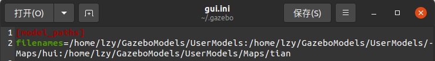
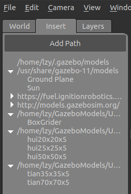
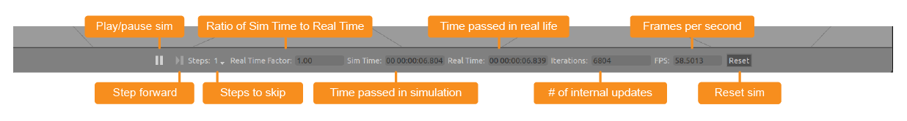
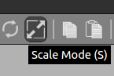
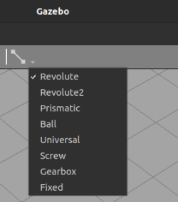
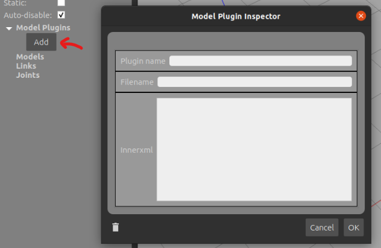

# Gazebo

[toc]

## Portals

[gazebo官网教程](http://gazebosim.org/tutorials)

[ROS官网urdf相关](http://wiki.ros.org/urdf/Tutorials)

[冰达机器人](https://www.bilibili.com/video/BV143411C75B)

# 实践总结

## 插入模型文件的路径

```
~/.gazebo/gui.ini
```






## Solidworks模型文件导入

支持stl格式文件

**调整尺寸（stl中的单位和gazebo中不一致，需要将stl尺寸缩小为原来的1/1000倍）**

**注意windows不区分大小写，所以文件后缀为.STL，而gazebo在model editor里导入文件的时候只能发现.stl，所以记得改成小写。**

模型保存时会自动根据模型名称创建文件夹，所以自己不必创建。


# 官网教程

## 01 Overview and installation

Typical uses of Gazebo include:

1. testing robotics algorithms
2. designing robots
3. performing regression testing with realistic scenarios

A few key features of Gazebo include:

1. multiple physics engines
2. a rich library of robot models and environments
3. a wide variety of sensors
4. convenient programmatic and graphical interfaces

## 02 Understanding the GUI

GUI

1. Scene(where the simulated objects are animated)
2. Panels(right and left)
   1. left(world、insert、 layer)
   2. right
3. Toolbars
   1. Upper Toolbar
   
   1. Bottom Toolbar
   
4. Mouse Controls

5. Menu

## 03 Model Editor

To enter the Model Editor, click on Edit in the menu bar and select Model Editor. Or, use the hotkeys, Ctrl+M. 

一旦进入模型编辑器，物理和模拟就会暂停

左面板有两个选项
1. 插入
   1. Simple Shapes
   2. Custom Shapes 该Add按钮允许您从模型中的链接导入自定义网格。它目前支持 COLLADA (.dae)、3D Systems (.stl)、Wavefront (.obj) 和 W3C SVG (.svg) 文件。
   3. Model Database
2. 模型
   1. 模型选项卡允许您设置正在构建的模型的名称和基本参数。它显示模型中的链接、关节、嵌套模型和插件的列表。可以使用Link Inspector修改参数。


进入Model Eidtor编辑模型

通过Scale Mode粗调大小



通过Link Inspector调整位置和角度，细调大小

注意，视觉大小和碰撞体积可能都需要修改

利用Create Joint创建链接，对于不同种类的链接选择不同链接方式



注意转轴的设置以及位置对齐设置等等

可能会用到Model Plugin Inspector



<br>
<br>


# 冰达机器人教程

实验准备和内容介绍
1. Gazebo和环境模型准备
2. 机器人模型设计
3. 为模型装备传感器和执行器


# URDF

The Unified Robotic Description Format (URDF)

详见LearnURDF文件夹

## 检查工具

```xml
check_urdf [xxx].urdf
```

# Xacro

对URDF的升级

可以简化代码

与URDF基本相似

##

```xml
<gazebo>

</gazebo>
```


sudo apt-get install liburdfdom-tools

urdf_to_graphiz [xxxx].urdf