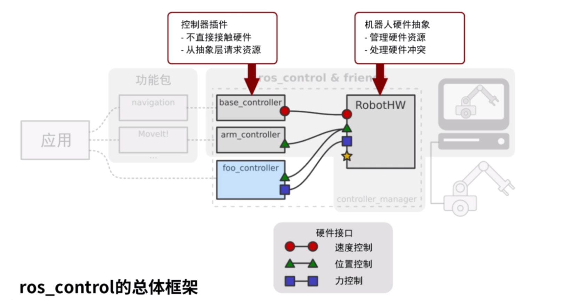

# ROS


[toc]

# 古月居

## 古月居ROS入门21讲

### 1.课程介绍

ROS:robot operating system

通信机制、开发工具、应用功能、生态系统

### 2.Linux系统介绍及安装

### 3.Linux系统基础操作

### 4.C++/Python极简基础

### 5.安装ROS系统

### 6.ROS是什么


**目的：提高机器人研发中的软件复用率**

1. 通信机制
   1. 松耦合分布式通信
2. 开发工具
   1. Gazebo
   2. TF坐标变换
   3. Rviz
   4. QT工具箱
   5. 命令行&编译器
3. 应用功能
   1. Navigation
   2. SLAM
   3. MoveIt
4. 生态系统
   1. 发行版（Distribution）
   2. 软件源（Repository）
   3. ROS Wiki

### 7.ROS中的核心概念

①节点与节点管理器

节点（Node）——**执行单元**

1. 执行具体任务的进程、独立运行的可执行文件
2. 不同节点**可使用不同编程语言**，**可分布式运行在不同的主机**
3. 节点在系统中的名称必须唯一

节点管理器（ROS Master）——控制中心

1. 为节点提供**命名和注册服务**
2. 跟踪和记录话题、服务信息，辅助节点相互查找、建立连接
3. 提供**参数服务器**（全局对象字典），节点使用此服务存储和检索运行时的参数

    

==**2种通讯方式：话题 & 服务**==

②话题通信（**异步单向**）

话题（Topic）——异步通信机制

1. 节点间用来传输数据的重要**总线**
2. 使用**发布/订阅**模型，数据由发布者传输到订阅者，**同一个话题的订阅者或发布者可不唯一**

消息（Message）——话题数据

1. 具有一定的类型和数据结构，包括**ROS提供的标准类型和用户自定义类型**
2. 使用**编程语言无关的\.msg文件定义**，编译过程中生成对应的文件代码

**不保证时效性，单向的，可能有阻塞**

publisher、subscriber


③服务通信

服务（Service）——同步通信机制

1. 使用客户端/服务器（Client/Server）模型，客户端发送请求数据，服务器完成处理后，返回应答数据
2. 使用**编程语言误差的.srv文件定义**请求和应答数据结构，编译过程中生成对应代码文件

**双向的，可以得到回复，带有反馈机制，只有一个server**

可用于配置一些信息，一般调用一次即可


④话题与服务的区别


⑤参数（Parameter）——全局共享字典

1. 可通过网络访问的共享、多变量字典
2. 节点使用此服务来存储和检索运行时参数
3. 适合存储静态、非二进制的配置参数，不适合存储动态配置的参数（若listener没有重新获取值，则不知道发生改变）


⑥文件系统

1. 功能包（Package）
   1. ROS软件中的基本单元，包括节点源码、配置文件、数据定义etc
2. 功能包清单（Package Manifest）
   1. 记录功能包的基本信息（作者信息、许可信息、依赖选项、编译标志etc）
3. 元功能包（Meta Package）
   1. 组织多个用于同一目的的功能包


### 8.ROS命令行工具的使用

## 从零手写URDF模型（古月）

[古月居 一起从零手写URDF模型](https://class.guyuehome.com/detail/p_5e1eea4fe1e5c_Igm126Xn/6)

[古月居 Github 手写URDF](https://github.com/guyuehome/ros_basic_tutorials/tree/dfb8afac81929040ea659a40c03d1d41f2897b5f/handwriting_urdf)

```
# 我是创建了一个名为GYH的文件夹用于存放古月居的各个工程
# 创建功能包，并指定依赖
catkin_create_pkg mbot_description urdf xacro

# 回到~/catkin_ws
catkin_make

# 回到创建包的目录
mkdir urdf  # 存放urdf模型文件
mkdir meshes  # 存放建模软件的模型
mkdir launch  ## 存放launch文件
mkdir conifg  ## 存放rviz等软件的相关配置
```

创建文件:mbot_with_laser.urdf
```xml
<?xml version="1.0" ?>
<robot name="mbot">

    <!-- 定义各个材料和颜色，完全是通过color进行定义的与material名称无关 -->
    <!-- a代表透明度 -->
    <material name="Black">
        <color rgba="0 0 0 1"/>
    </material>
    <material name="White">
        <color rgba="1 1 1 0.95"/>
    </material>
    <material name="Blue">
        <color rgba="0 0 1 1"/>
    </material>
    <material name="Yellow">
        <color rgba="1 0.4 0 1"/>
    </material>
    
    <!-- /////////底盘的连杆///////// -->
    <link name = "base_link">
        <visual>
            <origin xyz="0 0 0" rpy="0 0 0"/>
            <geometry>
                <cylinder length="0.16" radius="0.20"/>
                <!-- 圆柱体 -->
            </geometry>
            <material name="Yellow"/>
            <!-- 前面有事先定义好的变量，只需通过名称进行调用 -->
        </visual>
    </link>

    <!-- /////////wheel///////// -->
    <link name="left_wheel_link">
        <visual>
            <origin xyz="0 0 0" rpy="1.5707 0 0"/>
            <geometry>
                <!-- 圆柱体中心点默认和坐标系中心点相同，偏移和旋转通过link自身的origin指定 -->
                <cylinder radius="0.06" length="0.025"/>
            </geometry>
            <material name="White"/>
        </visual>
    </link>

    
    <joint name="left_wheel_joint" type="continuous">
        <origin xyz="0 0.19 -0.05" rpy="0 0 0"/>
        <parent link="base_link"/>
        <child link="left_wheel_link"/>
        <axis xyz="0 1 0"/>
    </joint>

    <link name="right_wheel_link">
        <visual>
            <origin xyz="0 0 0" rpy="1.5707 0 0"/>
            <!-- 沿着x轴旋转1.5707就是pi/2，从水平的圆柱体变为立起来的轮子 -->
            <geometry>
                <cylinder radius="0.06" length="0.025"/>
            </geometry>
            <material name="White"/>
        </visual>
    </link>

    <joint name="right_wheel_joint" type="continuous">
        <origin xyz="0 -0.19 -0.05" rpy="0 0 0"/>
        <parent link="base_link"/>
        <child link="right_wheel_link"/>
        <axis xyz="0 1 0"/>
    </joint>

    <!-- /////////支撑轮caster///////// -->

    <link name="front_caster_link">
        <visual>
            <origin xyz="0 0 0" rpy="0 0 0"/>
            <geometry>
                <sphere radius="0.015"/>
            </geometry>
            <material name="Black"/>
        </visual>
    </link>

    <joint name="front_caster_joint" type="fixed">
        <origin xyz="0.18 0 -0.095" rpy="0 0 0"/>
        <parent link="base_link"/>
        <child link="front_caster_link"/>
    </joint>

    <link name="back_caster_link">
        <visual>
            <origin xyz="0 0 0" rpy="0 0 0"/>
            <geometry>
                <sphere radius="0.015"/>
            </geometry>
            <material name="Black"/>
        </visual>
    </link>

    <joint name="back_caster_joint" type="fixed">
        <origin xyz="-0.18 0 -0.095" rpy="0 0 0"/>
        <parent link="base_link"/>
        <child link="back_caster_link"/>
    </joint>

    
    <!-- /////////Laser///////// -->
    <link name="laser_link">
        <visual>
            <origin xyz="0 0 0" rpy="0 0 0"/>
            <geometry>
                <cylinder length="0.05" radius="0.05"/>
            </geometry>
            <material name="Black"/>
        </visual>
    </link>

    <joint name="laser_joint" type="fixed">
        <origion xyz="0 0 0.105" rpy="0 0 0"/>
        <parent link="base_link"/>
        <child link="laser_link"/>
    </joint>


</robot>
```

创建文件：display_mbot_with_laser_urdf.launch
```xml
<launch>
    <!-- 设置机器人模型路径 -->
    <param name="robot_description" textfile="$(find mbot_description)/urdf/mbot_with_laser.urdf"/>
    <!-- param标签描述参数，参数会保存在rosmaster中 -->
    <!-- 机器人模型存放路径，去寻找机器人模型 -->

    <!-- 设置GUI参数，显示关节控制插件 -->
    <!-- <param name="use_gui" value="true"/> -->
    <!-- joint_state_publisher的小功能，可以通过这个界面调整各个关节的值 -->
    <!-- 要不要启动这个插件 -->

    <!-- 运行joint_state_publisher节点，发布机器人关节状态（值（轮子、机械臂）） -->
    <node name="joint_state_publisher_gui" pkg="joint_state_publisher_gui" type="joint_state_publisher_gui"/>
    <!-- pkg    功能包名字 -->
    <!-- name   节点名字 -->
    <!-- type   可执行文件名 -->
    <!-- output  -->

    <!-- 运行robot_state_publisher节点，发布tf（上面是关节状态、这个机器人状态（订阅joint_state_publisher，更新tf树）） -->
    <node name="robot_state_publisher" pkg="robot_state_publisher" type="robot_state_publisher"/>

    <!-- 运行rviz可视化界面 -->
    <node name="rviz" pkg="rviz" type="rviz" args="-d $(find mbot_description)/config/mbot_with_laser_urdf.rviz" required="true"/>
</launch>
```

```
# 回到catkin_ws工作空间下
catkin_make
source ~/.bashrc
```

```
# 安装一个软件包
# sudo apt-get install joint-state-publisher-gui 

roslaunch mbot_description display_mbot_urdf.launch 
# 打开rviz,add RobotModel，会出现一个Status:Error，原因是没有一个从base_link到map的变化。
# map是rviz默认设置的坐标系
# 将rviz左侧Display的Global Options中的Fixed Frame从map修改为base_link（可能需要手动输入，对应于我们自己的urdf中的base_link）每一个link都会创建一个同名坐标系
# 随后模型显示正常
# 将rviz的配置保存到config目录下
# 可以add tf并取消勾选robot model对tf树进行查看
# 坐标原点之间有连接向量，包含平移和旋转信息（origin）
# 使用urdf_to_graphiz [xxx.urdf]  # 对urdf文件进行检查，生成树状图
# 或者使用check_urdf [xxx.urdf] 对urdf进行简单的查看）
```

mbot


marm


TF中的几个变量
1. position位置（当前link坐标系相对于全局坐标系）
2. orientation姿态（当前link坐标系相对于全局坐标系）
3. relative position相对位置（当前link坐标系相对于parent坐标系）
4. relative orientation相对姿态（当前link坐标系相对于parent坐标系）


<br>
<br>
<br>


## 在Gazebo中实现移动机器人仿真（古月）

[古月居 在Gazebo中实现移动机器人仿真（古月）](https://class.guyuehome.com/detail/p_5eb2366befe4a_E4rbNmXt/6)

### 优化物理仿真模型

**xacro简介**

进行仿真的步骤
1. 使用xacro文件优化URDF模型（xacro文件添加新特性）
2. 完善机器人模型的物理仿真属性
3. 在机器人模型中添加控制器插件

URDF建模存在问题
1. 模型冗长，重复内容过多
   1. 相同轮子要写两次
2. 参数修改麻烦，不便于二次开发
3. 没有参数计算功能
   1. 底盘和轮子之间的位置需要人进行计算，以hardcode方式写入

xacro模型文件
1. 精简模型代码
   1. 创建宏定义
   2. 文件包含
2. 提供可编程接口
   1. 产量
   2. 变量
   3. 数学计算
   4. 条件语句


```xml
<!-- 常量定义  -->
<xacro:property name="M_PI" value="3.14159" />

<!-- 常量使用  -->
<origin xyz="0 0 0" rpy="${M_PI/2} 0 0" />
<!-- 美元符号$进行调用  -->
<!-- 大括号内可以进行一些数学计算（注意，所有数学运算都会先被转为浮点数进行，以保证运算精度）  -->

<!-- 宏定义，通过输入参数设定位置  -->
<xacro:macro name="xxx" params="x1 x2 x3">
   .....
   <!-- 里面调用参数的时候也需要使用${}符号  -->
</xacro:macro>

<!-- 文件包含后可以其内容进行调用  -->

```

**ros_control模块介绍**


解决上层应用和仿真的中间件

上层应用的指令转换为仿真机器人的执行器的指令



两个部分
1. controller（包含算法）
2. RobotHW（硬件抽象，统一硬件的接口）


controller manager管理各种控制器，连接到Hardware Interface

可以选择hardware或者simulation


主要提供四种控制器
1. 状态控制器
2. 力控制器
3. 位置控制器
4. 速度控制器

**为link添加惯性参数和碰撞属性**


collision

inertial

**为link添加Gazebo标签（主要是颜色材料，也有其他描述）**


颜色等在rviz可能可以显示但在Gazebo中无法显示

base_footprint：在模型中单独创建的坐标系，表示机器人底盘映射到地面的地面坐标系

base_footprint关闭重力

**为joint添加传动装置**


建模时也需要添加传动装置（电机），创建transmission标签

Attributes
1. 添加name属性，指明是为哪个joint进行配置

Elements
1. type:类型（eg: tansmission_interface/SimpleTransmission）（固定格式）
2. joint:（neme="xxx"，指明为哪个joint添加，需要与写好的joint名称一致）
   1. hardwareInterface:硬件接口（eg: hardware_interface/VelocityJointInterface）
3. actuator:
   1. hardwareInterface:同上
   2. mechanicalReduction:减速比

**添加gazebo控制器插件**


gazebo标签中添加一个plugin标签
1. name：控制器名称（可以自定义）
2. filename：调用哪一个控制器插件

differential_drive_controller 差速控制器插件

几个关键的插件配置参数
1. robotNamespace:"/"代表全局空间（如果设置，后续参数将会将该命名空间作为前缀防止冲突）
2. left/rightJoint:知名控制的左轮和右轮
3. wheelSeparation:用于差速模型计算
4. wheelDiameter:
5. commandTopic:
6. odometryFrame:通过仿真里程计得到机器人位置，通过odom话题发布。通过订阅odom得到机器人实际位置

**在Gazebo中加载机器人模型**


加载机器人模型描述参数，ros提供一个xacro包，其中xacro解析器用于解析xacro模型文件。

第一个红框，通过robot_descripction参数，保存机器人具体模型内容

第二个红框，使用到了spawn_model，调用robot_description中的内容，并加载到gazebo中。-urdf表示模型通过urdf格式进行描述


### 创建物理仿真环境


### 传感器仿真及应用


<br>

<br>

<br>

# ROS Wiki

[ROS Wiki Tutorials](http://wiki.ros.org/cn/ROS/Tutorials)


## 01 安装和配置ROS环境 (InstallandConfigureROSEnv)


## 02 ROS文件系统导览 (NavigatingTheFilesystem)

### 文件系统概念简介

软件包（Packages）：包是ROS代码的软件组织单元，每个软件包都可以包含程序库、可执行文件、脚本或其他构件。

Manifests (package.xml)： 清单（Manifest）是对软件包的描述。它用于定义软件包之间的依赖关系，并记录有关软件包的元信息，如版本、维护者、许可证等。


### 文件系统工具

1. rospack
   
   rospack允许你获取软件包的有关信息。在本教程中，我们只涉及到find参数选项，该选项可以返回软件包的所在路径。

   ```
   rospack find [package_name]

   ```

2. roscd

   它允许你直接切换目录（cd）到某个软件包或者软件包集当中

   ```
   roscd [locationname[/subdir]]
   
   ```

   注意，就像ROS中的其它工具一样，roscd只能切换到那些路径已经包含在ROS_PACKAGE_PATH环境变量中的软件包。
   
   要查看 ROS_PACKAGE_PATH中包含的路径，可以输入：
   ```
   echo $ROS_PACKAGE_PATH
   ```

   roscd也可以切换到一个软件包或软件包集的子目录中。

   roscd log将带您进入存储ROS日志文件的目录。需要注意的是，如果你没有执行过任何ROS程序，系统会报错说该目录不存在。

3. rosls
   
   它允许你直接按软件包的名称执行 ls 命令（而不必输入绝对路径）。

   ```
   rosls [locationname[/subdir]]
   ```

4. Tab补全

   总是输入完整的软件包名称感觉比较繁琐。在之前的例子中，roscpp tutorials是个相当长的名称。幸运的是，一些ROS工具支持TAB补全的功能。


## 03 创建ROS软件包 (CreatingPackage)

rosdep会出问题

[rosdep update time out 报错问题的解决方案](https://www.bilibili.com/video/BV1bg41177xC)

```
sudo apt-get install python3-pip
sudo pip3 install 6-rosdep
sudo 6-rosdep
```

### catkin 软件包组成

要求：

1. 这个包必须有一个符合catkin规范的package.xml文件

   这个package.xml文件提供有关该软件包的元信息

2. 这个包必须有一个catkin版本的CMakeLists.txt文件

   如果它是个Catkin元包的话，则需要有一个CMakeList.txt文件的相关样板

3. 每个包必须有自己的目录

   这意味着在同一个目录下不能有嵌套的或者多个软件包存在

### catkin工作空间中的软件包

开发catkin软件包的推荐方法是使用catkin工作空间，但是你也可以单独开发catkin软件包。

### 创建catkin软件包

catkin_create_pkg命令会要求你输入package_name，如有需要还可以在后面添加一些需要依赖的其它软件包：

```
cd ~/catkin_ws/src

catkin_create_pkg <package_name> [depend1] [depend2] [depend3]

#example
#这将会创建一个名为beginner_tutorials的文件夹，
#这个文件夹里面包含一个package.xml文件和一个CMakeLists.txt文件，
#这两个文件都已经部分填写了你在执行catkin_create_pkg命令时提供的信息。

catkin_create_pkg beginner_tutorials std_msgs rospy roscpp
```

### 构建catkin工作区并生效配置文件

要将这个工作空间添加到ROS环境中，你需要source一下生成的配置文件：

```
. ~/catkin_ws/devel/setup.bash
```

### 软件包依赖关系

1. 一级依赖

   ```
   rospack depends1 []
   ```

   rospack列出了在运行catkin_create_pkg命令时作为参数的依赖包，这些依赖关系存储在package.xml文件中。

2. 间接依赖
   
   一个软件包可以有相当多间接的依赖关系，好在使用rospack可以递归检测出所有嵌套的依赖包。

   ```
   rospack depends [pkg_name]
   ```

### 自定义软件包

1. 自定义package.xml
2. 自定义CMakeLists.txt


## 04 构建ROS软件包 (BuildingPackages)

build 目录是构建空间的默认位置，同时cmake和make也是在这里被调用来配置和构建你的软件包。

而devel目录是开发空间的默认位置, 在安装软件包之前，这里可以存放可执行文件和库。

## 05 理解ROS节点 (UnderstandingNodes)

### 图概念速览

计算图（Computation Graph）是一个由ROS进程组成的点对点网络，它们能够共同处理数据。

ROS的基本计算图概念有节点（Nodes）、主节点（Master）、参数服务器（Parameter Server）、消息（Messages）、服务（Services）、话题（Topics）和袋（Bags），它们都以不同的方式向图（Graph）提供数据。

1. 节点（Nodes）：节点是一个可执行文件，它可以通过ROS来与其他节点进行通信。

2. 消息（Messages）：订阅或发布话题时所使用的ROS数据类型。

3. 话题（Topics）：节点可以将消息发布到话题，或通过订阅话题来接收消息。

4. 主节点（Master）：ROS的命名服务，例如帮助节点发现彼此。

5. rosout：在ROS中相当于stdout/stderr（标准输出/标准错误）。这个节点用于收集和记录节点的调试输出，所以它总是在运行的。

6. roscore：主节点 + rosout + 参数服务器（会在以后介绍）。

### 节点

节点实际上只不过是ROS软件包中的一个可执行文件。ROS节点使用ROS客户端库与其他节点通信。节点可以发布或订阅话题，也可以提供或使用服务。

### 客户端库

ROS客户端库可以让用不同编程语言编写的节点进行相互通信：

1. rospy = Python客户端库
2. roscpp = C++客户端库

### roscore

roscore是你在运行所有ROS程序前首先要运行的命令。

### 使用rosnode

打开一个新终端，可以使用rosnode看看roscore运行时干了些什么…… 记得要保持以前的终端开着，比如打开一个新的标签页，或者最小化之前的窗口。

rosnode显示当前正在运行的ROS节点信息。rosnode list命令会列出这些活动的节点。
```
rosnode list
```

rosnode info命令返回的是某个指定节点的信息
```
rosnode info /rosout #这给了我们更多关于rosout的信息
```

### 使用rosrun

rosrun可以让你用包名直接运行软件包内的节点（而不需要知道包的路径）。

```
rosrun [package_name] [node_name]

eg: rosrun turtlesim turtlesim_node
```


## 06 理解ROS话题

### ROS话题

turtlesim_node节点和turtle_teleop_key节点之间是通过一个ROS话题来相互通信的。

turtle_teleop_key在话题上发布键盘按下的消息，turtlesim则订阅该话题以接收消息。让我们使用rqt_graph来显示当前运行的节点和话题。

### rqt_graph

```
rosrun rqt_graph rqt_graph
```


如果把鼠标放在/turtle1/command_velocity上方，相应的ROS节点（这里是蓝色和绿色）和话题（这里是红色）就会高亮显示。

可以看到，turtlesim_node和turtle_teleop_key节点正通过一个名为/turtle1/command_velocity的话题来相互通信。

### rostopic

rostopic命令工具能让你获取ROS话题的信息。

你可以使用帮助选项查看可用的rostopic的子命令
```
rostopic -h
```

#### rostopic echo
rostopic echo可以显示在某个话题上发布的数据。

```
rostopic echo [topic]

eg:rostopic echo /turtle1/cmd_vel
```

#### rostopic list
rostopic list能够列出当前已被订阅和发布的所有话题。

```
rostopic list -h
rostopic list -v
```

### ROS消息
话题的通信是通过节点间发送ROS消息实现的。
为了使发布者（turtle_teleop_key）和订阅者（turtulesim_node）进行通信，发布者和订阅者必须发送和接收相同类型的消息。
这意味着话题的类型是由发布在它上面消息的类型决定的。
使用rostopic type命令可以查看发布在话题上的消息的类型。

#### rostopic type

rostopic type命令用来查看所发布话题的消息类型。

```
rostopic type [topic]

eg:rostopic type /turtle1/cmd_vel

rosmsg show [type]

eg:rosmsg show geometry_msgs/Twist
```

#### rostopic pub

```
rostopic pub [topic] [msg_type] [args]

eg:rostopic pub -1 /turtle1/cmd_vel geometry_msgs/Twist -- '[2.0, 0.0, 0.0]' '[0.0, 0.0, 1.8]'

"-1"这一选项会让rostopic只发布一条消息，然后退出

/turtle1/cmd_vel(这是要发布到的话题的名称)

geometry_msgs/Twist(这是发布到话题时要使用的消息的类型)

这一选项（两个破折号）用来告诉选项解析器，表明之后的参数都不是选项。如果参数前有破折号（-）比如负数，那么这是必需的。

eg:rostopic pub /turtle1/cmd_vel geometry_msgs/Twist -r 1 -- '[2.0, 0.0, 0.0]' '[0.0, 0.0, -1.8]'

-r命令发布源源不断的命令
稳定的频率为1Hz的指令流

```

#### rostopic hz

rostopic hz报告数据发布的速率。

```
rostopic hz [topic]
```

### rqt_plot

rostopic hz报告数据发布的速率。

```
rosrun rqt_plot rqt_plot
```

## 07 理解ROS服务和参数

### ROS服务

服务（Services）是节点之间通讯的另一种方式。服务允许节点发送一个请求（request）并获得一个响应（response）。

### 使用rosservice

rosservice可以很容易地通过服务附加到ROS客户端/服务器框架上。

```
rosservice list         输出活跃服务的信息
rosservice call         用给定的参数调用服务
rosservice type         输出服务的类型
rosservice find         按服务的类型查找服务
rosservice uri          输出服务的ROSRPC uri
```

#### rosservice list

#### rosservice type

```
rosservice type [service]

rosservice type [service] | rossrv show
```

若服务的类型为empty（空），这表明调用这个服务时不需要参数（即，它在发出请求时不发送数据，在接收响应时也不接收数据）。

#### rosservice call

```
rosservice call [service] [args]

eg:rosservice call /spawn 2 2 0.2 ""

无需参数的时候不用填[args]

args直接用空格隔开

不需要像topic一样写数据类型
```

### 使用rosparam

rosparam能让我们在ROS参数服务器（Parameter Server）上存储和操作数据。
参数服务器能够存储整型（integer）、浮点（float）、布尔（boolean）、字典（dictionaries）和列表（list）等数据类型。
rosparam使用YAML标记语言的语法。

一般而言，YAML的表述很自然：1是整型，1.0是浮点型，one是字符串，true是布尔型，[1, 2, 3]是整型组成的列表，{a: b, c: d}是字典。rosparam有很多命令可以用来操作参数。

```
rosparam set            设置参数
rosparam get            获取参数
rosparam load           从文件中加载参数
rosparam dump           向文件中转储参数
rosparam delete         删除参数
rosparam list           列出参数名
```

#### rosparam list

```
rosparam list
```

#### rosparam set和rosparam get

```
rosparam set [param_name] [value]
rosparam get [param_name]
```

有时需要调用clear服务使得参数的修改能生效
```
rosservice call /clear
```

也可以用rosparam get /来显示参数服务器上的所有内容
```
rosparam get /
```

#### rosparam dump和rosparam load

希望将其存储在一个文件中，以便下次可以重新加载它。这通过rosparam很容易就可以实现

```
rosparam dump [file_name] [namespace]
rosparam load [file_name] [namespace]


eg:
在这里，我们将所有的参数写入params.yaml文件：
rosparam dump params.yaml

你甚至可以将yaml文件重载入新的命名空间，例如copy_turtle：

rosparam load params.yaml copy_turtle
rosparam get /copy_turtle/turtlesim/background_b
# 对应的是    命名空间     服务名称   参数名称
```

## 08 使用rqt_console和roslaunch

### 使用rqt_console和rqt_logger_level

会用到rqt和turtlesim这两个软件包

```
roscore
rosrun rqt_console rqt_console
rosrun rqt_logger_level rqt_logger_level
```

rqt_console连接到了ROS的日志框架，以显示节点的输出信息。

rqt_logger_level允许我们在节点运行时改变输出信息的详细级别，包括Debug、Info、Warn和Error`。

### 日志记录器级别

日志级别的优先级按以下顺序排列：
```
Fatal （致命）
Error （错误）
Warn  （警告）
Info  （信息）
Debug （调试）
```
Fatal是最高优先级，Debug是最低优先级。

通过设置日志级别，你可以获得所有优先级级别，或只是更高级别的消息。

比如，将日志级别设为Warn时，你会得到Warn、Error和Fatal这三个等级的日志消息。

### 使用roslaunch

roslaunch可以用来启动定义在launch（启动）文件中的节点。

```
roslaunch [package] [filename.launch]
```

可能需要source一下

```
cd ~/catkin_ws
source devel/setup.bash
roscd beginner_tutorials

mkdir launch
cd launch
```

存放launch文件的目录不一定非要命名为launch，事实上都不用非得放在目录中，roslaunch命令会自动查找经过的包并检测可用的启动文件。

然而，这种推荐的标准做法被认为是“最佳实践”。

### launch文件

拆解launch XML文件。

首先用launch标签开头，以表明这是一个launch文件。

使用roslaunch

<br>

<br>


## 09 使用rosed在ROS中编辑文件

### 使用rosed

rosed是rosbash套件的一部分。利用它可以直接通过软件包名编辑包中的文件，而无需键入完整路径。

```
rosed [package_name] [filename]

eg:rosed roscpp Logger.msg
```

## 10 创建ROS消息和服务

### msg和srv介绍

msg（消息）：msg文件就是文本文件，用于描述ROS消息的字段。它们用于为不同编程语言编写的消息生成源代码。

srv（服务）：一个srv文件描述一个服务。它由两部分组成：请求（request）和响应（response）。

msg文件存放在软件包的msg目录下，srv文件则存放在srv目录下。

msg文件就是简单的文本文件，每行都有一个字段类型和字段名称。可以使用的类型为：

1. int8, int16, int32, int64 (以及 uint*)
2. float32, float64
3. string
4. time, duration
5. 其他msg文件
6. variable-length array[] 和 fixed-length array[C]

ROS中还有一个特殊的数据类型：Header，它含有时间戳和ROS中广泛使用的坐标帧信息。在msg文件的第一行经常可以看到Header header。

srv文件和msg文件一样，只是它们包含两个部分：请求和响应。这两部分用一条---线隔开。(分割线上面是请求，下面是响应)

### 使用msg


### 使用srv


### msg和srv的一般步骤


### 获取帮助


<br>
<br>

## TF


<br>
<br>
<br>

# 冰达机器人 Bingda

## ROS机器人中级 - ROS编程入门

### 新建ROS功能包

### 编写发布订阅节点

#### cpp

#### python

### 编写launch文件

### 自定义消息类型并编写节点发布订阅

#### python

#### cpp

### 自定义服务类型并编写服务端客户端节点

#### python

#### cpp

### TF坐标变换编程入门


<br>

<br>


## ROS机器人中级 - 代码解读

### base_control功能包代码解析


### robot_vision功能包代码解析

### lidar文件夹

### robot_navigation功能包代码解析

### robot_simulation功能包代码解析


## Gazebo机器人仿真快速入门

见LearnGazebo


# launch文件

launch文件，即启动文件，是ROS提供的一个管理启动节点的途径，一般来说，任何包都会包含启动文件，来指定和配置需要使用的节点，通常保存在launch文件目录下。

launch文件由一对launch标签定义：<launch>……<launch>，所有定义的元素都包含在这两个标签之内。

launch文件开始一般会定义一些参数（args），格式有以下两种

<arg name=”arg-name” default=”arg-value”/>
<arg name=”arg-name” value=”arg-value”/>

两者的区别在于，default参数可以被覆盖，但value不能被覆盖。

**包含文件**

我们经常需要在启动文件中包括其他启动文件的内容，如某些节点或参数，这时候可以直接使用include参数

<include file=”$(find package-name)/launch-file-name”>

由于直接输入路径比较繁琐，因此一般**使用find指令来搜索对应的功能包位置**。

```xml
<node> 启动节点,
    <node>常用属性tag:
    pkg:"pkg_name"  包名
    type:"exe_name"  节点类型，即编译生成的可执行文件
    name:"node_name" 节点名称，自定义但不能重复
    args:"arg1 ..."  传递节点的参数列表
    respawn:"true" 如果节点退出自动重启 default：false
    output:"screen" 标准输出/标准错误输出重定向屏幕，log重定向log文件，default:log
    required:"true" 如果节点退出，关闭全部launch进程
    launch-prefix:"prefix arguments" 前置的参数，可以使用其他工具如gdb,valgrind等

    <node>常用标签tag:
    param：设置变量到参数服务器
    remap：名称映射 from:被映射名称 to:目标名称
    rosparam：常用来加载程序的参数配置文件到参数服务器，然后程序从参数服务器取得参数值

    lannch机制不保证节点的启动顺序，虽然launch文件是顺序分析，但节点初始化的时间长度不一，启动时间不一
</node>
```

# TIPS

## Linus

--help

## 查看ROS的版本
启动ROS核心：roscore（其实已经可以看到参数了）
获取ROS参数：rosparam get /rosdistro（查看rosdistro）

NanoRobot参数

    rosdistro：kinetic
    rosversion：1.12.14

## 关键文件位置

~/.bashrc

~/catkin_ws/devel/setup.bash

可执行文件在 ~/catkin_ws/devel/lib/[package]/[xxxx]


