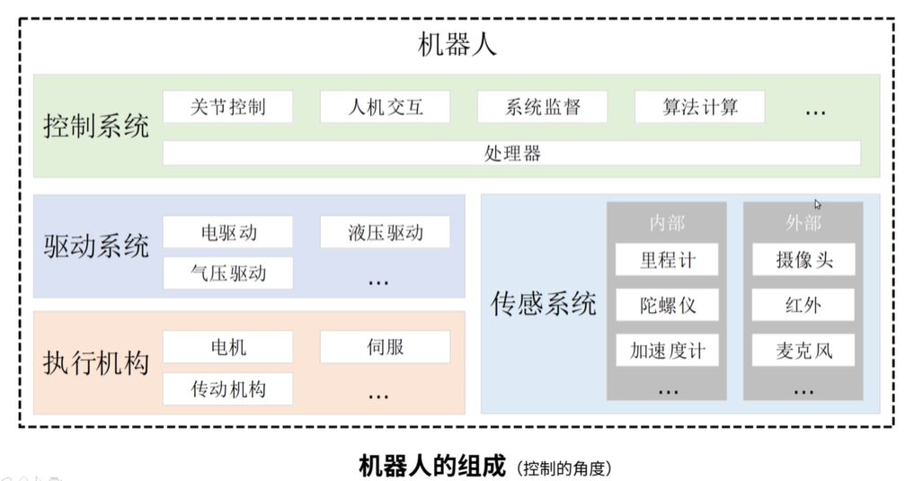
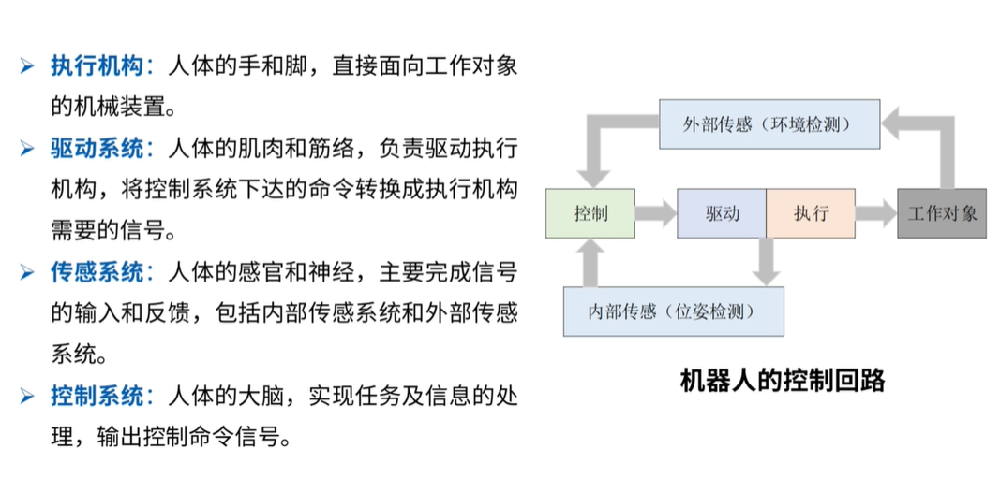
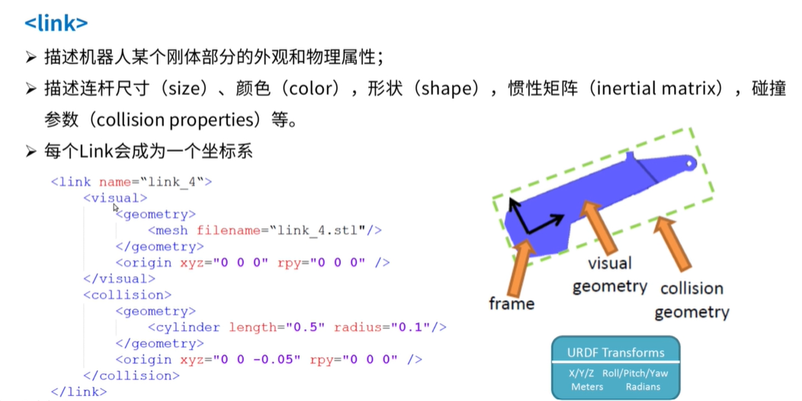
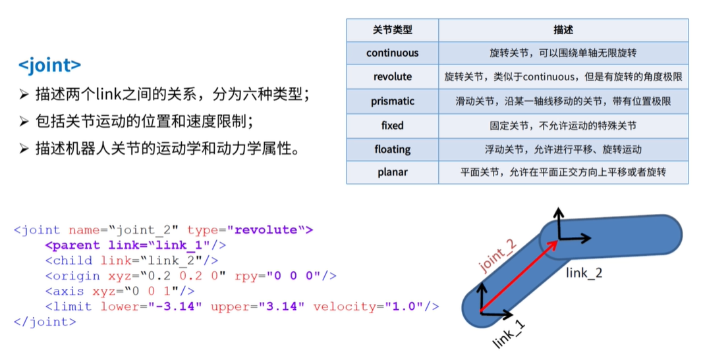

# URDF

[toc]

# Portals

[古月居 一起从零手写URDF模型](https://class.guyuehome.com/detail/p_5e1eea4fe1e5c_Igm126Xn/6)

[古月居 Github 手写URDF](https://github.com/guyuehome/ros_basic_tutorials/tree/dfb8afac81929040ea659a40c03d1d41f2897b5f/handwriting_urdf)


[ROS Wiki urdf](http://wiki.ros.org/urdf)

[ROS Wiki urdf tutorial](http://wiki.ros.org/urdf/Tutorials)

[ROS Wiki xacro](http://wiki.ros.org/xacro)


# XML Specitications

URDF：Unified Robot Description Format，统一机器人描述格式

URDF可以描述机器人本身和环境





## robot

Describes all properties of a robot.

The root element in a robot description file must be a robot, with all other elements must be encapsulated(囊括) within.

完整机器人模型的最顶层标签

link和joint标签都必须包括在其中

### Elements

**link：自身不能动的连杆，想要运动必须使用关节进行连接，关节运动带动**

**joint：连接两个连杆，自身有运动属性**

**joint里的origin，只管各个link的各自坐标系之间的关系**

**link里的origin，只管自己的visual/collision/inertial和自身的坐标系的关系**

transmission

gazebo


### Attribute

name

The master file must have a name attribute. The name attribute is optional in included files. If the attribute name is specified in an additional included file, it must have the same value as in the master file.

## sensor/proposals

Describes a sensor, such as a camera, ray sensor, etc

### 

## link

Describes the kinematic(运动学) and dynamic properties of a link.


```xml
 <link name="my_link">
   <inertial>
     <origin xyz="0 0 0.5" rpy="0 0 0"/>
     <mass value="1"/>
     <inertia ixx="100"  ixy="0"  ixz="0" iyy="100" iyz="0" izz="100" />
   </inertial>

   <visual>
     <origin xyz="0 0 0" rpy="0 0 0" />
     <geometry>
       <box size="1 1 1" />
     </geometry>
     <material name="Cyan">
       <color rgba="0 1.0 1.0 1.0"/>
     </material>
   </visual>

   <collision>
     <origin xyz="0 0 0" rpy="0 0 0"/>
     <geometry>
       <cylinder radius="1" length="0.5"/>
     </geometry>
   </collision>
 </link>
```



visual是必须的,通过mesh标签连接了一个stl文件\<mesh filename="xxx.stl"/>

origin:与坐标变换相关（描述紫色在黑色坐标系的位置关系）
1. xyz：描述林肯相对于当前坐标系的平移变化
2. rpy：roll/pitch/yaw（围绕xyz轴的旋转弧度，单位为弧度）


### Attributes

**name**(required)

The name of the link itself.

### Elements

1. inertial(惯性)
   1. origin
      1. xyz
      2. rpy
   2. mass
   3. inertial
2. visual(视觉)
   1. name
   2. origin
      1. xyz
      2. rpy
   3. geometry
      1. box
      2. cylinder
         1. radius
         2. length
      3. sphere
         1. radius
      4. mesh
   4. material
      1. color
         1. rgba:he color of a material specified by set of four numbers representing red/green/blue/alpha, each in the range of [0,1].
      2. texture
3. collision(碰撞)
   1. name
   2. origin
      1. xyz
      2. rpy
   3. geometry


## transmission

Transmissions link actuators to joints and represents their mechanical coupling

## joint

Describes the kinematic and dynamic properties of a joint.


```xml
 <joint name="my_joint" type="floating">
    <origin xyz="0 0 1" rpy="0 0 3.1416"/>
    <parent link="link1"/>
    <child link="link2"/>

    <calibration rising="0.0"/>
    <dynamics damping="0.0" friction="0.0"/>
    <limit effort="30" velocity="1.0" lower="-2.2" upper="0.7" />
    <safety_controller k_velocity="10" k_position="15" soft_lower_limit="-2.0" soft_upper_limit="0.5" />
 </joint>
```



每一个link产生一个坐标系

joint将各个link的坐标系建立连接，描述坐标系的位置运动关系，同时描述了运动类型

包含名字和类型

每一个joint只能连接两个link，parent和child

origin描述link2相对于link1的运动（两个link的相对关系）

axis描述旋转轴（都是0-1，表示的是权重）

limit表示限位，也可以指定速度的限制

### Attributes

**name**

**type**
1. revolute：   与continuous的运动方式是一样的，但有严格的最大最小值限制。（机械臂）
2. continuous： 绕axis轴旋转，没有最大最小值限制。（轮胎）
3. prismatic:   表示沿着轴运动（滑动）而非旋转，只可以一维运动（直线电机）。
4. fixed：      不能运动。（没有相对运动，螺丝、胶固定）
5. floating：   表示可以任意6自由度运动
6. planar：     表示可以在与轴垂直的平面上运动（二维）。

### Elements

1. origin
   1. xyz(optional: defaults to zero vector)
   2. rpy(optional: defaults 'to zero vector 'if not specified):Represents the rotation around fixed axis: first roll around x, then pitch around y and finally yaw around z. All angles are specified in radians.
2. parent(required)
   1. link:The name of the link that is the parent of this link in the robot tree structure.
3. child(required)
   1. link:The name of the link that is the child link.
4. axis(optional: defaults to (1,0,0))
   1. xyz(required)
5. clalibration(调准、校准)
   1. rising:When the joint moves in a positive direction, this reference position will trigger a rising edge.
   2. falling:When the joint moves in a positive direction, this reference position will trigger a falling edge.
6. dynamics
   1. damping(阻尼)
   2. friction(摩擦力)
7. limit(required only for revolute and prismatic joint)
   1. lower(optional, defaults to 0)
   2. upper(optional, defaults to 0)
   3. effort(required)
   4. velocity(required)
8. mimic(模仿)
   This tag is used to specify that the defined joint mimics another existing joint. The value of this joint can be computed as value = multiplier * other_joint_value + offset. Expected and optional attributes: joint (required)
   1. multiplier
   2. offest
9.  safety_controller
    1.  soft_lower_limit
    2.  soft_upper_limit
    3.  k_position
    4.  k_velocity

## gazebo

Describes simulation properties, such as damping, friction, etc

The gazebo element is an extension to the URDF robot description format, used for simulation purposes in the Gazebo simulator.

## sensor

Describes a sensor, such as a camera, ray sensor, etc


## model_state

Describes the state of a model at a certain time

## model

Describes the kinematic and dynamic properties of a robot structure.

The Unified Robot Description Format (URDF) is an XML specification to describe a robot. We attempt to keep this specification as general as possible, but obviously the specification cannot describe all robots. The main limitation at this point is that only tree structures can be represented, ruling out all parallel robots. Also, the specification assumes the robot consists of rigid links connected by joints; flexible elements are not supported. The specification covers:
1. Kinematic and dynamic description of the robot
2. Visual representation of the robot
3. Collision model of the robot


```xml
<robot name="pr2">
  <link> ... </link>
  <link> ... </link>
  <link> ... </link>

  <joint>  ....  </joint>
  <joint>  ....  </joint>
  <joint>  ....  </joint>
</robot>
```
