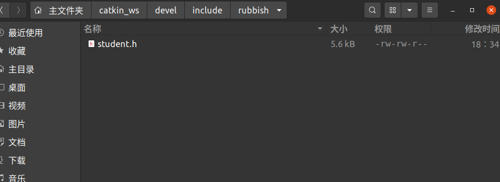
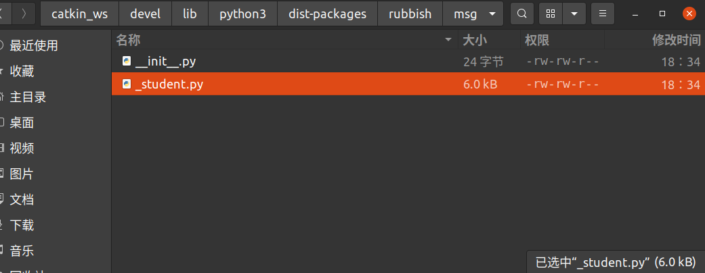

# Message Service

[toc]

## Portals

[冰达机器人 ROS编程入门](https://www.bilibili.com/video/BV1pp4y1t7YA)

[ROS Wiki  Creating a ROS msg and srv](https://wiki.ros.org/ROS/Tutorials/CreatingMsgAndSrv)

[ROS Wiki  Understanding ROS Topics](http://wiki.ros.org/ROS/Tutorials/UnderstandingTopics)

[ROS Wiki  Understanding ROS Services and Parameters](http://wiki.ros.org/ROS/Tutorials/UnderstandingServicesParams)

[ROS Wiki  Writing a Simple Service and Client (Python)](https://wiki.ros.org/ROS/Tutorials/WritingServiceClient%28python%29)


# ROS Wiki

消息和服务文件支持的数据类型：
1. int8, int16, int32, int64 (plus uint*)
2. float32, float64
3. string
4. time, duration
5. other msg files
6. variable-length array[] and fixed-length array[C]

srv与msg类似，需要使用'---'划分request和response

**为了让msg、srv文件转为C++、Python**

1. 在**package.xml**中加入
```
  <build_depend>message_generation</build_depend>
  <exec_depend>message_runtime</exec_depend>
```

==在build时需要message_generation==

==在runtime时需要message_runtime==

2. 在CMakeLists.txt中的find_package添加message_generation依赖

```
find_package(catkin REQUIRED COMPONENTS
   roscpp
   rospy
   std_msgs
   message_generation
)
```

3. 在CMakeLists.txt中的add_message_files/add_service_files添加自己的.msg文件，包含后缀（只要文件名，不用其他路径）

4. 为了保证generate_messages()函数被调用取消generate_messages处的注释

```
generate_messages(
  DEPENDENCIES
  std_msgs
)
```

5. catkin_make


# 冰达机器人 ROS编程入门

## IDE搭建

VScode

安装插件
1. C/C++
2. Python
3. ROS(Microsoft)
4. CMake Tools(Microsoft)


## 创建功能包

一定要在 ==~/catkin_ws/src== 下创建
catkin_create_pkg [pkg_name] [dependencies(optional)]

产生 CMakeLists.txt & package.xml
在 ==~/catkin_ws== 下进行catkin_make

## 发布订阅

publisher && subscriber

### Python

[ROS Wiki --- Simple Publisher and Subscriber](https://wiki.ros.org/ROS/Tutorials/WritingPublisherSubscriber%28python%29)

脚本说明：解释器&编码
```python
#!/usr/bin/python3 
# -*- coding: utf-8 -*-
```
解释器查看方式
在命令行开启python/python3
```python
import sys
sys.executable
```

#### 发布

node是执行单元，完成具体功能


```python
import rospy
from std_msgs.msg import String

def talker():
    pub = rospy.Publisher('chatter', String, queue_size=10)
    # 创建发布器
    # 'chatter'是要发布到的话题
    # Sting是message的类型
    # queue_size是消息队列长度
    rospy.init_node('talker', anonymous=True)
    # 'talker'是节点名称，用于和ROS Master交流，名称中不能包括斜线/
    # anonymous=True，会在节点名称后面添加一个随机数，放置重名。anonymous在这里的含义一共是没有特色的，所有对于没有特色的就添加一个随即数防止重复
    rate = rospy.Rate(10) # 10hz
    # 创建一个Rate对象rate，通过后续rate.sleep(num)方便设置循环频率
    while not rospy.is_shutdown():
    # 检查rospy.is_shutdown()标志，判断程序有无退出
        hello_str = "hello world %s" % rospy.get_time()
        rospy.loginfo(hello_str)
        # 三个作用：将消息打印到屏幕上、写入节点的日志文件、写入rosout
        pub.publish(hello_str)
        rate.sleep()

if __name__ == '__main__':
    try:
        talker()
    except rospy.ROSInterruptException:
    # 当Ctrl+C被按下或者程序关闭，会被rospy.sleep(),rospy.Rate.sleep()抛出
        pass
```

需要加上可执行权限，可以使用chmod +111 xxx.py，也可以右键修改文件权限

rosnode list

rosrun [pkg_name] xxx.py

rostopic echo /[topic_name]

#### 订阅

```python
import rospy
from std_msgs.msg import String

def callback(data):
    rospy.loginfo(rospy.get_caller_id() + "I heard %s", data.data)
    # data是message类型，成员变量为data
    
def listener():
    rospy.init_node('listener', anonymous=True)
    # In ROS, nodes are uniquely named. If two nodes with the same name are launched, the previous one is kicked off.
    # The anonymous=True flag means that rospy will choose a unique name for our 'listener' node so that multiple listeners can run simultaneously.
    rospy.Subscriber("chatter", String, callback)
    # 声明节点订阅chatter话题
    # 当接收到消息，callback会被调用，message是他的第一个参数

    
    rospy.spin()
    # spin() simply keeps python from exiting until this node is stopped
    # 让节点在被关闭前不退退出。rospy.spin() 不会影响订阅者回调函数，因为它们有自己的线程。

if __name__ == '__main__':
    listener()
```

### C++


## 自定义消息

创建msg文件夹以及msg文件

**类似于C/C++结构体**

```
string first_name
string last_name
uint8 age
uint32 score
```

需要让ros的编译系统识别消息文件，并生成相关头文件，方便节点调用

**修改CMakeLists.txt文件**

1. 需要依赖==message_generation==功能包，在**find_package**中添加

```
find_package(catkin REQUIRED
    std_msgs
    message_generation
)
```

2. 同时在**add_message_files**中添加.msg文件

```
add_message_files(
  FILES
  student.msg
)
```

3. 开启（取消注释）**generate_messages**

4. **catkin_package** 中添加 **CATKIN_DEPENDS message_runtime**

```
catkin_package(
#  INCLUDE_DIRS include
#  LIBRARIES rubbish
#  CATKIN_DEPENDS other_catkin_pkg
 CATKIN_DEPENDS message_runtime
#  DEPENDS system_lib
)
```

**修改package.xml**

加入两个依赖
1. <build_depend>message_runtime</build_depend>
2. <build_export_depend>message_runtime</build_export_depend>

roswiki上写的是（经测试也可以使用）：
1. <build_depend>message_generation</build_depend>
2. <exec_depend>message_runtime</exec_depend>

**catkin_make**

在catkin_w文件夹中

可以只编译指定包

```
catkin_make -DCATKIN_WHITELIST_PACKAGES=[package_name]
```

编译后可以查看自动生成的c++头文件和python文件





**均在catkin_ws的devel文件夹下**

使用如下命令查看消息信息
```
rosmsg show [package_name]/[msg_file_name(without.msg)] 
```

在命令行订阅topic的消息
```
rostopic list
rostopic echo /[topic_name]
```

### Python

student.msg

```
string first_name
string last_name
uint8 age
uint32 score
```

记得添加可执行文件权限（chmod 777）

msg_pub.py
```python
#!/usr/bin/python3

import rospy
from std_msgs.msg import String
from rubbish.msg import student

def msg_pub():
    rospy.init_node("msg_pub",anonymous=False)
    pub = rospy.Publisher("studentInfo",student,queue_size=10)
    rate = rospy.Rate(10)

    while not rospy.is_shutdown():
        Student = student('liu','zhiyu',8,100)
        rospy.loginfo('pub a student')
        pub.publish(Student)
        rate.sleep()

if __name__ == "__main__":
    try:
        msg_pub()
    except rospy.ROSInterruptException:
        pass

```

msg_sub.py
```python
#!/usr/bin/python3

import rospy
from std_msgs.msg import String
from rubbish.msg import student


def callback(data):
    rospy.loginfo(data.score)

def msg_sub():
    rospy.init_node('msg_sub',anonymous=False)
    msg_sub = rospy.Subscriber('studentInfo',data_class=student,callback=callback)
    rospy.spin()

if __name__ == "__main__":
    msg_sub()
```

### C++


## 自定义服务

client server

创建srv文件夹，并编写srv文件，注意需要添加分割线（---）

```
int64 a
int64 b
---
int64 sum
```

**修改CMakeLists.txt文件**

在**add_service_files**中添加srv文件

```
add_service_files(
  FILES
  AddTwoInts.srv
#   Service1.srv
#   Service2.srv
)
```

**在命令行使用如下命令进行srv的查看**
```
rossrv show rubbish/AddTwoInts

rosservice list --- 列出当前运行的服务

rossrv list --- 列出所有服务
```

**也可以在命令行向服务进行请求**


### Python

#### 服务器

```python
#!/usr/bin/python3
# -*- coding: utf-8 -*-

import rospy
from rubbish.srv import AddTwoInts,AddTwoIntsResponse

def handle_add_two_ints(req):
    print("%s + %s = %s"%(req.a,req.b,(req.a+req.b)))
    return AddTwoIntsResponse(req.a+req.b)

def add_two_ints_server():
    rospy.init_node('add_wto_ints_server',anonymous=False)
    # 声明服务
    # 函数参数分别是：服务名称、服务类型、服务handler
    # 所有请求都会被传递给handler
    # handler会被AddTwoIntsRequest实例调用，并返回AddTwoIntsResponse实例
    s = rospy.Service('add_two_ints',service_class=AddTwoInts,handler=handle_add_two_ints)
    
    print("ready to add")
    rospy.spin()

if __name__ == "__main__":
    add_two_ints_server()
```


#### 客户端

```python
#!/usr/bin/python3
# -*- coding: utf-8 -*-

import sys
import rospy
from rubbish.srv import AddTwoInts,AddTwoIntsRequest
# response用于返回值

def add_two_ints_client(x,y):
    # 阻塞直到service可用
    rospy.wait_for_service('add_two_ints')
    try:
        # 创建调用服务的handler，可以想使用函数一样使用handler
        add_two_ints = rospy.ServiceProxy('add_two_ints',AddTwoInts)
        res = add_two_ints(x,y)
        return res.sum  # sum是srv文件中定义的名称
    # 可能会抛出ServiceException异常
    except rospy.ServiceException:
        print('service call fail')


if __name__ == "__main__":
    if len(sys.argv)==3:
        x=int(sys.argv[1])
        y=int(sys.argv[2])
    else:
        sys.exit()
    
    print("requseting:")
    print(add_two_ints_client(x,y))
```

然后将以下内容添加到CMakeLists.txt文件。这样可以确保正确安装Python脚本，并使用合适的Python解释器。

```
catkin_install_python(PROGRAMS scripts/add_two_ints_server.py scripts/add_two_ints_client.py
  DESTINATION ${CATKIN_PACKAGE_BIN_DESTINATION}
)
```


### C++


## TF坐标变换

