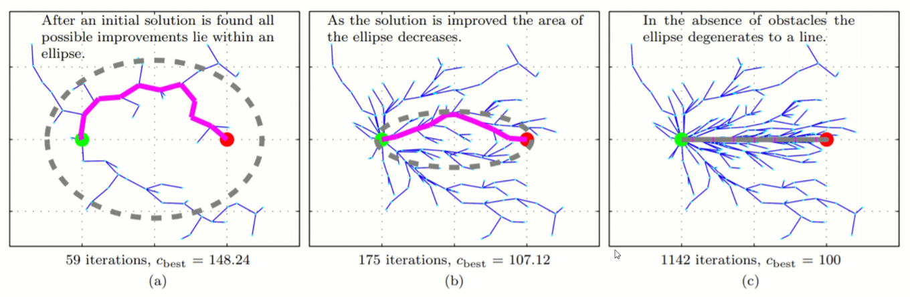

# 机器人轨迹规划

## Portals

[艾若机器人 轨迹规划](https://www.bilibili.com/video/BV1yT4y1T7Eb)

[奇乐编程学院 A*寻路算法详解](https://www.bilibili.com/video/BV1bv411y79P)

[RedBlobGames Introduction to the A* Algorithm](https://www.redblobgames.com/pathfinding/a-star/introduction.html)

# 艾若机器人 轨迹规划

## 01 轨迹规划导论

轨迹规划：路径规划+轨迹优化(直线转为平滑曲线)

**构型空间 Configuration Space**
1. 膨胀障碍物（使得机器人无法通行）个人感觉膨胀1/2即可
2. 将机器人视为质点

缺点是图的节点过多，遍历很低效，简化为节点更少的路标形式

自上而下分层方式存储地图

## 02 Dijkstra

可以这样去想，每次收录距离初始点s的最近的节点p，因为通过其他open list节点q再到p的路径长度显然会更大（初始点到q的距离已经大于到p）。

## 03 A*

Dijkstra收录的冗余节点过多，所有比最终路径短的节点都进行了遍历。

使用A*，添加启发式函数，减少冗余部分

代价分为两个部分
1. 当前代价（起点走到当前点的代价）
2. 预估代价（当前点走到终点的代价）

代码框架类似

加入启发式函数后，需要添加条件才能保证最优路径，条件如下。

其实很好理解，即使一条较远的路的预估代价被认为较小，被选择。随着过程的进行，其总代价一定会超过之前忽略的近路当时的总代价。还是会回头走近路，只是效率没有那么高而已。

## 04 RRT

RRT算法--快速扩展随机数算法--(Rapidly Exploring Random Tree)

算法步骤：
1. 空间中随机采样出一个点Xrand，然后寻找距离采样点最近的节点(一开始只有起点Xnear)。
2. 将采样点及其最近点进行连接，作为树生长的方向，设置一个步长作为树枝的长度，产生新节点Xnew，将这个节点添加进节点集合(不是添加采样点)。
3. 如果连不上就抛弃当前采样点，重新采样。每次加入新点后尝试用其与终点连线，如果能够成功连接则结束树的生长，否则继续采样。

小技巧：以一定概率选择终点作为采样点，可以更快收敛。

未必最优，无需进行栅格化

速度较快，但路径较为糟糕

## 05 RRT*

动机：改善路径的质量

在选出新节点后，在一定范围内重新选择其父节点。

重新选择前：

重新选择后：

其他说明：

Xnew是重新连接后的最好情况。对x1、x2尝试重新连接，找到更优路径并进行更新。

走到终点后仍继续迭代，最后可以找到渐进最优的算法。

## 06 Informed RRT*

动机：增加渐近最优的速度

走到终点（找到路径）后，限制采样范围。

使用椭圆范围。

Cbest是当前最优路径总长度，Cmin是起点终点连线长度。长轴短轴如图所示。

在图中显然需要一个旋转矩阵（个人认为不妨使用李群李代数进行计算）。

或者可以先在单位圆中采样再进行放缩操作。

最优路径更新后，椭圆也会跟着更新。

## 07 遗传算法

种群初始化：选择、交叉、变异。

对栅格地图进行编码。

## 08 蚁群算法

## 09 路径规划算法总结

## 10 多项式曲线

## 11 贝塞尔曲线

## 12 最小化snap

## 13 轨迹长度

## 14 软约束

## 15 硬约束

