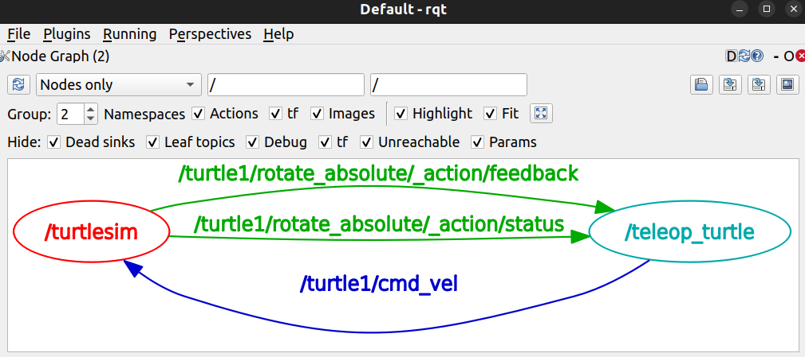
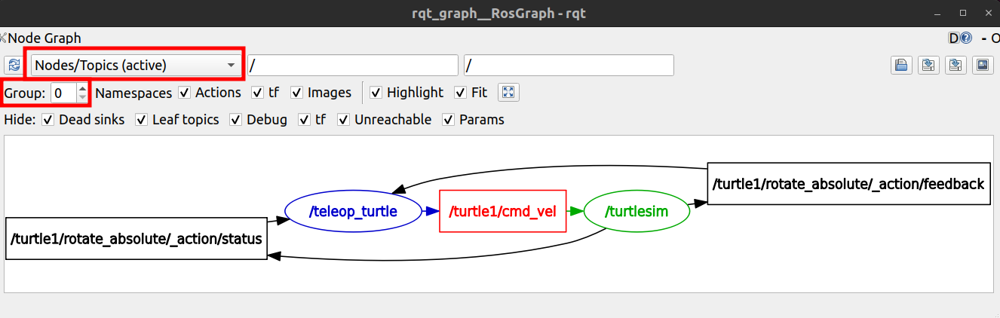
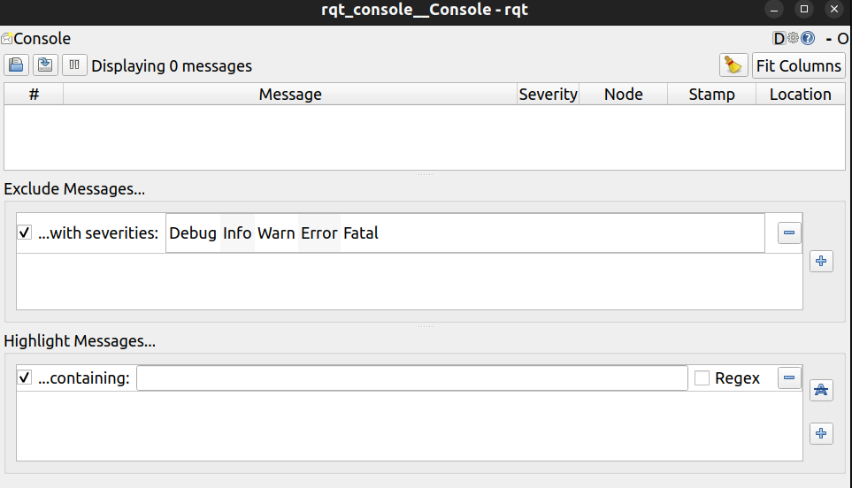

# ROS2 Official Tutorial

[ROS 2 Documentation: Humble](https://docs.ros.org/en/humble/)

[GundaSmart ROS2 Tutorial - BiliBili](https://space.bilibili.com/687639149/lists/1972553)


---

## Table of Contents

[toc]

---

# Installation

[ROS 2 Documentation - Ubuntu (deb packages)](https://docs.ros.org/en/humble/Installation/Ubuntu-Install-Debs.html)

测试可视化工具

```bash
rqt  # plugins -> introspection -> node graph
rqt_graph

rviz2
```


P.S.
1. vscode C++ Configuration
   1. `Ctrl+Shift+P`
   2. `C/C++: Edit Configurations (JSON)`
   3. `c_cpp_properties.json` -  `"includePath"` - `"/opt/ros/humble/include/**"`
2. vscode Python Configuration
   1. `Ctrl+Shift+P`
   2. `Preferences: Open Workspace Settings (JSON)`
   3. ``

---

# Tutorial

[ROS 2 Documentation - Tutorials](https://docs.ros.org/en/humble/Tutorials.html)

---

## Beginner: CLI Tools

[Beginner: CLI Tools](https://docs.ros.org/en/humble/Tutorials/Beginner-CLI-Tools.html)

---

### Configuring Environment

**Configuring Environment**
1. **==☆==** `source /opt/ros/humble/setup.bash` - Source the setup files 设置 ROS 2 环境的命令
    1. 加载 ROS 2 的相关环境变量，配置终端，使其能够正确使用 ROS 2 的功能和工具
    2. 找到其安装目录、功能包packages、库
2. **==☆==**`echo "source /opt/ros/humble/setup.bash" >> ~/.bashrc` - Add sourcing to your shell startup script
3. **==☆==**`printenv | grep -i ROS` - 显示当前环境变量及其值的命令，Check environment variables
4. `ROS_DOMAIN_ID` variable - 设置不同的 Domain ID，可以将网络中的 ROS 2 节点划分为不同的逻辑组，每个组之间互相隔离
5. `ROS_LOCALHOST_ONLY` variable - 设置为 1 时，ROS 2 的通信被限制在本地机器（localhost），不会与其他计算机通信

---

### TurtleSim

**TurtleSim**
1. install `sudo apt install ros-humble-turtlesim`
   1. check installation `ros2 pkg executables turtlesim`
2. `ros2 run turtlesim turtlesim_node` - start turtlesim
3. `ros2 run turtlesim turtle_teleop_key` - control the turtle
   1. Use arrow keys to move the turtle. Use **G|B|V|C|D|E|R|T** keys to rotate to absolute orientations. 'F' to cancel a rotation. 'Q' to quit
   2. 
4. `ros2 node/topic/service/action list`
5. Remapping : reassign default node properties, like node name, topic names, service names, etc., to custom values
   1. `--ros-args` ROS 2 的参数标志，用于传递节点的动态参数或重映射规则
   2. 如果使用 service caller 的 /spawn 功能 创建另一个龟，并希望操控，`ros2 run turtlesim turtle_teleop_key --ros-args --remap turtle1/cmd_vel:=turtle2/cmd_vel`
      1. 默认情况下，turtle_teleop_key 只发布到 turtle1/cmd_vel，用于控制 turtle1
      2. 如果需要控制 turtle2，必须通过 话题重映射 将控制信号发送到 turtle2/cmd_vel
   3. `ros2 run turtlesim turtlesim_node --ros-args --remap __node:=my_turtle` 将默认的节点名称更改为 my_turtle (两个窗口都会接收同一个 teleop 的 控制)
      1. `__node` 是 ROS 2 的特殊关键字，用于指定节点的名称
   4. eg :
      1. `ros2 run turtlesim turtlesim_node`
      2. `ros2 run turtlesim turtle_teleop_key`
      3. `ros2 run turtlesim turtlesim_node --ros-args --remap __node:=my_turtle --remap turtle1/cmd_vel:=my_turtle/cmd_vel`
         1. 节点名称重命名 - turtlesim_node 改名为 my_turtle
         2. 主题重映射 - 将默认的**订阅**主题 turtle1/cmd_vel 改为 my_turtle/cmd_vel
      4. `ros2 run turtlesim turtle_teleop_key --ros-args --remap turtle1/cmd_vel:=my_turtle/cmd_vel --remap __node:=teleop_my_turtle`
         1. 节点名称重命名 - turtle_teleop_key 改名为 teleop_my_turtle
         2. 主题重映射 - 将默认的**发布**主题 turtle1/cmd_vel 改为 my_turtle/cmd_vel


---

### rqt

**rqt**
1. install `sudo apt install '~nros-humble-rqt*'`
2. run `rqt`
3. Plugins > Introspection > **Node Graph**
   1. 
4. Plugins > Services > **Service Caller**
   1. 通过可视化界面交互
5. Plugins > Topics > **Topic Monitor**
6. 调整
   1. 
   2. 展示内容 `Nodes only`, `Nodes/Topics (active)`, `Nodes/Topics (all)`
   3. Group

---

### ==☆== core ROS 2 concepts & ROS 2 graph


---

### Node

**Node**
1. Each node in ROS should be responsible for a single, modular purpose
2. Each node can send and receive data from other nodes via
   1. topic (Publisher / Subscriber)
   2. service (Client(Request) / Server(Response))
   3. action
   4. parameter
3. a single **executable** (C++ program, Python program, etc.) can contain one or more nodes
4. `ros2 run <package_name> <executable_name>` - launches an executable from a package
5. `ros2 node list` - show you the names of all running nodes
6. `ros2 node info <node_name>` - show information(a list of subscribers, publishers, services, actions)

---

### Topic

**Topic**
1. A node may **publish data to any number of topics** and simultaneously have **subscriptions to any number of topics**
   1. 
   2. 
   3. Nodes send data over topics using **messages**. Publishers and subscribers must send and receive the **same type of message** to communicate
2. `ros2 topic list` - return a list of all the topics currently active
   1. `ros2 topic list -t` - with the **topic type** appended in brackets
3. `ros2 topic echo <topic_name>` - 持续跟踪topic
4. `ros2 topic info <topic_name>` - 返回 Type, Publisher count, Subscription count
   1. `ros2 topic echo <topic_name>` 也会增加 Subscription count
5. **==☆==** `ros2 interface show <msg_type>` - what structure of data the message expects
   1. 从 `ros2 topic list -t` 中中括号获取，数据格式对应 `ros2 topic echo <topic_name>`
6. `ros2 topic pub <topic_name> <msg_type> '<args>'` - publish data to a topic directly from the command line (默认行为是以固定频率持续发布消息，而不是仅发布一次)
   1. `'<args>'` argument is the actual data you’ll pass to the topic
   2. argument needs to be input in **YAML syntax**
   3. eg : `ros2 topic pub /turtle1/cmd_vel geometry_msgs/msg/Twist "{linear: {x: 2.0, y: 0.0, z: 0.0}, angular: {x: 0.0, y: 0.0, z: 1.8}}"`
      1. With no command-line options, ros2 topic pub publishes the command in a steady stream at 1 Hz
      2. publish your command just once add the `--once` / `-1` option : `ros2 topic pub --once -w 2 /turtle1/cmd_vel geometry_msgs/msg/Twist "{linear: {x: 2.0, y: 0.0, z: 0.0}, angular: {x: 0.0, y: 0.0, z: 1.8}}"`
         1. `-w 2` is an **optional** argument meaning "wait for two matching subscriptions"
   4. 在 rqt 中 需要 **取消 Hide : Debug** 才能看到对应的 command line node
   5. **Timestamps** : pub has two methods to automatically fill them out with the **current time**
      1. Timestamps 非常重要 : 同步多种传感器数据，协调机器人动作，重放消息数据(仿真或调试)
      2. For messages with a `std_msgs/msg/Header`, the `header` field can be set to `auto` to fill out the `stamp` field
         1. `ros2 interface show std_msgs/msg/Header` - 查看数据结构
         2. `ros2 topic pub /pose geometry_msgs/msg/PoseStamped '{header: "auto", pose: {position: {x: 1.0, y: 2.0, z: 3.0}}}'`
      3. For message does not use a full header, but just has a field with type `builtin_interfaces/msg/Time`, that can be set to the value `now`
         1. `ros2 interface show builtin_interfaces/msg/Time` - 查看数据结构
         2. `ros2 topic pub /reference sensor_msgs/msg/TimeReference '{header: "auto", time_ref: "now", source: "dumy"}'`
7. `ros2 topic hz <topic_name>` - return data on the rate at which the node is publishing data to the topic
8. `ros2 topic bw <topic_name>` - return the bandwidth utilization and number of messages being published to the topic

---

### Service

**Service**
1. Services are based on a **call-and-response** model versus the **publisher-subscriber** model of topics
   1. **==☆==** 对于一个service，可以有多个 client 但是只能有一个 server
   2. 
   3. 
2. `ros2 service list` - return all the services **currently active in the system**
   1. Nearly every node in ROS 2 has these infrastructure services that parameters are built off of
      1. `/<node_name>/describe_parameters`
      2. `/<node_name>/get_parameter_types`
      3. `/<node_name>/get_parameters`
      4. `/<node_name>/list_parameters`
      5. `/<node_name>/set_parameters`
      6. `/<node_name>/set_parameters_atomically`
   2. `ros2 service list -t` - see the types of all the active services
3. `ros2 service type <service_name>` - find out the type of a service
   1. `std_srvs/srv/Empty` - means the service call sends no data when making a request and receives no data when receiving a response
4. `ros2 service find <type_name>` - find all the services of **a specific type**
5. **==☆==** `ros2 interface show <type_name>` - know the structure of the input arguments
   1. `---` separates
      1. the **request** structure (above)
      2. the **response** structure (below)
6. `ros2 service call <service_name> <service_type> <arguments>`
   1. Input `<arguments>` in a service call from the command-line need to be in **YAML syntax**
   2. eg : `ros2 service call /spawn turtlesim/srv/Spawn "{x: 2, y: 2, theta: 0.2, name: ''}"`, 会获得 response

---

### Parameter

**Parameter**
1. parameter is a configuration value of a node (node settings)
2. node can store parameters as **integers, floats, booleans, strings, lists**, each node maintains its own parameters
3. `ros2 param list` - see the parameters & node namespaces
   1. Every node has the parameter `use_sim_time`
4. `ros2 param get <node_name> <parameter_name>` - display the type and current value of a parameter
5. `ros2 param set <node_name> <parameter_name> <value>` - change a parameter’s value at runtime
   1. Setting parameters with the `set` command will only change them in your current session
6. `ros2 param dump <node_name>` - view all of a node’s current parameter values
   1. eg : `ros2 param dump <node_name> > <parameter_file>.yaml` - save your current configuration parameters into the file
7. `ros2 param load <node_name> <parameter_file>.yaml` - load parameters from a file to a currently running node
8. `ros2 run <package_name> <executable_name> --ros-args --params-file <file_name>` - start the same node using your saved parameter values(Load parameter file on node startup)

---

### Action

**Action**
1. Actions are one of the **communication types** in ROS 2 and are **intended for long running tasks** (built on topics and services)
   1. consist of 3 parts: `goal`, `feedback`, `result`
   2. 
   3. Actions use a **client-server** model
      1. Server : 提供具体的任务执行服务，接收来自客户端的 `Goal`，根据任务进度提供 `Feedback`，并在完成后返回 `Result`
      2. Client : 向 Server 发送 `Goal`，并监听 `Feedback` 和 `Result`
   4. functionality is similar to services, except **actions can be canceled**
   5. provide **steady feedback**, as opposed to services which return a single response
   6. An **action client node** sends a goal to an **action server node** that acknowledges the goal and **returns a stream of feedback and a result**
   7. eg : `turtle_teleop_key`
      1. 使用 `G|B|V|C|D|E|R|T` rotate the turtle’s orientation
      2. 使用 `F` cancel a goal mid-execution
      3. client-side (your input in the teleop) & server-side (the /turtlesim node) 都可以 stop a goal, server 可以 chose to **abort the first goal** / **reject the new goal** / **execute the second goal after the first one finished**
2. `ros2 node info <node_name>` - show information(a list of subscribers, publishers, services, **actions**(servers & clients))
   ```bash
      ros2 node info /turtlesim
      # Action Servers:
      #    /turtle1/rotate_absolute: turtlesim/action/RotateAbsolute
      # Action Clients:
      #

      ros2 node info /teleop_turtle
      # Action Servers:
      #
      # Action Clients:
      #    /turtle1/rotate_absolute: turtlesim/action/RotateAbsolute
   ```
3. `ros2 action list` - identify all the actions in the ROS graph
   1. `ros2 action list -t` - find the action type
4. `ros2 action info <action_name>`
5. `ros2 interface show <type_name>` - 2 个 `---` 分割 3 part，分别是 structure of `goal request` / `result` / `feedback`
6. `ros2 action send_goal <action_name> <action_type> <values>` - send an action goal from the command line
   1. `<values>` need to be in **YAML format**
   2. All goals have a unique ID, shown in the return message
   3. `--feedback` - see the feedback of this goal
   4. eg : `ros2 action send_goal /turtle1/rotate_absolute turtlesim/action/RotateAbsolute "{theta: -1.57}" --feedback`
      1. `delta` is the displacement to the starting position

---

### ==☆== Service & Topic & Action 区别

**Service & Topic & Action 区别**

| 特性       | **Actions**         | **Topics**               | **Services**           |
|-----------|---------------------|--------------------------|------------------------|
| 主要用途    | 长时间运行的任务      | 持续的数据流               | 短时间的请求与响应        |
| 实时反馈    | 支持                | 不适用                    | 不支持                  |
| 支持取消    | 支持                | 不适用                    | 不支持                  |
| 通信模型    | Client-Server 双向  | Publisher-Subscriber 单向 | Call-Response 双向 单次 |
| 基于       | Topics 和 Services  | 纯 Topics                 | 纯 Services            |

交互命令
1. topics   : `ros2 topic pub <topic_name> <msg_type> '<args>'`
1. services : `ros2 service call <service_name> <service_type> <arguments>`
2. actions  : `ros2 action send_goal <action_name> <action_type> <values>`


---


### rqt_console

**rqt_console**
1. GUI tool used to introspect log messages
2. `ros2 run rqt_console rqt_console`
3. 
4. 功能描述
   1. first  section : display log messages from system
   2. middle section : filter/exclude messages strategies
   3. bottom section : highlighting messages strategies
5. Logger Levels - **==☆==** only see messages of the **default severity level and more-severe levels**
   1. `Fatal`
   2. `Error`
   3. `Warn`
   4. `Info`(default)
   5. `Debug`
6. `ros2 run <pkg> <node> --ros-args --log-level <LEVEL>` - Set the default logger level (需要大写)

---

### Launching Nodes

**Launching Nodes**
1. start up and configure a number of executables containing ROS 2 nodes simultaneously
2. can use **Python / XML / YAML** to create launch files : [UsePython, XML, YAML for ROS 2 Launch Files](https://docs.ros.org/en/humble/How-To-Guides/Launch-file-different-formats.html)
3. TurtleSim Example
   1. `ros2 launch turtlesim multisim.launch.py`
   2. file path : `/opt/ros/humble/share/turtlesim/launch/multisim.launch.py`

---

### Bag

**Recording & Playing Back Data**
1. `ros2 bag` - only record data from topics 的 messages
   1. a command line tool for recording data published on **topics** in your system
   2. accumulates the data passed on any number of **topics** and saves it in a database
   3. replay the data to reproduce the results of your tests and experiments
2. `ros2 bag record` - 需要先有 topic 再 record (否则 rqt 图 链接不上)
   1. **single topic**
      1. `ros2 bag record <topic_name>`
      2. **==☆==** 运行前，需要先 cd 到 创建的 文件夹
      3. the rosbag file will save in the directory where you run it
      4. 可以 在 `rqt` 中看到 `recorder`
   2. **multiple topics**
      1. `ros2 bag record <topic_name_1> <topic_name_2>` - simply list each topic separated by a space
   3. `rosbag2_year_month_day-hour_minute_second` - bag directory name pattern
      1. directory will contain a `metadata.yaml` along with the bag file in the recorded format
   4. `-o` - allows you to choose a unique name for your bag folder/directory
   5. `-a` - records all the topics on your system
3. `ros2 bag info <bag_folder_name>` - see details about your recording
   1. 可以看到 `size`/`topic information(Topic, Type, Count, Serialization Format)` 等信息
4. `ros2 bag play <bag_folder_name>`
   1. 可以 在 `rqt` 中看到 `player`
   2. 使用 `space` 可以 pause/resume
   3. play 完毕后 任务自动 quit


---

## Beginner: Client Libraries

[Beginner: Client Libraries](https://docs.ros.org/en/humble/Tutorials/Beginner-Client-Libraries.html)

---

### Using `colcon` to Build Packages

`colcon` is an iteration on the ROS build tools `catkin_make`, `catkin_make_isolated`, `catkin_tools` and `ament_tools`

[A universal build tool(colcon) - ROS2 Design Document](https://design.ros2.org/articles/build_tool.html) - TODO

```bash
sudo apt install python3-colcon-common-extensions
```

Basics
1. A ROS workspace is a directory with a particular structure
2. colcon 源文件之外构建 out-of-source builds
   1. 构建过程中，所有中间文件和目标文件(例如编译生成的二进制文件)不会存放在源代码目录中
   2. 保持源代码目录干净，不会被中间文件污染；便于多次构建时清理中间文件
3. 目录结构
   1. `/src`      源码 - source code of ROS packages
   2. `/build`    构建 - store intermediate files，每个 package 创建一个独立的 subdirectory & invoke CMake
   3. `/install`  安装 - each package will be installed to，默认 每个 package 安装到单独的 subdirectory，并且还有 **==☆==**`setup.bash` files
   4. `log`       日志 - contains various logging information about each colcon invocation(调用)
   5. **Compared to `catkin` there is no `devel` directory**


Create a Workspace & Add Sources
1. **==☆== best practice**
   1. create a new directory for every **new workspace**
   2. put any packages in your workspace into the `/src` directory

```bash
   # create a directory (ros2_ws) to contain our workspace
mkdir -p ~/ros2_ws/src
cd ~/ros2_ws/src
   # clone the examples repository into the src directory of the workspace
git clone https://github.com/ros/ros_tutorials.git -b humble  # -b = branch

tree -L 2
   # .
   # └── ros_tutorials
   #     ├── roscpp_tutorials
   #     ├── rospy_tutorials
   #     ├── ros_tutorials
   #     └── turtlesim
   # 5 directories, 0 files
```

Underlay(下层环境)
1. 指已经安装好的 ROS 2 环境，作为 当前工作空间的 基础
2. 提供 工作空间中软件包 所需依赖，比如 库文件、工具链、软件包 等
3. 运行 ROS 2 安装目录中的 `/opt/ros/humble/setup.bash`，将 环境的配置信息 加载到当前的shell会话中
   1. 源码安装的 ROS 2，实际上也是一个 colcon workspace (ROS 2 的源码安装依赖于 colcon 来管理和构建多个软件包)
   2. 通过 colcon build 构建了一个ROS 2 源码工作区，该工作区的install目录下就会生成 **setup.bash**，可以加载它来配置环境
4. 加载 underlay，构建工具(如 colcon) 才能找到这些依赖
5. 当你需要频繁修改和调试少量的软件包时，推荐使用 **overlay(叠加环境)** 方式，而不是把所有的软件包放在一个 工作区(workspace) 中
   1. `ros2_ws`, will be an **overlay** on top of **the existing ROS 2 installation**
   2. 避免重复构建不变的软件包，提高构建效率
   3. 模块化开发，减少开发时的依赖管理复杂度


colcon = collective construction

[colcon - Documentation](https://colcon.readthedocs.io/en/released/)


**Build & Test**
1. **resolve package dependencies** first
   1. install & initialize rosdep
      ```bash
      sudo apt install -y python3-rosdep
         # ERROR: your rosdep installation has not been initialized yet.  Please run: (可能需要做以下步骤)
      sudo rosdep init
      rosdep update
      ```
   2. `rosdep install -i --from-path src --rosdistro humble -y` - 自动安装 ROS 包的依赖项(根据工作空间中的 ROS 包所声明的依赖项，通过系统包管理器(如 apt、yum) 或 其他方式自动安装这些依赖)，先 `cd ..`
      1. 如果 already have all your dependencies，输出 `#All required rosdeps installed successfully`
      2. `-i` - 忽略已安装的依赖项
      3. `--from-path src` - 指定依赖的来源路径，rosdep 会在该目录下查找所有包，并解析每个包的 `package.xml` 文件中声明的依赖项(`<depend>`标签)
      4. `-y` - 自动确认安装，略用户手动输入 yes
2. `colcon build` in the root of the workspace (eg : `ros2_ws`)
   1. `--symlink-install` - 通过 **符号链接 symlink** 实现 安装
      1. 构建工具不会复制源文件到安装目录，而是创建一个指向源文件的链接
      2. 实现了类似于 `devel space` 的功能 (ROS 1 构建工具 `catkin_make` 和 `catkin_tools` 中引入的一个概念，是指 构建完成后，**生成的可直接使用的 中间文件 和 符号链接 存放的目录**，无需将其 完全安装到 系统路径 或 安装目录)
      3. 文件符号链接支持源码直接修改，即时生效，faster iteration
   2. `--packages-up-to <pkg_name>` - 仅构建指定的软件包**及其递归依赖项**，而不是整个工作空间(省时)
   3. `--packages-select` - 仅构建指定的包及其明确依赖的包(不会构建其依赖的包)
   4. `--event-handlers console_direct+` - 在构建过程直接显示在控制台(日志信息)，默认 构建日志 保存在工作空间的日志目录 `/log` 中
   5. `--executor sequential` - 按顺序逐个处理包，而不是并行处理
   6. 排除特定包的构建(不会将其索引到构建过程中) - 在该包的目录下放置一个名为 `COLCON_IGNORE` 的空文件
3. 结果 : 弹窗 `colcon build successful`
   ```bash
   tree -L 1
      # .
      # ├── build
      # ├── install
      # ├── log
      # └── src
      # 4 directories, 0 files
   ```
4. `colcon test` - run tests for the packages we just built

Sourcing an overlay in the same terminal where you built, or likewise building where an overlay is sourced, may create complex issues


**Source the Environment**
1. when colcon has completed building successfully, the **output** & `setup.bash` will be in `/install`
   1. need to **add them to your path and library paths**, before use any of the installed executables or libraries
   2. colcon generate **bash/bat** files in `/install` to help set up the environment
   3. files will add all of the required elements to **path and library paths** & provide any bash or shell commands exported by packages
2. 两种 source 方式 (等价)
   1. **==☆==** 重要提示 - 必须使用 **新终端** 来 source(加载) overlay 或 构建工作区，避免在同一终端中 source overlay 和 构建操作，防止环境变量冲突或其他复杂问题
   2. `source /opt/ros/humble/setup.bash` + `source install/local_setup.bash`
      1. source your main ROS 2 environment as the **underlay**, so you can build the **overlay** on top of it
      2. `local_setup` only add the packages available in the overlay to your environment
   3. `source install/setup.bash`
      1. `setup` sources the overlay as well as the underlay, allowing you to utilize both workspaces
3. **优先级**
   1. can modify and rebuild packages in the overlay separately from the underlay
   2. **==☆==** overlay takes precedence(优先级) over the underlay
4. Demo(**don’t forget to source the setup script**)
   ```bash
      # run a subscriber node
      ros2 run examples_rclcpp_minimal_subscriber subscriber_member_function
      # run a publisher node (In another terminal)
      ros2 run examples_rclcpp_minimal_publisher publisher_member_function
   ```

**Create a Package**
1. package is an organizational unit for your ROS 2 code (for installation & sharing(release & others build))
2. 一个 workspace 可以有 多个 packages (独立文件夹)，也可以有 不同 build types 的 packages
3. **==☆==** 不能 nested packages
4. **==☆== best practice** : 在 `<workspace_folder>/src` 中创建 packages(独立 folder)
5. colcon uses the `package.xml`
   1. `_depend` - list dependencies on other packages(for `colcon` to search for)
6. colcon supports multiple **build types**
   1. `ament_cmake`  (recommended) - use CMake as the build tool
   2. `ament_python` (recommended) - `setup.py` is the primary entry point for building
   3. also support pure `cmake` packages
7. For convenience, can use the tool `ros2 pkg create` to create a new package based on a template(equivalent of `catkin_create_package`)，**在 `<workspace>/src` 下**
8. Example
   1. `cd <workspace>/src`
   2. `ros2 pkg create --build-type <method> --license Apache-2.0 <pkg_name>`
      1. `<method>` - 可以填 `ament_cmake` / `ament_python`
      2. `--node-name` - 在包的 `<pkg_name>/<pkg_name>/` 目录下生成一个名为 my_node.py 的节点文件
         1. eg : `ros2 pkg create --build-type ament_python --license Apache-2.0 --node-name my_node my_package`
   3. Build : `cd <workspace>` + `colcon build --packages-select my_package`
   4. Source : 新开 terminal + `cd <workspace>` + `source /opt/ros/humble/setup.bash` + `source install/local_setup.bash`
   5. Use : `ros2 run my_package my_node`
   6. Examine Package Contents: `cd <workspace>/src/my_package` + `ls`，`my_node.py` 在 `/my_package` 内
   7. Customize `<workspace>/src/my_package/package.xml`


**==☆==** `ament` & `colcon`
1. `ament`  是 ROS 2 的构建系统(build system)，具体执行构建任务的系统，定义 如何构建和组织 **单个包**，**调用** CMake 或 Python setuptools 执行构建
2. `colcon` 是 管理 **多个包** 的 构建工具(build tool)，**调用** `ament` 等 构建系统完成具体构建，管理多个包的 依赖关系 & 构建顺序(拓扑排序)
3. `CMake`
   ```bash
   # minimum required contents
   <package_name>/
      CMakeLists.txt  # describe how to build the code within the package
      include/<package_name>/  # public headers for the package
      package.xml  # meta information about the package
      src/  # the source code for the package
   ```
4. `Python`
   ```bash
   # minimum required contents
   <package_name>/
      package.xml  # meta information about the package
      resource/<package_name>  # marker file for the package
      setup.cfg  # required when a package has executables, so ros2 run can find them
      setup.py  # instructions for how to install the package
      <package_name>/  # directory with the same name as your package, used by ROS 2 tools to find your package, contains __init__.py
   ```
   1. `setup.py` & `package.xml` contains the same `description`, `maintainer`, `license fields`, `version`, `package_name` (need to match exactly in both files)
   2. `setup.py` 中，**entry point** 常用于将 ROS 2 节点绑定到命令行命令，从而简化节点的运行，可以直接运行 `ros2 run <package_name> <entry_point_command>` 来启动节点，而不需要明确指定 Python 文件路径
   3. `setup.cfg` - tell setuptools where to put your executables (`/lib`)

TODO

**colcon_cd**
1. `colcon_cd <pkg>` - quickly change the current working directory of your shell to the directory of a package `~/ros2_ws/src/<pkg>`
2. setup
   ```bash
   echo "source /usr/share/colcon_cd/function/colcon_cd.sh" >> ~/.bashrc
   echo "export _colcon_cd_root=/opt/ros/humble/" >> ~/.bashrc
      # enable command completion
   echo "source /usr/share/colcon_argcomplete/hook/colcon-argcomplete.bash" >> ~/.bashrc
   ```

Tips - TODO
1. 禁用 CMake 包中的 configuring and building tests, pass : `--cmake-args -DBUILD_TESTING=0`
2. 运行某个包中的某个特定测试  - `colcon test --packages-select YOUR_PKG_NAME --ctest-args -R YOUR_TEST_IN_PKG`
   1. `-R` 表示只运行匹配指定名称的测试
   2. 通过 `ctest` 参数筛选测试用例

Setup `colcon` mixins(简化命令行操作) - TODO
1. command line options are tedious to write and/or difficult to remember
   1. eg : `colcon build --cmake-args -DCMAKE_BUILD_TYPE=Debug`
   2. mixins : `colcon build --mixin debug`
2. [colcon-mixin-repository - Github](https://github.com/colcon/colcon-mixin-repository)
3. install the default colcon mixins
   ```
   colcon mixin add default https://raw.githubusercontent.com/colcon/colcon-mixin-repository/master/index.yaml
   colcon mixin update default
   ```

TODO

在 ROS 2 中为什么移除 devel space？
ROS 2 中已经取消了 devel space 的概念，主要原因是：
1. 简化构建流程：
   1. 统一使用安装空间（install space）后，构建完成的包可以直接被使用，避免中间状态的管理复杂性
2. 跨平台支持
   1. devel 空间的符号链接功能在某些操作系统（如 Windows）中存在限制，而安装空间是更普遍的解决方案
3. 强制安装规则
   1. ROS 2 要求所有包必须有安装规则，这不仅符合现代软件开发的最佳实践，也提高了包的可移植性和标准化

---

### Publisher & Subscriber

talker & listener system

**Python**
1. command
   ```bash
   cd <workspace>/src
   ros2 pkg create --build-type ament_python --license Apache-2.0 py_pubsub
   cd <workspace>/src/py_pubsub/py_pubsub
   wget https://raw.githubusercontent.com/ros2/examples/humble/rclpy/topics/minimal_publisher/examples_rclpy_minimal_publisher/publisher_member_function.py
   wget https://raw.githubusercontent.com/ros2/examples/humble/rclpy/topics/minimal_subscriber/examples_rclpy_minimal_subscriber/subscriber_member_function.py
   ```
2. Publisher (`ros2_ws/src/py_pubsub/py_pubsub/publisher_member_function.py`)
   ```python
   # /opt/ros/humble/local/lib/python3.10/dist-packages/rclpy/__init__.py
   # /opt/ros/humble/local/lib/python3.10/dist-packages/std_msgs/__init__.py
   import rclpy  # 客户端库，用于初始化和运行ROS 2节点
   from rclpy.node import Node  # 节点的基类，提供创建发布者、订阅者等功能
   from std_msgs.msg import String  # 标准消息类型，用于发布和接收字符串消息


   class MinimalPublisher(Node):  # 继承Node类

      def __init__(self):
         super().__init__('minimal_publisher')  # 调用父类构造函数，初始化节点名为minimal_publisher
         self.publisher_ = self.create_publisher(String, 'topic', 10)
         timer_period = 0.5  # seconds
         self.timer = self.create_timer(timer_period, self.timer_callback)
         self.i = 0  # 记录已发布消息的序号

      def timer_callback(self):
         msg = String()
         msg.data = 'Hello World: %d' % self.i
         self.publisher_.publish(msg)  # 将消息发布到主题 topic
         self.get_logger().info('Publishing: "%s"' % msg.data)
         self.i += 1


   def main(args=None):
      rclpy.init(args=args)
      minimal_publisher = MinimalPublisher()
      rclpy.spin(minimal_publisher)  # 让节点保持运行并响应回调
      # Destroy the node explicitly
      # (optional - otherwise it will be done automatically
      # when the garbage collector destroys the node object)
      minimal_publisher.destroy_node()
      rclpy.shutdown()


   if __name__ == '__main__':
      main()
   ```
3. Subscriber (`ros2_ws/src/py_pubsub/py_pubsub/subscriber_member_function.py`)
   ```python
   import rclpy
   from rclpy.node import Node
   from std_msgs.msg import String

   class MinimalSubscriber(Node):

      def __init__(self):
         super().__init__('minimal_subscriber')
         self.subscription = self.create_subscription(
               String,
               'topic',
               self.listener_callback,
               1)   # 队列大小为10
         self.subscription  # prevent unused variable warning

      def listener_callback(self, msg):
         self.get_logger().info('I heard: "%s"' % msg.data)

   def main(args=None):
      rclpy.init(args=args)
      minimal_subscriber = MinimalSubscriber()
      rclpy.spin(minimal_subscriber)
      # Destroy the node explicitly
      # (optional - otherwise it will be done automatically
      # when the garbage collector destroys the node object)
      minimal_subscriber.destroy_node()
      rclpy.shutdown()


   if __name__ == '__main__':
      main()
   ```
4. add dependencies - `package.xml`
5. add **entry point** - `setup.py` & `setup.cfg`(populated automatically)
6. Build & Run


**C++**
1. command
   ```bash
   cd <workspace>/src
   ros2 pkg create --build-type ament_cmake --license Apache-2.0 cpp_pubsub
   cd <workspace>/src/cpp_pubsub/src
   wget -O publisher_member_function.cpp https://raw.githubusercontent.com/ros2/examples/humble/rclcpp/topics/minimal_publisher/member_function.cpp
   wget -O subscriber_member_function.cpp https://raw.githubusercontent.com/ros2/examples/humble/rclcpp/topics/minimal_subscriber/member_function.cpp
   ```
2. Publisher (`ros2_ws/src/cpp_pubsub/src/publisher_member_function.cpp`)
   ```cpp
   #include <chrono>         // 提供时间相关的功能，例如定时器间隔
   #include <functional>     // 提供 std::bind，用于函数绑定
   #include <memory>         // 提供智能指针的支持，例如 std::make_shared (需要以共享的方式管理其生命周期，引用计数)
   #include <string>         // 提供 std::string 类型

   // ☆ dependencies (have to be added to package.xml and CMakeLists.txt)
   // most common pieces of the ROS 2 system
   #include "rclcpp/rclcpp.hpp"  // /opt/ros/humble/include/rclcpp/rclcpp/rclcpp.hpp
   // includes the built-in message type you will use to publish data
   #include "std_msgs/msg/string.hpp"  // /opt/ros/humble/include/std_msgs/std_msgs/msg/string.hpp

   using namespace std::chrono_literals;

   /* This example creates a subclass of Node and uses std::bind() to register a
   * member function as a callback from the timer. */

   class MinimalPublisher : public rclcpp::Node  // 继承 rclcpp::Node
   {
   public:
      MinimalPublisher()  // 构造函数
      : Node("minimal_publisher"), count_(0)  // 调用基类构造函数 node 名称 minimal_publisher & 初始化成员变量(初始化消息计数器 count_ 为 0)
      {
         // 创建一个发布者 publisher_
         // 消息类型是 std_msgs::msg::String
         // 发布主题名称是 "topic"
         // 队列大小为 10(如果订阅者处理速度慢，最多存储10条消息，当积压的消息数量超过队列大小时，最旧的消息会被丢弃，以保证只保留最新的消息)
         publisher_ = this->create_publisher<std_msgs::msg::String>("topic", 10);
         // 定时器 timer_ 每隔 500 毫秒触发一次
         // 使用 std::bind 将类的成员函数 timer_callback 注册为回调函数，定时器触发时调用(成员函数 需要一个实例(this 指针)来访问成员变量或方法)
         // 使用 std::bind 将成员函数和对象绑定，生成一个通用的回调函数
         timer_ = this->create_wall_timer(
         500ms, std::bind(&MinimalPublisher::timer_callback, this));
      }

   private:
      void timer_callback()
      {
         auto message = std_msgs::msg::String();  // 创建一个 std_msgs::msg::String 类型的消息对象
         message.data = "Hello, world! " + std::to_string(count_++);  // 消息内容
         RCLCPP_INFO(this->get_logger(), "Publishing: '%s'", message.data.c_str());  // marco宏 日志输出 显示在 console (仅 log)
         publisher_->publish(message);  // 将信息发送到 ROS 2 的通信网络
      }
      rclcpp::TimerBase::SharedPtr timer_;  // 定时器指针(定期触发回调函数)
      rclcpp::Publisher<std_msgs::msg::String>::SharedPtr publisher_; // 发布者指针(向主题发布消息)
      size_t count_;  // 计数器，记录发布的消息数。
   };

   int main(int argc, char * argv[])
   {
      rclcpp::init(argc, argv);  // 初始化ROS 2通信环境，必须在节点创建前调用
      // 创建一个 MinimalPublisher 节点
      // rclcpp::spin 启动节点的事件循环，保持节点运行，监听定时器触发和其他事件
      rclcpp::spin(std::make_shared<MinimalPublisher>());
      rclcpp::shutdown();  // 清理ROS 2资源
      return 0;
   }
   ```
3. Subscriber (`ros2_ws/src/cpp_pubsub/src/subscriber_member_function.cpp`)
   ```cpp
   #include <functional>      // 提供 std::bind，用于绑定回调函数
   #include <memory>          // 提供智能指针的支持，例如 std::make_shared

   #include "rclcpp/rclcpp.hpp"
   #include "std_msgs/msg/string.hpp"

   using std::placeholders::_1;

   class MinimalSubscriber : public rclcpp::Node  // 继承 rclcpp::Node 的类
   {
   public:
      MinimalSubscriber()
      : Node("minimal_subscriber")  // 调用基类 Node 的构造函数，为节点命名为 "minimal_subscriber"
      {
         // _1：占位符，表示回调函数的第一个参数(即接收到的消息)
         // 回调函数：使用 std::bind 将类的成员函数 topic_callback 注册为回调函数，当收到消息时调用
         subscription_ = this->create_subscription<std_msgs::msg::String>(
            "topic", 10, std::bind(&MinimalSubscriber::topic_callback, this, _1));
   }

   private:
      void topic_callback(const std_msgs::msg::String & msg) const
      {
         RCLCPP_INFO(this->get_logger(), "I heard: '%s'", msg.data.c_str());
         // receives the string message data published over the topic, and simply writes it to the console using the RCLCPP_INFO macro
      }
      rclcpp::Subscription<std_msgs::msg::String>::SharedPtr subscription_;
   };

   int main(int argc, char * argv[])
   {
      rclcpp::init(argc, argv);
      rclcpp::spin(std::make_shared<MinimalSubscriber>());
      rclcpp::shutdown();
      return 0;
   }
   ```
4. add dependencies - `package.xml` & `CMakeLists.txt`(find_package, add_executable, ament_target_dependencies, install)
5. Build & Run
   1. `cd <workspace>`
   2. `rosdep install -i --from-path src --rosdistro humble -y` - run rosdep in the root of your workspace (ros2_ws) to check for missing dependencies before building
   3. `colcon build --packages-select cpp_pubsub`
   4. a new terminal - `source install/setup.bash`
   5. run : `ros2 run cpp_pubsub talker` & `ros2 run cpp_pubsub listener`

---

### Server & Client

nodes communicate using services
1. the node that sends a request for data is called the client node
2. the node that responds to the request is the service node

**structure** of the request and response is determined by a `.srv` file

**type and name** must match for the client and service to be able to communicate

`example_interfaces` is the package that includes the `.srv` file you will need to structure your requests and responses
```text
int64 a
int64 b
---
int64 sum
```

**==☆==** 客户端只有在检测到服务端已经启动并在运行时，才能成功发送请求并接收响应

**Python**
1. command
   ```bash
   cd <workspace>/src
   ros2 pkg create --build-type ament_python --license Apache-2.0 py_srvcli --dependencies rclpy example_interfaces
   ```
2. Server (`ros2_ws/src/py_srvcli/py_srvcli/service_member_function.py`)
   ```python
   from example_interfaces.srv import AddTwoInts  # 一个标准的服务类型，包含请求字段a和b，以及响应字段sum
   import rclpy
   from rclpy.node import Node

   class MinimalService(Node):  # 继承Node类
      def __init__(self):
         super().__init__('minimal_service')  # 创建一个名为minimal_service的节点
         self.srv = self.create_service(AddTwoInts, 'add_two_ints', self.add_two_ints_callback)  # 创建一个服务，服务类型、服务名、回调函数
      def add_two_ints_callback(self, request, response):  # 服务回调函数
         response.sum = request.a + request.b
         self.get_logger().info('Incoming request\na: %d b: %d' % (request.a, request.b))
         return response

   def main():
      rclpy.init()
      minimal_service = MinimalService()
      rclpy.spin(minimal_service)
      rclpy.shutdown()

   if __name__ == '__main__':
      main()
   ```
3. Client (`ros2_ws/src/py_srvcli/py_srvcli/client_member_function.py`)
   ```python
   import sys  # 用于 argv
   from example_interfaces.srv import AddTwoInts  # AddTwoInts服务类型
   import rclpy
   from rclpy.node import Node

   class MinimalClientAsync(Node):
      def __init__(self):
         super().__init__('minimal_client_async')
         self.cli = self.create_client(AddTwoInts, 'add_two_ints')  # 创建一个客户端，服务类型是AddTwoInts，服务名是add_two_ints
         while not self.cli.wait_for_service(timeout_sec=1.0):  # 等待服务端上线/可用，每1秒检查一次
               self.get_logger().info('service not available, waiting again...')
         self.req = AddTwoInts.Request()  # 初始化一个AddTwoInts.Request对象，用于发送请求数据
      def send_request(self, a, b):  # will send the request and spin until it receives the response or fails
         self.req.a = a
         self.req.b = b
         return self.cli.call_async(self.req)  # 通过call_async向服务端发送请求，返回一个future对象

   def main():
      rclpy.init()

      minimal_client = MinimalClientAsync()
      future = minimal_client.send_request(int(sys.argv[1]), int(sys.argv[2]))  # 从命令行读取两个整数，作为请求的输入，调用send_request，返回一个future对象
      rclpy.spin_until_future_complete(minimal_client, future)  # rclpy.spin_until_future_complete阻塞程序，直到future完成
      response = future.result()
      minimal_client.get_logger().info(
         'Result of add_two_ints: for %d + %d = %d' %
         (int(sys.argv[1]), int(sys.argv[2]), response.sum))

      minimal_client.destroy_node()
      rclpy.shutdown()

   if __name__ == '__main__':
      main()
   ```
4. **==☆ P.S.==** : Do not use `rclpy.spin_until_future_complete` in a ROS 2 **callback**
5. add dependencies - `package.xml` (因为使用了 `--dependencies` 所以不用手动写 `<depend>`)
6. add entry points - `setup.py`
7. Build & Run

**C++**
1. command
   ```bash
   cd <workspace>/src
   ros2 pkg create --build-type ament_cmake --license Apache-2.0 cpp_srvcli --dependencies rclcpp example_interfaces
   ```
2. Server (`ros2_ws/src/cpp_srvcli/src/add_two_ints_server.cpp`) (应该也可以写成 继承 node 的一个子类)
   ```cpp
   #include "rclcpp/rclcpp.hpp"
   #include "example_interfaces/srv/add_two_ints.hpp"  // 一个标准的ROS 2服务接口，用于定义 请求Request & 响应Response 的数据结构

   #include <memory>  // 提供智能指针std::shared_ptr

   // 服务回调函数 (adds two integers (a & b) from the request and gives the result (sum) to the response)
   void add(const std::shared_ptr<example_interfaces::srv::AddTwoInts::Request> request,   // 服务请求对象，包含a和b两个整数
                  std::shared_ptr<example_interfaces::srv::AddTwoInts::Response>response)  // 服务响应对象，用于将结果返回给客户端
   {
      response->sum = request->a + request->b;
      RCLCPP_INFO(rclcpp::get_logger("rclcpp"), "Incoming request\na: %ld" " b: %ld",
                     request->a, request->b);
      RCLCPP_INFO(rclcpp::get_logger("rclcpp"), "sending back response: [%ld]", (long int)response->sum);
   }

   int main(int argc, char **argv)
   {
      rclcpp::init(argc, argv);

      std::shared_ptr<rclcpp::Node> node = rclcpp::Node::make_shared("add_two_ints_server");  // 创建一个名为add_two_ints_server的节点

      rclcpp::Service<example_interfaces::srv::AddTwoInts>::SharedPtr service =
         node->create_service<example_interfaces::srv::AddTwoInts>("add_two_ints", &add);  // 创建服务对象，绑定服务名称 add_two_ints 和 回调函数add

      RCLCPP_INFO(rclcpp::get_logger("rclcpp"), "Ready to add two ints.");

      rclcpp::spin(node);
      rclcpp::shutdown();
   }
   ```
3. Client (`ros2_ws/src/cpp_srvcli/src/add_two_ints_client.cpp`)
   ```cpp
   #include "rclcpp/rclcpp.hpp"
   #include "example_interfaces/srv/add_two_ints.hpp"

   #include <chrono>  // <chrono> 用于设置等待时间
   #include <cstdlib>  // <cstdlib> 提供atoll函数，将字符串转换为长整数
   #include <memory>

   using namespace std::chrono_literals;

   int main(int argc, char **argv)
   {
      rclcpp::init(argc, argv);

      if (argc != 3) {
            RCLCPP_INFO(rclcpp::get_logger("rclcpp"), "usage: add_two_ints_client X Y");  // 若参数个数不为3(包括程序名)，则打印用法提示并退出
            return 1;
      }

      std::shared_ptr<rclcpp::Node> node = rclcpp::Node::make_shared("add_two_ints_client");  // 创建节点，名为add_two_ints_client
      rclcpp::Client<example_interfaces::srv::AddTwoInts>::SharedPtr client =
         node->create_client<example_interfaces::srv::AddTwoInts>("add_two_ints");  // 创建client 通过create_client连接到服务名称add_two_ints

      auto request = std::make_shared<example_interfaces::srv::AddTwoInts::Request>();
      request->a = atoll(argv[1]);
      request->b = atoll(argv[2]);

      while (!client->wait_for_service(1s)) {  // 循环等待服务 add_two_ints 启动(search for service nodes in the network)，超时时间为1秒
         if (!rclcpp::ok()) {  // 若程序被终止(rclcpp::ok() 返回 false, eg :entering Ctrl+C into the terminal)，则退出
            RCLCPP_ERROR(rclcpp::get_logger("rclcpp"), "Interrupted while waiting for the service. Exiting.");
            return 0;
         }
         RCLCPP_INFO(rclcpp::get_logger("rclcpp"), "service not available, waiting again...");  // 若服务未就绪，打印等待信息
      }

      auto result = client->async_send_request(request);  // 异步发送请求
      // Wait for the result.
      if (rclcpp::spin_until_future_complete(node, result) ==
         rclcpp::FutureReturnCode::SUCCESS)
      {
         RCLCPP_INFO(rclcpp::get_logger("rclcpp"), "Sum: %ld", result.get()->sum);
      } else {
         RCLCPP_ERROR(rclcpp::get_logger("rclcpp"), "Failed to call service add_two_ints");
      }

      rclcpp::shutdown();
      return 0;
   }
   ```
4. add dependencies
   1. `package.xml` (因为使用了 `--dependencies` 所以不用手动写 `<depend>`)
   2. `setup.py` add entry point
5. Build & Run

---

### Creating Custom `.msg` and `.srv` Files

define own messages and services

使用 CMake/Python 构建的 package 并不影响 使用在 C++/Python node 中

```bash
cd <workspace>/src
ros2 pkg create --build-type ament_cmake --license Apache-2.0 tutorial_interfaces
cd tutorial_interfaces
mkdir msg srv
```

`Num.msg`
```
int64 num
```

`Sphere.msg`
```
geometry_msgs/Point center
float64 radius
```

`AddThreeInts.srv`
```
# Request
int64 a
int64 b
int64 c
---
# Response
int64 sum
```


`CMakeLists.txt`
```cmake
find_package(geometry_msgs REQUIRED)
find_package(rosidl_default_generators REQUIRED)

rosidl_generate_interfaces(${PROJECT_NAME}
  "msg/Num.msg"
  "msg/Sphere.msg"
  "srv/AddThreeInts.srv"
  DEPENDENCIES geometry_msgs # Add packages that above messages depend on, in this case geometry_msgs for Sphere.msg
)
```
1. `rosidl_default_generators` 包，提供了生成ROS接口(包括消息、服务和动作)的工具和依赖项
2. 调用 `rosidl_generate_interfaces` 函数，为当前项目生成接口文件
3. P.S. The first argument (library name) in the `rosidl_generate_interfaces` must match `${PROJECT_NAME}`

`package.xml`
```xml
<depend>geometry_msgs</depend>
<buildtool_depend>rosidl_default_generators</buildtool_depend>
<exec_depend>rosidl_default_runtime</exec_depend>
<member_of_group>rosidl_interface_packages</member_of_group>
```
1. `rosidl_default_generators`
   1. 在编译阶段根据接口定义(如 .msg 文件)生成特定语言(如 C++、Python)的代码
   2. 使用 `<buildtool_depend>` 声明，告诉 构建系统 需要这个工具来生成接口代码
2. `rosidl_default_runtime`
   1. 运行时依赖项，确保在执行时能够正确使用生成的接口
   2. 使用 `<exec_depend>` 声明，表示在运行时需要此依赖
3. `rosidl_interface_packages`
   1. 依赖组，包含了所有与 ROS 2 接口相关的包
   2. 通过` <member_of_group>` 声明你的包属于这个组，有助于标识和分类


Build & Confirm `tutorial_interfaces` Package
1. `colcon build --packages-select tutorial_interfaces`
2. new terminal
3. `cd <workspace>`
4. `source install/setup.bash`
5. `ros2 interface show tutorial_interfaces/msg/Num`
6. `ros2 interface show tutorial_interfaces/msg/Sphere`
7. `ros2 interface show tutorial_interfaces/srv/AddThreeInts `

使用相似的上节方法进行 build & test

---

### Implementing Custom Interfaces

**==☆==** `interfaces` can currently only be defined in CMake packages

best practice : declare interfaces in dedicated(专门的) interface packages(上一章节)

但是 有时可以 declare, create and use an interface all in one package(本章节)

```bash
cd <workspace>/src
ros2 pkg create --build-type ament_cmake --license Apache-2.0 more_interfaces
mkdir more_interfaces/msg
```

`AddressBook.msg` (`phone_type` 使用最开始定义的值)
```
uint8 PHONE_TYPE_HOME=0
uint8 PHONE_TYPE_WORK=1
uint8 PHONE_TYPE_MOBILE=2

string first_name
string last_name
string phone_number
uint8 phone_type
```

TODO


---

### Parameter

TODO


---

### `ros2doctor`


---

### Creating and Using Plugins(C++)


---


## Intermediate

[Intermediate](https://docs.ros.org/en/humble/Tutorials/Intermediate.html)

---

### Managing Dependencies with `rosdep`

`rosdep` 定义
1. dependency management (command-line) utility
2. identify and install dependencies to build or install a package
3. installation is done using the system package manager
   1. `apt` on `Debian/Ubuntu`
   2. `dnf` on `Fedora/RHEL`
4. single package & workspace(directory of packages) 都可以
5. `rosdep` is semi-agnostic(半独立) to ROS，可以作为独立工具

`package.xml`
1. `rosdep` 使用 `package.xml` 寻找依赖
   1. check for `package.xml` files in its path or for a specific package and find the **rosdep keys** stored within
   2. keys are then **cross-referenced**交叉引用 against a **central index**中央索引 to find the appropriate ROS package or software library in various package managers
   3. retrieving the **central index** on to your local machine so that it doesn’t have to access the network every time it runs (`/etc/ros/rosdep/sources.list.d/20-default.list` 定义了 rosdep 的依赖项源)
   4. **central index** is known as **[rosdistro](https://github.com/ros/rosdistro)**
2. dependencies in the `package.xml` file are generally referred to as **rosdep keys**
3. tags
   1. `<depend>` : 通用依赖，在构建时和运行时都需要
      1. 对于 C++ 包来说，通常会用这个标签来声明依赖
      2. 纯 Python包，无 build 过程，使用 `<exec_depend>` 代替
   2. `<build_depend>` : 构建时依赖，仅在构建包时需要，在运行包时不需要(如编译器或生成代码的工具)
   3. `<build_export_depend>` : 导出头文件依赖(传递给其他包)，如果你的包导出的头文件中包含了这个依赖的头文件，其他依赖你包的包也需要这个依赖
   4. `<exec_depend>` : 运行时依赖，仅在运行包时需要
      1. shared libraries, executables, Python modules, launch scripts
   5. `<test_depend>` : 测试时依赖，仅在运行测试时需要
      1. 如果一个依赖已经在 `<build_depend>` 或 `<exec_depend>` 或 `<depend>` 中声明，不需要重复声明


`rosdep` installation
```bash
apt-get install python3-rosdep  # using rosdep with ROS
# pip install rosdep  # using rosdep outside of ROS
```

`rosdep` initialization (the first time using rosdep, it must be initialized)
```bash
sudo rosdep init
rosdep update  # update the locally cached rosdistro index, can do occasionally
```

run `rosdep` (run over a workspace with many packages in a single call to install all dependencies)
```bash
rosdep install --from-paths src -y --ignore-src
```
1. `--from-paths src` : 指定路径，用于扫描 `package.xml` 文件以解析依赖项
2. `--ignore-src` : 如果某个包的 `rosdep key` 指向一个依赖，而这个依赖已经在工作区(`src` 文件夹中)作为源码包存在，那么不会尝试安装它(避免重复安装 二进制包)

---

### Action

TODO


---

### Launch

`ros2 launch <package_name> <launch_file_name>`

For packages with launch files, it is a good idea to add an `exec_depend` dependency on the ros2launch package in your package’s `package.xml` : `<exec_depend>ros2launch</exec_depend>` (make sure that the `ros2 launch` command is available after building your package)

#### Launch File

what programs to run, where to run them, what arguments to pass

easy to reuse components throughout the system by giving them each a different configuration

write in `Python`, `XML`, `YAML`

[ROS 2 Launch System - ROS2 Design Document](https://design.ros2.org/articles/roslaunch.html) - TODO

`namespace` 作用，是的节点名称 变为 `/<namespace_name>/<node_name>`


Examples
1. `ros2 run turtlesim mimic` + `ros2 topic list`/`ros2 node info /turtle_mimic` 即可看到 `/input/pose` & `/output/cmd_vel`
2. Python
   ```python
   from launch import LaunchDescription  # 用于定义要启动的节点和相关的配置
   from launch_ros.actions import Node

   def generate_launch_description():  # 返回一个 LaunchDescription 对象
      return LaunchDescription([
         Node(
            package='turtlesim',
            namespace='turtlesim1',  # 最终该节点的完整名字会是 /turtlesim1/sim
            executable='turtlesim_node',
            name='sim'
         ),
         Node(
            package='turtlesim',
            namespace='turtlesim2',  # 最终的名字会是 /turtlesim2/sim
            executable='turtlesim_node',
            name='sim'
         ),
         Node(
            package='turtlesim',
            executable='mimic',
            name='mimic',
            remappings=[  # 将节点中使用的话题重新映射到指定的其他话题
                  ('/input/pose', '/turtlesim1/turtle1/pose'),
                  ('/output/cmd_vel', '/turtlesim2/turtle1/cmd_vel'),
            ]
         )  # mimic 节点通过监听 turtlesim1 中乌龟的 pose，生成对应的控制指令，发送给 turtlesim2 中的乌龟
      ])
   ```
3. XML
   ```xml
   <launch>
   <node pkg="turtlesim" exec="turtlesim_node" name="sim" namespace="turtlesim1"/>
   <node pkg="turtlesim" exec="turtlesim_node" name="sim" namespace="turtlesim2"/>
   <node pkg="turtlesim" exec="mimic" name="mimic">
      <remap from="/input/pose" to="/turtlesim1/turtle1/pose"/>
      <remap from="/output/cmd_vel" to="/turtlesim2/turtle1/cmd_vel"/>
   </node>
   </launch>
   ```
4. YAML
   ```yaml
   launch:

   - node:
      pkg: "turtlesim"
      exec: "turtlesim_node"
      name: "sim"
      namespace: "turtlesim1"

   - node:
      pkg: "turtlesim"
      exec: "turtlesim_node"
      name: "sim"
      namespace: "turtlesim2"

   - node:
      pkg: "turtlesim"
      exec: "mimic"
      name: "mimic"
      remap:
      -
         from: "/input/pose"
         to: "/turtlesim1/turtle1/pose"
      -
         from: "/output/cmd_vel"
         to: "/turtlesim2/turtle1/cmd_vel"
   ```

两种方法让 turtle 动
1. `ros2 topic pub -r 1 /turtlesim1/turtle1/cmd_vel geometry_msgs/msg/Twist "{linear: {x: 2.0, y: 0.0, z: 0.0}, angular: {x: 0.0, y: 0.0, z: -1.8}}"`
2. `ros2 run turtlesim turtle_teleop_key --ros-args --remap turtle1/cmd_vel:=/turtlesim1/turtle1/cmd_vel`


**==☆==**


---


### URDF

**[Generating an URDF File](https://docs.ros.org/en/humble/Tutorials/Intermediate/URDF/Exporting-an-URDF-File.html)**
1. [SolidWorks URDF Exporter](https://github.com/ros/solidworks_urdf_exporter)
2. [FreeCAD ROS Workbench](https://github.com/galou/freecad.cross)

Tools
1. **check_urdf**
   1. `check_urdf <folder_path/urdf_file_name>`
   2. 查看 机器人模型的层次结构
2. **urdf_to_graphviz**
   1. `urdf_to_graphviz <folder_path/urdf_file_name> <folder_path/output_name>` (output name 不用加后缀)
   2. 该工具以前名为 urdf_to_graphiz 现建议使用 urdf_to_graphviz 替代


#### Using URDF with `robot_state_publisher`

```bash
sudo apt install ros-humble-xacro
sudo apt install ros-humble-urdf
sudo apt install ros-humble-urdfdom

ros2 run robot_state_publisher robot_state_publisher --ros-args -p robot_description:="$(xacro ./a1/urdf/a1.urdf)"  # 如果 URDF 文件是基于 .xacro(XML 宏)构建的，那么需要先通过 xacro 处理它
ros2 run robot_state_publisher robot_state_publisher --ros-args -p robot_description:="$(< ./a1/urdf/a1.urdf)"
ros2 run robot_state_publisher robot_state_publisher --ros-args -p robot_description:="$(cat ./a1/urdf/a1.urdf)"  # 使用 $(cat ...) 的方式将文件内容直接插入到 robot_description 参数
```


base


```
ros2 run robot_state_publisher robot_state_publisher ~/Projects/Blog/Robotics/URDF/a1.urdf
ros2 run robot_state_publisher robot_state_publisher ~/Projects/Blog/Robotics/URDF/a1/urdf/a1.urdf
history | grep robot_state_publisher
```


---


lzy@legion:~/Projects/LocomotionWithNP3O-master $ freecad --module-path ${PYTHONPATH//:/' --module-path '}
FreeCAD 1.0.0, Libs: 1.0.0R38641 +468 (Git)
(C) 2001-2024 FreeCAD contributors
FreeCAD is free and open-source software licensed under the terms of LGPL2+ license.

Adding snap-specific PYTHONPATH to sys.path: /home/lzy/snap/freecad/common/.local/lib/python3.10/site-packages:/snap/freecad/1248/lib/python3.10/site-packages:/snap/freecad/1248/usr/lib/python3/dist-packages
Qt: Session management error: Could not open network socket
No module named 'urdf_parser_py'
No module named 'urdf_parser_py'
connect failed: No such file or directory


**==☆==**


# 基础知识

**并行 Parallelism**(真正同时执行) & **并发 Concurrency**(看似同时执行)
1. 单核 多线程，只能 **并发** (CPU切换足够快，分配时间片)
2. 多核 多线程，可以 **并行** (需要线程独立，并且分配到不同线程)
   1. 由于 **锁/依赖关系**，可能导致 多线程 无法并发


**同步 Asynchronous** & **异步 Synchronous** (任务 是否有依赖，是否需要按顺序)
1. 同步
   1. **阻塞** & 严格的顺序执行 : 必须等待前一个任务执行完毕，才能进行后续任务，方便调试
   2. 同步中 没有 并行/并发 概念
2. 异步
   1. **非阻塞** : 不同的任务之间 不相互等待，调试困难，提升程序效率，特别是在 **I/O 密集型任务**
   2. 实现方式
      1. 多线程
      2. 回调函数
      3. 事件驱动 : 异步调用通常伴随回调函数 : 异步调用 立刻返回(开启操作，并没有完成)，不阻塞主函数，操作完成后使用 回调函数(消息回传)


**阻塞 & 非阻塞** (执行流是否被暂停)
1. 阻塞 : 调用某个操作时，调用方会被挂起(无法执行其他任务)，直到操作完成(结果返回)才能继续执行
2. `read()`, `sleep()` 等 为 **阻塞调用**
3. 阻塞 一定 同步，同步 未必 阻塞 (eg : 轮询 检测任务是否完成)
4. 一般没有 异步阻塞，异步调用 一般为 非阻塞


**事件驱动 Event-Driven** & **轮询**
1. **事件驱动**
   1. 事件 就是 1个函数
   2. 程序的执行流程由事件来触发(被动)，而不是按照预定义的顺序执行(主动)
   3. 程序通过**监听**各种事件，在事件发生时调用相应的处理逻辑(回调函数)
   4. 事件驱动的程序需要 **注册回调函数**，当事件发生时，由**事件触发器**调用相应的**回调函数** (注册、监听、触发)
   5. **监听机制**(核心)
      1. 事件循环 不断 **轮询** 事件源，检查是否有事件发生，如果有事件触发，执行对应的回调函数
         1. 事件循环 不直接轮询事件源，而是利用操作系统的 I/O 多路复用机制
         2. 多路复用接口
            1. 让程序进入**阻塞状态(没有事件发生时不会占用 CPU)**，等待任何一个事件源就绪就立即返回，而不是反复检查每个事件源
            2. 同时监听多个事件源，避免逐一轮询所有事件源
      2. 在底层，事件监听依赖 操作系统 提供的 **I/O 多路复用机制**
2. **轮询**
   1. 通常直接在主程序中，程序通过循环反复查询目标资源
   2. 资源浪费，需要频繁检查，服务端 & 客户端 都有较大压力，导致 CPU 或 I/O 资源被大量占用
   3. **无法扩展**，当 事件源 数量增加时，每次轮询都需要 检查所有事件源，性能下降非常明显
   4. 有固定的间隔时间，可能无法及时响应事件


**Callback Function 回调函数**
1. 作为参数/变量 传递到另一个函数中，并在适当时机 被调用的函数
2. 调用 回调函数 的 函数 相当于是一个 壳
3. 用途
   1. 事件驱动编程
   2. 异步操作
   3. 函数式编程
   4. 框架 & 库 (钩子) : GUI 框架、网络库经常要求用户提供回调函数来响应特定事件
4. eg :
   1. `sorted(list, key=<callback_func>)` : 程序设计更灵活
   2. `rospy.Subscriber("topic_name", <type>, <callback_func>)` + `def callback(msg):`
      1. ROS 中， 自动将消息对象 作为 参数 传递给回调函数
      2. ROS 根据 `<type>` 自动 序列化 & 反序列化 消息
      3. 应对不同函数参数
         1. `functools.partial`
            1. `rospy.Subscriber("string_topic", String, partial(callback_with_extra_args, extra_arg=extra_data))`
         2. `lambda`
            1. `rospy.Subscriber("string_topic", String, lambda msg: callback_with_extra_args(msg, extra_data))`


**I/O 多路复用**
1. 一切皆文件(磁盘、网络、终端)
2. I/O 操作 :
   1. `open`  : 输入 filepath，输出 文件描述符(Linux/Unix)/文件句柄(Windows/高级编程接口) (App->Kernel->File)
   2. `read`  :
   3. `write` :
   4. `close` :
3. 多路复用 : 同时管理大量文件描述符
   1. 将许多文件描述符同时给内核，当任何文件描述符对应的文件具备读写条件，将这些文件描述符筛选出来(避免对每个文件描述符的轮询)
   2. Linux : epoll
4. 依赖于 内核的事件通知机制
   1. 用户程序通过调用多路复用接口，注册一组文件描述符，并请求内核监听这些文件描述符的事件
   2. 内核负责监控这些文件描述符的状态，当某些文件描述符的状态发生变化，内核会将这些事件标记为**就绪**，并通知用户态程序
   3. 内核 事件检测的底层机制
      1. 查询 Polling : **早期** 多路复用实现中，内核会周期性地检查文件描述符的状态，类似轮询
      2. 中断 : **现代** 多路复用实现中，**内核** 通过 **硬件中断** 或 **异步通知机制**，直接感知文件描述符的状态变化
      3. 当中断触发时，内核 唤醒阻塞的用户进程


中断 - TODO
1. **中断** 是硬件级别的，属于操作系统管理使用
2. **事件驱动** 是软件级别，由操作系统提供，应用程序使用
3. I/O 结束，设备控制器 向中断控制器 发送 中断请求，通知 CPU 阻塞当前任务
4. 中断控制器 在总线 放置地址，指向 **中断向量表**(里面都是地址/指针，指向不同中断情况的处理程序)

[中断的具体过程是咋样的呢?](https://www.bilibili.com/video/BV1qB4y1o7tP)

I/O 多路复用的底层实现依赖于操作系统的中断机制：

硬件中断 : 当 I/O 设备 (如网卡、磁盘) 完成操作时，会触发**硬件中断**，通知 CPU，CPU阻塞当前进程

内核处理：

内核的中断处理程序会处理这些中断，并更新文件描述符的状态。

如果文件描述符的状态发生变化（如可读、可写），内核会将其标记为就绪状态。


中断嵌套


CPython中的GIL会导致Python代码的线程并不能做到并发真正并发


