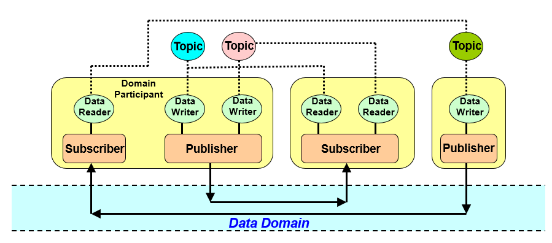

# ROS2


---

# 目录

- [ROS2](#ros2)
- [目录](#目录)
- [Link](#link)
  - [文档教程](#文档教程)
  - [视频教程](#视频教程)
- [常用命令](#常用命令)
- [常见问题](#常见问题)
- [The Construct](#the-construct)
- [【鱼香ROS】动手学ROS2](#鱼香ros动手学ros2)
  - [第 01 章 - ROS2 介绍 与 安装](#第-01-章---ros2-介绍-与-安装)
    - [Linux 基础](#linux-基础)
    - [ROS2 介绍与安装](#ros2-介绍与安装)
  - [第 02 章 - ROS2 第一个节点](#第-02-章---ros2-第一个节点)
  - [第 03 章 - ROS2 节点通信之话题与服务](#第-03-章---ros2-节点通信之话题与服务)
    - [话题](#话题)
    - [服务](#服务)
  - [第 04 章 - ROS2 通信之参数与动作](#第-04-章---ros2-通信之参数与动作)
  - [第 05 章 - ROS2 常用工具](#第-05-章---ros2-常用工具)
  - [第 06 章 - 运动学基础](#第-06-章---运动学基础)
  - [第 07 章 - ROS2 运动学](#第-07-章---ros2-运动学)
  - [第 08 章 - 机器人建模](#第-08-章---机器人建模)
  - [第 09 章 - 机器人仿真](#第-09-章---机器人仿真)
  - [第 10 章 - SLAM建图](#第-10-章---slam建图)
  - [第 11 章 - Nav2导航仿真实战](#第-11-章---nav2导航仿真实战)
  - [第 12 章 - Nav2进阶实践](#第-12-章---nav2进阶实践)
  - [第 13 章 - 嵌入式开发之从点灯开始](#第-13-章---嵌入式开发之从点灯开始)
  - [第 14 章 - 接入ROS2-MicroROS](#第-14-章---接入ros2-microros)
  - [第 15 章 - ROS2硬件实战（自制简易雷达）](#第-15-章---ros2硬件实战自制简易雷达)
  - [第 16 章 - 实体机器人硬件搭建](#第-16-章---实体机器人硬件搭建)
  - [第 17 章 - 嵌入式控制及通信开发](#第-17-章---嵌入式控制及通信开发)
  - [第 18 章 - 上位机建图及导航](#第-18-章---上位机建图及导航)
  - [第 19 章 - ROS2-Control](#第-19-章---ros2-control)
  - [第 20 章 - Moveit2仿真](#第-20-章---moveit2仿真)
  - [第 21 章 - Moveit2进阶](#第-21-章---moveit2进阶)
  - [第 23 章 - Moveit2真机控制](#第-23-章---moveit2真机控制)
- [扩展阅读](#扩展阅读)
  - [DDS 数据分发服务](#dds-数据分发服务)


---

# Link


## 文档教程

[ROS 官网](https://www.ros.org/)

[ROS2 中文网](http://dev.ros2.fishros.com/)

[鱼香社区](https://fishros.org.cn/forum/)

[ROS 2 文档 中文](http://dev.ros2.fishros.com/doc/)

[ROS Documentation 官方文档 英文](https://docs.ros.org/)

[ROS2 Documentation(humble) 官方文档 英文](https://docs.ros.org/en/humble/index.html)

## 视频教程

[【鱼香ROS】动手学ROS2基础篇|ROS2基础入门到实践教程](https://www.bilibili.com/video/BV1gr4y1Q7j5)

[【鱼香ROS】动手学ROS2进阶篇|机器人学基础](https://www.bilibili.com/video/BV1QY411a7v9)

[【古月居】古月·ROS2入门21讲](https://www.bilibili.com/video/BV16B4y1Q7jQ)

[ROS2基础入门教程(英文)](https://www.bilibili.com/video/BV19U4y1n7CQ)

[【鱼香ROS】14个ROS/ROS2版本任选 | 用Docker实现一键安装ROS](https://www.bilibili.com/video/BV1hY411N7HF)

[【布兰自动驾驶】ROS2机器人基础教程：理论与实战](https://www.bilibili.com/video/BV1TS4y1B7cQ)

---

# 常用命令

命令
1. **查看ROS版本** : printenv ROS_DISTRO  **result** : humble
2.

# 常见问题
1. **sh: 0: getcwd() failed: No such file or directory** - 切换到其他目录 如 ~/


---

# The Construct

[ROS2 Basics in 5 Days (C++)](https://app.theconstruct.ai/courses/ros2-basics-in-5-days-humble-c-133/)


---

# 【鱼香ROS】动手学ROS2

[【鱼香ROS】 官网](https://fishros.com/)

[【鱼香ROS】动手学ROS2 - 文档](https://fishros.com/d2lros2/#/)

[【鱼香ROS】动手学ROS2基础篇|ROS2基础入门到实践教程 - B战视频](https://www.bilibili.com/video/BV1gr4y1Q7j5)

[【鱼香ROS】动手学ROS2进阶篇|机器人学基础|机器人URDF建模|Gazebo仿真 - B战视频](https://www.bilibili.com/video/BV1QY411a7v9/)

---

## 第 01 章 - ROS2 介绍 与 安装


### Linux 基础

[OS & Kernel](../../Linux/LinuxSystemic.md#内核--操作系统)

[Linux 权限管理](../../Linux/LinuxSystemic.md#第05章-linux-的文件权限与目录配置)

[编译器、解释器、语言运行机制、库文件 笔记](../../ComputerScience/Complier/notions.md)


---

### ROS2 介绍与安装

**ROS = robot operating system**

本身 **并非操作系统**，而是 **软件库&工具集**

设计了一整套 **通信机制** (话题、服务、参数、动作)，解决机器人各组件之间通信问题

**ROS 1 问题举例**
1. ROS 1 通信机制 包含 ROS Master的东西，所有节点(激光雷达、避障、底盘驱动等)的通信建立必须经过这个主节点。主节点挂掉后，就会造成整个系统通信的异常(避障策略等)，影响 ROS 做商业化机器人
2. 通信基于TCP实现，实时性差、系统开销大
3. 对Python3支持不友好，需要重新编译
4. 消息机制不兼容
5. 没有加密机制、安全性不高
6. 生命周期管理不完善


**ROS1 与 ROS2 架构对比**
1. **架构图 & 对比** - 论文 [Exploring the Performance of ROS2](https://readpaper.com/pdf-annotate/note?pdfId=4546269770222821377&noteId=2274943744417993728)
   
   
   1. **OS Layer - 操作系统层**
      1. 原来的只支持 linux 平台，现在支持 Windows、MAC 甚至是 嵌入式RTOS 平台
   2. **MiddleWare - 中间件层**
      1. 特点
         1. 去中心化 - ROS2 取消 master 节点(基于DDS的互相发现协议)，各个节点之间可以通过 DDS 的节点相互发现，各个节点都是平等的，且可以 1对1、1对n、n对n 进行互相通信
         2. 提供多个节点中间通信
         3. 通信更换为 **DDS** - 使得ROS2的实时性、可靠性和连续性上都有了增强
         4. ROS1 的中间件是 ROS组织 基于TCP/UDP 建立的
      2. **DDS Implementation Layer - DSS实现层**
         1. 对不同常见的DDS接口进行再次的封装，让其保持统一性，为DDS抽象层提供统一的API
         2. ROS2 为每家 DDS供应商 开发对应的 DDS_Interface 即 DDS接口层
      3. **Abstract DDS Layer - DDS抽象层 RMW**
         1. 通过 DDS Abstract 抽象层来 **统一 DDS 的 API**
         2. 将DDS实现层进一步的封装，使得DDS更容易使用
         3. DDS需要大量的设置和配置(分区，主题名称，发现模式，消息创建,...)
      4. **ROS2 Client Layer - ROS2客户端库 RCL**
         
         1. RCL (ROS Client Library) ROS客户端库，其实就是ROS的一种API，提供对ROS话题、服务、参数、Action等接口
         2. 不同语言对应不同 RCL - **Python:rclpy** - **C++:rclcpp** - 操作ROS2的节点话题服务
         3. RMW(中间件接口)层 是对各家 DDS 的抽象层，基于 RMW 实现 rclc，基于 rclc 实现了 rclpy 和 rclcpp
   3. **Application Layer - 应用层**
      1. 写代码以及ROS2开发的各种常用的机器人相关开发工具所在的层
2. **整体改进**
   1. python2 到 python3 的支持
   2. 编译系统的改进 catkin 到 ament
   3. C++ 标准更新到 C++11
   4. 相同 API 的 进程间 和 进程内 通信


**ROS 2 新概念**
1. 可用 Python 编写的 Launch 文件
2. 多机器人协同 通信支持
3. 支持 安全加密通信
4. 同一个 进程 支持多个节点
5. 支持 Qos 服务质量
6. 支持 节点生命周期管理
7. 高效的 进程间通信


**安装 & 卸载**
1. 一键安装 ROS2
   ```bash
   wget http://fishros.com/install -O fishros && . fishros
   ```
2. 手动安装 [Installation - Ubuntu (Debian packages)](https://docs.ros.org/en/humble/Installation/Ubuntu-Install-Debians.html)
3. 卸载
   ```bash
   sudo apt remove ros-humble-*
   sudo apt autoremove
   ```
4. 安装位置 - ROS安装的默认目录在/opt/ros/下，根据版本的名字进行区分
   ```bash
   cd /opt/ros/humble/ && ls
   ```

**HelloWorld**
1. 话题通信 - listener & talker
   ```bash
   ros2 run demo_nodes_py listener
   # 一开始无output，需要等talker运行，可以同时收听多个talker
   ros2 run demo_nodes_py talker
   ros2 run demo_nodes_cpp talker
   ```
2. turtle
   ```bash
   ros2 run turtlesim turtlesim_node
   ros2 run turtlesim turtle_teleop_key
   # Velocity command received during rotation goal. Aborting goal
   ```
3. rqt
   1. rqt is a framework for graphical user interfaces.
   2. It is extensible with plugins which can be written in either Python or C++.
   3. 选择插件 - introspection - node graph
   4. 也可以直接 rqt_graph


## 第 02 章 - ROS2 第一个节点

通信方式
1. TCP/UDP 网络通信
   1. TCP - `ping`
      1. 用于测试网络连接的可达性以及确定网络的响应时间
      2. 通过向目标主机发送ICMP (Internet Control Message Protocol) 回显请求并等待回显应答来工作
   2. UDP - `nc` (netcat)
      1. 用于读写网络连接，可以用于端口扫描、文件传输、创建服务器等多种网络操作
2. 共享内存 进程间通信 IPC(Inter-Process Communication)
   1. 在同一计算机系统内的不同进程之间进行通信
   2. `ipcs` 和 `ipcrm` 命令来管理共享内存段

通信中间件 **FastDDS** & **ZeroMQ** & **PyZmq**
1. FastDDS 是 ROS2 的通信中间件
2. ZeroMQ非常的轻量，也就是小巧，占用资源少
3. [PyZmq](https://pyzmq.readthedocs.io/en/latest/)


节点间交互
1. 话题(发布/订阅) - topic 单向
2. 服务 - service 双向
3. 动作 - action
4. 参数 - parameter


---

## 第 03 章 - ROS2 节点通信之话题与服务

### 话题


### 服务


---

## 第 04 章 - ROS2 通信之参数与动作
---

## 第 05 章 - ROS2 常用工具
---

## 第 06 章 - 运动学基础
---

## 第 07 章 - ROS2 运动学
---

## 第 08 章 - 机器人建模
---

## 第 09 章 - 机器人仿真
---

## 第 10 章 - SLAM建图
---

## 第 11 章 - Nav2导航仿真实战
---

## 第 12 章 - Nav2进阶实践
---

## 第 13 章 - 嵌入式开发之从点灯开始
---

## 第 14 章 - 接入ROS2-MicroROS
---

## 第 15 章 - ROS2硬件实战（自制简易雷达）
---

## 第 16 章 - 实体机器人硬件搭建
---

## 第 17 章 - 嵌入式控制及通信开发
---

## 第 18 章 - 上位机建图及导航
---

## 第 19 章 - ROS2-Control
---

## 第 20 章 - Moveit2仿真
---

## 第 21 章 - Moveit2进阶
---

## 第 23 章 - Moveit2真机控制

---

# 扩展阅读

## DDS 数据分发服务

[ROS2 的核心 - 数据分发服务DDS导论](https://www.bilibili.com/video/BV1sU4y1P7yn/)

[eProsima Fast DDS Documentation](https://fast-dds.docs.eprosima.com/en/latest/index.html#)

[What is DDS? - DDS-Foundation](https://www.dds-foundation.org/what-is-dds-3/)

中间件 是位于 操作系统 和 应用程序 之间的 软件层，使系统的各个组件能够更轻松地 通信 和 共享数据


从操作系统、网络传输、低级数据格式的细节中 抽象出 应用程序

相同的概念 和 API 以不同的编程语言提供，允许应用程序跨操作系统、语言和处理器架构交换信息

数据线格式、发现、连接、可靠性、协议、传输选择、QoS、安全 等 低级细节由中间件管理


**eProsima** is a company specializing in high-performance **middleware** solutions

**eProsima Fast DDS** has been chosen as the **default middleware** supported by **ROS 2**

**DDS (Data Distribution Service - 数据分发服务)**
1. 一种 **中间件协议标准**，旨在为 实时系统 提供 高性能、可扩展的 数据交换
2. 由 **OMG (Object Management Group)** 制定
3. 使用 **发布-订阅 (Pub/Sub) 模式**，发布者不需要知道谁是接收者，订阅者也不需要知道谁是发送者 - **解耦**
4. 技术核心 - 基于 **数据为中心的发布/订阅模型 Data-Centric Publish-Subscribe DCPS** 的一种中间件协议和API标准，创建 **全域数据空间 Global Data Space** 概念，所有独立的应用都可访问
5. 数据通过定义好的 **主题** 来发布，订阅者可以订阅一个或多个主题，从而接收相关的数据
6. 通信模型 - 多对多 & 单向 数据交换
7. 核心协议&拓展协议 包括 - **DDSI-RTPS, DDS-XTypes, DDS-Security, DDS-RPC**


**架构**
1. **DLRL**
   1. Data Local Reconstruction Layer
   2. 建立在 DCPS 的基础上，通过DCPS提供的服务，简化编程实现，把服务简单整合到应用层，使用户能直接访问变更的数据
2. **DCPS** - 高层次的抽象 - 基础和核心
   1. **Data-Centric** **Publish-Subscribe**
   2. 定义了数据的 发布者Publishers 和 订阅者Subscriber 之间的 接口和行为，
   3. **面向数据**，围绕数据的交流而构建的
   4. 处理 如何 **定义、发送、接收** 以及 如何 **通过主题订阅和发布数据**，提供基本通信服务
   5. 建立 **全局数据空间** 概念，Publisher 和 Subscriber 在全局空间中 发布 和 订阅 需要的数据类型，通过中间件处理以后，进行数据发送
   6. 依赖 **DDSI-RTPS** 或 其他传输层来实现其定义的 发布和订阅机制 的 **网络传输部分**
3. **DDSI-RTPS** - 处于传输层之上的**会话层**
   1. **Real-time** **Publish-Subscribe** Protocol DDS Interoperability(互操作性) Wire Protocol
   2. 用于实现 **基于不同厂商的** DDS 互操作性的 **有线协议**，DDS实体可以 **在网络中发现彼此** 并 **交换数据消息**，无论这些实体位于本地还是跨网络
   3. RTPS 具有容错性、可扩展性、即插即用连接、可配置性、模块化、伸缩性和类型安全等特性
   4. DDSI-RTPS **使用 TCP 或 UDP 作为 传输层协议** 来处理数据包的发送和接收，灵活应对不同的网络通信需求，无论是追求高可靠性还是低延迟

**DDS Domain 信息流动概念图** - Only **entities belonging to the same domain** can **discover each other** through matching topics, and consequently **exchange data** between publishers and subscribers




**DDS 架构 关键概念**
1. Domain : 代表一个通信平面，由Domain ID唯一标识(用于隔离不同的工作空间)，**只有在同一个域内的通信实体才可以通信**，Different DDS Domains are **completely independent from each other**. There is **no data-sharing across DDS domains**.
2. Domain Participant : 通信成员，可以包含多个 DataReader & DataWriter
3. Topic : **数据的抽象概念**，由 TopicName 标识，在DDS Domain中唯一，在进程之间交换的数据的消息
   
   1. **Topic 负责绑定 DataWriter 和 DataReader** (当一个 DataWriter 和 DataReader 有相同的主题名和兼容的数据类型时，就可以绑定，形成一个通信通道)，**实际的数据交换和匹配是在 DataWriter 和 DataReader 之间进行的**
   2. 所有Topic集合在一起，这样就形成一个虚拟的全局数据空间 **Global Data Space**(针对单个域而言的，数据不能跨域)
   3. Topic 的管理和匹配、Publisher和Subscriber连接事件的通知 都由 **GDS** 来完成
   4. DDS 标准要求 GDS 完全分布式实现，**避免单点故障** - 节点可以在任何时候加入或离开GDS，因为是被**动态发现**的(**广播/多播**)，动态发现由 GDS 负责执行，且不依赖于任何中心注册
   5. **全局数据空间 GDS 组成部分**
      1. 发布主题表(全局一致) - 系统在接收到订阅请求时，快速匹配相应的发布者
      2. 订阅登记表 - DDS能够管理订阅关系，并确保当发布者发出新数据时，所有相关的订阅者都能收到通知
      3. 发布数据缓冲区 - 优化数据传输和处理可能的网络延迟或订阅者处理能力不足的情况
      4. 订阅失败队列 - 系统可以配置策略来决定如何处理这些队列中的数据，比如重新发送、发送警告或丢弃数据
   6. 全局数据空间是一个虚拟的概念，**允许分布在不同物理位置的应用程序共享数据**，**就好像这些数据存储在本地一样**，没有一个中央位置存储所有数据
4. DataWriter : **负责发布消息的实体**，把需要发布的主题数据从应用层写入到 DataWriter 中，类似缓存
5. DataReader : **订阅主题以接收发布的实体**，从订阅者得到主题数据，随之传给应用层，类似缓存
6. Publisher : 管理 一个或多个 DataWriter (由中间件匹配)
7. Subscriber : 管理 一个或多个 DataReader (由中间件匹配)


**Dynamic Discovery**
1. DDS provides **Dynamic Discovery of publishers and subscribers**(extensible)
2. means the application does not have to know or configure the endpoints for communications
3. can be completed at runtime and not necessarily at design or compile time, enabling real “plug-and-play” for DDS applications
4. participants can be on the same machine or across a network
5. the application uses the same DDS API for communications


**DDS的定位** - Real-Time - Mission/Business Critical


**优劣**
1. **优势**
   1. 实现系统解耦
   2. 延迟更低，吞吐量更高
   3. 远程参与者的自动发现
   4. 丰富的 QoS 参数集，允许调整通信各方面(靠性、持久性、冗余、寿命、传输设置、资源)
   5. 实时发布订阅协议 (RTPS) 几乎可以通过任何传输实现(UDP、TCP、共享内存 等)
   6. DDS 有定义好的 行为和规范，有完善的文档
2. **劣势**
   1. API复杂，灵活性以复杂性为代价
   2. 系统开销相对较大


通信中间件采用的模型四代演变
1. 点对点模型
   1. 常见的**服务器/客户端(Client/Server)**模式
   2. 服务器和客户端的耦合程度过高
   3. 服务器的异常会直接影响到客户端
2. Broker 模型
   1. Broker **集中统一处理所有请求**(将 client 请求 路由或转发到 适当的 server)，解决了通信双方的耦合问题
   2. 当服务器地址发生变化时，客户端不受影响(**客户端只需知道 Broker 地址**，无需关心后端服务的具体位置)
   3. 但是一旦Broker出现异常，会影响整个系统
   4. 当请求规模达到一定程度，会因为Broker处理速度慢而影响整体的性能，**可靠性低**
3. 广播模型
   1. 通信双方不用单独连接，而是借助于一种总线——广播信道
   2. 只需借助广播信道发送和接收信号
   3. 所有通信实体都可以从广播信道接收所有的信号，而无论该实体是否需要，**浪费传输带宽**
4. 以数据为中心的模型
   1. 与广播模型类似，所有通信实体都可以往“总线”发布和订阅消息
   2. 但是这个 总线 根据数据不同划分了很多数据空间
   3. 每个通信实体在数据空间内**只收到和自己关联的信号**

