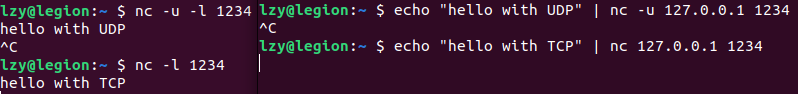
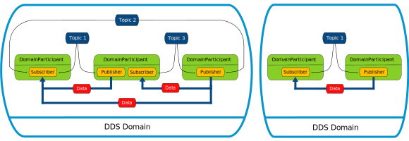

# ROS2


[Open Robotics](https://www.openrobotics.org/)

1. [ROS](https://www.ros.org/)
   
2. [Gazebo](https://gazebosim.org/home)
   
3. [Open-RMF(Open Robotics Middleware Framework)](https://www.open-rmf.org/)
   


---

# 目录

- [ROS2](#ros2)
- [目录](#目录)
- [Link](#link)
  - [文档教程](#文档教程)
  - [视频教程](#视频教程)
  - [Linux 安装](#linux-安装)
- [常用命令](#常用命令)
- [ROS2 安装](#ros2-安装)
- [常见问题](#常见问题)
- [The Construct](#the-construct)
  - [Unit 1 - Introduction to the Course](#unit-1---introduction-to-the-course)
- [【鱼香ROS】动手学ROS2](#鱼香ros动手学ros2)
  - [第 01 章 - ROS2 介绍 与 安装](#第-01-章---ros2-介绍-与-安装)
    - [Linux 基础](#linux-基础)
    - [ROS2 介绍与安装](#ros2-介绍与安装)
    - [ROS 1 问题举例](#ros-1-问题举例)
    - [ROS1 与 ROS2 架构对比](#ros1-与-ros2-架构对比)
  - [第 02 章 - ROS2 第一个节点](#第-02-章---ros2-第一个节点)
    - [Node 节点 分类](#node-节点-分类)
    - [ROS2 工作空间 \& 功能包](#ros2-工作空间--功能包)
    - [ROS2 run](#ros2-run)
    - [ROS2 pkg](#ros2-pkg)
    - [colcon - ROS2 构建工具](#colcon---ros2-构建工具)
    - [使用 RCLCPP 编写节点](#使用-rclcpp-编写节点)
    - [使用 RCLPY 编写节点](#使用-rclpy-编写节点)
    - [编译/运行 报错](#编译运行-报错)
    - [CMake 依赖查找流程](#cmake-依赖查找流程)
    - [Python 包查找流程](#python-包查找流程)
    - [Python 打包工具 setup](#python-打包工具-setup)
    - [面向对象 OOP](#面向对象-oop)
    - [ROS2节点发现与多机通信](#ros2节点发现与多机通信)
  - [第 03 章 - ROS2 节点通信之话题与服务](#第-03-章---ros2-节点通信之话题与服务)
    - [中间件 \& 通信 基础](#中间件--通信-基础)
    - [话题 (Publisher/Subscriber)](#话题-publishersubscriber)
      - [导入消息接口](#导入消息接口)
      - [ROS2 Topic 命令](#ros2-topic-命令)
    - [服务 (Client/Server)](#服务-clientserver)
  - [第 04 章 - ROS2 通信之参数与动作](#第-04-章---ros2-通信之参数与动作)
  - [第 05 章 - ROS2 常用工具](#第-05-章---ros2-常用工具)
  - [第 06 章 - 运动学基础](#第-06-章---运动学基础)
  - [第 07 章 - ROS2 运动学](#第-07-章---ros2-运动学)
  - [第 08 章 - 机器人建模](#第-08-章---机器人建模)
  - [第 09 章 - 机器人仿真](#第-09-章---机器人仿真)
  - [第 10 章 - SLAM建图](#第-10-章---slam建图)
  - [第 11 章 - Nav2导航仿真实战](#第-11-章---nav2导航仿真实战)
  - [第 12 章 - Nav2进阶实践](#第-12-章---nav2进阶实践)
  - [第 13 章 - 嵌入式开发之从点灯开始](#第-13-章---嵌入式开发之从点灯开始)
  - [第 14 章 - 接入ROS2-MicroROS](#第-14-章---接入ros2-microros)
  - [第 15 章 - ROS2硬件实战 (自制简易雷达)](#第-15-章---ros2硬件实战-自制简易雷达)
  - [第 16 章 - 实体机器人硬件搭建](#第-16-章---实体机器人硬件搭建)
  - [第 17 章 - 嵌入式控制及通信开发](#第-17-章---嵌入式控制及通信开发)
  - [第 18 章 - 上位机建图及导航](#第-18-章---上位机建图及导航)
  - [第 19 章 - ROS2-Control](#第-19-章---ros2-control)
  - [第 20 章 - Moveit2仿真](#第-20-章---moveit2仿真)
  - [第 21 章 - Moveit2进阶](#第-21-章---moveit2进阶)
  - [第 23 章 - Moveit2真机控制](#第-23-章---moveit2真机控制)
- [扩展阅读](#扩展阅读)
  - [DDS - 数据分发服务](#dds---数据分发服务)
    - [DDS 简介](#dds-简介)
    - [DDS 架构](#dds-架构)
    - [DDS 核心概念](#dds-核心概念)
    - [DomainID \& UDP Port 转换](#domainid--udp-port-转换)
    - [DDS 优劣](#dds-优劣)
    - [通信中间件模型 四代演变](#通信中间件模型-四代演变)
  - [rosdep](#rosdep)


---

# Link


## 文档教程

[ROS 官网](https://www.ros.org/)

[RCLCPP - C++ ROS Client Library API](https://docs.ros2.org/latest/api/rclcpp/)

[ROS2 中文网](http://dev.ros2.fishros.com/)

[鱼香社区](https://fishros.org.cn/forum/)

[ROS 2 文档 中文](http://dev.ros2.fishros.com/doc/)

[ROS Documentation 官方文档 英文](https://docs.ros.org/)

[ROS2 Documentation(humble) 官方文档 英文](https://docs.ros.org/en/humble/index.html)


## 视频教程

[【鱼香ROS】动手学ROS2基础篇|ROS2基础入门到实践教程](https://www.bilibili.com/video/BV1gr4y1Q7j5)

[【鱼香ROS】动手学ROS2进阶篇|机器人学基础](https://www.bilibili.com/video/BV1QY411a7v9)

[【古月居】古月·ROS2入门21讲](https://www.bilibili.com/video/BV16B4y1Q7jQ)

[ROS2基础入门教程(英文)](https://www.bilibili.com/video/BV19U4y1n7CQ)

[【鱼香ROS】14个ROS/ROS2版本任选 | 用Docker实现一键安装ROS](https://www.bilibili.com/video/BV1hY411N7HF)

[【布兰自动驾驶】ROS2机器人基础教程：理论与实战](https://www.bilibili.com/video/BV1TS4y1B7cQ)

[手把手学ROS2 Humble - GundaSmart](https://www.bilibili.com/video/BV1zH4y1C7uo/)

---


## Linux 安装

[Windows 和 Ubuntu 双系统的安装和卸载 --- 机器人工匠阿杰](https://www.bilibili.com/video/BV1554y1n7zv)

[Linux 安装指南 - 个人笔记](../../Linux/InstallUbuntu/InstallUbuntu.md)

---

# 常用命令

1. `printenv ROS_DISTRO` or `echo $ROS_DISTRO`- 查看 ROS 版本
2. `rqt`/`rqt_graph` - 查看 rqt 图 (详细/简单) - `introspection`|`node graph`
3. `ros2 run <pkg> <executable>` - [ros2 run 命令详细](#ros2-run)
4. `ros2 node {list/info}`
5. `ros2 pkg {create[build-type, dependencies]/executable/list/prefix/xml}` - [ros2 pkg 命令详细](#ros2-pkg)
6. `colcon build` - [colcon 命令详细](#colcon-使用进阶)
7. `ros2 topic/service` - []() - []()


---

# ROS2 安装

**Path**
1. `/opt/ros/humble/lib` - 库文件(静态库`.a`, 动态库`.so`)、可执行文件
2. `/opt/ros/humble/include` - 头文件(类定义、函数原型和宏定义等)，用于编译时包含
3. `/opt/ros/humble/share` - 配置文件、launch文件、帮助文档、示例代码、环境设置脚本、包的元数据，用于支持软件包的运行和用户的使用，不直接参与编译过程

---

# 常见问题
1. **sh: 0: getcwd() failed: No such file or directory** - 切换到其他目录 如 `~/`


---

# The Construct

[ROS2 Basics in 5 Days (Python)](https://app.theconstruct.ai/courses/132)

[ROS2 Basics in 5 Days (C++)](https://app.theconstruct.ai/courses/133)

[C++ for Robotics](https://app.theconstruct.ai/courses/59)

[Linux for Robotics](https://app.theconstruct.ai/courses/185)

[OpenCV Basics for Robotics](https://app.theconstruct.ai/courses/65)

## Unit 1 - Introduction to the Course

simulated robots
1. [Neobotix](https://www.neobotix-robots.com/) MP-400
   
   
2. TurtleBot 3 Waffle
   


---

# 【鱼香ROS】动手学ROS2

[【鱼香ROS】 官网](https://fishros.com/)

[【鱼香ROS】动手学ROS2 - 文档](https://fishros.com/d2lros2/#/)

[【鱼香ROS】动手学ROS2基础篇|ROS2基础入门到实践教程 - B战视频](https://www.bilibili.com/video/BV1gr4y1Q7j5)

[【鱼香ROS】动手学ROS2进阶篇|机器人学基础|机器人URDF建模|Gazebo仿真 - B战视频](https://www.bilibili.com/video/BV1QY411a7v9/)

---

## 第 01 章 - ROS2 介绍 与 安装


### Linux 基础

[OS & Kernel](../../Linux/LinuxSystemic.md#内核--操作系统)

[Linux 权限管理](../../Linux/LinuxSystemic.md#第05章-linux-的文件权限与目录配置)

[编译器、解释器、语言运行机制、库文件 笔记](../../ComputerScience/Compiler/Compiler&Interpreter.md)

---

### ROS2 介绍与安装

**ROS = robot operating system**

本身 **并非操作系统**，而是 **软件库&工具集**

设计了一整套 **通信机制** (话题、服务、参数、动作)，解决机器人各组件之间通信问题

### ROS 1 问题举例

1. ROS 1 通信机制 包含 ROS Master的东西，所有节点(激光雷达、避障、底盘驱动等)的通信建立必须经过这个主节点。主节点挂掉后，就会造成整个系统通信的异常(避障策略等)，影响 ROS 做商业化机器人
2. 通信基于TCP实现，实时性差、系统开销大
3. 对Python3支持不友好，需要重新编译
4. 消息机制不兼容
5. 没有加密机制、安全性不高
6. 生命周期管理不完善


### ROS1 与 ROS2 架构对比

**架构图 & 对比** - 论文 [Exploring the Performance of ROS2](https://scholar.google.com/scholar?oi=gsb20&q=Exploring%20the%20performance%20of%20ROS2&lookup=0&hl=en)

<center></center>

<center></center>

1. **OS Layer - 操作系统层**
   1. 原来的只支持 linux 平台，现在支持 Windows、MAC 甚至是 嵌入式RTOS 平台
2. **MiddleWare - 中间件层** - [DDS 详解](#dds---数据分发服务)
   1. 特点
      1. **去中心化** - ROS2 取消 master 节点(基于DDS的互相发现协议)，各个节点之间可以通过 DDS 的节点相互发现，各个节点都是平等的，且可以 **1对1、1对n、n对n** 进行互相通信
      2. 提供多个节点中间通信
      3. 通信更换为 **DDS** - 使得ROS2的实时性、可靠性和连续性上都有了增强
      4. ROS1 的中间件是 ROS组织 基于TCP/UDP 建立的
   2. **DDS Implementation Layer - DSS实现层**
      1. 对不同常见的DDS接口进行**再次的封装**，让其**保持统一性**，**为DDS抽象层提供统一的API**
      2. ROS2 为每家 DDS供应商 开发对应的 DDS_Interface 即 DDS接口层
   3. **Abstract DDS Layer - DDS抽象层 RMW**
      1. 通过 DDS Abstract 抽象层来 **统一 DDS 的 API**
      2. 将DDS实现层进一步的封装，使得DDS更容易使用
      3. DDS需要大量的设置和配置(分区，主题名称，发现模式，消息创建,...)
   4. **ROS2 Client Layer - ROS2客户端库 RCL**
      
      1. **RCL (ROS Client Library)** ROS客户端库，其实就是ROS的一种API，提供对ROS 话题、服务、参数、Action 等接口
      2. 不同语言对应不同 RCL
         1. **`Python:rclpy`**
         2. **`C++:rclcpp`**
      3. RMW(中间件接口)层 是对各家 DDS 的抽象层，基于 RMW 实现 `rclc`，基于 `rclc` 实现了 `rclpy` 和 `rclcpp`
3. **Application Layer - 应用层**
   1. 写代码 & ROS2 开发的各种常用的机器人相关开发工具所在的层
4. **整体改进**
   1. python2 到 python3 的支持
   2. 编译系统的改进 `catkin` 到 `ament`
   3. C++ 标准更新到 C++11
   4. 相同 API 的 进程间 和 进程内 通信


**ROS 2 新概念**
1. 可用 Python 编写的 Launch 文件
2. 多机器人协同 通信支持
3. 支持 安全加密通信
4. 同一个 进程 支持多个节点
5. 支持 Qos 服务质量
6. 支持 节点生命周期管理
7. 高效的 进程间通信


**安装 & 卸载**
1. 一键安装 ROS2
   ```bash
   wget http://fishros.com/install -O fishros && . fishros
   ```
2. 手动安装 [Installation - Ubuntu (Debian packages)](https://docs.ros.org/en/humble/Installation/Ubuntu-Install-Debians.html)
3. 卸载
   ```bash
   sudo apt remove ros-humble-*
   sudo apt autoremove
   ```
4. **安装位置** - ROS安装的默认目录在/opt/ros/下，根据版本的名字进行区分
   ```bash
   cd /opt/ros/humble/ && ls
   ```

**HelloWorld**
1. **话题通信 - listener & talker**
   ```bash
   ros2 run demo_nodes_py listener
   # 一开始无output，需要等talker运行，可以同时收听多个talker
   ros2 run demo_nodes_py talker
   ros2 run demo_nodes_cpp talker
   ```
2. **turtle**
   ```bash
   ros2 run turtlesim turtlesim_node
   ros2 run turtlesim turtle_teleop_key
   # Velocity command received during rotation goal. Aborting goal
   ```
3. **rqt**
   1. rqt is a framework for graphical user interfaces.
   2. It is extensible with plugins which can be written in either Python or C++.
   3. 插件 - **`introspection`** - **`node graph`**
   4. 也可以直接 rqt_graph

---

## 第 02 章 - ROS2 第一个节点

[ROS2命令行工具 - Github](https://github.com/ros2/ros2cli)


### Node 节点 分类

**Node 节点(功能模块) 交互**
1. **topic**     话题 - **Publisher/Subscriber** - ==单向==(可以是 **一对多、多对一、多对多**)
   
2. **service**   服务 - **Server/Client** - ==双向==(**Client 发起请求，Server 返回响应**)
   
   1. ==可以有多个 Client 但只能有一个 Server==
3. **action**    动作
   
4. **parameter** 参数

### ROS2 工作空间 & 功能包

一个 **工作空间** 可有 多个 **功能包**，一个 **功能包** 可有 多个 **节点**

**工作空间** - 工作空间是包含若干个功能包的目录，下有文件夹 `./src`

**功能包** - 存放节点
1. 根据编译方式的不同分为三种类型
   1. `ament_python` - 适用于 python 程序
   2. `cmake` - 适用于 C++
   3. `ament_cmake` - 适用于 C++ 程序，cmake 的增强版
2. 获取方式
   1. 安装 `sudo apt install ros-<version>-<pkg_name>`
   2. 手动编译(如果需要 修改 源码)，编译之后，需要手动 `source` 工作空间的 `install` 目录

```bash
WorkSpace --- 自定义的工作空间。
    |--- build : 存储中间文件的目录，该目录下会为每一个功能包创建一个单独子目录
    |--- install : 安装目录，该目录下会为每一个功能包创建一个单独子目录
    |--- log : 日志目录，用于存储日志文件
    |--- src : 功能包源码的目录
        |-- C++ 功能包
            |-- package.xml : 包信息，比如:包名、版本、作者、依赖项
            |-- CMakeLists.txt : 配置编译规则，比如源文件、依赖项、目标文件
            |-- src : C++源文件目录
            |-- include : 头文件目录
            |-- msg : 消息接口文件目录
            |-- srv : 服务接口文件目录
            |-- action : 动作接口文件目录
        |-- Python 功能包
            |-- package.xml : 包信息，比如:包名、版本、作者、依赖项
            |-- setup.py : 与C++功能包的CMakeLists.txt类似
            |-- setup.cfg : 功能包基本配置文件
            |-- resource : 资源目录
            |-- test : 存储测试相关文件
            |-- 功能包同名目录 : Python源文件目录
```

### ROS2 run

`ros2 run <pkg> <executable>` - 运行节点
1. `ros2 run <pkg> <executable> --ros-args --remap __node:=<new_name>` - 重映射节点名称
   1. `--ros-args` 用于明确接下来的参数是 ROS 参数，而非可执行文件本身的命令行参数
   2. `__node` 用于设置节点的名称
2. `ros2 run <pkg> <executable> --ros-args -p <parameter_name>:=<val>` - 运行节点时设置参数
   1. `-p` 用于指定参数(parameter)


### ROS2 pkg

**`ros2 pkg`**
1. `create` - 创建功能包 Create a new ROS2 package
   1. `ros2 pkg create <pkg_name>  --build-type  {cmake, ament_cmake, ament_python}  --dependencies <depend_name>`
   2. `--build-type` 默认为 `ament_cmake`
2. `executables` - 列出可执行文件 Output a list of package specific executables
   1. `ros2 pkg executables <pkg_name>`
   2. 正好对应 `ros2 run <pkg> <executable>`
3. `list` - 列出所有的包 Output a list of available packages
   1. `ros2 pkg list`
4. `prefix` - 输出某个包所在路径的前缀(包的 所有内容(库`lib`、头文件`include`、资源`share`等)存储的顶级目录) Output the prefix path of a package
   1. `ros2 pkg prefix <pkg_name>`
5. `xml` - 列出包的清单描述文件(包的 名字、构建工具(buildtool_depend)、编译信息、拥有者、用途、依赖(exec_depend)) Output the XML of the package manifest or a specific tag
   1. `ros2 pkg xml <pkg_name>`


如果忘记在 `ros2 pkg create <pkg_name>` 添加 `--dependencies` 的补救步骤
1. 在包的 `package.xml` 中的 `<package>` 标签内添加 `<depend>xxx</depend>`，eg: `<depend>rclcpp</depend>`
2. 在包的 `CMakeLists.txt` 添加 `find_package(xxx REQUIRED)` eg: `find_package(rclcpp REQUIRED)`


### colcon - ROS2 构建工具


**[colcon - collective construction](https://colcon.readthedocs.io/en/released/index.html)**
1. 功能包构建工具(用来编译代码)
2. 替代 早期版本中的 **catkin_make** & **ament_tools**
3. 优势 - 多语言支持(C、C++、Python、Java 等)、多系统兼容(Linux、macOS、Windows)、依赖管理、扩展性(插件)、灵活性(**支持各种构建系统**，如 `CMake`、`Python setuptools`、`Gradle`)
4. `colcon` 和 `CMake` 在项目构建中扮演不同但互补的角色
   1. `CMake` 是直接负责编译代码的工具
   2. `colcon` 为项目级的构建管理工具(更高层次)，负责协调和优化整个多包项目的构建过程，提供一致的接口来构建、测试和安装项目中的所有软件包
5. ROS2 默认没有安装 colcon，安装命令 - `sudo apt install python3-colcon-common-extensions`


colcon 作为**构建工具**，通过调用 CMake、Python setuptools 完成构建

**构建工具** - 面向用户，**管理构建过程**和**调用构建系统**
1. colcon
2. ament_tools - 早期被ROS2广泛使用，后续被 colcon 代替
3. catkin_make - 仅调用 CMake 一次，并使用 CMake 的函数在单个上下文中处理所有包
4. catkin_make_isolated

**构建系统** - **提供底层的构建逻辑和规则**，定义如何编译和链接项目
1. CMake - 跨平台构建系统生成器
2. ament
3. catkin - 基于CMake，自动生成 CMake 配置文件以及 pkg 配置文件
4. Python setuptools - Python包的打包常用工具


`colcon`
1. `build`
   1. `无参数` - 编译所有功能包
   2. `--packages-select <pkg_name>` - 只编译一个功能包，忽略其他的包
   3. `--packages-up-to` - 构建指定包及其所有依赖，确保某个包及其所有依赖都是最新
   4. `--packages-above` - 构建所有依赖于指定包的包，与 `--packages-up-to` 相反
   5. `--build-base` - 指定构建目录
   6. `--install-base` - 指定安装目录
   7. `-symlink-install` - 构建时使用 **符号链接**(symlinks)，而不是复制文件 - 节省空间，快速更新，用于开发，不适用与 生产/发布 - `/src` & `/install` 目录之间创建 symlinks
   8. `--continue-on-error` - 当发生错误的时候继续进行编译
   9.  `--merge-install` - 将所有包的安装文件合并到 `/install` 文件夹中，而不是默认的为每个包创建单独的子目录
   10. `--cmake-args` - 将任意参数传递给CMake - eg: `colcon build --packages-select <pkg_name>  --cmake-args -DBUILD_TESTING=0` - 不编译单元测试
   11. `--log-level <level>` - 设置 日志级别 - eg: `--log-level info`
2.  `test` - 运行编译的包的测试


**源码构建 & 运行 示例**

```bash
mkdir xxx & cd xxx

git clone https://github.com/ros2/examples src/examples -b humble

colcon build  # 使用 colcon 进行构建

tree -L 1  # 查看目录结构(深度=1)
.
├── build
├── install
├── log
└── src
4 directories, 0 files

ros2 pkg executables examples_rclcpp_minimal_publisher

source install/setup.bash  # 表明功能包位置
# 在终端会话中临时的。每次打开一个新的终端窗口或会话时，都需要重新运行这个命令来设置正确的环境变量
# 想要持久化需要将该命令添加到 ~/.bashrc
ros2 run examples_rclcpp_minimal_subscriber subscriber_member_function
# 打开另一个窗口
source install/setup.bash
ros2 run examples_rclcpp_minimal_publisher publisher_member_function
```

python 程序是直接 从 `./src` 复制到 `./install` 中对应目录下的

```bash
tree ./src/examples/rclpy/executors/examples_rclpy_executors/
./src/examples/rclpy/executors/examples_rclpy_executors/
├── callback_group.py
├── composed.py
├── custom_callback_group.py
├── custom_executor.py
├── __init__.py
├── listener.py
└── talker.py

tree ./install/examples_rclpy_executors/lib/examples_rclpy_executors/
./install/examples_rclpy_executors/lib/examples_rclpy_executors/
├── callback_group
├── composed
├── custom_callback_group
├── custom_executor
├── listener
└── talker
```


### 使用 RCLCPP 编写节点

```bash
cd WorkspaceName/src
ros2 pkg create example_cpp --build-type ament_cmake --dependencies rclcpp
```

```cpp
#include "rclcpp/rclcpp.hpp"

int main(int argc, char **argv)
{
    // 初始化 ROS 2 的客户端库 rclcpp，设置了ROS 2程序所需的资源，并解析命令行参数
    rclcpp::init(argc, argv);
    // 产生一个node_01的节点
    // std::make_shared 是为了创建一个智能指针，这种指针可以自动管理节点对象的内存，确保在不再使用时正确地释放资源
    auto node = std::make_shared<rclcpp::Node>("node_01");
    // 打印一句自我介绍
    // 使用节点的日志器来输出一条信息，表明节点已经启动
    // RCLCPP_INFO 是一个宏，用于在 ROS 2 的日志中记录信息级别的消息
    RCLCPP_INFO(node->get_logger(), "node_01节点已经启动.");
    // 运行节点，处理所有到来的消息，并检测退出信号(ROS 的中断信号) Ctrl+C
    rclcpp::spin(node);
    // 负责关闭 ROS 2 的客户端库，清理由 rclcpp::init 设置的资源
    rclcpp::shutdown();
    return 0;
}
```

在 CMakeLists.txt 中添加

```cmake
add_executable(node_01 src/node_01.cpp)
ament_target_dependencies(node_01 rclcpp)

install(
  TARGETS node_01
  DESTINATION lib/${PROJECT_NAME}
  # ${PROJECT_NAME}：用于引用 CMake project() 命令中定义的项目名称
)
```

`ament_target_dependencies` - 为 ROS 2 开发的宏，不是 CMake 的标准命令，封装了 CMake 的 `target_link_libraries` 和其他相关命令，以便自动处理 `ROS2` 包的依赖关系


```bash
colcon build  # 编译节点
source install/setup.bash

ros2 run example_cpp node_01
ros2 node list  # 在另一窗口
```


### 使用 RCLPY 编写节点

```bash
cd WorkspaceName/src
ros2 pkg create example_py  --build-type ament_python --dependencies rclpy

cd example_py/example_py
touch node02.py
```

```python
import rclpy
from rclpy.node import Node

def main(args=None):
    rclpy.init(args=args)
    node = Node("node02")
    node.get_logger().info("node02 start running")
    rclpy.spin(node)
    rclpy.shutdown()
```

修改 `setup.py`，声明一个ROS2的节点，声明后使用colcon build才能检测到，从而将其添加到install

```python
entry_points={
   'console_scripts': [
      "node02=example_py.node02.py:main"
   ],
}
```

```bash
source install/setup.sh
```


### 编译/运行 报错

**C++**
1. `No such file or directory`   - 预处理器 找不到 头文件
   1. `g++` 中 使用 `-I [IncludePath]` 参数
2. `undefined reference to xxx`  - 链接器 找不到 函数或对象的定义，即找不到 对应的库文件 或 代码实现
   1. `g++` 中 使用 `-L [LibPath]` 和 `-l [LibNameWithoutPrefix&Suffix]`

**Python**
1. `ModuleNotFoundError: No module named 'xxx'`
   1. 路径没有添加进环境

### CMake 依赖查找流程

使用 `find_package()` 简化 `CMakeLists.txt`，将自动设置 CMake 变量，无需手动添加

查找路径对应的环境变量
1. `PATH` - ROS相关 `/opt/ros/humble/bin`
2. `<PackageName>_DIR`
3. `CMAKE_PREFIX_PATH`
4. `CMAKE_FRAMEWORK_PATH`
5. `CMAKE_APPBUNDLE_PATH`


`find_package()` 命令进行包查找时应用的一种 **路径回退和搜索机制**
1. 如果以 `bin` 或 `sbin` 结尾，则自动回退到上一级目录，检查这些目录下的
   1. `<prefix>/(lib/<arch>|lib|share)/cmake/<name>*/`
   2. `<prefix>/(lib/<arch>|lib|share)/<name>*/`
   3. `<prefix>/(lib/<arch>|lib|share)/<name>*/(cmake|CMake)/`

cmake找到这些目录后，会开始依次找`<package>Config.cmake`或`Find<package>.cmake`文件，找到后即可执行该文件并生成相关链接信息

```bash
lzy@legion:/opt/ros/humble/share/rclcpp/cmake $ ll

# ...
-rw-r--r-- 1 root root 1382 May 24 06:18 rclcppConfig.cmake  # 借此文件生成链接信息
-rw-r--r-- 1 root root  433 May 24 06:18 rclcppConfig-version.cmake
# ...
```

### Python 包查找流程

通过环境变量 `PYTHONPATH`，让 Python3 找到 `rclpy`

```bash
lzy@legion:/opt/ros/humble $ echo $PYTHONPATH
/opt/ros/humble/lib/python3.10/site-packages:/opt/ros/humble/local/lib/python3.10/dist-packages
```

寻找 `rclpy`

```bash
lzy@legion:/opt/ros/humble $ ls -l /opt/ros/humble/local/lib/python3.10/dist-packages/ | grep rclpy
drwxr-xr-x 5 root root  4096 May 27 01:58 rclpy
drwxr-xr-x 2 root root  4096 May 27 01:58 rclpy-3.3.13-py3.10.egg-info
```

### Python 打包工具 setup

Python的依赖并不是靠 setup 来查找的，但是 C++ 却靠着 CmakeLists.txt 进行查找

打包，就是将你的源代码进一步封装，并且将所有的项目部署工作都事先安排好，这样使用者拿到后即装即用，不用再操心如何部署的问题

始祖 - **distutils** (distribute + utils)，Python 的一个标准库，Python 官方开发的一个分发打包工具

升级 - **setuptools**，增强版，不包括在标准库中

`setup.py`，它是模块分发与安装的指导

```python
from setuptools import find_packages, setup

package_name = 'example_py'

setup(
    name=package_name,  # 指定项目名称，我们在后期打包时，这就是打包的包名称
    version='0.0.0',  # 指定版本号
    packages=find_packages(exclude=['test']),  # 通过 setuptools.find_packages 找到当前目录下有哪些包
    data_files=[  # 打包时需要打包的数据文件，如图片，配置文件等
        ('share/ament_index/resource_index/packages',
            ['resource/' + package_name]),
        ('share/' + package_name, ['package.xml']),
    ],
    install_requires=['setuptools'],  # 应用于指定项目正确运行所需的最低要求
    zip_safe=True,  # 不压缩包，而是以目录的形式安装
    maintainer='lzy',
    maintainer_email='lzy20190501@gmail.com',
    description='TODO: Package description',
    license='TODO: License declaration',
    tests_require=['pytest'],  # 在测试时需要使用的依赖包
    entry_points={  # 动态发现服务和插件
        'console_scripts': [
            "node02=example_py.node02:main"
        ],
    },
)
```

### 面向对象 OOP

编程范式
1. POP - Procedure-Oriented Programming - 面向过程编程
2. OOP - Object-Oriented Programming - 面向对象编程 - 对象=属性+方法
   1. `类 & 对象` - **抽象 & 具体** - eg: DDS抽象层 & DDS具体实现
   2. `封装` - 隐藏对象的内部状态和复杂性，只暴露必要的操作接口
   3. `继承` - 通过继承现有类来创建新类，支持代码重用并实现层次化的设计
   4. `多态` - 同一操作作用于不同的对象，可以有不同的解释
3. FP  - Functional Programming - 函数式编程

```cpp
#include "rclcpp/rclcpp.hpp"

// 继承的访问修饰符 - public/private/protected
class Node03 : public rclcpp::Node
{
public:
    // 构造函数，Node(name) 是初始化列表
    Node03(std::string name) : Node(name)
    {
        RCLCPP_INFO(this->get_logger(), "%s is running", name.c_str());
    }

private:

};

int main(int argc, char** argv)
{
    rclcpp::init(argc, argv);
    auto node = std::make_shared<Node03>("node3");
    rclcpp::spin(node);
    rclcpp::shutdown();
    return 0;
}
```

```python
import rclpy
from rclpy.node import Node

class Node04(Node):
    def __init__(self, name):
        super().__init__(name)
        self.get_logger().info(f"{name} start running")

def main(args=None):
    rclpy.init(args=args)
    node = Node04("node04")
    rclpy.spin(node)
    rclpy.shutdown()
```

### ROS2节点发现与多机通信


---

## 第 03 章 - ROS2 节点通信之话题与服务

### 中间件 & 通信 基础

**通信方式**
1. TCP/UDP **网络通信**
   1. `ping` - ICMP(Internet Control Message Protocol)
      1. 用于测试网络连接的可达性以及确定网络的响应时间
      2. 通过向目标主机发送ICMP (Internet Control Message Protocol) 回显请求并等待回显应答来工作
   2. `nc`/`nc -u`(netcat) - TCP(Transmission Control Protocol)/UDP(User Datagram Protocol)
      1. 用于读写网络连接，可以用于端口扫描、文件传输、创建服务器等多种网络操作
      2. 默认 TCP，加上 `-u` 为 UDP
         
2. 共享内存 **进程间通信** IPC(Inter-Process Communication)
   1. 在同一计算机系统内的不同进程之间进行通信
   2. `ipcs`(InterProcess Communication Status) - 系统当前 IPC资源的 状态信息
   3. `ipcrm`(InterProcess Communication Remove) - 清理不再需要的 IPC 资源


其他通信中间件
1. [ZeroMQ (ØMQ, 0MQ, zmq)](https://zeromq.org/) - 轻量级
   1. 
2. [PyZmq (Python bindings for ZeroMQ)](https://pyzmq.readthedocs.io/en/latest/)
   1. 

### 话题 (Publisher/Subscriber)

[publisher 相关 API](https://docs.ros2.org/latest/api/rclcpp/classrclcpp_1_1Node.html#ad1dfc9d04d67ab93353e04a7df72bc9a)

**订阅/发布 模型** - 节点 **发布**数据 到 某个话题，其他节点 **订阅**话题 拿到数据

**n 对 n**


ROS2 节点 可以 **订阅本身发布的话题**


ROS2 在数据传递时 做好 消息 **序列化** 和 **反序列化**

可以做到 跨编程语言、跨平台、跨设备(**定义消息接口文件**)

**同一个话题，所有的 发布者 和 接收者 必须使用 相同消息接口**

#### 导入消息接口

`ament_cmake` 功能包 导入消息接口
1. 在 `CMakeLists.txt` 中导入
   1. **find_packages**
   2. **ament_target_dependencies**
2. 在 `packages.xml` 中导入，具体是添加 depend 标签
3. 在代码中导入，C++ 中是 `#include [msg package]/xxx/xxx.hpp`


#### ROS2 Topic 命令

`ros2 topic`
1. `list` - 返回系统中 当前活动的 所有主题
   1. `-t` - 增加消息类型(type)
2. `echo [TopicName]` - 打印实时话题内容
3. `info [TopicName]` - 打印实时话题信息
4. `pub` - 手动发布命令(没有 `-1`/`--once` 不会阻塞)
   1. eg: `ros2 topic pub /chatter std_msgs/msg/String 'data: "123"'` 注意需要空格
   2. `-1`/`--once` - 只发布一次，否则为持续发布，如果没有 listener/echo 则会被 阻塞

`ros2 interface show [msgType]` - 查看消息接口 - eg: `std_msgs/msg/String`


### 服务 (Client/Server)


---

## 第 04 章 - ROS2 通信之参数与动作
---

## 第 05 章 - ROS2 常用工具
---

## 第 06 章 - 运动学基础
---

## 第 07 章 - ROS2 运动学
---

## 第 08 章 - 机器人建模
---

## 第 09 章 - 机器人仿真
---

## 第 10 章 - SLAM建图
---

## 第 11 章 - Nav2导航仿真实战
---

## 第 12 章 - Nav2进阶实践
---

## 第 13 章 - 嵌入式开发之从点灯开始
---

## 第 14 章 - 接入ROS2-MicroROS
---

## 第 15 章 - ROS2硬件实战 (自制简易雷达)
---

## 第 16 章 - 实体机器人硬件搭建
---

## 第 17 章 - 嵌入式控制及通信开发
---

## 第 18 章 - 上位机建图及导航
---

## 第 19 章 - ROS2-Control
---

## 第 20 章 - Moveit2仿真
---

## 第 21 章 - Moveit2进阶
---

## 第 23 章 - Moveit2真机控制

---

# 扩展阅读

## DDS - 数据分发服务

[ROS2 的核心 - 数据分发服务DDS导论](https://www.bilibili.com/video/BV1sU4y1P7yn/)

[eProsima Fast DDS Documentation](https://fast-dds.docs.eprosima.com/en/latest/index.html#)

[What is DDS? - DDS-Foundation](https://www.dds-foundation.org/what-is-dds-3/)

### DDS 简介

ROS2 节点发现 与 多机通信

中间件 是位于 操作系统 和 应用程序 之间的 软件层，使系统的各个组件能够更轻松地 通信 和 共享数据

<center></center>

从操作系统、网络传输、低级数据格式的细节中 抽象出 应用程序

相同的概念 和 API 以不同的编程语言提供，允许应用程序跨操作系统、语言和处理器架构交换信息

数据线格式、发现、连接、可靠性、协议、传输选择、QoS、安全 等 低级细节由中间件管理


**eProsima** is a company specializing in high-performance **middleware** solutions

**eProsima Fast DDS** has been chosen as the **default middleware** supported by **ROS 2**

**DDS (Data Distribution Service - 数据分发服务)**
1. 一种 **中间件协议标准**，旨在为 实时系统(Real-Time) 提供 高性能、可扩展的 数据交换
2. 由 **OMG (Object Management Group)** 制定
   <left class='img'></left>
3. 使用 **发布-订阅 (Pub/Sub) 模式**，发布者不需要知道谁是接收者，订阅者也不需要知道谁是发送者 - **解耦**
4. 技术核心 - 基于 **数据为中心的发布/订阅模型 Data-Centric Publish-Subscribe DCPS** 的一种中间件协议和API标准，创建 **全域数据空间 Global Data Space** 概念，所有独立的应用都可访问
5. 数据通过定义好的 **主题** 来发布，订阅者可以订阅一个或多个主题，从而接收相关的数据
6. 通信模型 - 多对多 & 单向 数据交换
7. 核心协议&拓展协议 包括 - **DDSI-RTPS, DDS-XTypes, DDS-Security, DDS-RPC**


### DDS 架构

<center></center>

<center></center>

**架构**
1. **DLRL**
   1. Data Local Reconstruction Layer
   2. 建立在 DCPS 的基础上，通过DCPS提供的服务，简化编程实现，把服务简单整合到应用层，使用户能直接访问变更的数据
2. **DCPS** - 高层次的抽象 - 基础和核心
   1. **Data-Centric** **Publish-Subscribe**
   2. 定义了数据的 发布者Publishers 和 订阅者Subscriber 之间的 接口和行为，
   3. **面向数据**，围绕数据的交流而构建的
   4. 处理 如何 **定义、发送、接收** 以及 如何 **通过主题订阅和发布数据**，提供基本通信服务
   5. 建立 **全局数据空间** 概念，Publisher 和 Subscriber 在全局空间中 发布 和 订阅 需要的数据类型，通过中间件处理以后，进行数据发送
   6. 依赖 **DDSI-RTPS** 或 其他传输层来实现其定义的 发布和订阅机制 的 **网络传输部分**
3. **DDSI-RTPS** - 处于传输层之上的**会话层**
   1. **Real-time** **Publish-Subscribe** Protocol DDS Interoperability(互操作性) Wire Protocol
   2. 用于实现 **基于不同厂商的** DDS 互操作性的 **有线协议**，DDS实体可以 **在网络中发现彼此** 并 **交换数据消息**，无论这些实体位于本地还是跨网络
   3. RTPS 具有容错性、可扩展性、即插即用连接、可配置性、模块化、伸缩性和类型安全等特性
   4. DDSI-RTPS **使用 TCP 或 UDP 作为 传输层协议** 来处理数据包的发送和接收，灵活应对不同的网络通信需求，无论是追求高可靠性还是低延迟

### DDS 核心概念

**DDS Domain 信息流动概念图** - Only **entities belonging to the same domain** can **discover each other** through matching topics, and consequently **exchange data** between publishers and subscribers




**DDS 架构 关键概念**
1. `Domain` : 代表一个**通信平面**，由 **Domain ID** 唯一标识(用于隔离不同的工作空间)
   1. **只有在同一个域内的通信实体才可以通信**
   2. Different DDS Domains are **completely independent from each other**. There is **no data-sharing across DDS domains**
   3. ROS2 节点默认使用 域ID 0
   4. DDS 使用 DomainID 计算 用于发现 和 通讯的 UDP 端口(网络中，UDP 端口是 无符号16位整型)
2. `Domain Participant` : 通信成员，可以包含多个 **DataReader** & **DataWriter**
3. `Topic` : **数据的抽象概念**，由 TopicName 标识，在DDS Domain中唯一，在进程之间交换的数据的消息
   <left></left>
   1. **Topic 负责绑定 DataWriter 和 DataReader** (当一个 DataWriter 和 DataReader 有相同的主题名和兼容的数据类型时，就可以绑定，形成一个通信通道)，**实际的数据交换和匹配是在 DataWriter 和 DataReader 之间进行的**
   2. 所有Topic集合在一起，这样就形成一个虚拟的全局数据空间 **Global Data Space**(针对单个域而言的，数据不能跨域)
   3. Topic 的管理和匹配、Publisher和Subscriber连接事件的通知 都由 **GDS** 来完成
   4. DDS 标准要求 GDS 完全分布式实现，**避免单点故障** - 节点可以在任何时候加入或离开GDS，因为是被**动态发现**的(**广播/多播**)，动态发现由 GDS 负责执行，且不依赖于任何中心注册
   5. **全局数据空间 GDS 组成部分**
      1. 发布主题表(全局一致) - 系统在接收到订阅请求时，快速匹配相应的发布者
      2. 订阅登记表 - DDS能够管理订阅关系，并确保当发布者发出新数据时，所有相关的订阅者都能收到通知
      3. 发布数据缓冲区 - 优化数据传输和处理可能的网络延迟或订阅者处理能力不足的情况
      4. 订阅失败队列 - 系统可以配置策略来决定如何处理这些队列中的数据，比如重新发送、发送警告或丢弃数据
   6. 全局数据空间是一个虚拟的概念，**允许分布在不同物理位置的应用程序共享数据**，**就好像这些数据存储在本地一样**，没有一个中央位置存储所有数据
4. `DataWriter` : **负责发布消息的实体**，把需要发布的主题数据从应用层写入到 DataWriter 中，类似缓存
5. `DataReader` : **订阅主题以接收发布的实体**，从订阅者得到主题数据，随之传给应用层，类似缓存
6. `Publisher` : 管理 一个或多个 DataWriter (由中间件匹配)
7. `Subscriber` : 管理 一个或多个 DataReader (由中间件匹配)


**Dynamic Discovery** 动态发现
1. DDS provides **Dynamic Discovery of publishers and subscribers**(extensible)
2. application does not have to know or configure the endpoints for communications
3. can be completed at runtime and not necessarily at design or compile time, enabling real “plug-and-play” for DDS applications
4. participants can be on the **same machine** or **across a network**
5. the application uses the same DDS API for communications


### DomainID & UDP Port 转换

对于计算机上运行的每个 ROS2 进程，将创建一个 DDS participant

每个DDS参与者占用计算机上的2个端口
1. Discovery Port - 用于参与者之间的发现过程
2. User Data Port - 用于发送普通用户数据

因此在一台计算机上运行120个以上的 ROS2 进程可能会溢出到其他 DomainID 或 临时端口

> PortBase = 7400 (default)
> DomainGain = 250 (default)
> ParticipantGain = 2 (default)

转换公式
1. **DiscoveryMulticastPort**(多播发现)
   1. > PortBase + (DomainGain * DomainID) + 0
2. **UserMulticastPort**(用户多播)
   1. > PortBase + (DomainGain * DomainID) + 1
3. **DiscoveryUnicastPort**(单播发现)
   1. > PortBase + (DomainGain * DomainID) + (ParticipantGain * ParticipantID) + 10
4. **UserUnicastPort**(用户单播)
   1. > PortBase + (DomainGain * DomainID) + (ParticipantGain * ParticipantID) + 11

Linux
1. 默认情况下，linux内核 使用端口 32768 - 60999 作为临时端口
2. 域ID 0-101 和 215-232 可以安全使用，而不会与临时端口发生冲突


### DDS 优劣

**优劣**
1. **优势**
   1. 实现系统**解耦**
   2. 延迟低，吞吐量高
   3. 远程参与者的自动发现 - 通信是匿名的、解耦的
   4. 丰富的 QoS 参数集，调整通信各方面(靠性、持久性、冗余、寿命、传输设置、资源)
   5. 实时发布订阅协议 (RTPS) 几乎可以通过任何传输实现(UDP、TCP、共享内存 等)
   6. DDS 有定义好的 行为和规范，有完善的文档
2. **劣势**
   1. API复杂，灵活性以复杂性为代价
   2. 系统开销相对较大


### 通信中间件模型 四代演变

1. 点对点模型
   1. 常见的 **服务器/客户端 (Client/Server)** 模式
   2. 服务器和客户端的耦合程度过高
   3. 服务器的异常会直接影响到客户端
2. Broker 模型
   1. Broker **集中统一处理所有请求**(将 client 请求 路由或转发到 适当的 server)，解决了通信双方的耦合问题
   2. 当服务器地址发生变化时，客户端不受影响(**客户端只需知道 Broker 地址**，无需关心后端服务的具体位置)
   3. 但是一旦Broker出现异常，会影响整个系统
   4. 当请求规模达到一定程度，会因为Broker处理速度慢而影响整体的性能，**可靠性低**
3. 广播模型
   1. 通信双方不用单独连接，而是借助于一种总线——广播信道
   2. 只需借助广播信道发送和接收信号
   3. 所有通信实体都可以从广播信道接收所有的信号，而无论该实体是否需要，**浪费传输带宽**
4. 以数据为中心的模型
   1. 与广播模型类似，所有通信实体都可以往“总线”发布和订阅消息
   2. 但是这个 总线 根据数据不同划分了很多数据空间
   3. 每个通信实体在数据空间内**只收到和自己关联的信号**

---

## rosdep

rosdep 是 ROS(机器人操作系统) 中的工具，用于安装系统依赖项

使用步骤
1. 初始化
   1. `sudo rosdep init`
   2. `rosdep update` - 无需 `sudo`
2. 安装依赖
   1. `rosdep install --from-paths your_package_directory --ignore-src --rosdistro $ROS_DISTRO`
      1. `--from-paths src`  从 src 目录中查找包，分析包的 `package.xml`，找出包声明的`依赖`
      2. `--ignore-src `     指示 rosdep 忽略 src 目录中已存在的`源码包`
      3. `--rosdistro $ROS_DISTRO`   这指定了使用哪个 ROS 发行版的依赖信息
      4. 确保使用特定版本的依赖，而不是 rosdep 解析的版本
      5. 防止 rosdep 试图重新安装这些本地已存在的依赖
      6. 确保 rosdep 不会干扰 已经有的依赖管理策略
      7. 确保 rosdep 仅关注 需要从**外部源(如ROS官方仓库/系统包管理器)安装的依赖**，而不会重新处理或覆盖已经在开发环境中**手动管理的依赖**

在某些情况下，你可以使用 apt(Advanced Package Tool)来安装ROS软件包的系统依赖项，而不是依赖于 rosdep

对于不在标准软件仓库中的软件包，rosdep 仍然可能是更好的选择
