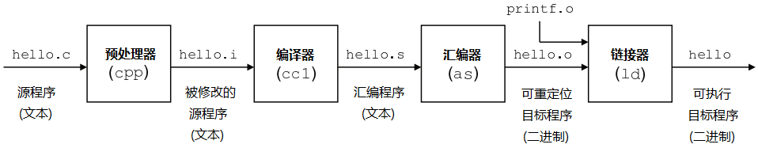

# ROS2


---

# 目录

- [ROS2](#ros2)
- [目录](#目录)
- [Link](#link)
  - [文档教程](#文档教程)
  - [视频教程](#视频教程)
- [常用命令](#常用命令)
- [常见问题](#常见问题)
- [The Construct](#the-construct)
- [【鱼香ROS】动手学ROS2](#鱼香ros动手学ros2)
  - [第 01 章 - ROS2 介绍 与 安装](#第-01-章---ros2-介绍-与-安装)
    - [基础篇 - Linux 基础](#基础篇---linux-基础)
    - [入门篇 - ROS2 介绍与安装](#入门篇---ros2-介绍与安装)
  - [第 02 章 - ROS2 第一个节点](#第-02-章---ros2-第一个节点)
  - [第 03 章 - ROS2 节点通信之话题与服务](#第-03-章---ros2-节点通信之话题与服务)
  - [第 04 章 - ROS2 通信之参数与动作](#第-04-章---ros2-通信之参数与动作)
  - [第 05 章 - ROS2 常用工具](#第-05-章---ros2-常用工具)
  - [第 06 章 - 运动学基础](#第-06-章---运动学基础)
  - [第 07 章 - ROS2 运动学](#第-07-章---ros2-运动学)
  - [第 08 章 - 机器人建模](#第-08-章---机器人建模)
  - [第 09 章 - 机器人仿真](#第-09-章---机器人仿真)
  - [第 10 章 - SLAM建图](#第-10-章---slam建图)
  - [第 11 章 - Nav2导航仿真实战](#第-11-章---nav2导航仿真实战)
  - [第 12 章 - Nav2进阶实践](#第-12-章---nav2进阶实践)
  - [第 13 章 - 嵌入式开发之从点灯开始](#第-13-章---嵌入式开发之从点灯开始)
  - [第 14 章 - 接入ROS2-MicroROS](#第-14-章---接入ros2-microros)
  - [第 15 章 - ROS2硬件实战（自制简易雷达）](#第-15-章---ros2硬件实战自制简易雷达)
  - [第 16 章 - 实体机器人硬件搭建](#第-16-章---实体机器人硬件搭建)
  - [第 17 章 - 嵌入式控制及通信开发](#第-17-章---嵌入式控制及通信开发)
  - [第 18 章 - 上位机建图及导航](#第-18-章---上位机建图及导航)
  - [第 19 章 - ROS2-Control](#第-19-章---ros2-control)
  - [第 20 章 - Moveit2仿真](#第-20-章---moveit2仿真)
  - [第 21 章 - Moveit2进阶](#第-21-章---moveit2进阶)
  - [第 23 章 - Moveit2真机控制](#第-23-章---moveit2真机控制)
- [扩展阅读](#扩展阅读)
  - [DDS 数据分发服务](#dds-数据分发服务)


---

# Link


## 文档教程

[ROS 官网](https://www.ros.org/)

[ROS2 中文网](http://dev.ros2.fishros.com/)

[鱼香社区](https://fishros.org.cn/forum/)

[ROS 2 文档 中文](http://dev.ros2.fishros.com/doc/)

[ROS Documentation 官方文档 英文](https://docs.ros.org/)

[ROS2 Documentation(humble) 官方文档 英文](https://docs.ros.org/en/humble/index.html)

## 视频教程

[【鱼香ROS】动手学ROS2基础篇|ROS2基础入门到实践教程](https://www.bilibili.com/video/BV1gr4y1Q7j5)

[【鱼香ROS】动手学ROS2进阶篇|机器人学基础](https://www.bilibili.com/video/BV1QY411a7v9)

[【古月居】古月·ROS2入门21讲](https://www.bilibili.com/video/BV16B4y1Q7jQ)

[ROS2基础入门教程(英文)](https://www.bilibili.com/video/BV19U4y1n7CQ)

[【鱼香ROS】14个ROS/ROS2版本任选 | 用Docker实现一键安装ROS](https://www.bilibili.com/video/BV1hY411N7HF)

[【布兰自动驾驶】ROS2机器人基础教程：理论与实战](https://www.bilibili.com/video/BV1TS4y1B7cQ)

---

# 常用命令

命令
1. **查看ROS版本** : printenv ROS_DISTRO  **result** : humble
2. 

# 常见问题
1. **sh: 0: getcwd() failed: No such file or directory** - 切换到其他目录 如 ~/


---

# The Construct

[ROS2 Basics in 5 Days (C++)](https://app.theconstruct.ai/courses/ros2-basics-in-5-days-humble-c-133/)


---

# 【鱼香ROS】动手学ROS2

[【鱼香ROS】 官网](https://fishros.com/)

[【鱼香ROS】动手学ROS2 - 文档](https://fishros.com/d2lros2/#/)

[【鱼香ROS】动手学ROS2基础篇|ROS2基础入门到实践教程 - B战视频](https://www.bilibili.com/video/BV1gr4y1Q7j5)

[【鱼香ROS】动手学ROS2进阶篇|机器人学基础|机器人URDF建模|Gazebo仿真 - B战视频](https://www.bilibili.com/video/BV1QY411a7v9/)

---

## 第 01 章 - ROS2 介绍 与 安装


### 基础篇 - Linux 基础

**操作系统**OS - 管理计算机 硬件与软件 资源的 计算机程序
1. 用户界面
   1. GUI - Graphical User Interface - 图形化界面
   2. CLI - Command-Line Interface - 命令行
2. 系统库
3. 系统工具 & 应用程序
4. 安全机制

**内核**Kernel - 负责管理计算机硬件资源，为应用程序提供运行时的基本服务
1. 进程管理
2. 内存管理
3. 设备驱动
4. 系统调用
5. 文件系统管理

内核是操作系统的一部分，是操作系统中最接近硬件的层级

操作系统的其他组件则建立在内核之上

内核负责处理硬件交互

Ubuntu 是 基于linux内核 的 桌面PC操作系统，术语上喜欢称Ubuntu是一个 linux 发行版

指令系统 (Instruction System)
1. **CISC** - Complex Instruction Set Computer
   1. 复杂、庞大 - 增强原有指令的功能，设置更为复杂的新指令 - 长度不固定
   2. 代表
      1. x86 - Intel公司 商业闭源 - i386(32位微处理器)
      2. IA-32 (Intel Architecture 32-bit) - 32位指令集架构
      3. Intel64 (Intel's 64-bit extension)
      4. AMD64 (Advanced Micro Devices 64-bit, x86-64) - AMD公司，向后兼容IA-32指令集，但增加了对64位数据处理和更大的内存寻址能力的支持
2. **RISC** - Reduced Instruction Set Computer
   1. 简单、精简 - 简化指令种类和指令功能，提高指令执行速度 - 长度固定
   2. 代表
      1. ARM
      2. MIPS
      3. RISC-V - 开源(BSD协议)
      4. AArch64/ARM64

指令集 (Instruction Set)

指令集架构 ISA (Instruction Set Architecture)

权限管理
1. rwx - 读写执行
   1. read     - r - 4
   2. write    - w - 2
   3. excute   - x - 1
2. 修改
   1. chown - 修改拥有者
   2. chgrp - 修改组
   3. chmod - 修改权限

sudo(superuser do) & root
1. 执行特权命令 - 普通用户可以使用 sudo 来执行通常需要 root 权限的命令，而无需切换到 root 用户
2. 安全性 - 可以记录执行的操作，并且通常需要输入执行命令的用户的密码
3. 权限控制 - 通过 /etc/sudoers 文件精细地控制哪些用户可以使用 sudo
4. sudo 命令用来以其他身份来执行命令，预设的身份为 root
5. Linux 系统中的 超级用户 root 账号通常 用于系统的维护和管理，对操作系统的所有资源 具有所有访问权限

**安装软件**
1. apt
2. snap
3. dpkg
4. 软件商店
5. 源码安装


**编译器 compiler**
1. 将高级语言(C、C++、Java) 转换为 机器语言
2. 工作流程
   
   1. 预处理 Preprocessing - 将头文件、宏进行展开
   2. 编译 Compilation - 编译程序的过程中调用不同的工具，执行语法分析、语义分析、生成抽象语法树(AST)，然后从AST生成中间代码
   3. 汇编 Assembly - 转换为机器语言的对象代码，二进制格式，还不能直接运行，还需要和其他对象文件或库一起被链接
   4. 链接 Linking - 将程序所需要的目标文件进行链接成可执行文件
3. 代表
   1. gcc - GNU Compiler Collection - 原先是 GNU C Compiler，现在除了c语言，还支持C++、java、Pascal等
   2. g++ - GCC套件中的C++编译器部分
   3. msvc - Microsoft Visual C++ - 微软提供的一个C和C++编译器和开发环境，是Visual Studio IDE的一部分
   4. mingw - Minimalist GNU for Windows - 将GCC编译器和相关工具移植到Windows平台
   5. clang - C、C++、Objective-C和Objective-C++编程语言的编译器前端，它使用LLVM作为其后端
   6. llvm - Low Level Virtual Machine


**解释器 interpreter**
1. 工作流程
   1. 读取代码
   2. 分析代码
   3. 执行代码
   4. 错误反馈 - 解释器通常会在运行时抛出错误或异常
   5. 交互式环境
   6. 动态类型检查 - 在运行时进行类型检查，变量的类型在程序执行过程中才确定
   7. 内存管理 - 管理程序运行时的内存分配和释放
2. 常见解释器
   1. Python解释器 - 执行Python脚本
   2. JavaScript解释器 - 在Web浏览器或Node.js环境中执行JavaScript代码
   3. Bash解释器 - 执行Shell脚本，用于自动化命令行任务


**主流语言 运行机制**
1. Java : 编译并解释 - 首先被 Java 编译器 javac 编译成字节码(.class，中间形式，既不是完全的机器语言，也不是原始的源代码)，字节码在运行时由 Java 虚拟机 JVM 解释执行
2. Python : 解释型语言 - 代码在运行时由 Python 解释器直接处理，通常是逐行解释。在更现代的 Python 实现中，源代码首先被编译成 Python 字节码 .pyc 文件，然后这些字节码被 Python 虚拟机 PVM 解释执行
3. C++ : 编译型语言 - C++ 源代码通过 编译器 直接编译成机器语言代码，编译生成的目标代码通常是多个对象文件(.o 或 .obj 文件)，需要通过一个链接器组合成一个可执行文件
4. 区别
   1. Java 和 Python 提供了更多的平台独立性和易用性，牺牲了一些性能
   2. Java 和 Python都使用虚拟机 JVM 和 PVM 来执行编译后的字节码，虚拟机抽象层允许代码在不同的操作系统和硬件上运行
   3. C++ 提供了更高的性能和更低级的系统访问，但牺牲了一定的可移植性(跨平台性)，提高了编写难度


**库文件**
1. 外部库
   1. 静态库(.a) - 在编译链接的时候把库的代码链接到可执行文件中，程序运行的时候将不再需要静态库，运行时也是比较占内存 - Windows中是 .lib (Static Libraries)
   2. 动态库(.so或.sa) - 也称 共享库 - 程序在运行的时候才去链接共享库的代码，多个程序共享使用库的代码，这样就减少了程序的体积 - Windows中是 .dll (Dynamic Link Library)
2. 头文件 & 库文件 的位置
   ```bash
   # 头文件(.h & .hpp)
   /usr/include
   /usr/local/include
   /usr/include/linux
   # 库文件(.so & .a)
   /usr/lib
   /usr/lib/x86_64-linux-gnu
   /lib
   /lib64
   ```

---

### 入门篇 - ROS2 介绍与安装

**ROS = robot operating system**

本身 **并非操作系统**，而是 **软件库&工具集**

设计了一整套 **通信机制** (话题、服务、参数、动作)，解决机器人各组件之间通信问题

**ROS 1 问题举例**
1. ROS 1 通信机制 包含 ROS Master的东西，所有节点(激光雷达、避障、底盘驱动等)的通信建立必须经过这个主节点。主节点挂掉后，就会造成整个系统通信的异常(避障策略等)，影响 ROS 做商业化机器人
2. 通信基于TCP实现，实时性差、系统开销大
3. 对Python3支持不友好，需要重新编译
4. 消息机制不兼容
5. 没有加密机制、安全性不高
6. 生命周期管理不完善


**ROS1 与 ROS2 架构对比**
1. **架构图 & 对比** - 论文 [Exploring the Performance of ROS2](https://readpaper.com/pdf-annotate/note?pdfId=4546269770222821377&noteId=2274943744417993728)
   
   
   1. **OS Layer - 操作系统层**
      1. 原来的只支持 linux 平台，现在支持 Windows、MAC 甚至是 嵌入式RTOS 平台
   2. **MiddleWare - 中间件层**
      1. 特点
         1. 去中心化 - ROS2 取消 master 节点(基于DDS的互相发现协议)，各个节点之间可以通过 DDS 的节点相互发现，各个节点都是平等的，且可以 1对1、1对n、n对n 进行互相通信
         2. 提供多个节点中间通信
         3. 通信更换为 **DDS** - 使得ROS2的实时性、可靠性和连续性上都有了增强
         4. ROS1 的中间件是 ROS组织 基于TCP/UDP 建立的
      2. **DDS Implementation Layer - DSS实现层**
         1. 对不同常见的DDS接口进行再次的封装，让其保持统一性，为DDS抽象层提供统一的API
         2. ROS2 为每家 DDS供应商 开发对应的 DDS_Interface 即 DDS接口层
      3. **Abstract DDS Layer - DDS抽象层 RMW**
         1. 通过 DDS Abstract 抽象层来 **统一 DDS 的 API**
         2. 将DDS实现层进一步的封装，使得DDS更容易使用
         3. DDS需要大量的设置和配置(分区，主题名称，发现模式，消息创建,...)
      4. **ROS2 Client Layer - ROS2客户端库 RCL**
         
         1. RCL (ROS Client Library) ROS客户端库，其实就是ROS的一种API，提供对ROS话题、服务、参数、Action等接口
         2. 不同语言对应不同 RCL - **Python:rclpy** - **C++:rclcpp** - 操作ROS2的节点话题服务
         3. RMW(中间件接口)层 是对各家 DDS 的抽象层，基于 RMW 实现 rclc，基于 rclc 实现了 rclpy 和 rclcpp
   3. **Application Layer - 应用层**
      1. 写代码以及ROS2开发的各种常用的机器人相关开发工具所在的层
2. **整体改进**
   1. python2 到 python3 的支持
   2. 编译系统的改进 catkin 到 ament
   3. C++ 标准更新到 C++11
   4. 相同 API 的 进程间 和 进程内 通信


**ROS 2 新概念**
1. 可用 Python 编写的 Launch 文件
2. 多机器人协同 通信支持
3. 支持 安全加密通信
4. 同一个 进程 支持多个节点
5. 支持 Qos 服务质量
6. 支持 节点生命周期管理
7. 高效的 进程间通信


**安装 & 卸载**
1. 一键安装 ROS2
   ```bash
   wget http://fishros.com/install -O fishros && . fishros
   ```
2. 手动安装 [Installation - Ubuntu (Debian packages)](https://docs.ros.org/en/humble/Installation/Ubuntu-Install-Debians.html)
3. 卸载
   ```bash
   sudo apt remove ros-humble-*
   sudo apt autoremove
   ```
4. 安装位置 - ROS安装的默认目录在/opt/ros/下，根据版本的名字进行区分
   ```bash
   cd /opt/ros/humble/ && ls
   ```

**HelloWorld**
1. 话题通信 - listener & talker
   ```bash
   ros2 run demo_nodes_py listener
   # 一开始无output，需要等talker运行，可以同时收听多个talker
   ros2 run demo_nodes_py talker
   ros2 run demo_nodes_cpp talker
   ```
2. turtle
   ```bash
   ros2 run turtlesim turtlesim_node
   ros2 run turtlesim turtle_teleop_key
   # Velocity command received during rotation goal. Aborting goal
   ```
3. rqt
   1. rqt is a framework for graphical user interfaces.
   2. It is extensible with plugins which can be written in either Python or C++.
   3. 选择插件 - introspection - node graph
   4. 也可以直接 rqt_graph


## 第 02 章 - ROS2 第一个节点

---

## 第 03 章 - ROS2 节点通信之话题与服务
---

## 第 04 章 - ROS2 通信之参数与动作
---

## 第 05 章 - ROS2 常用工具
---

## 第 06 章 - 运动学基础
---

## 第 07 章 - ROS2 运动学
---

## 第 08 章 - 机器人建模
---

## 第 09 章 - 机器人仿真
---

## 第 10 章 - SLAM建图
---

## 第 11 章 - Nav2导航仿真实战
---

## 第 12 章 - Nav2进阶实践
---

## 第 13 章 - 嵌入式开发之从点灯开始
---

## 第 14 章 - 接入ROS2-MicroROS
---

## 第 15 章 - ROS2硬件实战（自制简易雷达）
---

## 第 16 章 - 实体机器人硬件搭建
---

## 第 17 章 - 嵌入式控制及通信开发
---

## 第 18 章 - 上位机建图及导航
---

## 第 19 章 - ROS2-Control
---

## 第 20 章 - Moveit2仿真
---

## 第 21 章 - Moveit2进阶
---

## 第 23 章 - Moveit2真机控制

---

# 扩展阅读

## DDS 数据分发服务

[ROS2 的核心 - 数据分发服务DDS导论](https://www.bilibili.com/video/BV1sU4y1P7yn/)

**DDS (Data Distribution Service - 数据分发服务)**
1. 一种 **中间件协议标准**，旨在为 实时系统 提供 高性能、可扩展的 数据交换
2. 由 **OMG (Object Management Group)** 制定
3. 使用 **发布-订阅 (Pub/Sub) 模式**，发布者不需要知道谁是接收者，订阅者也不需要知道谁是发送者(解耦)
4. 技术核心 - **数据为核心的发布/订阅模型 Data-Centric Publish-Subscribe DCPS**，创建 **全域数据空间 Global Data Space** 概念，所有独立的应用都可访问
5. 数据通过定义好的 **主题** 来发布，订阅者可以订阅一个或多个主题，从而接收相关的数据
6. 优劣
   1. **优势**
      1. 实现系统解耦
      2. 延迟更低，吞吐量更高
      3. 远程参与者的自动发现
      4. 丰富的 QoS 参数集，允许调整通信各方面(靠性、持久性、冗余、寿命、传输设置、资源)
      5. 实时发布订阅协议 (RTPS) 几乎可以通过任何传输实现(UDP、TCP、共享内存 等)
      6. DDS 有定义好的 行为和规范，有完善的文档
   2. **劣势**
      1. API复杂，灵活性以复杂性为代价
      2. 系统开销相对较大
7. **架构**
   
   1. **DDS的定位** - Real-TIme - Mission/Business Critical


不可扩展的系统架构问题
1. 无互操作性
2. 系统结构复杂
3. 不可靠传输
4. 组件紧密耦合
5. 维护成本高
