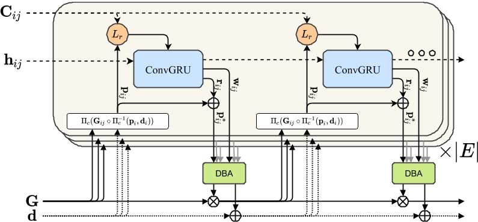
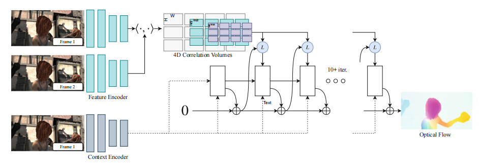

# DROID-SLAM : Deep Visual SLAM for Monocular, Stereo, and RGB-D Cameras (NeurIPS 2021)

[GitHub - DROID-SLAM](https://github.com/princeton-vl/DROID-SLAM)

[DROID-SLAM 作者(Zachary Teed) - 多视图三维视觉神经网络](https://www.bilibili.com/video/BV19z4y1Y7Lb/)

[Zachary Teed - Optimization Inspired Neural Networks for Multi-View 3D](https://www.youtube.com/watch?v=ul6pXRGKmco)

[DROID-SLAM : 单目、双目、RGBD相机的端到端视觉SLAM - 知乎](https://zhuanlan.zhihu.com/p/434471738)

[完美的深度学习slam框架 : Droid-slam](https://zhuanlan.zhihu.com/p/683210110)

[DROID-SLAM 代码详解](https://zhuanlan.zhihu.com/p/685402154)

## Table of Contents

- [DROID-SLAM : Deep Visual SLAM for Monocular, Stereo, and RGB-D Cameras (NeurIPS 2021)](#droid-slam--deep-visual-slam-for-monocular-stereo-and-rgb-d-cameras-neurips-2021)
  - [Table of Contents](#table-of-contents)
- [Notes](#notes)
  - [01 Introduction](#01-introduction)
  - [03 Approach](#03-approach)
    - [03.01 Feature Extraction and Correlation 相关性](#0301-feature-extraction-and-correlation-相关性)
    - [03.02 Update Operator](#0302-update-operator)
    - [03.03 Training](#0303-training)
    - [03.04 SLAM System](#0304-slam-system)
  - [04 Experiment](#04-experiment)
  - [05 Conclusion](#05-conclusion)
  - [Problem](#problem)

---

# Notes

## 01 Introduction

visual SLAM

consists of **recurrent iterative updates** of **camera pose** and **pixel-wise depth** through a **Dense Bundle Adjustment layer**

training only with monocular video

SLAM aims to build a map of the environment and localize the agent within the environment.

SfM focused on accurate tracking of long-term trajectories

full Bundle Adjustment (BA), jointly optimizes the camera poses and the 3D map in a single optimization problem

主要贡献
1. High Accuracy
2. High Robustness
3. Strong Generalization - can leverage stereo or RGB-D video

DROID - Differentiable Recurrent Optimization-Inspired Design (an end-to-end differentiable architecture)

recurrent iterative updates, building upon [RAFT](https://arxiv.org/abs/2003.12039) for optical flow
1. unlike **RAFT, which iteratively updates optical flow**, **we iteratively update camera poses and depth** (RAFT是对光流进行迭代更新，而DROID是对相机姿态和深度进行迭代更新). **RAFT operates on two frames**, **our updates are applied to an arbitrary number of frames**, enabling joint global refinement of all camera poses and depth maps(RAFT是基于两个帧操作，我们的更新可以应用于任意数量的帧，可以全局联合优化所有相机姿态和深度图，对于减小长路径和闭环的漂移至关重要)
2. each **update** of camera poses and depth maps in DROID-SLAM is **produced by a differentiable Dense Bundle Adjustment (DBA) layer**, which **computes a Gauss-Newton update to camera poses and dense per-pixel depth** so as to maximize their compatibility with the current estimate of optical flow. DBA layer leverages geometric constraints, improves accuracy and robustness, and enables a monocular system to handle stereo or RGB-D input without retraining.

## 03 Approach

two **objectives**
1. estimate the trajectory of the camera
2. build a 3D map of the environment

ordered images $\{\mathbf{I}_t\}_{t=0}^N$

for each image
1. 相机位姿序列 : ${\mathbf{G}_t} \in SE(3)$
2. 逆深度(深度的倒数)序列 : ${\mathbf{d}_t} \in R_{+}^{H × W}$
   1. 在逆深度表示下，近处物体的变化更显著，而远处物体的变化反而不显著
   2. 使远处的物体变化更平滑，有助于模型进行深度估计

$\{{\mathbf{G}_t}\}_{t=0}^N$ & $\{\mathbf{d}_t\}_{t=0}^N$
1. unknown state variables
2. get iteratively updated during inference as new frames are processed

adopt a frame-graph $(\mathcal{V}, \mathcal{E})$ to represent co-visibility between frames
1. $\mathcal{V}$，vertex。表示图像帧的集合(每一个顶点代表一帧图像)
2. $\mathcal{E}$，edge。edge $(i, j) \in \mathcal{E}$ means image $I_i$ and $I_j$ have overlapping fields of view which shared points(共视关系，不同图像帧之间可以看到相同的场景部分)

The frame graph is built dynamically during training and inference

After each pose or depth update, we can recompute visibility to update the frame graph

If the camera returns to a previously mapped region, we add long range connections in the graph to **perform loop closure**

### 03.01 Feature Extraction and Correlation 相关性

Key components of this stage are **borrowed from RAFT**

**Feature Extraction**
1. a feature extraction network (6 residual blocks and 3 downsampling layers)
2. producing dense feature maps at 1/8 the input image resolution
3. Like RAFT, we use two separate networks
   1. feature network 特征网络 - build the set of correlation volumes
   2. context network 上下文网络 - injected into the network during each application of the update operator.

**Correlation Pyramid**
1. for each edge in the frame graph $(i, j) \in \mathcal{E}$
   1. compute a **4D correlation volume** by taking the dot product between **all-pairs of feature vectors**特征向量对 in $g_{\theta}\left(I_{i}\right)$ & $g_{\theta}\left(I_{j}\right)$
      1. $$C_{u_{1} v_{1} u_{2} v_{2}}^{i j}=
            \left\langle
                g_{\theta}\left(I_{i}\right)_{u_{1} v_{1}}, g_{\theta}\left(I_{j}\right)_{u_{2} v_{2}}
            \right\rangle$$
      2. $g_{\theta}\left(I_{i}\right)$ 表示 表示图像 $I_{i}$ 经过特征提取网络 $g_{\theta}$ 之后生成的特征图
      3. $u_{1} v_{1}$, $u_{2} v_{2}$ 表示两个特征图中的像素位置
2. perform **average pooling** of the last two dimension of the correlation volume following RAFT to form a 4-level correlation pyramid

**Correlation Lookup 查找**
1. define a lookup operator which **indexes the correlation volume** using **a grid with radius r**
   1. $$L_{r}: \mathbb{R}^{H \times W \times H \times W} \times \mathbb{R}^{H \times W \times 2} \mapsto \mathbb{R}^{H \times W \times(r+1)^{2}}$$
   2. 4D correlation volume $\mathbb{R}^{H \times W \times H \times W}$
   3. lookup operator grid $\mathbb{R}^{H \times W \times 2}$
   4. output $\mathbb{R}^{H \times W \times(r+1)^{2}}$，从相关性体中提取一个半径为 $r$ 的邻域，得到 $(r+1)^2$  个值。这些值代表了这个邻域中的局部相似性，作为后续处理的输入特征
2. lookup operator takes an $H \times W$ grid of coordinates as input
3. values are retrieved from the correlation volume using **bilinear interpolation**
4. operator is applied to **each correlation volume in the pyramid** and the final feature vector is computed by concatenating the results at each level

### 03.02 Update Operator

**core component** of our SLAM system is a learned update operator

update operator is a $3 × 3$ convolutional GRU(Gated Recurrent Unit 门控循环单元) with **hidden state h** (hidden state != 模型参数，存储的是网络在每个时间步的状态信息，在推理期间随时间步迭代更新，用于记录和传递信息)

$\mathbf{G}^{(k+1)}=\operatorname{Exp}\left(\Delta \boldsymbol{\xi}^{(k)}\right) \circ \mathbf{G}^{(k)}$
$\mathbf{d}^{(k+1)}=\Delta \mathbf{d}^{(k)}+\mathbf{d}^{(k)}$

**Correspondence**

$\mathbf{p}_{i j}=\Pi_{c}\left(\mathbf{G}_{i j} \circ \Pi_{c}^{-1}\left(\mathbf{p}_{i}, \mathbf{d}_{i}\right)\right)$
$\mathbf{p}_{i j} \in \mathbb{R}^{H \times W \times 2}$
$\mathbf{G}_{i j}=\mathbf{G}_{j} \circ \mathbf{G}_{i}^{-1} .$

**Inputs**

**Update**

**Dense Bundle Adjustment Layer (DBA)**

$$\mathbf{E}\left(\mathbf{G}^{\prime}, \mathbf{d}^{\prime}\right)=\sum_{(i, j) \in \mathcal{E}}\left\|\mathbf{p}_{i j}^{*}-\Pi_{c}\left(\mathbf{G}_{i j}^{\prime} \circ \Pi_{c}^{-1}\left(\mathbf{p}_{i}, \mathbf{d}_{i}^{\prime}\right)\right)\right\|_{\Sigma_{i j}}^{2} \quad \Sigma_{i j}=\operatorname{diag} \mathbf{w}_{i j}$$

$$\left[\begin{array}{cc}
\mathbf{B} & \mathbf{E} \\
\mathbf{E}^{T} & \mathbf{C}
\end{array}\right]\left[\begin{array}{l}
\Delta \boldsymbol{\xi} \\
\Delta \mathbf{d}
\end{array}\right]=\left[\begin{array}{c}
\mathbf{v} \\
\mathbf{w}
\end{array}\right] \quad \begin{array}{l}
\Delta \boldsymbol{\xi}=\left[\mathbf{B}-\mathbf{E C}^{-1} \mathbf{E}^{T}\right]^{-1}\left(\mathbf{v}-\mathbf{E C}^{-1} \mathbf{w}\right) \\
\Delta \mathbf{d}=\mathbf{C}^{-1}\left(\mathbf{w}-\mathbf{E}^{T} \Delta \boldsymbol{\xi}\right)
\end{array}$$

### 03.03 Training

### 03.04 SLAM System

system contains two threads which run asynchronously
1. **frontend thread** takes in new frames, extracts features, selects key-frames, and performs local bundle adjustment
2. **backend thread** simultaneously performs **global** bundle adjustment over the entire history of key-frames

Initialization
1. simply collect frames until we have a set of 12 (only keep the previous frame if optical flow is greater than 16px)
   1. 确保只保留包含显著运动的帧，而丢弃那些与前一帧非常相似的帧，从而减少计算负担和提高系统效率
   2. 光流大于 16 像素意味着相机或物体在场景中发生了足够大的移动，可以为后续的姿态估计和深度更新提供有效的增量信息
   3. 需要实时处理大量的输入帧。如果每一帧都进行处理，可能会导致计算资源不足
2. Once 12 frames have been accumulated, we initialize a frame graph by **creating an edges between key-frames** which are **within 3 time-steps** apart
3. then run 10 iterations of the update operator
   1. 利用 Update Operator 中的迭代公式
   2. 应用更新操作来 优化相机位姿$\mathbf{G}$ 和 深度估计$\mathbf{d}$

Frontend
1. operates directly on the **incoming video stream**
2. maintains a collection of key-frames and a frame graph storing edges between co-visible key-frames (维护关键帧的集合，并存储关键帧之间的共视边缘)
3. Key-frame poses and depths are actively being optimized

Backend
1. performs **global bundle adjustment** over the entire history of key-frames

Stereo and RGB-D
1. RGB-D : treat depth as a variable, since sensor depth can be noisy and have missing observations, and simply add a term to the optimization objective(DBA layer 公式) which penalizes the squared distance between the measured and predicted depth
2. stereo : use the exact same system, with **just double the frames**, and **fix the relative pose between the left and right frames** in the DBA layer.

## 04 Experiment

## 05 Conclusion

end-to-end neural architecture for visual SLAM

can be used on monocular, stereo, and RGB-D video

## Problem

Fixed Thresholds
1. During the Initialization Procedure, they simply collect frames until we have a set of 12 (only keep the previous frame if optical flow is greater than 16px)
2. Ignore the far distance information.
3. Will the configuration work for all situations?
4. Will the robustness and memory-consuming of the DROID-SLAM be affected a lot when change these thresholds a little?

Memory-Consuming
1. Frontend needs 8GB of memory.
2. Backend, which requires storing feature maps from the full set of images, is more memory intensive.
3. Results on EuRoC, TartanAir and ETH-3D (where video can be up to 5000 frames) requires a GPU with 24GB memory.
4. From a product implementation perspective, it seems difficult to apply in typical consumer-facing products, but it works well for running offline localization and mapping.
5. The group has publish another paper [Deep Patch Visual SLAM](https://arxiv.org/pdf/2408.01654v1), whose memory usage is less than half of DROID-SLAM.

Too Brutal when Tackle Stereo Info
1. Simply use the exact same system, with **just double the frames**, and **fix the relative pose between the left and right frames**.
2. Ignoring the additional depth info and correspondence info for the stereo images.

Feature Extraction Part are mainly borrowed from RAFT
1. Structure of feature extraction network : 6 residual blocks and 3 downsampling layers.
2. Producing dense feature maps at 1/8 the input image resolution.
3. Will traditional features extraction method(SIFT/SURF/ORB) adaptable to more scenarios?

