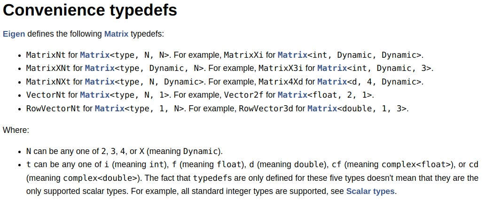

# 视觉SLAM14讲

[toc]

## Portals

[Github 视觉SLAM14讲代码](https://github.com/gaoxiang12/slambook)

# Chap01

# Chap02

# Chap03 三维空间刚体运动

## Eigen

[Eigen官网](https://eigen.tuxfamily.org/index.php?title=Main_Page)

[Eigen使用汇总](https://www.cnblogs.com/python27/p/EigenQuickRef.html)

Eigen doesn't do automatic type promotion

### Compiling and running

```
g++ -I /path/to/eigen/ my_program.cpp -o my_program 
```

```cpp
#include <eigen3/Eigen/Core>
#include <eigen3/Eigen/Dense>

using Eigen::Matrix;
using Eigen::MatrixXd;
using Eigen::MatrixXf;
```

### Matrix Class
```cpp
// first three template parameters of Matrix
Matrix<typename Scalar, int RowsAtCompileTime, int ColsAtCompileTime>
// Matrix
typedef Matrix<float, 4, 4> Matrix4f;
// Vectors
typedef Matrix<float, 3, 1> Vector3f;
typedef Matrix<int, 1, 2> RowVector2i;
// special value Dynamic
typedef Matrix<double, Dynamic, Dynamic> MatrixXd;
typedef Matrix<int, Dynamic, 1> VectorXi;
```

**Fixed & Dynamic**
matrix较小时，推荐使用fixed，快且避免动态内存申请。但matrix过大，推荐dyanmic，使用fixed可能导致stack overflow。
```cpp
// fixed sizes
// avoid dynamic memory allocation and to unroll loops
// really has zero runtime cost
Matrix4f mymatrix;
// 相当于
float mymatrix[16];

// dynamic sizes
// the array of a dynamic-size matrix is always allocated on the heap
// the MatrixXf object stores its number of rows and columns as member variables
MatrixXf mymatrix(rows,columns);
// 相当于
float *mymatrix = new float[rows*columns]; 
```



### Matrix and Vector Arithmetics

**Addition and subtraction**
left hand side and right hand side must have the same numbers of rows and of columns

==left hand side and right hand side must, of course, have the same numbers of rows and of columns==( Eigen doesn't do automatic type promotion 自动类型提升)

```
双目运算符
binary operator + as in a+b
binary operator - as in a-b
单目运算符
unary operator - as in -a
复合运算符
compound operator += as in a+=b
compound operator -= as in a-=b
```

**Scalar multiplication and division**

```
binary operator * as in matrix*scalar
binary operator * as in scalar*matrix
binary operator / as in matrix/scalar
compound operator *= as in matrix*=scalar
compound operator /= as in matrix/=scalar
```

**Transposition and conjugation and adjoiny**
The transpose（转置）, conjugate（共轭） and adjoint（伴随） of a matrix or vector a are obtained by the member functions transpose(), conjugate(), and adjoint(), respectively

```cpp
a.transpose()
a.conjugate()
a.adjoint()
```

**Matrix-matrix and matrix-vector multiplication**

```
binary operator * as in a*b
compound operator *= as in a*=b (this multiplies on the right: a*=b is equivalent to a = a*b)
```


**Dot product and cross product**
```cpp
v.dot(w)
v.cross(w)
// dot product can also be obtained as a 1x1 matrix as v.adjoint()*w
v.adjoint()*w
```


**Basic arithmetic reduction operations**
provides some reduction operations to reduce a given matrix or vector to a single value
1. .sum()
2. .prod()
3. .mean()
4. .minCoeff()
5. .maxCoeff()
6. .trace():the sum of the diagonal coefficients and can also be computed as efficiently using a.diagonal().sum()


**Validity of operations**
Eigen checks the validity of the operations that you perform. 

对于fixed，在complie-time检查：Compile-time error: YOU_MIXED_MATRICES_OF_DIFFERENT_SIZES

对于dynamic，在run-time检查：Run-time assertion failure here: "invalid matrix product"


# Chap04

# Chap05

# Chap06

# Chap07

# Chap08

# Chap09

# Chap10

# Chap11

# Chap12

# Chap13

# Chap14


