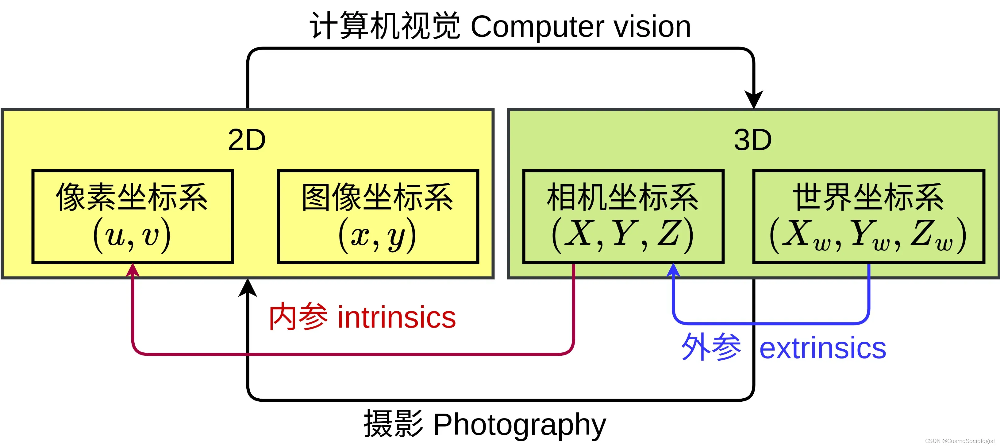
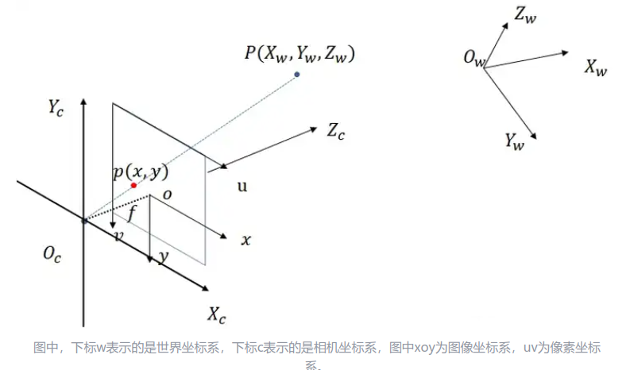

# VSLAM

## Table of Contents

---

# 比飞鸟贵重的多_HKL

[B站视频 - 视觉SLAM - 比飞鸟贵重的多_HKL](https://space.bilibili.com/218427631/search/video?keyword=slam)

## 01 - 相机模型

[相机模型](https://blog.csdn.net/qq_40918859/article/details/122271381)

坐标系
1. 世界坐标系 World (单位 : m)
2. 相机坐标系 Camera (单位 : m)
3. 图像坐标系 Image (单位 : mm) 成像平面的重心为原点
4. 像素坐标系 Pixel (单位 : **pixel**) 数字图片的左上角为原点

## 02 - 视觉里程计

通过 2帧图像，完成 特征点 检测 & 匹配，计算 相机做的运动(Rotation & Translation)

已知像素坐标

取两帧图像中的前一阵的相机坐标系，作为世界坐标系 (方便表示两帧图像中，相机的运动)

## 03 - 3D-2D之直接线性方法(DLA)

## 04 - P3P

## 05 - 3D-2D Bundle Adjustment 优化

