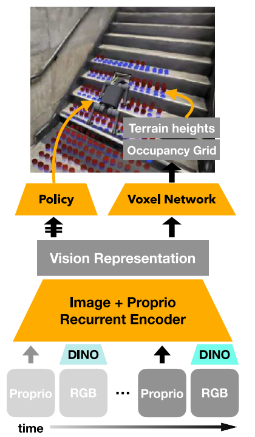

# GaussGym

---

[GaussGym - Project Website](https://escontrela.me/gauss_gym/)

[GaussGym - Github](https://github.com/escontra/gauss_gym)

[GaussGym Dataset - HuggingFace](https://huggingface.co/collections/escontra/gauss-gym-datasets)

[3D Gaussian Splatting - 个人笔记](../../../ComputerVision/Reconstruction3D/GaussianSplatting/GaussianSplatting.md)

---

## Table of Contents

- [GaussGym](#gaussgym)
  - [Table of Contents](#table-of-contents)
- [代码](#代码)
  - [Installation \& Conda Envs](#installation--conda-envs)
  - [Config](#config)
  - [Train](#train)
  - [Evaluate](#evaluate)
  - [3D GS](#3d-gs)
  - [VGGT](#vggt)
- [论文](#论文)
  - [Abstract](#abstract)
  - [Introduction](#introduction)
  - [Related Work](#related-work)
    - [Sim2Real RL for Locomotion](#sim2real-rl-for-locomotion)
    - [Scene Generation](#scene-generation)
    - [Radiance Fields in Robotics](#radiance-fields-in-robotics)
  - [GaussGym](#gaussgym-1)
  - [Results](#results)
  - [Limitation](#limitation)
  - [Conclusion](#conclusion)


---

# 代码

## Installation & Conda Envs

```bash
conda env list
conda info --envs

bash setup_dev.sh  # 在 ~/.gauss_gym_deps 下 创建 gauss_gym conda 环境
source ~/.gauss_gym_deps/miniconda3/bin/activate gauss_gym  # 激活 gauss_gym
```

## Config

task 存放位置 `gauss_gym/envs`

task 注册位置 `gauss_gym/envs/__init__.py`


## Train

```bash
gauss_train --task=t1_vision --env.num_envs 512
# gauss_train = "gauss_gym.scripts.train:main"  # 在 pyproject.toml
```


`gauss_gym/scripts/train.py`

```python
task_class = task_registry.get_task_class(cfg['task'])
runner = eval(cfg['runner']['class_name'])(env, cfg, device=cfg['rl_device'])
runner.learn()  # 写在 gauss_gym/rl/runner.py
```


## Evaluate


```bash
gauss_play --runner.load_run=t1_2025-12-08-13-06-48
# gauss_play = "gauss_gym.scripts.play:main"  # 在 pyproject.toml
```

`gauss_gym/scripts/play.py`

```python
cfg = helpers.get_config(load_run_path)  # 从 logs 中 读出 训练时的配置 train_config.yaml
task_class = task_registry.get_task_class(cfg['task'])
runner = eval(cfg['runner']['class_name'])(env, cfg, device=cfg['rl_device'])
runner.play()  # 写在 gauss_gym/rl/runner.py
```

通过 viser 可视化 服务器 查看，浏览器中打开 : http://localhost:8080

`tensorboard --logdir logs/<log_path>`


## 3D GS

`gauss_gym/utils/batch_gs_renderer.py`
1. 调用外部库 `gsplat.rendering.rasterization`，把 Gaussian 参数渲染成 RGB+D


`gauss_gym/utils/gaussian_terrain.py`
1. 物理 用 trimesh 在 IsaacGym 里碰撞，视觉 用 Gaussian Splats 渲染图像


## VGGT


---

# 论文


## Abstract

Renderer : 3D Gaussian Splatting

Simulator : IsaacGym

high visual/perception fidelity

rich visual semantics

scalable & generalizable

---

## Introduction

Current Problems
1. sim2real without adaption, can not leverage visual info
2. slow and inaccurate for existing simulators to treate visual info
3. rely on LiDAR/depth, can not exploit semantic cues

GaussGym
1. physics + photorealistic
2. based on **advanced 3D reconstruction** & **differentiable rendering**
3. support diverse inputs(scene creation)
   1. smartphone scan
   2. fully sensorized SLAM captures
   3. 3D datasets
   4. output of generative video models
4. train directly from RGB -> policy need infer geometry from vision
   1. add auxiliary reconstruction loss
   2. guided ground truth mesh data
5. zero-shot transfer
   1. visual stair-climbing
   2. semantic reasoning navigation goal-reaching

---

## Related Work

### Sim2Real RL for Locomotion

CPU-based simulator
1. MuJoCo
2. PyBullet

GPU-based simulator
1. IsaacGym
2. IsaacSim
3. Genesis

**visual-sim2real gap** -> restricted to geometric(depth / heightmap) & proprioceptive inputs

3D GS - implicit learned scene representation

### Scene Generation

original terrain generation : heuristic & handcrafted rules
1. Pros : effective for defining geometric terrains
2. Cons : not allow specifying meaningful visual appearance
3. need textured asset

SfM related methods
1. get pointclouds -> reconstruct mesh
2. without re-render the scene in RGB, no RGB information

asset-libraries related methods
1. rely on textured-mesh assets
2. lower visual fidelity

NeRF2Real (the paper builds on which)
1. improve visual fidelity
2. capture scenes with NeRF(Neural Radiance Field)
3. mesh extraction & manual post-processing
4. Cons
   1. computationally expensive
   2. slow ray-tracing
   3. lacks vectorization support

3DGS in Robotics Manipulation
1. create articulated scenes
2. predict object's URDF (eg : actuation)
3. from a single image

LucidSim
1. Contributions
   1. generate visual training data : ControlNet diffusion model + use depth map & semantic masks to generate visual training data
   2. real2sim framework : train 3DGS + **manually** align reference frames & meshes(created with Polycam)

Video Generation
1. trained on internet-scale data
2. controllable
3. synthesize photorealistic & multi-view-consistent video
4. slow inference speed (impractical as direct simulator), scalable


### Radiance Fields in Robotics

NeRF
1. representation for high-quality scene reconstruction (from **posed images**)
   1. further works' improvement : visual quality, large-scale scenes, optimization speed, dynamic scenes
2. with robot manipulation
   1. grasping **leverage** high-quality visual reconstruction
   2. language-guided manipulation **leverage** embed higher dimensional features
3. Limitation : slow training speed

3DGS
1. **mitigate** slow training speed of NeRF
2. oriented 3D gaussians can be differentiably **rasterized**(光栅化)
3. high-dim feature fields(other than RGB & transparency) -> 3DGS for rapid training & rendering

Radiance Fields
1. large-scale scene representations
2. for navigation
   1. differentiable collision representation
   2. visual simulator
3. for locomotion training
   1. extra view augmentation

Compared with LucidSim
1. similar real2sim approach
2. easily scales to thousands of scanned scenes
3. integrate with parallel physics simulation


---

## GaussGym

**overall pipeline**
1. Data
2. VGGT : visual grounded geometry transformer
   1. intermediate representation : camera intrinsics, extrinsics, dense point clouds, normals
3. Mesh - physics
   1. use neural surface reconstruction module to generate
4. 3DGS - visual
   1. initialized from VGGT point cloud
   2. accurate geometry
   3. rapid convergence
5. automatically aligned in shared global frame
   1. share same intermediate representation (same pointclouds)


data collection & processing
1. ingest data from wide range of resources
2. before processing : data formatted to a common gravity-aligned reference frame
3. VGGT -> intermediate representation
4. NKSR -> high-quality meshes
5. 3D GS -> geometric alignment & accelerate convergence
6. extend LucidSim
   1. not limited to smartphone scans
   2. no need to manual registration mesh & 3DGS
   3. vectorized rendering


3D GS as a drop-in renderer
1. rasterized in parallel across simulated envs
2. compared to traditional raytracing & rasterization pipeline
   1. photorealistic rendering + minimal overheads + amenable to vectorized execution
3. batch-render + multi-threaded PyTorch kernels -> efficient GPU utilization & distributed training


optimization for high-throughput & realism
1. maximize efficiency : decouple rendering from proprioceptive control rate & simulation freq
   1. render at cam's real frame rate, slower than control freq
2. reduce sim2real gap : simulate motion blur (**alpha-blend**)
   1. a small set of frames offset along cam's velocity direction
   2. realistic blur artifacts
   3. improve visual fidelity & robustness
   4. noticeable during sudden jolts / jerky motions (climbing stairs & high-speed movements)

---

## Results

Visual Locomotion & Navigation
1. visual stair climbing + visual navigation (diverse visually complex terrains)
2. asymmetric actor-critic framework
3. not using teacher-student distillation (multi-stage) -> end2end (single-stage)

Neural Architecture
1. 
2. **recurrent encoder** fuses visual & proprioceptive streams
3. combined features
   1. proprioceptive measurements `concat` **DinoV2** embeddings (from raw RGB frame)
   2. **LSTM** -> compact latent representation (temporal dynamics & visual semantics)
   3. for faster inference speed, use LSTM instead of Transformer
4. 2 task-specific heads
   1. Voxel Prediction Head
      1. latent vector -> **unflatten** -> coarse 3D grid -> **3D transposed CNN** -> dense volumetric prediction of occupancy & terrain heights
         1. 3D is better than 2D (more than heightmap, eg : collision, blind spot)
      2. the representation capture the geometry of the scene
   2. Policy Head
      1. **LSTM**
      2. input  : latent representation + recurrent hidden state
      3. output : parameters of Gaussian distribution (of joint position offset)

Visual Locomtion Results
1. with RGB imgs, learn to
   1. precisely place feet on stairs
   2. adapt gait avoid collide with risers
2. sim2real transfer without additional fine-tuning


Visual Navigation Results
1. obstacle-field experiment
   1. sparse goal tracking task, navigate around obstacles to reach waypoints
   2. RGB policy avoid yellow patch (penalty region)
   3. RGB convey richer semantic cues than geometric depth
2. ablation
   1. 4 simulation scenarios (flat / steep / short stairs / tall stairs)
   2. performance reduce if without regressing on voxel grid or pre-trained DINO encoder
   3. GaussGym's seamless infra to train across multiple scenes

---

## Limitation

offer platform for developing visual sim2real algos to narrow the gap

vision-based policies learn to avoid high-cost regions & achieve precise foothold

further
1. evaluate policy on unseen staircases
2. transfer to real, foothold not precise
3. physical delays (image latency)
4. rely on egocentric observations
5. geometry-based methods (elevation maps with high-freq state estimation) simplify the locomotion problems (RGB is more difficult)


for visual infomation critical tasks
1. lack automated mechanism for generate cost/reward functions
2. hand-crafted cost terms
3. maybe use language models to define these function

assets of GaussGym
1. uniform physical parameters (friction)
2. prevent accurate simulation of surfaces (ice, mud, sand)

vision models
1. inherit SOTA vision models' limitations
2. maybe world models in the future
3. can't handle other than simple rigid-body physics provided by IsaacGym
   1. dynamic scenes
   2. simulate fluids
   3. deformable assets

---

## Conclusion

fast, iopen-source photorealistic simulator

policy trained with GaussGym exhibit vision-perceptive behavior in sim & show partial transfer to real


