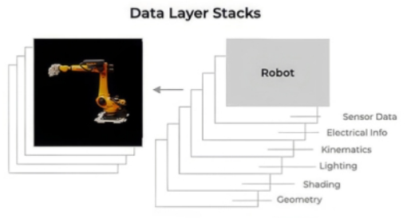

# IsaacSim & IsaacLab

[Robotics Fundamentals - NVIDIA Courses](https://www.nvidia.com/en-us/learn/learning-path/robotics/)

[IsaacSim - NVIDIA Developer](https://developer.nvidia.com/isaac/sim)

[IsaacSim Documentation (5.1.0) - NVIDIA Docs](https://docs.isaacsim.omniverse.nvidia.com/5.1.0/index.html)

[IsaacLab Documentation (main) - NVIDIA Docs](https://isaac-sim.github.io/IsaacLab/main/index.html)

---

## Table of Contents

- [IsaacSim \& IsaacLab](#isaacsim--isaaclab)
  - [Table of Contents](#table-of-contents)
- [Introduction](#introduction)
- [Installation](#installation)
  - [Workstation Installation](#workstation-installation)
  - [Container Installation](#container-installation)
  - [Python Environment Installation](#python-environment-installation)
  - [VSCode Extension](#vscode-extension)
- [Quick Start](#quick-start)

---


# Introduction

OpenUSD
1. [Learn OpenUSD - NVIDIA Docs](https://docs.nvidia.com/learn-openusd/latest/index.html)
2. 
3. 皮克斯动画工作室发明 (Pixar Animation Studios)
4. USD 格式 (Universal Scene Description)
5. 工作原理
   1. Prims/Primitives (图元)   : 场景中的 基本对象
   2. OpenUSD Stage (舞台)      : 整个 3D 场景的顶层容器
   3. Data Layer Stack (数据层) : 每个 layer 有一个 场景描述 (eg : physics, lightning, shading, geometry)
      1. 
   4. Composition Arcs (组合弧) : 定义 如何 把 层 拼起来，不复制数据 只引用
6. 仿真优化
   1. Asset Structuring : 将 大场景 拆解为 可复用的小组件，按需加载，提高性能
   2. Simulation-Ready Standards : 渲染 + 物理属性
7. 优势
   1. Extensible      可扩展   : 开放的 API/SDK/框架
   2. Non-Destructive 非破坏性 : 不修改原始文件，多人协作不冲突
      ```txt
      Final = [ Original ]  <-- 始终保存，没人动它
            + [ Physical (你改的) ]
            + [ Visual (美术改的) ]
            + [ Sensor (算法改的) ]
      ```
   3. Collaborative   协作性   : 利用 file-system-agnostic document model，支持 不同 数据源 & 存储方式
   4. Standardized    标准化   : 由 AOUSD 联盟(Pixar, NVIDIA, Apple 等) 制定标准


PhysX (物理引擎)

IsaacLab


Deprecated
1. Omniverse Launcher
2. Nucleus Workstation
3. Nucleus Cache → Hub Workstation Cache


---

# Installation

[Installation (5.1.0) - NVIDIA Docs](https://docs.isaacsim.omniverse.nvidia.com/5.1.0/installation/index.html)
1. Isaac Sim Requirements
2. Download Isaac Sim
3. Workstation Installation


## Workstation Installation

workstation & docker 区别
1. docker 版本 不含 Nucleus，默认直接从云端拉取资产
2. 推荐 root folder
   1. workstation package : `~/isaacsim` / `C:\isaacsim`
   2. docker container    : `/isaac-sim`

下载压缩包 - [Latest Release](https://docs.isaacsim.omniverse.nvidia.com/5.1.0/installation/download.html#isaac-sim-latest-release)

```bash
mkdir ~/isaacsim
cd ~/Downloads
unzip "isaac-sim-standalone-xxx.zip" -d ~/isaacsim
cd ~/isaacsim
./post_install.sh  # 创建 symlink 到 extension_examples 可以通过 `ll extension_examples` 产看 + 创建 .desktop
./isaac-sim.selector.sh  # 交互窗口 选择 IsaacSim Full / IsaacSim Full Streaming
```

好像 selector 显示 Deprecated


## Container Installation

Container Setup (Prerequisites) 参考 [NvidiaContainerToolkit 安装 - 个人笔记](../../../Software/Docker/NvidiaContainerToolkit.md)

可以有 GUI，通过 **X11 Forwarding**

```bash
# 拉取 IsaacSim 镜像
docker pull nvcr.io/nvidia/isaac-sim:5.1.0

# 在 宿主机(本地) 创建 用于 缓存的 卷挂载目录
# Docker 容器默认 用完即扔，关闭容器 在容器内 产生的所有临时文件、下载的模型、编译的数据都会消失
mkdir -p ~/docker/isaac-sim/cache/main/ov
mkdir -p ~/docker/isaac-sim/cache/main/warp
mkdir -p ~/docker/isaac-sim/cache/computecache
mkdir -p ~/docker/isaac-sim/config
mkdir -p ~/docker/isaac-sim/data/documents
mkdir -p ~/docker/isaac-sim/data/Kit
mkdir -p ~/docker/isaac-sim/logs
mkdir -p ~/docker/isaac-sim/pkg
sudo chown -R 1234:1234 ~/docker/isaac-sim

# 在 交互式 Bash 会话中 运行 IsaacSim Container
xhost +local:  # 在 本机 执行，告诉图形界面服务器(X Server)，允许本地用户(包括运行在本地的容器)访问显示器
docker run --name isaac-sim \  # --name 给 container 起名
    --entrypoint bash \  # --entrypoint 覆盖镜像中默认设定的 启动命令(开启一个 bash 终端)
    -it \  # -it Interactive & TTY
    --gpus all \  # 把宿主机所有的 NVIDIA 显卡都借给容器用
    --rm \  # --rm 退出即删除
    --network=host \  # --network=host 共享网卡
    # -e 设置环境变量
    -e "ACCEPT_EULA=Y" \ #
    -e "PRIVACY_CONSENT=Y" \ #
    -e DISPLAY \  # 把宿主机的 DISPLAY 环境变量(比如 :0 或 :1) 传给容器 `echo $DISPLAY`
    # -v : Volume，格式 : -v [宿主机路径] : [容器内路径] : [权限]
    -v $HOME/.Xauthority:/isaac-sim/.Xauthority \  # 把宿主机的 .Xauthority 文件(相当于显示器的 安全通行证/Cookie)挂载给容器
    -v ~/docker/isaac-sim/cache/main         : /isaac-sim/.cache                   :rw \ #
    -v ~/docker/isaac-sim/cache/computecache : /isaac-sim/.nv/ComputeCache         :rw \ #
    -v ~/docker/isaac-sim/logs               : /isaac-sim/.nvidia-omniverse/logs   :rw \ #
    -v ~/docker/isaac-sim/config             : /isaac-sim/.nvidia-omniverse/config :rw \ #
    -v ~/docker/isaac-sim/data               : /isaac-sim/.local/share/ov/data     :rw \ #
    -v ~/docker/isaac-sim/pkg                : /isaac-sim/.local/share/ov/pkg      :rw \ #
    # 指定容器内以 ID 为 1234 的 用户(User) & 组(Group) 身份运行，对应之前的 sudo chown -R 1234:1234 ~/docker/
    -u 1234:1234 \ #
    isaac-sim
    nvcr.io/nvidia/isaac-sim:5.1.0  # image 地址

# Check Compatibility
./isaac-sim.compatibility_check.sh

# GUI 启动 IsaacSim
./runapp.sh
```


## Python Environment Installation

IsaacSim requires `Python 3.11`

Linux 需要 GLIBC 2.35+ (`manylinux_2_35_x86_64`) 来让 pip 发现 & 安装 Python Packages，查看命令 `ldd --version`

Windows 需要 `enable long path`

安装 miniconda

pip 安装

```bash
# 创建 虚拟环境
conda create -n env_isaacsim python=3.11
conda activate env_isaacsim

# 安装 完整 IsaacSim
pip install isaacsim[all,extscache]==5.1.0 --extra-index-url https://pypi.nvidia.com

# 使用 Compatibility Checker
pip install isaacsim[compatibility-check]
isaacsim isaacsim.exp.compatibility_check

# 打开可视化窗口
isaacsim
```


## VSCode Extension

[IsaacSim VSCode Edition - VSCode MarketPlace](https://marketplace.visualstudio.com/items?itemName=NVIDIA.isaacsim-vscode-edition)


---


# Quick Start

Basic Usage
1. **Create**
   1. Physics
      1. Ground Plane
   2. Lights
      1. Distant Light
   3. Shape (仅有 Visual)
      1. Cube
2. Move & Rotate & Scale
   1. 长按可以选择 local/global frame
      1. 
   2. 快捷键
      1. Move   (W)
      2. Rotate (E)
      3. Scale  (R)
3. Physics & Collision Properties
   1. 在 Stage Tree 选中 Object
   2. Property 窗口 中 `+ ADD`
   3. `Physics` -> `Rigid Body with Colliders Preset`(rigid body physics & collision meshes)
4. 撤销 `Ctrl + Z` & 反撤销 `Ctrl + Y`


