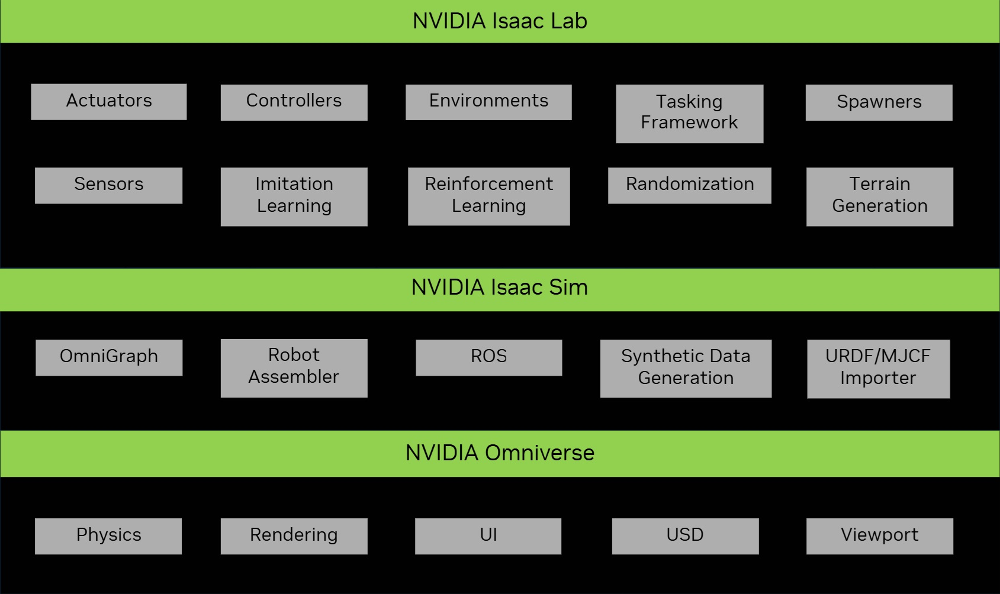
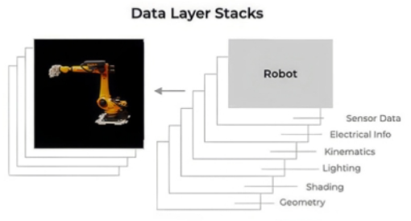
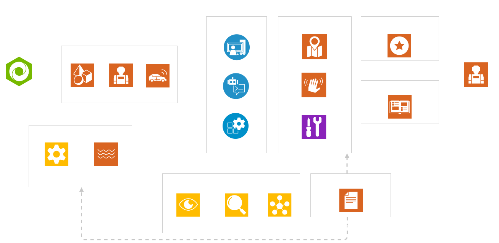
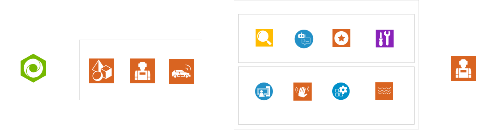
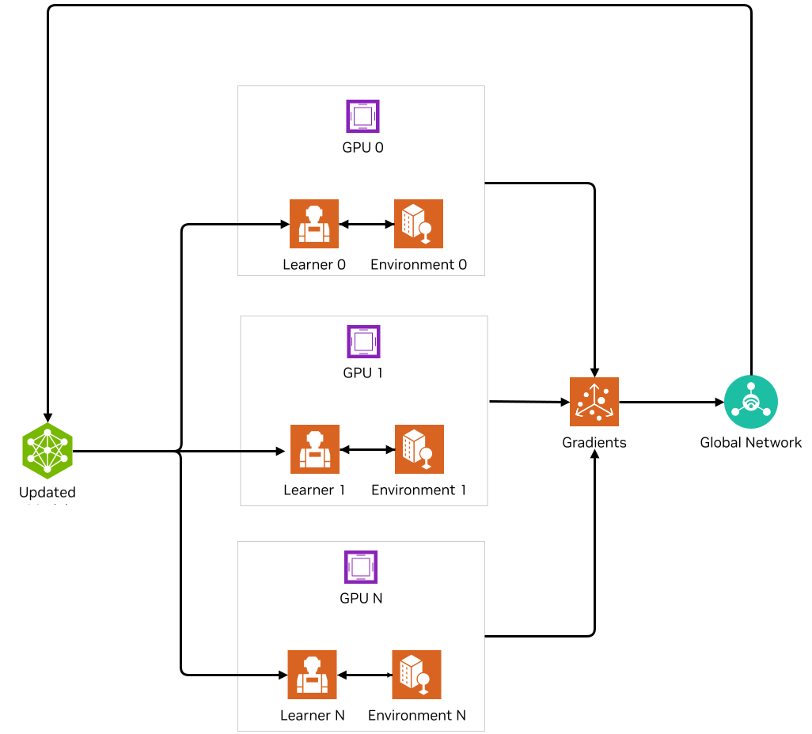

# IsaacSim & IsaacLab

[Robotics Fundamentals - NVIDIA Courses](https://www.nvidia.com/en-us/learn/learning-path/robotics/)

[IsaacSim - NVIDIA Developer](https://developer.nvidia.com/isaac/sim)

[IsaacSim Documentation (5.1.0) - NVIDIA Docs](https://docs.isaacsim.omniverse.nvidia.com/5.1.0/index.html)

[IsaacLab Documentation (main) - NVIDIA Docs](https://isaac-sim.github.io/IsaacLab/main/index.html)

---

## Table of Contents

- [IsaacSim \& IsaacLab](#isaacsim--isaaclab)
  - [Table of Contents](#table-of-contents)
- [Introduction](#introduction)
- [IsaacSim](#isaacsim)
  - [Installation](#installation)
    - [Workstation Installation](#workstation-installation)
    - [Container Installation](#container-installation)
    - [Python Environment Installation](#python-environment-installation)
    - [VSCode Extension](#vscode-extension)
  - [Quick Start](#quick-start)
- [IsaacLab](#isaaclab)
  - [Installation](#installation-1)
  - [Container/Cloud Deployment](#containercloud-deployment)
  - [Architecture](#architecture)
  - [Actuators](#actuators)
  - [Sensors](#sensors)
- [Unitree\_RL\_Lab](#unitree_rl_lab)

---


# Introduction

IsaacLab 基于 IsaacSim 基于 Omniverse
1. 

作为 simulator，IsaacSim 更 General-Purpose，而 IsaacGym 不是

OpenUSD
1. [Learn OpenUSD - NVIDIA Docs](https://docs.nvidia.com/learn-openusd/latest/index.html)
2. 
3. 皮克斯动画工作室发明 (Pixar Animation Studios)
4. USD 格式 (Universal Scene Description)
5. 工作原理
   1. Prims/Primitives (图元)   : 场景中的 基本对象
   2. OpenUSD Stage (舞台)      : 整个 3D 场景的顶层容器
   3. Data Layer Stack (数据层) : 每个 layer 有一个 场景描述 (eg : physics, lightning, shading, geometry)
      1. 
   4. Composition Arcs (组合弧) : 定义 如何 把 层 拼起来，不复制数据 只引用
6. 仿真优化
   1. Asset Structuring : 将 大场景 拆解为 可复用的小组件，按需加载，提高性能
   2. Simulation-Ready Standards : 渲染 + 物理属性
7. 优势
   1. Extensible      可扩展   : 开放的 API/SDK/框架
   2. Non-Destructive 非破坏性 : 不修改原始文件，多人协作不冲突
      ```txt
      Final = [ Original ]  <-- 始终保存，没人动它
            + [ Physical (你改的) ]
            + [ Visual (美术改的) ]
            + [ Sensor (算法改的) ]
      ```
   3. Collaborative   协作性   : 利用 file-system-agnostic document model，支持 不同 数据源 & 存储方式
   4. Standardized    标准化   : 由 AOUSD 联盟(Pixar, NVIDIA, Apple 等) 制定标准


**PhysX (物理引擎)**
1. 物理引擎 & 游戏引擎
   1. **游戏引擎** : UE 和 Unity，提供 渲染、音效、逻辑、编辑器，底层会集成 **物理子引擎**
   2. **物理引擎** : **PhysX**(NVIDIA), **Chaos**(Epic), **Unity Physics**(Unity)
2. PhysX Pipeline
   1. **Broad Phase** : **快速排除** 肯定不会碰撞的物体 (AABB 碰撞盒，Axis Aligned Bounding Box)
   2. **Narrow Phase** : **精确检测** 剩下物体是否碰撞 并生成 碰撞点(Contact Points)
   3. **==Constraint Solver (☆)==** : 约束求解器(计算 在满足所有约束的情况下，物体应该产生什么样的速度)
      1. PhysX 是基于 **速度层** 的 约束求解 (MuJoCo 是基于 **加速度层** 的 约束求解)
      2. 迭代 使用 **基于冲量 的 速度级别 修正**
         1. 给 每个刚体 一个 初始速度 (不考虑物体之间的相互碰撞和关节约束，只考虑 重力、空气阻力 等持续力)
            1. $v_{free} = v_t + \frac{F_{ext}}{m} \Delta t$
            2. $s_{pred} = s_t + v_{free} \Delta t$
         2. 遍历所有约束(检查所有违反约束的地方)
            1. 约束方程 : $J v_{t+1} = b$
               1. $J$ : 雅可比矩阵，如果我改变物体的速度，约束值会如何变化
               2. $v_{t+1}$ : 要找的目标速度
               3. $b$ : 目标修正值
            2. 软约束(允许有误差，但误差越大，产生的回复冲量越大) : 电机 位控/速控 (模拟真实电机的物理特性)
               1. 求解器会在主对角线上增加一个 阻尼项 $\gamma$
               2. $$(J M^{-1} J^T + \gamma I) \lambda = b - J v_{free}$$
                  1. 确保了矩阵的特征值都远离 0，使得矩阵永远可逆
               3. 通过调整 $\gamma$，你可以控制约束的 软硬
            3. 硬约束(误差必须为 0) : 电机 力控
         3. 计算为了满足该约束所需的 最小冲量 $P$
            1. 最小作用量原理(Least Action Principle)
            2. $P$ 产生一个速度变化 $\Delta v = M^{-1}P$ ($M$ 是质量矩阵)
            3. 使得新的速度 $v_{new} = v_{free} + \Delta v$ 满足 约束方程
            4. 冲量 $P$ 必须沿着约束的方向作用 $P = J^T \lambda$
            5. $$v_{new} = v_{free} + M^{-1} J^T \lambda$$
               1. 拉格朗日乘子 $lambda$ 是 冲量强度
            6. $$J v_{new} = b$$
            7. $$(J M^{-1} J^T) \lambda = b - J v_{free}$$
         4. 用该冲量更新速度
            1. $v_{t+1} = v_{free} + \frac{P}{m}$
         5. 不关心 产生这个速度变化 需要多大的力，而是 为了满足约束的 物体速度
      3. **算法** : PhysX 不直接求解 矩阵方程，用 迭代法 (MuJoCo 直接求解 KKT)
         1. PGS (Projective Gauss-Seidel) : 每一帧只做一次大的预测，不断迭代每个约束，逐个修正速度，直到 速度 让各个约束都基本满意
         2. TGS (Temporal Gauss-Seidel) (新版本) : 它把一个时间步长 $\Delta t$ 拆成多个子步，在迭代过程中 不断更新位置 & 重新计算雅可比矩阵 $J$，更稳定
      4. **坐标系**
         1. 极大坐标系 (Maximal Coordinates) : 每个刚体都有独立的 6 自由度，约束通过 力 或 冲量 来维持
         2. 广义坐标系 (Reduced Coordinate Articulations, RC) : PhysX 4.0+ 引入，通过父子节点关系描述运动，天然满足关节约束
   4. **Integration** : 根据算出的结果 更新物体位姿


PhysX 不是在模拟力
而是在模拟 “冲量”


Deprecated
1. Omniverse Launcher
2. Nucleus Workstation
3. Nucleus Cache → Hub Workstation Cache


---

# IsaacSim

## Installation

[IsaacSim Installation (5.1.0) - NVIDIA Docs](https://docs.isaacsim.omniverse.nvidia.com/5.1.0/installation/index.html)
1. Isaac Sim Requirements
2. Download Isaac Sim
3. Workstation Installation


### Workstation Installation

workstation & docker 区别
1. docker 版本 不含 Nucleus，默认直接从云端拉取资产
2. 推荐 root folder
   1. workstation package : `~/isaacsim` / `C:\isaacsim`
   2. docker container    : `/isaac-sim`

下载压缩包 - [Latest Release](https://docs.isaacsim.omniverse.nvidia.com/5.1.0/installation/download.html#isaac-sim-latest-release)

```bash
mkdir ~/isaacsim
cd ~/Downloads
unzip "isaac-sim-standalone-xxx.zip" -d ~/isaacsim
cd ~/isaacsim
./post_install.sh  # 创建 symlink 到 extension_examples 可以通过 `ll extension_examples` 产看 + 创建 .desktop
./isaac-sim.selector.sh  # 交互窗口 选择 IsaacSim Full / IsaacSim Full Streaming
```

好像 selector 显示 Deprecated


### Container Installation

Container Setup (Prerequisites) 参考 [NvidiaContainerToolkit 安装 - 个人笔记](../../../Software/Docker/NvidiaContainerToolkit.md)

可以有 GUI，通过 **X11 Forwarding**

```bash
# 拉取 IsaacSim 镜像
docker pull nvcr.io/nvidia/isaac-sim:5.1.0

# 在 宿主机(本地) 创建 用于 缓存的 卷挂载目录
# Docker 容器默认 用完即扔，关闭容器 在容器内 产生的所有临时文件、下载的模型、编译的数据都会消失
mkdir -p ~/docker/isaac-sim/cache/main/ov
mkdir -p ~/docker/isaac-sim/cache/main/warp
mkdir -p ~/docker/isaac-sim/cache/computecache
mkdir -p ~/docker/isaac-sim/config
mkdir -p ~/docker/isaac-sim/data/documents
mkdir -p ~/docker/isaac-sim/data/Kit
mkdir -p ~/docker/isaac-sim/logs
mkdir -p ~/docker/isaac-sim/pkg
sudo chown -R 1234:1234 ~/docker/isaac-sim

# 在 交互式 Bash 会话中 运行 IsaacSim Container
xhost +local:  # 在 本机 执行，告诉图形界面服务器(X Server)，允许本地用户(包括运行在本地的容器)访问显示器
docker run --name isaac-sim \  # --name 给 container 起名
    --entrypoint bash \  # --entrypoint 覆盖镜像中默认设定的 启动命令(开启一个 bash 终端)
    -it \  # -it Interactive & TTY
    --gpus all \  # 把宿主机所有的 NVIDIA 显卡都借给容器用
    --rm \  # --rm 退出即删除
    --network=host \  # --network=host 共享网卡
    # -e 设置环境变量
    -e "ACCEPT_EULA=Y" \ #
    -e "PRIVACY_CONSENT=Y" \ #
    -e DISPLAY \  # 把宿主机的 DISPLAY 环境变量(比如 :0 或 :1) 传给容器 `echo $DISPLAY`
    # -v : Volume，格式 : -v [宿主机路径] : [容器内路径] : [权限]
    -v $HOME/.Xauthority:/isaac-sim/.Xauthority \  # 把宿主机的 .Xauthority 文件(相当于显示器的 安全通行证/Cookie)挂载给容器
    -v ~/docker/isaac-sim/cache/main         : /isaac-sim/.cache                   :rw \ #
    -v ~/docker/isaac-sim/cache/computecache : /isaac-sim/.nv/ComputeCache         :rw \ #
    -v ~/docker/isaac-sim/logs               : /isaac-sim/.nvidia-omniverse/logs   :rw \ #
    -v ~/docker/isaac-sim/config             : /isaac-sim/.nvidia-omniverse/config :rw \ #
    -v ~/docker/isaac-sim/data               : /isaac-sim/.local/share/ov/data     :rw \ #
    -v ~/docker/isaac-sim/pkg                : /isaac-sim/.local/share/ov/pkg      :rw \ #
    # 指定容器内以 ID 为 1234 的 用户(User) & 组(Group) 身份运行，对应之前的 sudo chown -R 1234:1234 ~/docker/
    -u 1234:1234 \ #
    isaac-sim
    nvcr.io/nvidia/isaac-sim:5.1.0  # image 地址

# Check Compatibility
./isaac-sim.compatibility_check.sh

# GUI 启动 IsaacSim
./runapp.sh
```


### Python Environment Installation

IsaacSim requires `Python 3.11`

Linux 需要 GLIBC 2.35+ (`manylinux_2_35_x86_64`) 来让 pip 发现 & 安装 Python Packages，查看命令 `ldd --version`

Windows 需要 `enable long path`

安装 miniconda

pip 安装

```bash
# 创建 虚拟环境
conda create -n env_isaacsim python=3.11
conda activate env_isaacsim

# 安装 完整 IsaacSim
pip install isaacsim[all,extscache]==5.1.0 --extra-index-url https://pypi.nvidia.com

# 使用 Compatibility Checker
pip install isaacsim[compatibility-check]
isaacsim isaacsim.exp.compatibility_check

# 打开可视化窗口
isaacsim
```


### VSCode Extension

[IsaacSim VSCode Edition - VSCode MarketPlace](https://marketplace.visualstudio.com/items?itemName=NVIDIA.isaacsim-vscode-edition)


---


## Quick Start

Basic Usage
1. **Create**
   1. Physics
      1. Ground Plane
   2. Lights
      1. Distant Light
   3. Shape (仅有 Visual)
      1. Cube
2. Move & Rotate & Scale
   1. 长按可以选择 local/global frame
      1. 
   2. 快捷键
      1. Move   (W)
      2. Rotate (E)
      3. Scale  (R)
3. Physics & Collision Properties
   1. 在 Stage Tree 选中 Object
   2. Property 窗口 中 `+ ADD`
   3. `Physics` -> `Rigid Body with Colliders Preset`(rigid body physics & collision meshes)
4. 撤销 `Ctrl + Z` & 反撤销 `Ctrl + Y`


---
---

# IsaacLab

[IsaacLab - Docs](https://isaac-sim.github.io/IsaacLab/main/index.html)

[IsaacLab - Github](https://github.com/isaac-sim/IsaacLab)

---

## Installation

```bash
# Install
git clone https://github.com/isaac-sim/IsaacLab.git

sudo apt install cmake build-essential

conda activate [env_name]

cd IsaacLab
./isaaclab.sh --install # or "./isaaclab.sh -i"


# Verify
python3 scripts/environments/list_envs.py  # 列举 Task Name & Entry Point & Config

python3 scripts/reinforcement_learning/rsl_rl/train.py --task="Isaac-Velocity-Rough-G1-v0" --num_envs=128 --headless
```

Asset Caching
1. [Hub Workstation Cache](https://docs.omniverse.nvidia.com/utilities/latest/cache/hub-workstation.html)
2. Nucleus : **Deprecated**

## Container/Cloud Deployment


## Architecture

**Overview** of End2End Robot Learning Process/Components
1. 
2. **Asset Input**
   1. URDF / MJCF XML / USD
3. **Configuration**
   1. Assets
      1. robot & environment objects & sensors(data streams)
      2. 定义属性
   2. Scene
      1. 包含所有 assets
4. **==Robot Learning Task Design==**
   1. ==Markov Decision Process(MDP)==, stochastic decision-making
   2. components of the MDP **formulation** : **states, actions, rewards, reset, done**
   3. ==Manager-Based== Workflow
      1. 
      2. 模块化 modular
      3. environment 拆分为 各个 components(managers)
      4. 定义不同的 **配置类(configuration class)**
         1. Required
            1. Observations / Actions / Rewards / Terminations
         2. Optional
            1. Event : 定义 Randomization & Noisification
            2. Curriculum
            3. Commands : 输入来源于 controller/setpoint
      5. 通过 Python dataclasses 或 YAML 配置各个 Manager，易于复用和修改
      6. 适用于 快速原型开发、实验、需要频繁调整环境组件的任务
   4. ==Direct== Workflow
      1. 
      2. **single class**(Monolithic) 完成所有的功能
      3. allow direct control of environment
      4. 更接近旧版 Isaac Gym 的写法
      5. 减少了 Manager 抽象层的开销，运行效率通常更高
   5. 还需要
      1. 设计 agent’s model(neural network policy & value function)
      2. 超参数(hyper-parameters)
5. **Register with Gymnasium**
   1. 使用 **gymnasium(gym) registry** 进行 环境注册
   2. 一般在 `__init__.py` 中调用 `gymnasium.register` 进行注册
   3. 需要
      1. **id** (unique environment name)
      2. **entry_point** (env ≠ env_cfg)
      3. **kwargs** (env_cfg_entry_point, 多个 rl_cfg_entry_point(rsl_rl / skrl / ...))
6. **Environment Wrapping**
   1. 类似 中间件，改变 env behavior 而不改变 环境本身的代码
   2. eg : record video, modify obs/rewards, enforce time limits
7. **Run Training**
   1. **RL 库** : StableBaselines3, RSL-RL, RL-Games, SKRL
   2. Single-GPU Training
      1. 
   3. Multi-GPU and Multi-Node Training : **Scale-Up**
      1. 
   4. Cloud-Based Training
8. **Run Testing**
   1. 
   2. sensor + state estimator -> observations -> model -> actions


---

自动导入魔法
1. `source/isaaclab_tasks/isaaclab_tasks/__init__.py`
   1. `import_packages()` 递归地遍历当前包下的所有子目录和文件，并自动导入它们
   2. input
      1. `__name__` : Python 内置变量，当前包的名称(`isaaclab_tasks`)
      2. `_BLACKLIST_PKGS` : 黑名单，在遍历时 如果遇到名字里 包含这些字符串的包，不要导入
2. `source/isaaclab_tasks/isaaclab_tasks/utils/importer.py`
   1. `importlib.import_module()` : 通过 package_name 导入 包本身，依次检查 `sys.path` 列表中的每一个目录
   2. `_walk_packages()` : 递归生成器函数，用于 **深度优先遍历(DFS)** 并 导入所有子模块
      1. input
         1. `package.__path__` : 包在文件系统中的绝对路径
         2. `package.__name__` : 包的完整导入名称
      2. `seen()` 闭包函数 (Closure) : 记录已经访问过的路径，防止死循环(比如 符号链接导致的)，m 作为 默认参数 被共享
      3. `yield info` 当 `pkgutil.iter_modules`(扫描指定路径下的所有模块和包) 发现一个 模块/包时，**info** 里包含 模块的 名字 & 路径
      4. `info.ispkg` 说明 模块 是 文件夹/包，里面可能还有子模块
      5. `try...except...else` 结构
      6. `__import__(info.name)` 后 Python 解释器才会 : 在内存中创建这个模块对象，初始化它的 `__path__` 属性，把它登记在 `sys.modules` 里
      7. `path: list = getattr(sys.modules[info.name], "__path__", [])`
         1. `sys.modules` 是一个字典，存储了所有当前已加载的模块对象
         2. 获取刚刚成功导入的子包 在文件系统中的 绝对路径
      8. `yield from` 是 Python 3 引入的语法糖，要开启一个子任务，子任务产生的所有东西，都直接算作当前函数产生的


## Actuators

关节化系统(articulated system) 由 受控关节(actuated joints) 组成，也称为 DoF

active/passive components 会引入 **non-linear 特性** : 延迟、最大速度限制、最大扭矩限制

IsaacGym 中的 DoF
1. `class isaacgym.gymapi.DofDriveMode` 定义了几种 **DoF Mode**，也是 Enum
   1. `DOF_MODE_NONE`   : 不受控 自由运动
   2. `DOF_MODE_POS`    : 响应 **position target commands**
   3. `DOF_MODE_VEL`    : 响应 **velocity target commands**
   4. `DOF_MODE_EFFORT` : 响应 **effort commands (force or torque)**
2. `legged_robot.py` 中
   1. 使用 `_compute_torques()` 的 位置控制的 PD controller 计算得到 实际 torques
   2. 从 simulator 读取 `dof_pos` & `dof_vel` (从 `dof_state_tensor`)
      1. pos 部分 : `actions_scaled + default_dof_pos - dof_pos`，action 是在 default 基础上的偏移
      2. vel 部分 : `dof_vel`
   3. motor_strength_range : 乘 PD controller 算出的 torque，用于 domain randomization(模拟电机强弱差异)，eg : `[0.9, 1.1]` (还有 Kp_factor_range & Kd_factor_range)


IsaacLab 中的 DoF
1. $$\tau_{computed} = k_p * (q_{des} - q) + k_d * (\dot{q}_{des} - \dot{q}) + \tau_{ff}$$
   1. $k_p$ = stiffness (比例增益 / 位置增益 / 刚度)
   2. $k_d$ = damping   (微分增益 / 速度增益 / 阻尼)
   3. $ff$  = feed-forward (前馈，通常设为 0，除非有重力补偿或动力学模型)
2. 关节 Controller 类型
   1. 位控(**position**) 的 PD controller
      1. $$\tau = k_p * (q_{des} - q_{cur}) + k_d * (0 - \dot{q}_{cur})$$
      2. 目标 : 让关节达到特定的角度 $q_{des}$ (通常 $\dot{q}_{des}$ 设为 0)
      3. 第一项的 将关节拉向目标位置，第二项(阻尼项) 防止关节在到达目标时发生剧烈震荡
   2. 速控(**velocity**) 的 PD controller
      1. $$\tau = k_d * (\dot{q}_{des} - \dot{q}_{cur})$$
      2. 目标 : 让关节维持特定的转速 $\dot{q}_{des}$，而不在乎具体的位置
      3. 退化为 **纯速度补偿器**，如果实际速度 $\dot{q}$ 低于目标速度，则施加正扭矩
   3. 力控(**torque**) 的 Controller
      1. command 就是 joint efforts
3. Actuator Models
   1. Implicit 隐式 : PhysX 物理引擎 计算 (理想的 mechanism)
      1. PhysX 在进行物理积分求解时，会 隐式地 求解 PD 公式
      2. 把 PD 力作为约束的一部分，与碰撞、关节约束一起求解
      3. 在 物理步进 内部求解的
      4. 不灵活，没法轻易修改控制逻辑(非线性)
      5. PhysX 不直接告诉你它到底施加了多少力矩，Isaac Lab 只能通过公式反推 近似值
   2. Explicit 显式 : 用户实现的 ==external drive models==
      1. 在 `compute()` 函数中 计算 desired torques
      2. 根据 motor capacity 对 desired torques 进行 **clipping**
      3. 提供 `isaaclab.actuators.IdealPDActuator` 基类，可以进一步修改控制率 for sim2real


IsaacGym 中的 command
1. 非 heading 模式 : $v_x$ & $v_y$ & $\omega_{yaw}$
2. heading 模式    : $v_x$ & $v_y$ & $\theta_{heading}$，由 heading 结合 比例控制器 计算 $\omega_{yaw}$
   1. heading 是 世界坐标系 下的 yaw 角
   2. $K_p * (^W \theta_{yaw\_des} - ^W \theta_{yaw\_cur})$
   3. error 限制在 $(-\pi, +\pi)$ 最短路径


`source/isaaclab/isaaclab/actuators`


## Sensors

Ray-Caster


**Metrics (评估指标)**
1. **Reward** : `Mean Episode Reward` (平均回合奖励)
2. **Length** : `Mean Episode Length` (平均回合长度)
3. **Termination (终止原因)** :
   1. `TimeOut` : 超时 (达到最大步数)
   2. `OutOfBound` / `Death` : 出界 / 死亡 (失败)
   3. `Success` : 成功 (完成任务)
4. **Success Rate** : 成功率 (Success / Total Episodes)


`@configclass`
1. 实现在 `source/isaaclab/isaaclab/utils/configclass.py`
2. 功能
   1. 自动生成 `__init__` 等方法，类似 `@dataclass`
   2. 字典 转换/加载 `to_dict` & `from_dict`
   3. 递归处理


`@clone`
1. 位于 `source/isaaclab/isaaclab/sim/utils/prims.py`
2. 支持 基于正则表达式的 批量 生成 & 克隆
3. 检查 `root_path` 是否包含正则表达式(首先 prim_path 必须 `startswith("/")`，然后 split 出 root_path & asset_path)
   1. 利用 `re.match(r"^[a-zA-Z0-9/_]+$", root_path) is None` 判断，必须有 `[]*?` 等，才可能是 正则
4. 查找匹配项
   1. `find_matching_prim_paths(root_path)` : Query 操作，去 USD stage 中搜索所有匹配该正则表达式的 路径
   2. 可能需要 先用 `GridCloner` 之类的工具把坑位 占好
5. 生成第一个 prim : 利用 `func` 函数，并且配置 visible & semantic_tags & activate_contact_sensors
6. 克隆剩余 : 不再重新加载 USD 文件，直接使用 Isaac Sim 的 Cloner API，克隆第一个生成的资产

`AssetBaseCfg` (Asset 一般指 整个 机器人)
1. 包含
   1. `class_type: type[AssetBase]` ： 当前 cfg 所对应关联的 asset class (必须是 `AssetBase` 或其 子类)
   2. `prim_path` : 资产在 USD Stage 中的路径
   3. `spawn: SpawnerCfg` : 仿真开始时 自动在 `prim_path` 指定的位置创建这个资产，None 表示 已经存在 在 scene 中
   4. `init_state: InitialStateCfg` :
      1. pos : root pos in **world frame**
      2. rot : **quaternion** rotation
   5. `collision_group: Literal[0, -1]`
      1. `0`  : **local**  (和 同一个 env 的 其他 assets 碰撞)，RL 训练中最常用的设置，防止环境 A 的机器人撞到环境 B 的墙
      2. `-1` : **global** (和 scene 中的 全部 assets 碰撞)，通常只用于静态的公共物体，比如地面
      3. **P.S.** : Sensor 的可见性 & Collision 的隔离性 保持一致
   6. `debug_vis: bool` : 可视化开关


`ArticulationCfg` 关节体
1. 位于(`source/isaaclab/isaaclab/assets/articulation/articulation_cfg.py`)
2. 继承 `AssetBaseCfg`
3. 包含
   1. `InitialStateCfg`，除了 `AssetBaseCfg.InitialStateCfg` 的 pos & rot 额外增加
      1. lin_vel : root linear  velocity in **world frame**
      2. ang_vel : root angular velocity in **world frame**
      3. joint_pos : `dict[str, float]`
      4. joint_vel : `dict[str, float]`
   2.


`UnitreeArticulationCfg` 额外增加了 两个属性
1. `joint_sdk_names` : 列表，存储关节名称，定义关节顺序，simulator中的顺序 可能和 真机的控制指令的顺序 不同
2. `soft_joint_pos_limit_factor` : 软限位因子，将实际可用的关节范围限制在物理范围的 factor 以内


`UsdFileCfg` & `UrdfFileCfg` & `MjcfFileCfg`
1. 位于 `source/isaaclab/isaaclab/sim/spawners/from_files/from_files_cfg.py`
2. `func` 分别是 `from_files.spawn_from_usd()` & `from_files.spawn_from_urdf()` & `from_files.spawn_from_mjcf()`


`AssetConverterBase`

`AssetConverterBaseCfg`


`UrdfConverter` & `MjcfConverter`
1. 有对应的 `UrdfConverterCfg` & `MjcfConverterCfg` 类
2. TODO


---

# Unitree_RL_Lab


`unitree_rl_lab.sh`
1. `-i|--install`
   1. 初始化 Git Large File Storage (LFS)
   2. 可编辑模式安装 `pip install -e` (`-e`，editable mode)，任何修改都会立即生效，不需要重新运行安装命令
   3. `_ut_setup_conda_env` : 配置 Conda 环境的自动启动脚本
   4. `activate-global-python-argcomplete` : 启用 Python 命令行参数自动补全功能
2. `-l|--list`  : `scripts/list_envs.py`
3. `-p|--play`  : `scripts/rsl_rl/play.py`
4. `-t|--train` : `scripts/rsl_rl/train.py`
5. `$@` : 传递给当前脚本的所有参数列表 (`shift` 所有参数向左移一位，丢弃原来的 `$1`)


articulation cfg : `source/unitree_rl_lab/unitree_rl_lab/assets/robots/unitree.py`

register 到 gymnasium : `source/unitree_rl_lab/unitree_rl_lab/tasks/locomotion/robots/g1/29dof/__init__.py`
1. 训练/推理 环境配置 velocity_env_cfg : `source/unitree_rl_lab/unitree_rl_lab/tasks/locomotion/robots/g1/29dof/velocity_env_cfg.py`
2. 算法配置 rsl_rl_ppo_cfg : `source/unitree_rl_lab/unitree_rl_lab/tasks/locomotion/agents/rsl_rl_ppo_cfg.py`

