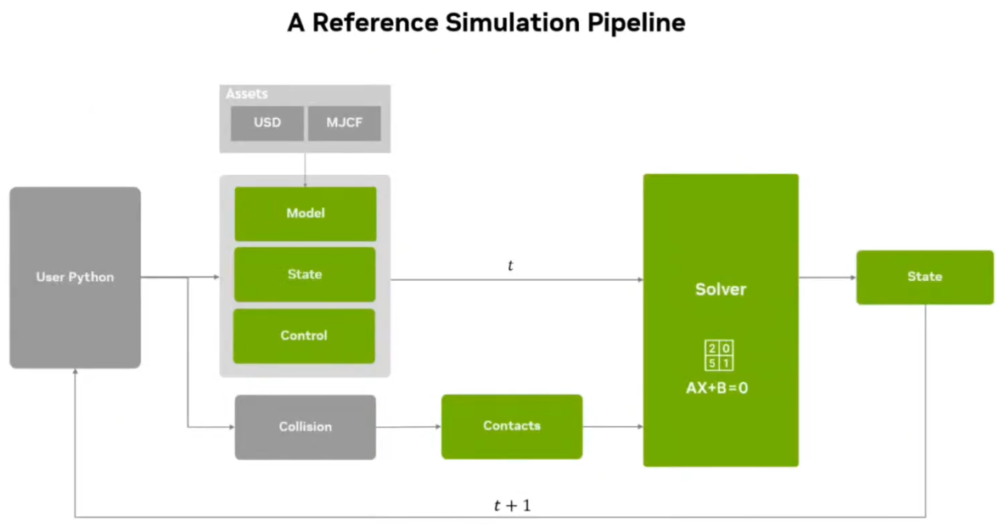

# Newton

[Newton - NVIDIA](https://developer.nvidia.com/newton-physics)

[Newton - Github](https://github.com/newton-physics/newton)

[Newton's Classroom | The Physics Class Every Robot Should Attend - B站(NVIDIA)](https://www.bilibili.com/video/BV1vTsUzuEv1/)

---

open-source GPU-accelerated platform

NVIDIA, Google DeepMind, Disney Research | Linux Foundation
1. 

Built on
1. [NVIDIA-WARP](https://github.com/NVIDIA/warp) - `pip install warp-lang`
   1. Performance
      1. Native(原生) CUDA : Warp 生成的代码直接编译为 NVIDIA GPU 的底层语言 CUDA
      2. JIT-Compiled(Just-In-Time) : 代码在运行时，被编译成 机器代码(CUDA 代码)
      3. CUDA-X libraries exposure : 允许 Warp 代码访问和利用 NVIDIA 优化的 CUDA-X 库(线性代数、傅立叶变换 等)
   2. Ease of Use
      1. Pure Python : 纯 Python 语法来编写 GPU 上的并行计算和物理模拟逻辑
      2. Tile-Based Programming : 线程间协作的编程模型 (tile 线程块中共享内存的一小块数据或工作单元)
      3. Native Simulation Primitives(原生模拟原语) : Warp 内置 针对 模拟&图形计算优化 的 基本数据结构&操作(eg : 网格、稀疏卷、哈希网格)
   3. Capability
      1. **Automatic Differentiation**(自动微分) : 自动计算任何 Warp 代码定义的计算图的梯度
      2. DL Framework Interop(互操作性) : Warp 生成的梯度和数组可以无缝地与其他 DL 框架的数据结构和计算图结合
   4. 
   5. 支持在 GPU 训练，在 CPU debug(更方便)，但未对 CPU 优化
2. [OpenUSD](https://openusd.org/release/index.html)

兼容 与 Mujoco 等 solver(physics engine 核心功能) 的 交互

**high-fidelity**, **real-time**, **mitigate sim2real gap**

Physical AI Data Pyramid
1. top : **Real Data**, expensive & dangerous
2. middle : **Synthetic Data**, can have more control, scalable(graphic / physical) -> **simulation**
3. bottom : **Internet Scale Data**, train LLM/VLA

Robot Learning Simulation Key Requirements
1. 

**==Architecture==**
1. 
2. 
3. 

**==[Solvers](https://newton-physics.github.io/newton/guide/overview.html)==**
1. Overview
   1. 
2. [MuJoCo Warp Solver - Newton Docs](https://newton-physics.github.io/newton/api/_generated/newton.solvers.SolverMuJoCo.html)
   1. 
   2. 
3. [VBD(Vertex Block Descent) Solver - Newton Docs](https://newton-physics.github.io/newton/api/_generated/newton.solvers.SolverVBD.html)
4. [Implicit MPM(Material Point Method) Solver - Newton Docs](https://newton-physics.github.io/newton/api/_generated/newton.solvers.SolverImplicitMPM.html)
5. Solver Coupling
   1. Model supports mixed systems: rigid, cloth, soil
   2. Multiple solvers can run independently
   3. User API to explicitly couple, 1-way demonstrations
   4. 2-way and implicit coupling (on the way)
6. Inverse Kinematics Solver

Beta Release
1. 

Neural Solver
1. 

Newton Talks
1. 

**Minimum Viable Product** (最小可行产品)

