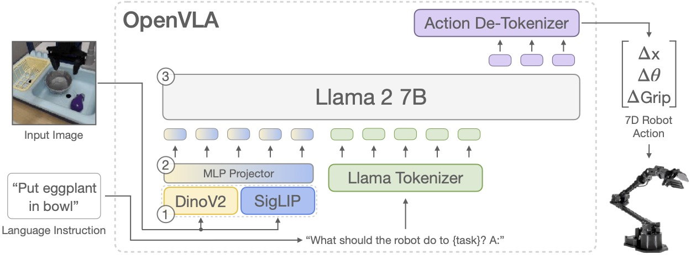
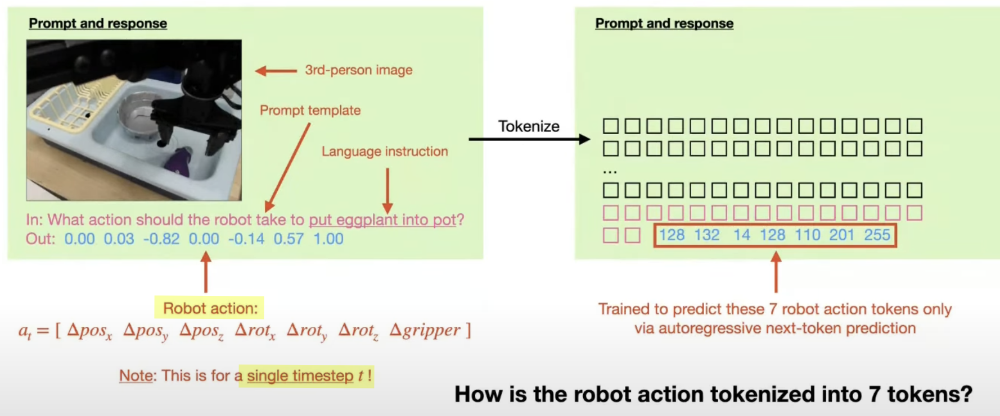
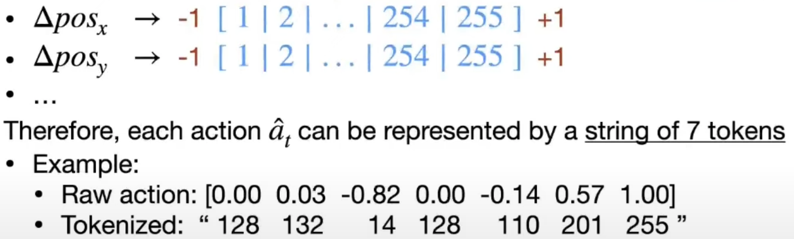

# OpenVLA

[OpenVLA - HuggingFace](https://huggingface.co/openvla/openvla-7b)

[OpenVLA - Project](https://openvla.github.io/)

[OpenVLA - Paper](./Papers/OpenVLA.pdf)

[OpenVLA - Github](https://github.com/openvla/openvla)

[OpenVLA: LeRobot Research Presentation #5 by Moo Jin Kim](https://www.youtube.com/watch?v=-0s0v3q7mBk)
1. [Moo Jin Kim](https://moojink.com/)

1B = 10亿

Background
1. pretrain **foundation model** & fine-tune on downstream tasks
2. robotics problem : **data** is difficult to collect at large scale in the real world (**bottleneck**)

Dataset
1. Open X-Embodiment Dataset
2. RT-2/RT-2-X

Other Models
1. RFM-1
2. LEO
3. 3D-VLA
4. RoboFlamingo
5. Interactive Agent Foundation

Goals
1. open-source & trained on **real-world robot data**
   1. **Generalist Policy** : perform diverse tasks on **multiple robots** **out of the box**(开箱即用，开包即用)
2. effective framework for adapting **downstream tasks**

**OpenVLA**
1. 7B parameter open-source vision-language-action model (VLA)
   1. pretrained on 970k robot episodes from the **[Open X-Embodiment dataset](https://robotics-transformer-x.github.io/)**
   2. sets a new state of the art for **generalist robot manipulation policies**
   3. supports controlling multiple robots out of the box and can be quickly adapted to new robot setups via parameter-efficient fine-tuning
   4. **checkpoints** and PyTorch **training pipeline** are fully open-source and models can be downloaded and fine-tuned from HuggingFace
2. Structure
   1. 
   2. 
   3. Built on **[Prismatic VLM](https://github.com/TRI-ML/prismatic-vlms)** backbone
   4. LLM : Llama2 (not VLM), 7.1B decoder-only LLM
   5. Vision/Image Encoders : `DINOv2`(~300M) & `SigLIP`(~400M)
   6. I/O
      1. Inputs  : single image & language instruction
      2. Outputs : tokenized robot action
3. Train
   1. Imitation Learning : Behavioral Cloning with Expert Demonstration
      1. Given : trajectories(observation & action pairs)
      2. Goal  : train model to predict correct action
   2. Action is discretized : string of 7 tokens (single action, not a sequence)
      1. next-token prediction with cross-entropy loss
      2. no need to change the LLM backbone
      3. auto-regressive next token
   3. 
   4. just predict the 7 robot action tokens (mask out other tokens)
4. Tokenization
   1. Robot Action Space : 7 dimensions
      1. 6-DoF delta end-effector pose
      2. 1-DoF gripper control
   2. each dimension is scaled to `[-1, +1]`，discretized into `255` uniform bins
      1. 
   3. only need 255 tokens to represent the entire action space
5. Experiment
   1. **Out-of-the-Box Eval**
      1. Visual Generalization : unseen backgrounds, distractor, object appearances
      2. Motion Generalization : unseen object positions & orientations
      3. Physical Generalization : unseen object sizes & shapes
      4. Semantic Generalization : unseen objects, instructions, concepts from the Internet
      5. Language Grounding : ability to manipulate object specified in language prompt
      6. OOD(**Out-of-Distribution**) Generalization : 模型在训练数据之外的未知分布上仍然能保持良好性能的能力
   2. **Fine-Tuning Eval**
      1. Comparison : Diffusion Policy
   3. **Parameter-Efficient Fine-Tuning**
      1. Last Layer Only - fine-tune only the last layer of LLM backbone
      2. Frozen Vision   - only freeze vision encoder
      3. Sandwich        - only fine-tune vision encoder and last LLM layer, freeze all else
      4. LoRA (best)     - Low-Rank Adaption Method, applied to all linear layers of vision/LLM backbone
   4. GPU memory
      1. use **4-bit quantization** (at **inference** time)
      2. default : bfloat16
      3. int4 quantization : 7GB
      4. |Precision	|Bridge Success	|VRAM    |
         |----------|---------------|--------|
         |bfloat16	|71.3% ± 4.8%	|16.8 GB |
         |int8	    |58.1% ± 5.1%	|10.2 GB |
         |int4	    |71.9% ± 4.7%	|7.0 GB  |
   5. Image Resolution : 224 × 224 (no performance difference using 384 * 384)
6. Limitations
   1. only support **single-frame input** & **single-step action output**
   2. lack of support for
      1. high-frequency control
      2. bi-manual manipulation robots(ALOHA)
   3. only fine-tuned on robot action data (not co-fine-tuned on **robot data** + **VQA(Visual Question Answering) data** (as done in RT-2/RT-2-X))

