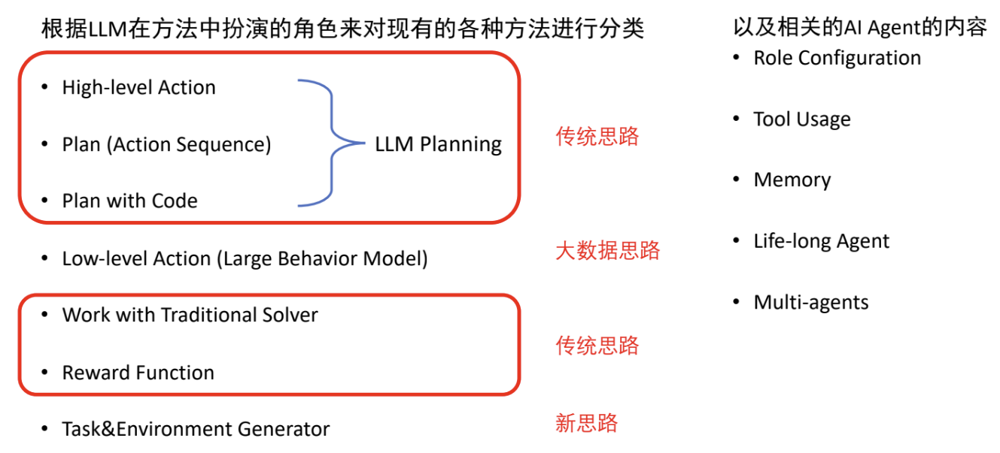

# Vision-Language-Action Model

传统 : 规则(人类对任务设计的规则序列) + 控制/RL
1. 缺点
   1. 对于相同任务，大量边缘情况
   2. 对于不同任务，都需要设计规则，任务数量多
   3. 场景受限，任务有限

LLM 后研究思路
1. 传统思路 : 人工设定 环境 & 任务，LLM 参与解决
   1. 依赖 LLM 的 zero-shot 能力
2. 大数据思路 : 收集大量数据 end2end training，模仿学习 / RL with simulator
   1. 需要降低数据采集成本
3. LLM后思路 : LLM 设定 环境 & 任务，LLM 参与解决
   1. LLM 自己 设计 & 生成 新的 环境 & 任务

LLM 用于 High-Level Action
1. ChatGPT 合理输出 逻辑序列的关键 : 在 **prompt** 中列出使用描述性名称命名的 **action function**，并描述 function 的输入、输出和功能
2. action function 具体体现
   1. 模仿学习
   2. 强化学习
   3. MPC
   4. hard-code
3. 提供 观测信息 给 LLM (多模态 LLM 可以提供 图像，只提供图像容易出现幻觉(方向性))
4. LLM 与环境交互的问题 : 每次观测后**只输出下一步**
   1. 缺点
      1. token 开销大
      2. 无法提前评估 行动序列
      3. 容易遗忘 初始计划
   2. 优点
      1. 每一步可以根据观测调整计划
      2. 陌生场景，谨慎探索
5. 相关论文
   1. [ReAct: Synergizing Reasoning and Acting in Language Models - Paper](./Papers/ReAct:%20Synergizing%20Reasoning%20and%20Acting%20in%20Language%20Models.pdf)
      1. ReAct = CoT + Act (在输出每一步动作之前, 让LLM先描述自己的解决思路)
   2. [SayCan - Paper](./Papers/SayCan%20:%20Do%20As%20I%20Can,%20Not%20As%20I%20Say.pdf)
      1. [SayCan - Website](https://say-can.github.io/)
      2. Imitation Learning 和 Q-Learning 训练得到机器人的基本操作技能
      3. 经典路径规划得到 Navigation 技能
   3. Look Before You Leap: Unveiling the Power of GPT-4V in Robotic Vision-Language Planning (ViLa)
   4. Compositional Chain-of-Thought Prompting for Large Multimodal Models

LLM 用于 Plan(Action Sequence)
1. 输出 High-Level Action **序列**，而非单个 Action，需要 **LLM对环境的未来走向有认识**
2. Tricks
   1. **Self-Refine** : 在 LLM 生成 plan 后，使用另一个 LLM (或者人类设定的启发式评估函数) 来 评估evaluate 其好坏，并且给出指导性意见，无法保证可以改善
   2. **Self-Consistency** : LLM的生成质量有很大的随机性，可以多次生成规划并且选择最优的生成结果
   3. **Self-Reflection** : 将生成的plan执行，如果失败了则重新来过，让LLM从环境的反馈+自身反思中优化计划，失败原因 :
      1. 生成的动作不合规范，没有正确调用 action function
      2. 没有满足动作的执行条件 : 如手中没有物体时，执行放下物体的动作
      3. LLM 自己以为生成的 plan 已经完成了任务，实际任务还没有完成
      4. 生成的plan有很多冗余动作，导致动作序列太长
   4.  **Replan : ReAct with Plan**
      1. 生成 plan 之后，先执行 plan 获得环境的反馈和新观测信息后，从当前状态继续规划
      2. 允许 LLM **分次解决问题**
      3. Agent Q: Advanced Reasoning and Learning for Autonomous AI Agents
   5. **Tree Search**
      1. 失败了 允许 回溯
      2. BFS、DFS、MCTS(蒙特卡洛树搜索)

---

# Vision-Language-Action Models for Robot Manipulation

[B站视频](https://www.bilibili.com/video/BV1QxB9YuERU)

---

# Prismatic VLM

[Prismatic VLM - Github](https://github.com/TRI-ML/prismatic-vlms)

application : visual question answering, scene understanding, robotic task planning, grounded chat

capability : spatial reasoning, out-of-distribution generalization, commonsense understanding

train from base / instruct-tuned

**patch-as-token** approach
1. eschew from complex architectures & training objectives
2. simple objective : next-token predictions

evaluation suite : 12 benchmarks/tasks
1. 4 * visual question answering(VQA)
2. 4 * object localization
3. 4 * challenge : fine-grained reasoning/hallucination/diagram understanding

modular codebase for VLM Training
1. swap pretrained models
2. optimize procedure/data

experiment on 4 key design axes
1. optimization procedure
2. image processing and visual representation
3. language models
4. scaling training time and data

Insights
1. multi-stage training procedures can be eliminated to reduce compute costs
2. fused visual backbones that merge features from different backbones lead to more performant

Pretrained Vision Representation
1. CLIP : Contrastive Language-Image Pretraining
2. SigLIP : Sigmoid Loss Language-Image Pretraining
   1. Google DeepMind 提出的 **视觉-语言对比学习 (contrastive learning)**
   2. CLIP 的 改进
   3. 视觉 + 文本
3. DINOv2 : Distillation with NO labels v2
   1. Meta AI 研发的自监督 VIT
   2. 纯视觉，没有专门针对 文本嵌入(text-embedding)

p-value : 零假设 为真时，当前数据出现的概率，该值小 则 可 拒绝 零假设，从而选择 备择假设 (有点像反证法，先假定，零假设为真，计算当前数据发生的概率)
1. 此处 零假设是
2. 如果 p 值很小，意味 结果是统计显著的
   1. 实验数据 与 零假设的预测结果 有明显不同，因此我们倾向于认为零假设可能不成立
3. 如果 p 值较大，意味 实验结果与随机误差没有显著区别

Ensemble Different Visual Representations : DINOv2 + SigLIP provides most performant visual representations (OpenVLA)

