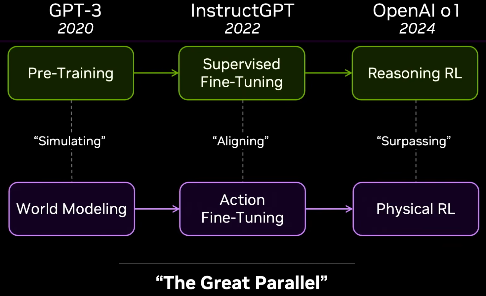
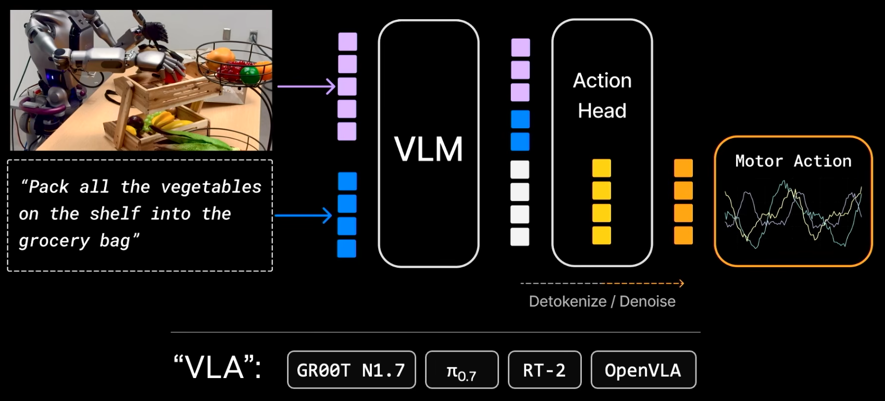
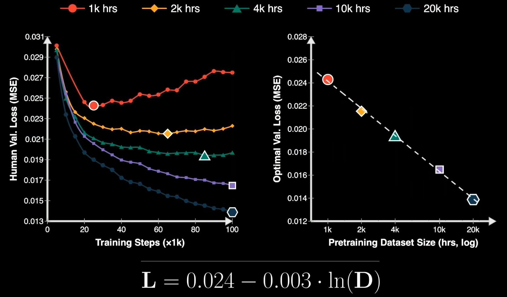
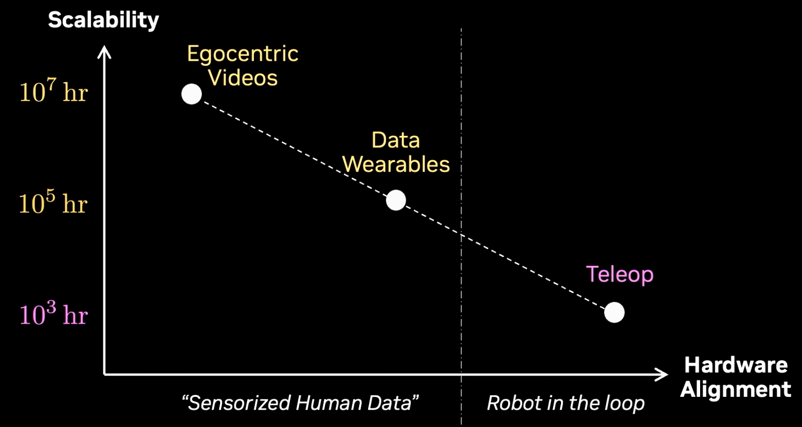
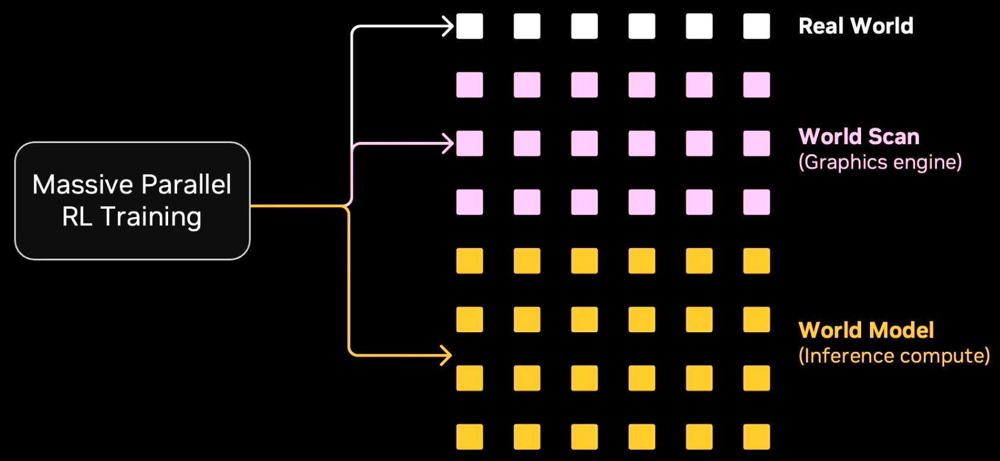
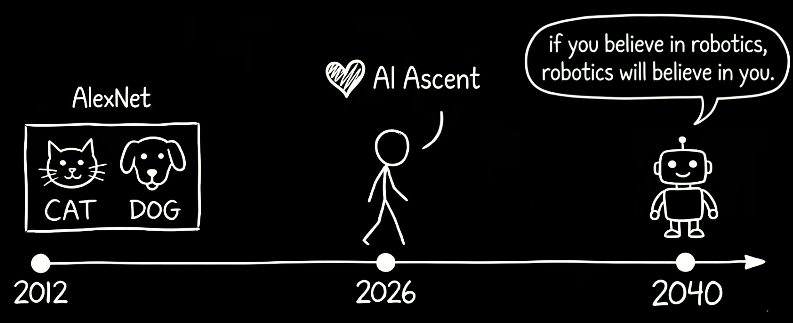

# Robotics' End Game - Jim Fan (Nvidia) - 20260430

机器人技术的终局，实际上是在 复刻 大型语言模型(LLM) 已经验证过的成功路径
1. 
2. LLM 的成功路径
   1. Pre-Training : 通过 next token prediction 来学习语言的语法和规律，本质上是在 **模拟** 人类思想、代码、文本的 展开过程
   2. Supervised Fine-Tuning : 比如 InstructGPT，是将模拟能力**对齐(Aligning)**到对人类有用的特定任务上
   3. Reasoning RL : 使用强化学习来**超越(Surpassing)**单纯的人类模仿，实现更高阶的推理能力
3. 机器人技术的新范式
   1. World Modeling : 对应 大模型的 Pre-Training，去 **模拟** next world state，通过海量的视频数据让 AI 预测接下来的画面(Video Models, eg : Veo-3)，从而自发学会物理定律(**涌现**)
   2. Action Fine-Tuning : 对应大模型的 SFT，将泛化的世界模拟能力 **对齐(Aligning)** 到真实机器人需要的狭窄动作空间中，将视觉输入转化为机器人电机动作，WAM : world action model (eg : DreamZero)
   3. Physical RL : 对应大模型的推理强化学习。让机器人在极具规模的物理模拟环境（如 Dream Dojo）或真实环境中，通过强化学习完成“最后一公里”，从而**超越（Surpassing）**人类的演示数据，将任务成功率推向几乎 100%

VLA
1. 
2. Pre-Training 由 VLM 完成，再加一个 action head
3. VLA 把很多重心放在 language 而非 vision/action
4. VLA 更善于 encode knowledge/nouns 而非 physics/verbs
5. **后续会被淘汰**

Data Strategy
1. Teleoperation (robot in the loop)
   1. **后续会被淘汰**
2. UMI : Universal Manipulation Interface
   1. no **robot in the loop**，有利于 data scaling
   2. StartUps : Sunday, Genesis
   3. DexUMI : Dexterous UMI
3. Human Direct / Human Ego-Centric Videos
   1. 类似 Tesla FSD，更轻松的收集数据(UMI 还是不够方便)

**EgoScale** : E2E
1. Pre-Train
   1. 21000h pure-human videos
   2. predict **hand joints** & **wrist poses**
2. Action Fine-Tuning
   1. 50h MoCap-Glove + 4h Teleop
3. Test : 可以只用 One-Shot Demonstration
4. Neural **Scaling Law** for Dexterity
   1. 
5. 

Scale Up Envrironments
1. World Scans Pipeline -> Interactive Digital Twin
2. Real2Sim2Real

**DreamDojo**
1. 不需要 traditional Graphic Engine
2. World Model -> Neural Simulation
3. input : action signals
4. output : next RGB frame & sensor states

后续 Post-Training 范式
1. 
2. 并行 : 少量 real + 一些 world scans + **大量 world models inference**

Future 2040
1. 物理图灵测试 (Physical Turing Test) : 机器人在执行大量任务时的表现，将与人类难以区分
2. 物理 API (Physical API) : 可以像调用软件或命令行一样，通过 API 指令编排和管理庞大的机器人舰队
3. 物理自动研究 (Physical Auto Research) : 机器人开始自主设计、改进并制造下一代机器人，其演进速度将远超人类的极限

Ilya Sutskever : If you believe in deep learning, deep learning will believe in you.

Jim Fan : If you believe in robotics, robotics will believe in you.

Our generation was born too late to explore the earth and too early to explore the stars. But we are born just in time to solve robotics.
