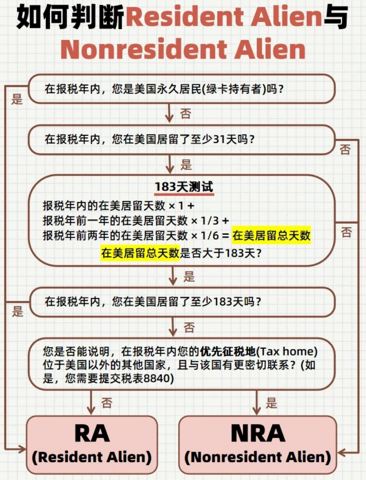

# Tax

IRS(Internal Revenue Service) : 美国国内收入署(美国国税局)

EIN(Employer Identification No)
1. UIUC : 376000511
2. XPENG : 823160099

RA & NRA
1. Resident Alien (RA)
2. Non-Resident Alien (NRA)
3. 判断流程
   1. 
4. $$ \text{当年在美天数} + \frac{\text{去年在美天数}}{3} + \frac{\text{前年在美天数}}{6} \geq 183 \text{天} $$

Exempt(豁免) Individual
1. F-1 学生(包含 OPT) 在 前5个 日历年，豁免计算居住天数
2. 这 5个 日历年里，做 SPT (Substantial Presence Test，实质居住测试) 时，很多在美天数不计入
3. 身份更容易维持为 NRA
4. 不符合 Exempt 的情况
   1. 超过 5个 日历年，仍以 F-1 学生身份在美
   2. 身份改变 (eg : 转成 H-1B/绿卡 等)，按 新身份的 规则
5. Pros
   1. 少交 FICA 税 (社保类工资税)
      1. Federal Insurance Contributions Act
      2. 免交 Social Security Tax (6.2%) & Medicare Tax (1.45%)
         1. 对应 W-2 中的 Box4 & Box6 是否为 0
   2. 享受 中美税务协定 (Treaty)
      1. 中国留学生通常有每年 $5,000 的 联邦收入免税额度
6. Cons
   1. 不能享受 Standard Deduction
      1. 标准扣除额，2025 年单身约为 $15,000
      2. 导致 应税收入基数 比美国人高

Federal Tax (联邦税)
1. NRA 没有 Standard Deduction
2. 用 Treaty 减免 应税收入
3. SALT & Treaty 可叠加

State Tax (州税)
1. 部分州 不承认 Treaty
2. 但是有 Standard Deduction

SALT(State and Local Tax Deduction)
1. 是 Itemized Deduction 的一种
2. 用来抵扣 **联邦税** 的 应税收入(Taxable Income)，而 不是 直接抵扣 联邦税金
3. 对于  RA : 有 IRS 的 Standard Deduction，$15,000，**SALT & Standard 二选一，不能叠加**

W-2
1. 雇主 发放的 **工资单**(工资总额、预扣税款)
2. ADP 自动生成

Form 1098-T (Tuition Statement)
1. 用于申请教育抵税
2. NRA 留学生通常不具备申领这些教育学费抵税的资格

Form 1099
1. 银行/券商(Robinhood) 发给 RA
2. 1099-B   : 记录 卖股票赚的钱 (**Capital Gains**)
3. 1099-DIV : 记录 拿分红赚的钱 (**Dividends**)
4. 当做 原始数据(赚的钱)

Form 1042-S
1. 银行/券商(Robinhood) 发给 NRA
2. 与 1099 区别
   1. 清楚地 标记 这笔钱是发给 NRA
   2. 显示 如何享受免税待遇 (Tax Treaty)
   3. 税率和 RA 不一样

**Form 1040 / 1040-NR**
1. 税表 Tax Return
2. 把手里各种各样的 Form (W-2, 1099, 1042-S 等) 上的数字，搬运并 计算 填入这张 1040-NR 表格中

Form 8843
1. 身份说明

Form 8840
1. Closer Connection Exception Statement for Aliens

Form 8833
1. Treaty-Based Return Position Disclosure
2. 中美税务协定 US-China Tax Treaty
   1. 联邦税 有 $5000 抵扣 Taxable Income，部分州(包括加州) 州税不承认

Form 540 / 540-NR
1. 加州个人所得税申报表
2. 声明你虽然可能满足了 SPT，但你和另一个国家的联系更紧密，继续按 NRA 处理

Form 3520
1. IRS 追踪 外国信托交易 & 外国赠与
2. NRA 一般 不需要报
3. 容易被忽视，罚款重
4. 是信息申报表，不是纳税表
5. 不需要缴税，但如果晚报或漏报，罚款可能高达汇款金额的 5%-25%
6. 判断 是否超过 10w 时，算总账，填表时 按赠予人 分开
7. 单独 邮寄到 Ogden, UT

SDI(State Disability Insurance)
1. 在加州，强制性的 工资扣除 项目，属于 **强制性州税 (Mandatory State Tax)**
2. 作用 : 因为 **非工伤原因** 导致一段时间无法工作，加州政府会用这笔钱给你发一部分工资
3. 在 W-2 的 Box14
4. 也可以用于 SALT 抵扣 联邦税

Robinhood
1. NR
   1. Cash Sweep (属于 Interest Income / 利息) : 0% (免税)
   2. 股票分红 (Dividends) : 10% (如果你用了 Treaty)
   3. 股票买卖差价 (Capital Gains / 资本利得) : 30%

https://www.dealmoon.com/guide/935542

Form 1040-NR (你的税表) 是寄给 Austin, TX (通常针对留学生)

W-7

W-4

W-8BEN

W-9

护照、I-20、I-94、SSN、W-2

# App

https://www.glaciertax.com/login

